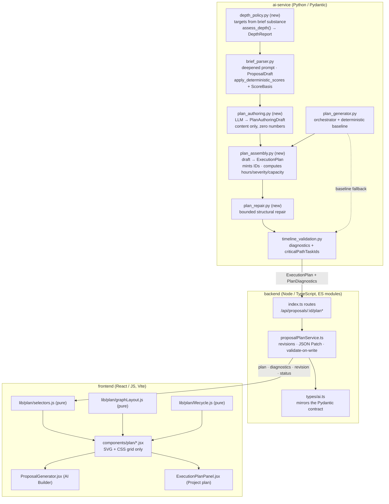
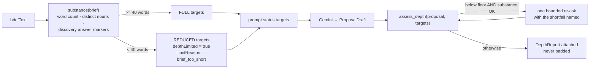
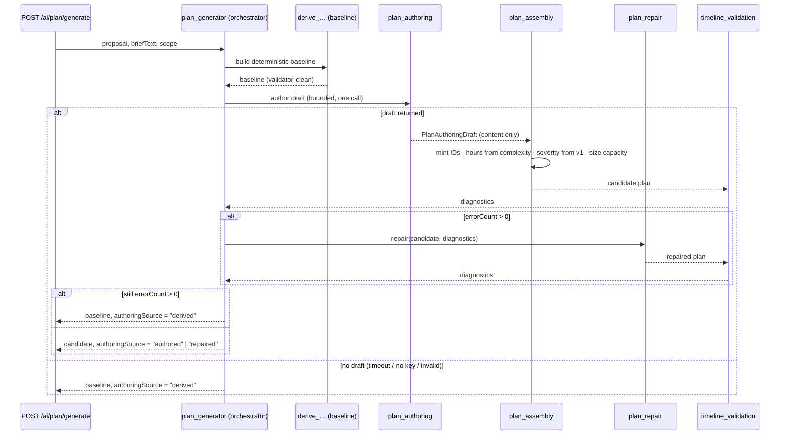
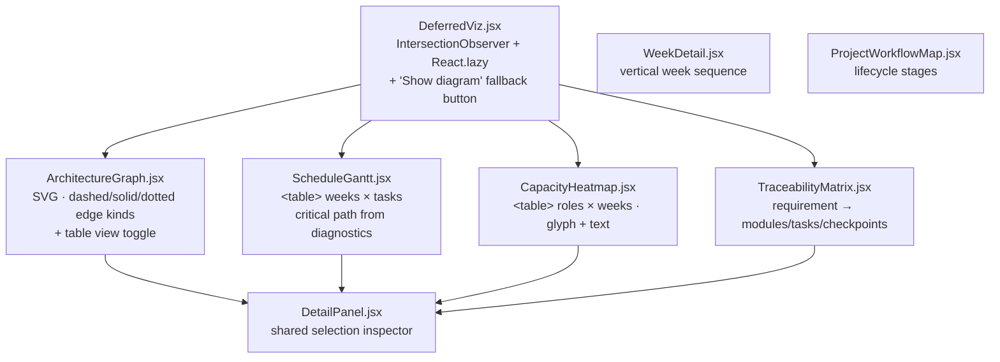

# Design — Proposal Depth & Visualisation

## Overview

The feature has one spine: **depth is authored on the server, numbers stay derived, and the browser only projects.** Every decision below follows from that sentence.

Three layers, each with a single responsibility:

| Layer | Owns | Lives in | Never does |
|---|---|---|---|
| **Authoring** | How much detail the model is asked for, and the qualitative content of the v2 plan | `ai-service/app/features/brief_parser.py`, new `depth_policy.py`, `plan_authoring.py`, `plan_assembly.py`, `plan_repair.py` | emit numbers, pad to hit a target |
| **Trust** | Recomputing every numeric/diagnostic figure, gating what may be surfaced | `ai-service/app/features/timeline_validation.py`, `ai-service/app/main.py`, `backend/src/services/proposalPlanService.ts` | trust a model-supplied number |
| **Projection** | Turning an `ExecutionPlan` + `PlanDiagnostics` into diagrams | new `frontend/src/lib/plan/*.js` (pure) + `frontend/src/components/plan/*.jsx` (presentational) | compute any figure the validator owns |

Two research findings shaped the design:

**1. Raising `min_length` on `Proposal` would break backward compatibility.** `ai-service/app/schemas/proposal.py` is not only the generation schema — it is also the *inbound* contract for `/ai/plan/generate` (`PlanGenerateRequest.proposal`) and `/ai/confidence/evaluate` (`EvaluateRequest.proposal`). A proposal persisted before this feature with 4 features would fail Pydantic validation on the way back in, returning 422 and breaking Requirement 11.1/11.3. So depth is raised through a **separate generation-only model** (`ProposalDraft`, with the higher minimums, used solely as the Gemini `response_schema`) plus a **post-generation depth assessment**, while `Proposal` — the persistence and interchange contract — keeps `min_length=1`. This honours the intent of "raise the minimums in `proposal.py`" (the raised minimums do live in that file) without weaponising them against history. It is also the only correct way to satisfy Requirement 1.3, which explicitly wants *fewer* items for a thin brief — a hard schema floor could never express that.

**2. Anything the client can see must already exist in `PlanDiagnostics`.** Requirement 5.5 (critical path) and Requirement 3.3 (week gaps) both want derived facts. Rather than compute them in the browser and violate the trust rule, `timeline_validation.py` gains `criticalPathTaskIds` (new, optional field on `PlanDiagnostics`) and already emits `empty_week` warnings. The frontend reads them; it never derives them.

### Requirement coverage map

| Requirement | Primary mechanism |
|---|---|
| 1 — Scope depth | `depth_policy.py` targets + `ProposalDraft` + deepened `SYSTEM_PROMPT` + `Feature.source` |
| 2 — Intelligence depth | Same targets for `risks`/`market`/`impact`; `ScoreBasis` on scored items; degraded path unchanged |
| 3 — Week-by-week timeline | `WeekDetail.jsx` over `plan.weeks[]` + `clientActions[]`; `empty_week` diagnostics |
| 4 — Architecture diagram | `graphLayout.js` + `ArchitectureGraph.jsx` over `architecture.components`/`edges` |
| 5 — Schedule & dependencies | `ScheduleGantt.jsx` + `diagnostics.criticalPathTaskIds` + dependency issue codes |
| 6 — Capacity heatmap | `CapacityHeatmap.jsx` over `diagnostics.capacity[]` (grouped, never recomputed) |
| 7 — Traceability | `TraceabilityMatrix.jsx` over `diagnostics.scopeCoverage[]` + `Requirement.source` |
| 8 — Workflow visualisation | `lifecycle.js` (pure) + `ProjectWorkflowMap.jsx` |
| 9 — Authoring quality | `plan_authoring` → `plan_assembly` → `plan_repair` → validator gate → baseline fallback |
| 10 — Navigable proposal | `STEP_TABS` extension + section nav + progressive disclosure |
| 11 — Backward compatibility | All new stored fields optional with defaults; empty states per diagram |
| 12 — Perf & a11y | `DeferredViz.jsx`, SVG/CSS only, table fallbacks, roving tabindex, reduced-motion |

### Out of scope

Unchanged: escrow, payments, agreement, hiring handshake behaviour. No model-authored scores. No `three` / `@react-three/*` / `matter-js` on any new path. No migration of stored proposals.

---

## Architecture



### A. Depth policy (Requirements 1, 2, 9.4)

`depth_policy.py` is pure and LLM-free.



`FULL` targets: features 6–12, risks ≥5 across ≥2 categories, market ≥3, impact ≥3, timeline phases ≥3, effort ≥3, ≥2 acceptance criteria per scope module. The upper bound on features is the "stays reviewable" cap from Requirement 1.1 — the prompt states it and `assess_depth` reports an `over_cap` note if exceeded, but nothing is silently truncated.

The re-ask is **bounded to one extra call** and only fires when the brief passes the substance threshold and the first response is under floor. This is the only place generation cost grows, and it is guarded by the timeout budget in §C.

`assess_depth` never mutates the proposal. Padding is structurally impossible because no code path constructs a `Feature`/`Risk`/`MarketItem`/`ImpactItem` to satisfy a target — the only synthesising code is `sanitize_and_patch_brief`, which runs on the degraded path and is explicitly labelled (Requirement 2.5).

### B. Plan authoring (Requirements 3, 4, 5, 9)

Today `plan_generator.derive_execution_plan_from_proposal` is a pure redistribution of the v1 proposal: one module per feature, one component per `area`, `edges=[]`, one task per `delivery_plan` week task, no `clientActions`, no `affectedWeekNumbers`. It cannot add engineering depth. The fix is to put an authoring pass *in front* of it while keeping it as the baseline.



The draft is content-only. The split is absolute:

| Field | Author |
|---|---|
| `requirements[].statement`, `.source`, `.priority` | model |
| `scopeModules[]` names, objectives, in/out of scope, acceptance criteria | model |
| `architecture.components[]` responsibility, interfaces, dataBoundary, errorHandling, decisions, openDecisions | model |
| `architecture.edges[].kind`, `.label` | model |
| `tasks[].title`, `.description`, `.acceptanceCriteria`, `.evidenceRequired`, ordinal week span, `dependencyTaskIds` (by draft-local key) | model |
| `weeks[].objective`, `.label`, `clientActions[].description`, `.required` | model |
| `tasks[].estimateHours`, `.estimateBasis` | **code** — `_COMPLEXITY_HOURS[complexity]`, unchanged table |
| `risks[].severity` | **code** — already deterministic on the v1 `Proposal` |
| `teamCapacity[].hoursPerWeek` | **code** — sized from peak demand, existing algorithm |
| every `diagnostics.*` field | **code** — `validate_execution_plan` |

`plan_assembly` resolves the draft's local keys (`"t1"`, `"mod-auth"`) into the plan's stable IDs, drops any reference it cannot resolve, and clamps ordinal week spans into `1..N`. `plan_repair` then applies at most one pass of: remove dangling refs, renumber weeks to `1..N`, break each reported `dependency_cycle` by dropping the reported back-edge, attach an unmitigated high-severity risk to `cp-risk-review`, and add a covering task for any `module_no_task`. Repair is deliberately *subtractive* — it removes bad references rather than inventing content, which is what keeps Requirement 9.4 true.

### C. Trust boundary and budget

Three enforcement points, none of them new in kind:

1. `plan_assembly` never reads a numeric field from the draft — the draft schema has none, so it cannot.
2. `main.py` clears `body.executionPlan.diagnostics` / `body.existingPlan.diagnostics` before use, so a caller cannot smuggle diagnostics in. `plan_generate` and `plan_validate` both return freshly computed diagnostics (already true; the design makes the discard explicit rather than incidental).
3. `proposalPlanService.ts` already calls `validateExecutionPlan` after every patch, restore, and approve. Unchanged.

Budget (Requirement 9.5): brief parse is one call (`gemini_proposal_model`, `gemini_timeout_sec` default 15s) plus at most one depth re-ask. Plan authoring is one call under a new `GEMINI_PLAN_TIMEOUT_SEC` (default 20s) in `config.py`. The baseline is computed *before* the authoring call, so an authoring timeout costs the user nothing but latency, and the response is always a valid plan. Worst case authoring adds one timeout window; the gateway's existing `fetchWithRetry` envelope is unchanged. The UI reports progress per stage rather than showing one indeterminate spinner (Requirement 9.5, second clause).

### D. Projection layer

Everything derived in the browser is a *grouping* or *layout* of server data, in pure functions with no React import:

- `selectors.js` — index maps (`tasksById`, `weekByNumber`, …), week rollups (tasks, deliverables, checkpoints, client actions, gap flag read from `empty_week` issues), capacity matrix (`roles × weeks` grid of the server's `CapacityCell` objects, with `null` for absent cells), traceability rows, dependency-issue lookup keyed by task id, and per-cell task attribution (filter by `ownerRoleId` + span contains week — attribution, not arithmetic).
- `graphLayout.js` — longest-path layering plus barycentre ordering, returning `{ nodes: [{id, layer, order, x, y}], edges: [{...,points}] , layers }`. Deterministic (stable tie-break on `id`) so snapshots are reproducible.
- `lifecycle.js` — `deriveLifecycle({ workflow, planStatus, matchWorkflow, milestones })` → ordered stages with `state: 'done' | 'current' | 'upcoming' | 'blocked'`, each carrying `what`, `owner`, `advancedBy`, and an optional `gate: { holder, rule }`.

Component tree:



Accessibility decisions, applied uniformly:

- **State is never colour-only.** Every state carries a glyph *and* a word: capacity `▲ Over / ● Near / ○ OK / ? Unknown`, edge kind rendered as solid+filled-arrow (`sync`), dashed+open-arrow (`async`), dotted+diamond (`data`), dash-dot+hollow-arrow (`event`), each labelled in a legend and spelled out in the table view.
- **Keyboard.** Each diagram is a single tab stop with roving `tabindex` inside; arrows move, `Enter`/`Space` selects, `Escape` closes the inspector. Selection changes announce through one `aria-live="polite"` region per diagram.
- **Text equivalent.** Every diagram has a "View as table" toggle rendering the same data as a semantic `<table>`. This is the a11y answer *and* the mobile answer *and* the >60-node answer.
- **Motion.** A shared `usePrefersReducedMotion()` hook gates all transitions; with motion disabled, state changes are instant and every control still works.
- **Containment.** Each diagram sits in `overflow-x: auto; max-width: 100%`, with `min-width` on the inner canvas only — so a wide chart scrolls in its own box and the page never scrolls horizontally.

Performance: `DeferredViz` code-splits each diagram into its own Vite chunk (React.lazy) and only mounts it when it intersects the viewport, so the landing and initial dashboard bundles are untouched (Requirement 12.1/12.2). Selector results are `useMemo`'d on `[plan, diagnostics]` identity. Beyond `MAX_GRAPH_NODES = 60` components or `MAX_GANTT_ROWS = 120` tasks the diagram renders the table view with a notice and per-workstream progressive disclosure, so a large plan never blocks on a synchronous layout pass (Requirement 12.6).

### E. Surface integration

`ProposalGenerator.jsx` (AI Builder) keeps its five-step sequential, approval-gated stepper and its persisted `activeStep`/`approvedSteps` restore. Only the per-step tab sets grow:

| Step | Today | After |
|---|---|---|
| 2 Structured scope | `["scope", "architecture"]` | `["scope", "architecture", "traceability"]` |
| 3 Intelligence analysis | `["risks", "competitors"]` | `["risks", "competitors", "impact"]` |
| 4 Timeline & roles | `["milestones", "roles"]` | `["weeks", "schedule", "capacity", "roles"]` |
| 5 Review & finalize | — | adds the workflow map |

The builder gains a `usePlan(proposalId)` hook wrapping the existing `api.getExecutionPlan`; a 404 (`PLAN_NOT_GENERATED`) renders the generate affordance instead of an error (Requirement 11.2). `ExecutionPlanPanel.jsx` keeps its tabs, inspector, revisions, and approve/reopen flow and swaps its list renderings for the same shared components — one implementation, two surfaces.

---

## Components and Interfaces

### Python — `ai-service/app/features/depth_policy.py` (new)

```python
FULL_TARGETS: DepthTargets      # features 6..12, risks 5, market 3, impact 3, timeline 3, effort 3
REDUCED_TARGETS: DepthTargets   # features 2.., no floors; depth is reported as limited
SUBSTANCE_WORD_THRESHOLD = 40

def brief_substance(brief_text: str) -> BriefSubstance: ...
def targets_for(substance: BriefSubstance) -> DepthTargets: ...
def assess_depth(proposal: Proposal, targets: DepthTargets) -> DepthReport: ...
def shortfall_instruction(report: DepthReport) -> str | None:
    """Names exactly which sections are short, for the single bounded re-ask.
    Returns None when nothing is short."""
```

### Python — `ai-service/app/features/brief_parser.py` (changed)

```python
SYSTEM_PROMPT: str  # adds explicit depth targets, per-module acceptance criteria,
                    # inferred-vs-stated sourcing, and an explicit no-padding rule.
                    # The existing "do NOT invent numeric scores" rule is preserved verbatim.

async def parse_brief(brief_text: str) -> ParseBriefResponse: ...
    # 1. substance → targets  2. generate against ProposalDraft
    # 3. apply_deterministic_scores  4. assess_depth
    # 5. at most one shortfall re-ask  6. attach DepthReport

def explain_confidence(complexity, has_technical_approach, in_delivery_plan,
                       dependencies_resolved) -> ScoreBasis: ...
def explain_severity(category: str, mitigation: str) -> ScoreBasis: ...
def explain_impact(category: str, linked_to_feature: bool) -> ScoreBasis: ...
def explain_relevance(trend: str, linked_to_feature: bool) -> ScoreBasis: ...
```

Each `explain_*` mirrors its existing `derive_*` sibling and returns the qualitative inputs plus the human-readable rule, so Requirement 2.4 is answered from the same code path that produced the number. `apply_deterministic_scores` populates `score_basis` alongside each figure it already overwrites.

### Python — `ai-service/app/features/plan_authoring.py` (new)

```python
PLAN_SYSTEM_PROMPT: str

async def author_plan_draft(
    proposal: Proposal,
    brief_text: str | None,
    *,
    timeout_sec: float,
) -> PlanAuthoringDraft | None:
    """One bounded Gemini call constrained to PlanAuthoringDraft.
    Returns None on timeout, missing key, or validation failure — never raises
    into the request path."""
```

### Python — `ai-service/app/features/plan_assembly.py` (new)

```python
def assemble_plan(
    draft: PlanAuthoringDraft,
    proposal: Proposal,
    *,
    baseline: ExecutionPlan,
) -> ExecutionPlan:
    """Resolve draft-local keys to stable IDs, compute every numeric field from
    deterministic tables, and inherit teamCapacity sizing from the baseline
    algorithm. Unresolvable references are dropped, never guessed."""

def estimate_hours(complexity: QualComplexity) -> tuple[float, str]:
    """Returns (hours, basis text) — the basis is what the UI shows for R9.6."""
```

### Python — `ai-service/app/features/plan_repair.py` (new)

```python
def repair_plan(plan: ExecutionPlan, diagnostics: PlanDiagnostics) -> ExecutionPlan:
    """One subtractive repair pass driven by diagnostic codes:
    dangling_ref · week_discontinuity · span_out_of_range · dependency_cycle ·
    module_no_task · high_risk_unmitigated · orphan_deliverable.
    Pure; returns a new plan."""
```

### Python — `ai-service/app/features/plan_generator.py` (changed)

```python
def derive_execution_plan_from_proposal(proposal: Proposal) -> ExecutionPlan: ...  # unchanged

async def generate_execution_plan(
    proposal: Proposal,
    *,
    scope: str = "all",
    existing_plan: ExecutionPlan | None = None,
    preserve_client_edits: bool = True,
    brief_text: str | None = None,
) -> ExecutionPlan:
    """Now async (authoring is an awaited call). Baseline first, then author →
    assemble → validate → repair → validate. Returns the candidate only if it
    is validator-clean, otherwise the baseline. Sets authoringSource."""
```

`_merge_section` and `degraded_execution_plan` keep their current behaviour, including the post-merge `validate_execution_plan` call.

### Python — `ai-service/app/features/timeline_validation.py` (changed)

```python
def compute_critical_path(plan: ExecutionPlan) -> list[str]:
    """Longest dependency chain by summed estimateHours; [] when a cycle exists.
    Deterministic tie-break on task id."""

def validate_execution_plan(plan: ExecutionPlan) -> PlanDiagnostics: ...
    # unchanged checks, plus criticalPathTaskIds on the result
```

### Python — `ai-service/app/main.py` (changed)

`PlanGenerateRequest` gains nothing (it already carries `briefText`). Both plan routes strip inbound diagnostics before use, and `PlanGenerateResponse` gains `authoringSource: Literal["authored", "repaired", "derived", "degraded"]`.

### Node — `backend/src/types/ai.ts` (changed)

Mirrors, all additive and optional: `Feature.source?`, `Feature.score_basis?`, `Risk.score_basis?`, `MarketItem.score_basis?`, `ImpactItem.score_basis?`, `Proposal.depth_report?`, `PlanTask.estimateBasis?`, `ExecutionPlan.authoringSource?`, `PlanDiagnostics.criticalPathTaskIds?`. No Zod schema changes are required: `parseBrief` and the plan routes proxy the AI service's own validated payload, and `sanitizeWorkflow` / `TransitionSchema` are untouched.

### Frontend — `frontend/src/lib/plan/selectors.js` (new, pure)

```js
export function indexPlan(plan)                       // { tasksById, weeksByNumber, ... }
export function buildWeekRollups(plan, diagnostics)   // [{ week, tasks, deliverables, checkpoints,
                                                      //    clientActions, blockingClientActions, isGap }]
export function buildCapacityMatrix(plan, diagnostics)// { roles, weekNumbers, cell(roleId, week) }
export function tasksForCapacityCell(plan, roleId, weekNumber)
export function buildTraceabilityRows(plan, diagnostics)
export function dependencyIssuesByTask(diagnostics)   // Map<taskId, DiagnosticIssue[]>
export function hasBlockingPlanError(diagnostics)     // dependency_cycle → refuse to draw
```

### Frontend — `frontend/src/lib/plan/graphLayout.js` (new, pure)

```js
export const MAX_GRAPH_NODES = 60;
export function layoutArchitectureGraph(components, edges, opts)
// → { nodes:[{id,layer,order,x,y,w,h}], edges:[{from,to,kind,points,isBack}], width, height, layers }
```

### Frontend — `frontend/src/lib/plan/lifecycle.js` (new, pure)

```js
export const LIFECYCLE_STAGES = [ /* brief → proposal → plan → agreement → invite →
  freelancer accepts → hired → funded → in review → client accepts → funds released */ ];
export function deriveLifecycle({ workflow, planStatus, matchWorkflow, milestones })
// → { stages: [{ id, label, what, owner, advancedBy, gate, state }], currentStageId }
```

Gates encode the two rules Requirement 8.3 names explicitly, read from the real FSMs: hiring's `invited → accepted` transition is freelancer-only (`ACTION_ROLES.accept = ['freelancer']` in `clientMatchWorkflow.ts`), and `Approved → Funds_Released` follows client acceptance (`ALLOWED_TRANSITIONS` in `escrowStateMachine.ts`).

### Frontend — components

`components/plan/DeferredViz.jsx`, `ArchitectureGraph.jsx`, `ScheduleGantt.jsx`, `CapacityHeatmap.jsx`, `TraceabilityMatrix.jsx`, `WeekDetail.jsx`, `ProjectWorkflowMap.jsx`, `DetailPanel.jsx`, `DiagramLegend.jsx`, `EmptyDiagram.jsx`; hook `hooks/usePrefersReducedMotion.js`. All presentational, props-in/render-out, styled with the existing `panel-*` classes and inline styles used across `ExecutionPlanPanel.jsx`. `EmptyDiagram` takes `{ reason, action }` so Requirements 4.5, 10.5 and 11.4 all render an explanation rather than a blank container.

---

## Data Models

### New Pydantic models — `ai-service/app/schemas/depth.py` (new)

```python
class BriefSubstance(BaseModel):
    wordCount: int
    distinctTopicCount: int
    hasDiscoveryAnswers: bool
    sufficient: bool

class DepthTargets(BaseModel):
    minFeatures: int
    maxFeatures: int
    minRisks: int
    minRiskCategories: int
    minMarket: int
    minImpact: int
    minTimelinePhases: int
    minEffort: int
    minCriteriaPerModule: int

class SectionDepth(BaseModel):
    section: str
    actual: int
    target: int
    met: bool

class DepthReport(BaseModel):
    sections: List[SectionDepth]
    depthLimited: bool = False
    limitReason: Optional[Literal["brief_too_short", "model_shortfall", "degraded"]] = None
    note: Optional[str] = None          # user-facing sentence for R1.3
    reaskUsed: bool = False

class ScoreBasis(BaseModel):
    """Why a deterministic number is what it is (R2.4, R9.6)."""
    inputs: List[str]                   # e.g. ["complexity=High", "concrete technical approach", "scheduled in plan"]
    rule: str                           # e.g. "base 55 (High) +5 approach +5 scheduled"
```

### Changed — `ai-service/app/schemas/proposal.py`

Additive and optional on the interchange models, so historical JSON keeps parsing:

```python
class Feature(BaseModel):
    ...                                                     # unchanged fields
    source: Literal["brief", "discovery", "inferred"] = "brief"   # R1.4
    score_basis: Optional[ScoreBasis] = None                      # R2.4

class Risk(BaseModel):
    ...
    score_basis: Optional[ScoreBasis] = None

class MarketItem(BaseModel):
    ...
    score_basis: Optional[ScoreBasis] = None

class ImpactItem(BaseModel):
    ...
    score_basis: Optional[ScoreBasis] = None

class Proposal(BaseModel):
    ...                                     # min_length values UNCHANGED (see Overview finding 1)
    depth_report: Optional[DepthReport] = None

class ParseBriefResponse(BaseModel):
    ...
    depthReport: Optional[DepthReport] = None
```

The raised minimums live in a generation-only sibling in the same file:

```python
class ProposalDraft(Proposal):
    """Generation-time contract ONLY — used as the Gemini response_schema so the
    model is constrained toward depth. Never used to validate stored proposals."""
    features: List[Feature] = Field(min_length=6, max_length=12)
    risks: List[Risk] = Field(min_length=5)
    timeline: List[TimelinePhase] = Field(min_length=3)
    effort: List[Effort] = Field(min_length=3)
    market: List[MarketItem] = Field(min_length=3)
    impact: List[ImpactItem] = Field(min_length=3)
```

When `targets_for` returns `REDUCED_TARGETS` (thin brief), `parse_brief` generates against `Proposal` rather than `ProposalDraft`, so Requirement 1.3 is satisfied by construction — a short brief is never asked to fill six slots.

### New — `ai-service/app/schemas/plan_draft.py` (new)

The authoring contract. Numbers are absent from the schema, so the model cannot supply them.

```python
class DraftRequirement(BaseModel):
    key: str
    statement: str
    source: Literal["brief", "discovery", "client", "inferred"] = "brief"
    priority: Priority = "should"

class DraftScopeModule(BaseModel):
    key: str
    name: str
    businessObjective: str
    actors: List[str] = []
    inScope: List[str] = []
    outOfScope: List[str] = Field(min_length=1)
    acceptanceCriteria: List[str] = Field(min_length=2)
    requirementKeys: List[str] = Field(min_length=1)
    dataEntities: List[str] = []
    integrations: List[str] = []
    securityControls: List[str] = []
    componentKeys: List[str] = []
    complexity: QualComplexity = "Medium"

class DraftComponent(BaseModel):
    key: str
    name: str
    responsibility: str
    moduleKeys: List[str] = []
    runtime: Optional[str] = None
    technology: Optional[str] = None
    dataBoundary: str
    interfaces: List[str] = Field(min_length=1)
    errorHandling: str
    observability: Optional[str] = None
    security: Optional[str] = None
    scaling: Optional[str] = None
    dependencyComponentKeys: List[str] = []
    failureImpact: Optional[str] = None
    decisions: List[str] = []
    openDecisions: List[str] = []            # R4.4

class DraftEdge(BaseModel):
    fromKey: str
    toKey: str
    kind: Literal["sync", "async", "data", "event"]
    label: Optional[str] = None

class DraftTask(BaseModel):
    key: str
    title: str
    description: str
    moduleKey: str
    workstreamKey: str
    ownerRoleKey: str
    startWeek: int = Field(ge=1)             # ordinal; clamped to 1..N by the assembler
    endWeek: int = Field(ge=1)
    dependencyTaskKeys: List[str] = []
    acceptanceCriteria: List[str] = Field(min_length=1)
    evidenceRequired: List[str] = []
    complexity: QualComplexity = "Medium"    # → estimateHours, by code
    priority: Priority = "should"

class DraftClientAction(BaseModel):
    description: str
    weekNumber: int = Field(ge=1)
    required: bool = False                   # blocking flag for R3.5

class DraftWeek(BaseModel):
    weekNumber: int = Field(ge=1)
    label: str
    objective: str
    taskKeys: List[str] = []
    deliverableTitles: List[str] = []
    checkpointKeys: List[str] = []
    clientActions: List[DraftClientAction] = []

class DraftCheckpoint(BaseModel):
    key: str
    title: str
    type: CheckpointType
    weekNumber: int = Field(ge=1)
    ownerRoleKey: str
    blocking: bool = False
    exitCriteria: List[str] = []
    evidenceRequired: List[str] = []
    linkedTaskKeys: List[str] = []

class DraftRiskLink(BaseModel):
    label: str                               # matched to a v1 Risk to inherit severity
    category: str
    affectedModuleKeys: List[str] = []
    affectedWeekNumbers: List[int] = []
    mitigationTaskKeys: List[str] = []
    mitigationCheckpointKeys: List[str] = []

class PlanAuthoringDraft(BaseModel):
    summary: str
    planningAssumptions: List[Assumption] = []
    openQuestions: List[OpenQuestion] = []
    requirements: List[DraftRequirement] = Field(min_length=1)
    scopeModules: List[DraftScopeModule] = Field(min_length=1)
    workstreams: List[Workstream] = Field(min_length=1)
    roles: List[str] = Field(min_length=1)   # role names; ids minted by code
    components: List[DraftComponent] = []
    edges: List[DraftEdge] = []
    tasks: List[DraftTask] = Field(min_length=1)
    weeks: List[DraftWeek] = Field(min_length=1)
    checkpoints: List[DraftCheckpoint] = []
    risks: List[DraftRiskLink] = []
```

### Changed — `ai-service/app/schemas/execution_plan.py`

Two additive optional fields:

```python
class PlanTask(BaseModel):
    ...
    estimateBasis: Optional[str] = None              # R9.6 — "Medium complexity → 16h baseline"

class PlanDiagnostics(BaseModel):
    ...
    criticalPathTaskIds: List[str] = Field(default_factory=list)   # R5.5

class ExecutionPlan(BaseModel):
    ...
    authoringSource: Optional[Literal["authored", "repaired", "derived", "degraded"]] = None
```

### Frontend view models (JSDoc typedefs in `lib/plan/selectors.js`)

```js
/** @typedef {{ week: PlanWeek, tasks: PlanTask[], deliverables: Deliverable[],
 *   checkpoints: Checkpoint[], clientActions: ClientAction[],
 *   blockingClientActions: ClientAction[], isGap: boolean, gapIssue: ?DiagnosticIssue }} WeekRollup */
/** @typedef {{ roles: TeamCapacity[], weekNumbers: number[],
 *   cells: Object.<string, CapacityCell> }} CapacityMatrix */
/** @typedef {{ requirement: Requirement, coverage: ScopeCoverage, modules: ScopeModule[],
 *   tasks: PlanTask[], checkpoints: Checkpoint[],
 *   blockingQuestions: OpenQuestion[] }} TraceabilityRow */
/** @typedef {{ id: string, label: string, what: string, owner: string, advancedBy: string,
 *   gate: ?{holder: string, rule: string},
 *   state: 'done'|'current'|'upcoming'|'blocked' }} LifecycleStage */
```

### Backward compatibility

| Change | Compatible because |
|---|---|
| `Feature.source` | has a default (`"brief"`), absent in stored JSON → defaults |
| `score_basis`, `depth_report`, `estimateBasis`, `authoringSource` | `Optional[...] = None` |
| `criticalPathTaskIds` | `default_factory=list` |
| Raised minimums | live on `ProposalDraft`, never on the stored/interchange `Proposal` |
| `PlanAuthoringDraft` | generation-only, never persisted |
| Node `types/ai.ts` mirrors | all fields optional (`?:`) |
| Diagrams with missing inputs | `EmptyDiagram` with a reason; siblings still render (R11.4) |
| No stored plan at all | 404 `PLAN_NOT_GENERATED` → generate affordance (R11.2) |

---

## Correctness Properties

*A property is a characteristic or behavior that should hold true across all valid executions of a system — essentially, a formal statement about what the system should do. Properties serve as the bridge between human-readable specifications and machine-verifiable correctness guarantees.*

This feature is a good fit for property-based testing: the authoring pipeline (`depth_policy`, `plan_assembly`, `plan_repair`, `timeline_validation`) and the projection layer (`selectors`, `graphLayout`, `lifecycle`) are pure functions over structured data with a large input space. The React components themselves get example-based and snapshot tests instead (see Testing Strategy).

### Property 1: The emitted plan is always validator-clean

*For any* well-formed v1 proposal and *any* authoring draft — including drafts with dangling keys, dependency cycles, duplicate keys, or out-of-range week spans — the plan returned by `generate_execution_plan` SHALL validate with `errorCount == 0`, and SHALL be exactly the deterministic baseline whenever the authored candidate cannot be repaired to clean.

**Validates: Requirements 1.2, 1.5, 2.1, 9.1, 9.3**

### Property 2: Injected structural defects are always detected

*For any* validator-clean plan, injecting a dangling identifier reference or a dependency cycle SHALL cause `validate_execution_plan` to report at least one `error`-severity issue, and a cycle SHALL yield an empty `criticalPathTaskIds`.

**Validates: Requirements 5.4, 9.1**

### Property 3: Diagnostics recomputation is pure and ignores supplied diagnostics

*For all* execution plans, `validate_execution_plan` SHALL return the same result on repeated invocation (ignoring `computedAt`), and that result SHALL be independent of any `diagnostics` value already attached to the input plan.

**Validates: Requirements 6.5, 9.2**

### Property 4: Deterministic scores are independent of model-supplied numbers and idempotent

*For any* proposal, replacing every `confidence_pct`, `risk.severity`, `impact_score`, and `market.relevance` with arbitrary values SHALL NOT change the output of `apply_deterministic_scores`, and applying it twice SHALL equal applying it once.

**Validates: Requirements 2.3, 9.2**

### Property 5: Every score carries a basis that explains it

*For all* combinations of qualitative scoring inputs, the `ScoreBasis` attached to a scored item SHALL name each qualitative signal the corresponding `derive_*` function consumed, and its stated rule SHALL evaluate to the derived number.

**Validates: Requirements 2.4, 9.6**

### Property 6: Depth is assessed, never padded

*For any* brief and *any* proposal, `targets_for` SHALL return the full targets exactly when the brief clears the substance threshold and the reduced targets otherwise; `assess_depth` SHALL report each section's actual item count, SHALL set `depthLimited` with a `limitReason` exactly when a target is unmet, and SHALL leave the proposal's item counts unchanged.

**Validates: Requirements 1.1, 1.3, 2.2, 2.5, 9.4**

### Property 7: Every task estimate is derived from its complexity and states its basis

*For any* authoring draft, each emitted `PlanTask` SHALL have `estimateHours` equal to the deterministic complexity table entry for its complexity, and a non-empty `estimateBasis` naming that complexity.

**Validates: Requirements 5.3, 9.6**

### Property 8: The week rollup is a faithful projection of the plan

*For any* plan and its diagnostics, `buildWeekRollups` SHALL emit exactly one rollup per plan week in ascending week order, carrying that week's number, label, and objective verbatim; each rollup's tasks, deliverables, checkpoints, and client actions SHALL be exactly the resolvable entities named by that week (unresolvable identifiers dropped, never rendered as undefined); `blockingClientActions` SHALL be exactly those client actions with `required` true; and `isGap` SHALL be true exactly when the diagnostics carry an `empty_week` issue for that week.

**Validates: Requirements 3.1, 3.2, 3.3, 3.5**

### Property 9: The projection layer performs no arithmetic on server figures

*For any* diagnostics, the capacity matrix SHALL contain exactly the supplied `CapacityCell` values keyed by `(roleId, weekNumber)` with absent combinations null; a cell with no declared capacity SHALL surface as unknown with no percentage; `tasksForCapacityCell` SHALL return exactly the tasks whose owner role matches and whose span contains that week; traceability rows SHALL be one per requirement drawn from the matching `scopeCoverage` record with its blocking open questions joined by requirement id; the displayed covered/total counts SHALL equal the diagnostics' own counts even when they disagree with a client-side recomputation; and *for any* selected component or task, the detail panel SHALL render every field the requirements name, substituting an explicit "not specified" for absent optional fields rather than an empty or undefined value.

**Validates: Requirements 4.3, 5.3, 6.1, 6.3, 6.4, 6.5, 7.1, 7.2, 7.3, 7.5**

### Property 10: Diagram state is encoded distinctly and as text

*For all* edge kinds, capacity states, task statuses, coverage states, and lifecycle states, the presentation map SHALL be injective on its non-colour channel (glyph or stroke pattern plus marker), SHALL provide a non-empty word for every state, and every rendered stateful element SHALL expose that word in its accessible name.

**Validates: Requirements 4.2, 4.4, 6.2, 7.4, 12.3**

### Property 11: The architecture layout is sound and capped

*For any* component and edge set at or below `MAX_GRAPH_NODES`, `layoutArchitectureGraph` SHALL assign every component exactly one node, SHALL give no two nodes the same `(layer, order)`, SHALL place `layer(from) < layer(to)` for every non-back edge, SHALL emit an edge only for edges whose endpoints both resolve, and SHALL be deterministic for a given input; above the cap the layout SHALL NOT be computed and the table view SHALL be selected instead.

**Validates: Requirements 4.1, 12.6**

### Property 12: The critical path is a real maximal chain

*For any* acyclic task graph, `compute_critical_path` SHALL return identifiers forming a chain in which each element is a dependency of its successor, whose summed estimate hours are greater than or equal to those of any other dependency chain in the graph, and SHALL return an empty list when a cycle is present.

**Validates: Requirements 5.1, 5.2, 5.5**

### Property 13: Lifecycle derivation is ordered and gate-respecting

*For any* combination of proposal workflow, plan status, match workflow, and milestone states, `deriveLifecycle` SHALL return the full ordered stage list with exactly one stage marked current, every earlier stage marked done and every later stage marked upcoming or blocked (never done), every stage carrying a non-empty description, owner, and advancing action; the hiring stage SHALL be marked done only when the match workflow records the freelancer's own acceptance, and the funds-released stage only when a milestone reached client approval.

**Validates: Requirements 8.1, 8.2, 8.3, 8.6**

### Property 14: Interactive diagrams keep a single tab stop and reach every node

*For any* node set rendered by an interactive diagram, exactly one node SHALL have `tabindex="0"` and all others `tabindex="-1"`, and repeated arrow-key traversal SHALL visit every node exactly once per cycle.

**Validates: Requirements 12.4**

### Property 15: Historical records keep parsing and progressive disclosure loses nothing

*For any* JSON payload that validated under the pre-feature `Proposal` schema, validation SHALL still succeed under the new schema and re-serialisation SHALL round-trip; every field added by this feature SHALL be optional or carry a default. *For any* plan with an arbitrary subset of its sections emptied, every remaining diagram SHALL render and each emptied section SHALL render an empty state with a stated reason. *For any* item list and page size, the visible slice plus the remaining count SHALL equal the total, and repeated disclosure SHALL eventually reveal every item.

**Validates: Requirements 10.3, 11.1, 11.3, 11.4**

### Property 16: Sequential approval stays a contiguous prefix

*For any* client-supplied `activeStep` / `approvedSteps` payload, including hostile input, the sanitised workflow SHALL be a contiguous prefix starting at 1, `activeStep` SHALL lie within `[1, min(maxApproved + 1, totalSteps)]`, and saving then loading a valid workflow SHALL return an equal workflow.

**Validates: Requirements 10.2, 10.4**

---

## Error Handling

The rule everywhere: **degrade visibly, never silently, and never invent content to cover a gap.**

### AI service

| Failure | Handling | Surfaced as |
|---|---|---|
| Brief parse: Gemini timeout / 5xx / invalid key | Existing bounded retry + fallback-model swap in `gemini.py`; then `sanitize_and_patch_brief` | `source="fallback"`, `degradedReason`, `depthReport.limitReason="degraded"`; UI shows the degraded banner and adds nothing (R2.5) |
| Brief parse: schema validation failure | Existing `raw_payload` salvage path | `degradedReason="partial_salvage"` |
| Depth shortfall after one re-ask | Keep what was produced | `depthLimited=true`, `limitReason="model_shortfall"`, user-facing note (R1.3) |
| Plan authoring: timeout / no key / invalid draft | `author_plan_draft` returns `None`; baseline already built | `authoringSource="derived"`, plan valid, no visible error |
| Assembled plan has errors | One subtractive `repair_plan` pass, re-validate | `authoringSource="repaired"` on success, `"derived"` on failure |
| Repair still leaves errors | Discard the candidate entirely | Baseline returned; nothing broken is ever surfaced (R9.3) |
| Unresolvable draft reference | Dropped by the assembler | Absent from the plan; never a placeholder |
| `degraded_execution_plan` path | Minimal single-week plan | `degraded=true` + `degradedReason`; UI banner already exists (R9.4) |

`author_plan_draft` catches everything and returns `None` rather than raising into the request path — the route must never fail because enrichment failed.

### Gateway

Unchanged behaviour, restated because the design depends on it: `409` on a stale `baseRevision` (the panel reloads), `422` with diagnostics when a patch would make the plan invalid, `404 PLAN_NOT_GENERATED` when no plan exists (the UI offers generation, R11.2), `503` when the AI service is unconfigured or returns `invalid_key`, and approval refused while `errorCount > 0`.

### Frontend

| Condition | Handling |
|---|---|
| Plan fetch 404 | `EmptyDiagram` with a generate action, not an error banner |
| Plan fetch other error | Existing error banner; the rest of the step still renders |
| `diagnostics` null (old record) | Diagrams that need diagnostics show an empty state with the reason; scope/architecture still render (R11.4) |
| `dependency_cycle` present | `ScheduleGantt` refuses to draw bars and renders the validator findings instead (R5.4) |
| `architecture` null / no components | Empty state offering generation (R4.5) |
| Node/task count above cap | Table view plus a notice; layout never invoked (R12.6) |
| `IntersectionObserver` unavailable | `DeferredViz` renders its "Show diagram" button so the content is always reachable |
| Selector receives a dangling id | Dropped; nothing renders as `undefined` |
| Render throw inside a diagram | Each `DeferredViz` wraps its child in an error boundary, so one broken diagram cannot take down the proposal step |

---

## Testing Strategy

### Property-based tests

**Python** (`ai-service/`) — add `hypothesis>=6.100` to `requirements-dev.txt`. Existing suites are `unittest`-style modules run by pytest; property tests follow the same layout in new files:

| File | Properties |
|---|---|
| `test_plan_properties.py` | 1, 2, 3, 7, 12 |
| `test_depth_policy_properties.py` | 6 |
| `test_scoring_properties.py` | 4, 5 |
| `test_schema_compat_properties.py` | 15 (backward-compatibility clause) |

Composite Hypothesis strategies build the inputs: `proposals()` (valid v1 proposals with varied feature/risk/market/impact counts, complexities, categories, mitigations, delivery weeks), `plan_drafts()` (including adversarial variants — dangling keys, cycles, duplicate keys, out-of-range spans, empty sections), and `execution_plans()` (built by deriving from `proposals()` then applying random mutations). Generators cover the edge cases the prework flagged: empty collections, single-item collections, unicode and whitespace-only strings, zero and null capacity, and week spans at the boundaries.

**Frontend** (`frontend/`) — the pure modules need a runner, so add `vitest` and `fast-check` as devDependencies plus a `test` script (`vitest --run`). No production dependency is added.

| File | Properties |
|---|---|
| `src/lib/plan/__tests__/selectors.prop.test.js` | 8, 9 |
| `src/lib/plan/__tests__/graphLayout.prop.test.js` | 11 |
| `src/lib/plan/__tests__/lifecycle.prop.test.js` | 13 |
| `src/components/plan/__tests__/encoding.prop.test.jsx` | 10, 14 |
| `src/lib/plan/__tests__/disclosure.prop.test.js` | 15 (disclosure clause) |

**Node** (`backend/`) — Property 16 is tested against `sanitizeWorkflow` in the existing hand-rolled `src/test/` style, driving it with a generated matrix of hostile step/approval payloads. No new dependency.

Configuration for every property test:

- Minimum 100 iterations (`@settings(max_examples=100)` in Hypothesis, `{ numRuns: 100 }` in fast-check).
- Exactly one property test per design property.
- Each test is tagged with a comment in the form:
  `Feature: proposal-depth-and-visualisation, Property {number}: {property text}`

### Unit and example-based tests

Deliberately few, targeting the criteria the prework classified as examples:

- `WeekDetail` phase expansion keeps `activeStep` unchanged (3.4) and uses the vertical variant at narrow widths (3.6).
- `ArchitectureGraph` with `architecture: null` renders the empty state with a generate action (4.5).
- `ProjectWorkflowMap` with `matchMedia` stubbed to `reduce`: no transitions applied, selection still works (8.4); keyboard traversal announces the active stage through the live region (8.5).
- Section navigation preserves scroll anchor and step (10.1); each empty reason renders an explanation (10.5).
- A proposal with no plan renders the generate affordance rather than an error (11.2).
- `DeferredViz` does not request its lazy chunk until intersection (12.2).
- An oversized diagram scrolls in its own container with no document-level horizontal overflow (12.5).

### Integration and smoke tests

- **Authoring budget (9.5)** — one integration test with a stubbed slow authoring call: exactly one attempt, wrapped in the configured timeout, and a timeout still returns a validator-clean plan promptly. Classified INTEGRATION, not a property: the behaviour does not vary meaningfully with input and 100 iterations would only cost time.
- **Bundle isolation (12.1)** — a single smoke check asserting that no module under `src/lib/plan/` or `src/components/plan/` transitively imports `three`, `@react-three/fiber`, `@react-three/drei`, or `matter-js`. One execution is sufficient; this is a configuration fact.
- **End-to-end depth run** — one test against a recorded brief through `parse_brief` → `generate_execution_plan` → `validate_execution_plan`, asserting the plan is clean, the depth report is attached, and `authoringSource` is set.

### Existing suites

`test_plan_generator.py`, `test_timeline_validation.py`, and `test_brief_parser_scoring.py` must keep passing unchanged — they are the regression net for the deterministic baseline and the scoring derivation this design builds on. `generate_execution_plan` becoming `async` requires updating their call sites; the deterministic `derive_execution_plan_from_proposal` stays synchronous so most assertions are untouched.
