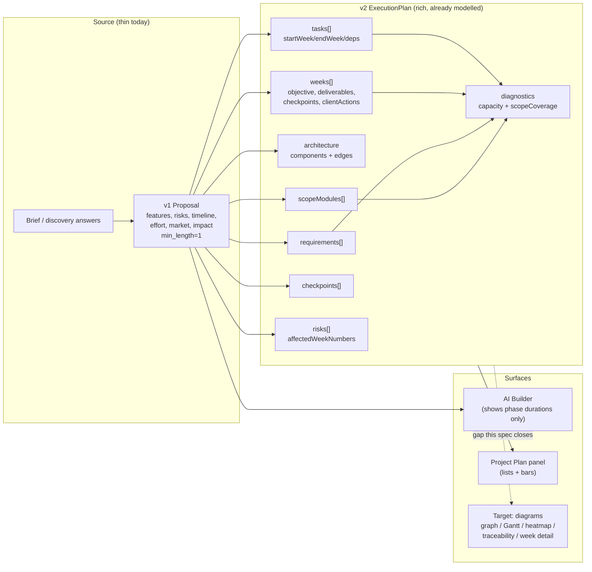

# Requirements — Proposal Depth & Visualisation

## Introduction

The AI Project Proposal Generator currently produces a proposal that is structurally correct but shallow: roughly four scope items, three acceptance criteria, two risks, one market signal, and three milestones expressed only as phase-level durations ("Duration: 3 weeks"). A client reviewing it cannot see *how* the work decomposes week by week, how components relate, where capacity is at risk, or which requirement each task actually serves.

This feature raises the proposal to a decision-ready artifact. It has two distinct halves, both grounded in the existing codebase:

**1. Depth is capped at the source.** `ai-service/app/schemas/proposal.py` sets `min_length=1` on `features`, `risks`, `timeline`, and `effort`, and places no minimum on `market`/`impact` — a single item satisfies the contract. The brief-parser prompt only instructs "keep feature counts realistic" with no target. Separately, `plan_generator.py` builds the v2 `ExecutionPlan` by *deterministic derivation* from the v1 proposal, so it can only redistribute whatever thinness already exists; it cannot add engineering depth.

**2. The richest data already exists but is never surfaced.** The v2 `ExecutionPlan` already models a directed architecture graph (`components` + `edges` typed `sync|async|data|event`), week-by-week `weeks[]` carrying objectives, deliverables, checkpoints and client actions, `tasks[]` with `startWeek`/`endWeek`/`dependencyTaskIds`, `risks[]` with `affectedWeekNumbers`, and `diagnostics.capacity[]` as a role×week utilisation matrix. The AI Builder renders none of this.

A hard constraint runs through everything below. The platform's trust position depends on numbers being explainable, so `brief_parser.py` deliberately derives every numeric score (`confidence_pct`, `risk.severity`, `impact_score`, `market.relevance`) from qualitative LLM signals plus proposal structure, and `timeline_validation.py` recomputes all plan diagnostics server-side and never trusts a model-supplied figure. Adding depth must not weaken that. More detail must mean more *authored, traceable* detail — never invented precision.

### Current vs target information architecture

### Out of scope

- Changing the escrow, payments, agreement, or hiring-handshake behaviour.
- Replacing the deterministic numeric derivation with model-authored scores.
- Introducing 3D or physics visualisations (`three`, `@react-three/*`, `matter-js` remain off the critical path per the frontend performance rules).
- Editing historical proposals in place, or any migration that rewrites stored proposals.

---

## Requirements

### Requirement 1 — Substantive scope depth

**User Story:** As a client reviewing a generated proposal, I want the scope broken into enough discrete, well-described modules that I can judge whether the work is genuinely understood, so that I am not approving a four-bullet summary.

#### Acceptance Criteria

1. WHEN a brief of at least 40 words is parsed THEN the system SHALL produce at least 6 scope/feature items, and SHALL cap the count so the list stays reviewable.
2. WHEN a scope item is produced THEN it SHALL include a title, a description, a technical approach, a complexity label, an area, and at least one acceptance criterion attributable to that item.
3. WHEN the brief is shorter than the depth threshold or lacks substance THEN the system SHALL produce fewer items and SHALL state that depth was limited by brief detail, rather than padding the list with generic entries.
4. WHERE a scope item cannot be tied back to any statement in the brief or discovery answers THEN the system SHALL mark it as an inferred assumption rather than presenting it as a client requirement.
5. WHEN acceptance criteria are generated THEN each SHALL be individually checkable, and the total SHALL scale with the number of scope modules rather than remaining fixed at three.

---

### Requirement 2 — Deeper intelligence analysis

**User Story:** As a client, I want risk, market, and impact analysis with enough coverage and reasoning that it changes a decision, so that this section is more than a single illustrative card.

#### Acceptance Criteria

1. WHEN a proposal is generated THEN the system SHALL produce at least 5 risks spanning more than one category, and each SHALL carry a category, a concrete mitigation, and the scope modules it affects.
2. WHEN a proposal is generated THEN the system SHALL produce at least 3 market signals and at least 3 impact items.
3. WHEN any numeric score is displayed for a risk, impact, or market item THEN that number SHALL be computed by the existing deterministic derivation, and the system SHALL NOT display a model-supplied numeric score.
4. WHEN a user asks how a score was reached THEN the system SHALL show the qualitative inputs that produced it, so the figure is explainable rather than asserted.
5. IF the AI service is unreachable or degraded THEN the system SHALL show the clearly-labelled degraded result and SHALL NOT synthesise additional risks or market items to fill the section.

---

### Requirement 3 — Week-by-week timeline

**User Story:** As a client, I want to see what happens in each individual week rather than a phase labelled "3 weeks", so that I can tell when I will see something and what is expected of me.

#### Acceptance Criteria

1. WHEN a plan exists THEN the AI Builder SHALL present the timeline at week granularity, showing each week's number, label, and objective.
2. WHEN a week is displayed THEN it SHALL list the tasks scheduled in that week, the deliverables due, any checkpoints, and any actions required from the client.
3. WHEN a week has no task, deliverable, checkpoint, or client action THEN the system SHALL surface that as a gap, consistent with the existing week-content validation rule.
4. WHEN a user opens a phase or milestone THEN the system SHALL let them expand into the constituent weeks without leaving the step.
5. WHERE a client action is required in a given week THEN the system SHALL mark whether it is blocking, so schedule dependencies on the client are visible before approval.
6. WHEN the timeline is displayed on a viewport narrower than the desktop breakpoint THEN the week detail SHALL remain readable as a vertical sequence rather than a horizontally clipped chart.

---

### Requirement 4 — Architecture diagram

**User Story:** As a technical reviewer, I want the proposed architecture drawn as a diagram rather than listed as cards, so that I can see how components interact and where the boundaries are.

#### Acceptance Criteria

1. WHEN a plan contains architecture components THEN the system SHALL render them as a directed graph using the existing `components` and `edges` data.
2. WHEN an edge is rendered THEN its kind (`sync`, `async`, `data`, or `event`) SHALL be visually distinguishable, and SHALL NOT be conveyed by colour alone.
3. WHEN a user selects a component THEN the system SHALL show its responsibility, the scope modules it serves, its interfaces, its data boundary, and its failure impact.
4. WHEN a component has unresolved design decisions THEN the system SHALL mark that component as having open decisions.
5. IF the plan has no architecture section THEN the system SHALL show an explicit empty state offering to generate it, rather than rendering a blank canvas.

---

### Requirement 5 — Task schedule and dependency visualisation

**User Story:** As a client or delivery lead, I want to see how tasks span weeks and what blocks what, so that I can spot an unrealistic sequence before funding it.

#### Acceptance Criteria

1. WHEN tasks exist THEN the system SHALL render a schedule view positioning each task across its `startWeek` to `endWeek` span.
2. WHEN a task has dependencies THEN the system SHALL make those relationships visible, and SHALL indicate when a dependency finishes after its dependent starts.
3. WHEN a user selects a task THEN the system SHALL show its owner role, estimate, acceptance criteria, required evidence, and the scope module it serves.
4. WHERE the existing validator has detected a dependency cycle THEN the system SHALL surface that as an error rather than rendering a misleading chart.
5. WHEN a task is on the longest dependency path THEN the system SHALL be able to distinguish it, so the critical path is legible.

---

### Requirement 6 — Capacity heatmap

**User Story:** As a client, I want to see whether the plan asks more of a role than it has hours for, so that I can challenge an over-committed schedule.

#### Acceptance Criteria

1. WHEN diagnostics contain capacity cells THEN the system SHALL render a role-by-week matrix from the existing `capacity` data.
2. WHEN a cell's state is `over` or `warning` THEN the system SHALL mark it distinctly, using a label or pattern in addition to colour.
3. WHEN a cell has no declared capacity THEN the system SHALL render it as unknown rather than implying zero utilisation.
4. WHEN a user selects a cell THEN the system SHALL list the tasks contributing hours to that role in that week.
5. WHEN capacity figures are displayed THEN they SHALL come from the server-side validator and SHALL NOT be recomputed in the browser.

---

### Requirement 7 — Requirement traceability

**User Story:** As a client, I want to confirm every requirement I stated is actually covered by planned work, so that nothing I asked for is quietly missing.

#### Acceptance Criteria

1. WHEN a plan exists THEN the system SHALL present a traceability view linking each requirement to the scope modules, tasks, and checkpoints that satisfy it, using the existing `scopeCoverage` diagnostics.
2. WHEN a requirement has no covering task THEN the system SHALL flag it as uncovered.
3. WHEN the traceability view is displayed THEN it SHALL show the covered count against the total requirement count.
4. WHEN a requirement originated as an inference rather than from the brief THEN the system SHALL show its source, so inferred scope is distinguishable from stated scope.
5. WHEN an open question is blocking THEN the system SHALL associate it with the requirements it blocks.

---

### Requirement 8 — Dynamic project workflow visualisation

**User Story:** As a client, I want an interactive view of how my project moves from brief through delivery to released funds, so that I understand the process I am committing to before I approve anything.

#### Acceptance Criteria

1. WHEN a user opens the workflow visualisation THEN the system SHALL show the project lifecycle stages and SHALL indicate which stage the current project occupies.
2. WHEN a user selects a stage THEN the system SHALL show what happens in it, who is responsible, and what advances it.
3. WHEN a stage is gated by a decision THEN the system SHALL show who holds that decision, and SHALL reflect that hiring requires the freelancer's own acceptance and that funds release requires client acceptance.
4. WHEN the visualisation animates THEN it SHALL respect `prefers-reduced-motion` and SHALL remain fully usable with animation disabled.
5. WHEN the visualisation is operated by keyboard THEN every stage SHALL be reachable and selectable, and the active stage change SHALL be announced.
6. WHEN a project has not reached a stage THEN the system SHALL show it as upcoming rather than implying completion.

---

### Requirement 9 — Plan authoring quality without fabricated precision

**User Story:** As the platform owner, I want added depth to come from genuine reasoning over the brief, so that a longer proposal does not become a more confident-looking guess.

#### Acceptance Criteria

1. WHEN the execution plan is produced THEN every cross-reference identifier SHALL resolve, so the plan remains validator-clean.
2. WHEN a plan is returned from the AI service THEN the deterministic validator SHALL recompute all diagnostics, and any model-supplied diagnostics SHALL be discarded.
3. WHEN the model authors a plan that fails validation THEN the system SHALL fall back to a valid plan rather than surfacing a broken one.
4. WHEN the plan is degraded THEN the system SHALL show the degraded reason, and the plan SHALL contain no invented detail.
5. WHEN generation depth increases THEN a single proposal generation SHALL still complete within the existing request timeout, or SHALL report progress rather than appearing to hang.
6. WHEN an estimate is shown THEN it SHALL be presented as an estimate with its basis available, not as a precise commitment.

---

### Requirement 10 — Sectioned, navigable proposal

**User Story:** As a client, I want a substantially longer proposal to remain easy to navigate, so that added depth does not make it harder to review.

#### Acceptance Criteria

1. WHEN the proposal contains the expanded sections THEN the system SHALL provide navigation between them without losing the reviewer's position.
2. WHEN a section is expanded THEN the system SHALL preserve the existing sequential approval model, so a section is still approved in order.
3. WHEN a section contains more items than fit comfortably THEN the system SHALL progressively disclose the remainder rather than truncating silently.
4. WHEN a user returns to a proposal THEN the system SHALL restore the step and approval state already persisted by the proposal workflow.
5. WHEN a section is empty because data is unavailable THEN the system SHALL explain why rather than rendering an empty container.

---

### Requirement 11 — Backward compatibility

**User Story:** As an existing user, I want my previously generated proposals to keep working, so that this upgrade does not break my history.

#### Acceptance Criteria

1. WHEN a proposal persisted before this feature is loaded THEN it SHALL render without error.
2. WHEN a stored proposal has no execution plan THEN the system SHALL offer to generate one rather than failing.
3. WHEN new fields are added to any stored schema THEN they SHALL be optional, so historical records continue to parse.
4. WHEN a stored proposal lacks the newer visualisation inputs THEN the affected diagram SHALL show an empty state and the rest of the proposal SHALL remain usable.

---

### Requirement 12 — Performance and accessibility of visualisations

**User Story:** As any user, I want the diagrams to load quickly and be usable without a mouse, so that richer visuals do not cost me speed or access.

#### Acceptance Criteria

1. WHEN visualisation code is added THEN it SHALL NOT pull `three`, `@react-three/fiber`, `@react-three/drei`, or `matter-js` into the landing or initial dashboard bundle.
2. WHEN a diagram-heavy view is not being viewed THEN its rendering work SHALL be deferred.
3. WHEN a diagram conveys state THEN that state SHALL be available as text, so it is not communicated by colour alone.
4. WHEN a diagram is interactive THEN it SHALL be operable by keyboard with visible focus.
5. WHEN a diagram exceeds the available width THEN it SHALL scroll within its own container without causing horizontal page scroll.
6. WHEN a plan is large THEN the view SHALL remain responsive to interaction rather than blocking on a synchronous render.

---

## Success Criteria

The feature is complete when a single brief produces a proposal a client could act on without a follow-up call: at least 6 scope modules with per-module acceptance criteria, at least 5 categorised risks with mitigations, a week-by-week timeline where every week names its objective and client obligations, an architecture graph, a task schedule with visible dependencies, a role capacity matrix, and a requirement traceability view — with every displayed number still produced by the deterministic server-side derivation, every diagram keyboard-accessible, and every pre-existing proposal still rendering.
