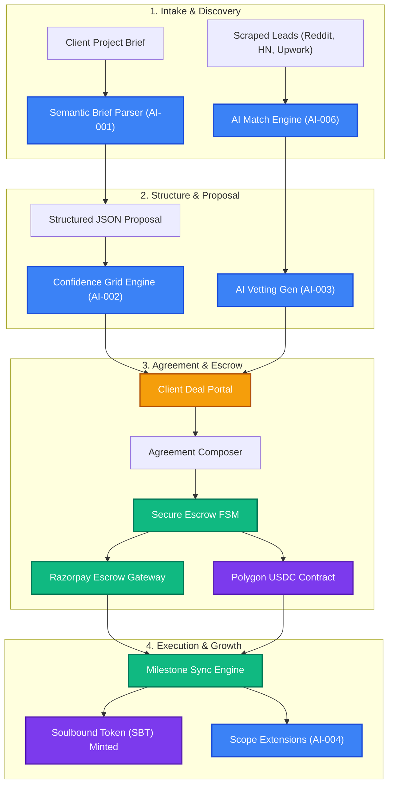

<div align="center">

```
███████╗██╗██╗  ██╗███████╗██╗      ██████╗ ██╗    ██╗ █████╗ ██╗
██╔════╝██║╚██╗██╔╝██╔════╝██║     ██╔═══██╗██║    ██║██╔══██╗██║
█████╗  ██║ ╚███╔╝ █████╗  ██║     ██║   ██║██║ █╗ ██║███████║██║
██╔══╝  ██║ ██╔██╗ ██╔══╝  ██║     ██║   ██║██║███╗██║██╔══██║██║
██║     ██║██╔╝ ██╗██║     ███████╗╚██████╔╝╚███╔███╔╝██║  ██║██║
╚═╝     ╚═╝╚═╝  ╚═╝╚═╝     ╚══════╝ ╚═════╝  ╚══╝╚══╝ ╚═╝  ╚═╝╚═╝
```

### *Verify real skills. Auto-hunt leads. Generate proposals. Secure payments.*

<br/>

[](https://react.dev)
[](https://vite.dev)
[](https://nodejs.org)
[](https://aws.amazon.com)
[](https://aws.amazon.com/dynamodb)
[](https://razorpay.com)
[](https://polygon.technology)

<br/>

> **An all-in-one AI & Web3 operating system for freelancers and agencies. Verify GitHub evidence, auto-aggregate opportunities, draft personalized outreach, build structured proposals, and secure payments via Razorpay fiat escrow and Polygon smart contracts.**

</div>

---

## 📖 Executive Summary & Core Value Proposition

FixFlowAI is a trust-first hiring platform and automated freelance execution workspace. Traditional freelancing platforms are plagued by skill inflation, high client intake friction, and default risks. FixFlowAI resolves this by replacing resume-based profiles with **evidence-based vetting** (direct scanner of repositories and commits) and securing delivery using a state-machine-driven milestone payments engine. 

For a deep dive into our market research, target personas, and value positioning, refer to the [market_positioning_and_uvps.md](file:///c:/Users/suvam/Desktop/VS%20code/Projects/FixFlowAI/docs/specifications/product_strategy/market_positioning_and_uvps.md) specification.

---

## 🗺️ Project Navigation Index

All project specifications, blueprints, and roadmaps are organized under `docs/specifications/`. Select a guide below to explore specific details:

### 1. Product & UI Strategy
*   [market_positioning_and_uvps.md](file:///c:/Users/suvam/Desktop/VS%20code/Projects/FixFlowAI/docs/specifications/product_strategy/market_positioning_and_uvps.md) – Competitive analysis, unique selling points, and pricing models.
*   [landing_page_redesign_implementation_plan.md](file:///c:/Users/suvam/Desktop/VS%20code/Projects/FixFlowAI/docs/specifications/product_strategy/landing_page_redesign_implementation_plan.md) – Structural blueprints for the modern landing page redesign.
*   [fixflowai_product_image_generation_prompt_pack.md](file:///c:/Users/suvam/Desktop/VS%20code/Projects/FixFlowAI/docs/specifications/product_strategy/fixflowai_product_image_generation_prompt_pack.md) – High-fidelity Midjourney/FLUX asset prompt libraries for dashboard views.

### 2. System Architecture & Database
*   [system_design.md](file:///c:/Users/suvam/Desktop/VS%20code/Projects/FixFlowAI/docs/specifications/architecture/system_design.md) – AWS serverless layout, tech stack, and cost parameters.
*   [erd_and_api_contracts.md](file:///c:/Users/suvam/Desktop/VS%20code/Projects/FixFlowAI/docs/specifications/architecture/erd_and_api_contracts.md) – Core DynamoDB schemas, API endpoints, and event structures.
*   [database_design.md](file:///c:/Users/suvam/Desktop/VS%20code/Projects/FixFlowAI/docs/specifications/architecture/database_design.md) – PostgreSQL relational schema and Prisma ORM definition.
*   [security_architecture.md](file:///c:/Users/suvam/Desktop/VS%20code/Projects/FixFlowAI/docs/specifications/architecture/security_architecture.md) – Access control, rate limits, data encryption, and Web3 security protocols.
*   [backend_connectivity_roadmap.md](file:///c:/Users/suvam/Desktop/VS%20code/Projects/FixFlowAI/docs/specifications/architecture/backend_connectivity_roadmap.md) – Roadmap to tie frontend components to active REST/SSE services.

### 3. Core Subsystems & Feasibility
*   [skills.md](file:///c:/Users/suvam/Desktop/VS%20code/Projects/FixFlowAI/docs/specifications/core_subsystems/skills.md) – Production manual for the core backend skill engines.
*   [extra_implementation_roadmap.md](file:///c:/Users/suvam/Desktop/VS%20code/Projects/FixFlowAI/docs/specifications/core_subsystems/extra_implementation_roadmap.md) – Testing boundaries, error-handling states, and validation logic.
*   [opportunity_intelligence_implementation.md](file:///c:/Users/suvam/Desktop/VS%20code/Projects/FixFlowAI/docs/specifications/core_subsystems/opportunity_intelligence_implementation.md) – Lead scraping architecture across platforms.
*   [opportunity_intelligence_alternative_platforms.md](file:///c:/Users/suvam/Desktop/VS%20code/Projects/FixFlowAI/docs/specifications/core_subsystems/opportunity_intelligence_alternative_platforms.md) – Comparison of Brave, SerpAPI, and Apify scraper tools.
*   [client_project_ingestion_feasibility.md](file:///c:/Users/suvam/Desktop/VS%20code/Projects/FixFlowAI/docs/specifications/core_subsystems/client_project_ingestion_feasibility.md) – Feasibility breakdown of importing client contracts from external portals.

### 4. Frontend Specifications
*   [frontend_gaps_and_requirements.md](file:///c:/Users/suvam/Desktop/VS%20code/Projects/FixFlowAI/docs/specifications/frontend/frontend_gaps_and_requirements.md) – Assessment of UI gaps and dynamic components.
*   [frontend_implementation_guide.md](file:///c:/Users/suvam/Desktop/VS%20code/Projects/FixFlowAI/docs/specifications/frontend/frontend_implementation_guide.md) – Detailed guide for live state integration, charts, and portals.
*   [frontend_roadmap.md](file:///c:/Users/suvam/Desktop/VS%20code/Projects/FixFlowAI/docs/specifications/frontend/frontend_roadmap.md) – Frontend development stages and milestones.

### 5. AI Features Index
*   [ai_features/README.md](file:///c:/Users/suvam/Desktop/VS%20code/Projects/FixFlowAI/docs/specifications/ai_features/README.md) – Overarching master index for all integrated AI systems.

---

## 🤖 AI Feature Matrix

FixFlowAI implements 6 specialized AI features powered by Google Gemini and custom orchestration agents:

| Feature ID | Feature Name | Core Capability | Specification Document |
| :--- | :--- | :--- | :--- |
| **AI-001** | Semantic Brief Parsing | Extracts scope, requirements, tech stack, and milestones from text/PDFs into structured JSON proposals. | [ai_001_semantic_brief_parsing.md](file:///c:/Users/suvam/Desktop/VS%20code/Projects/FixFlowAI/docs/specifications/ai_features/ai_001_semantic_brief_parsing.md) |
| **AI-002** | Multi-Agent Confidence Grid | Grades proposal task cards for cost, time, and feasibility, self-correcting outliers through agent consensus loops. | [ai_002_confidence_grid_self_correction.md](file:///c:/Users/suvam/Desktop/VS%20code/Projects/FixFlowAI/docs/specifications/ai_features/ai_002_confidence_grid_self_correction.md) |
| **AI-003** | AI Vetting Interview | Generates context-specific, randomized questionnaire flows to vet candidate competencies on the brief's stack. | [ai_003_interview_vetting_generation.md](file:///c:/Users/suvam/Desktop/VS%20code/Projects/FixFlowAI/docs/specifications/ai_features/ai_003_interview_vetting_generation.md) |
| **AI-004** | Contract Scope Extensions | Monitors active project logs and scopes, dynamically offering contract extension clauses to retain talent. | [ai_004_contextual_contract_extensions.md](file:///c:/Users/suvam/Desktop/VS%20code/Projects/FixFlowAI/docs/specifications/ai_features/ai_004_contextual_contract_extensions.md) |
| **AI-005** | Opportunity Intelligence | Scrapes and categorizes client projects from Upwork, Reddit, HN, Tavily, scoring leads by margin and viability. | [ai_005_opportunity_intelligence_scoring.md](file:///c:/Users/suvam/Desktop/VS%20code/Projects/FixFlowAI/docs/specifications/ai_features/ai_005_opportunity_intelligence_scoring.md) |
| **AI-006** | Developer Skill Matching | Scans freelancer GitHub repositories (commits, metadata) and matches them to active client proposals. | [ai_006_smart_matching_lead_scoring.md](file:///c:/Users/suvam/Desktop/VS%20code/Projects/FixFlowAI/docs/specifications/ai_features/ai_006_smart_matching_lead_scoring.md) |

---

## ⚙️ Core Engineering Skills (Production Modules)

The core logic of FixFlowAI is encapsulated in modular engine directories. These run inside the backend API node environment or handle active sync operations:

### 📥 Backend Modules (`backend/src/skills/`)
1.  [briefParser.ts](file:///c:/Users/suvam/Desktop/VS%20code/Projects/FixFlowAI/backend/src/skills/briefParser.ts): Uses Gemini structured JSON outputs to parse text briefs, enforcing schemas using Zod validation.
2.  [confidenceGrid.ts](file:///c:/Users/suvam/Desktop/VS%20code/Projects/FixFlowAI/backend/src/skills/confidenceGrid.ts): Evaluates project risks, sets baseline hours/costs, and triggers self-correction loops on task cards.
3.  [interviewGenerator.ts](file:///c:/Users/suvam/Desktop/VS%20code/Projects/FixFlowAI/backend/src/skills/interviewGenerator.ts): Customizes project-specific screening tests to filter candidates based on brief requirements.
4.  [contextExtensions.ts](file:///c:/Users/suvam/Desktop/VS%20code/Projects/FixFlowAI/backend/src/skills/contextExtensions.ts): Scrapes project conversation logs and tasks to propose contract revisions and renewals.
5.  [escrowStateMachine.ts](file:///c:/Users/suvam/Desktop/VS%20code/Projects/FixFlowAI/backend/src/skills/escrowStateMachine.ts): Oversees project phase lifecycles, release approvals, and disputes with cryptographically generated audit hashes.
6.  [syncServer.ts](file:///c:/Users/suvam/Desktop/VS%20code/Projects/FixFlowAI/backend/src/skills/syncServer.ts): Coordinates high-throughput WebSocket synchronization and handles conflicts using Vector Clocks.
7.  [reputationCalculator.js](file:///c:/Users/suvam/Desktop/VS%20code/Projects/FixFlowAI/backend/src/skills/reputationCalculator.js): Compiles Git metrics and payment histories to mint Soulbound ID tokens on Polygon.
8.  [clientScoring.js](file:///c:/Users/suvam/Desktop/VS%20code/Projects/FixFlowAI/backend/src/skills/clientScoring.js): Assesses client risk based on historical funding activity, communications, and disputes.
9.  [earningsCalculator.js](file:///c:/Users/suvam/Desktop/VS%20code/Projects/FixFlowAI/backend/src/skills/earningsCalculator.js): Projects tax estimates, platform processing costs, and direct payouts.

### 📤 Frontend Modules (`frontend/src/skills/`)
1.  [optimisticSync.js](file:///c:/Users/suvam/Desktop/VS%20code/Projects/FixFlowAI/frontend/src/skills/optimisticSync.js): Manages local Zustand stores, optimistic server updates, and local storage offline caching fallback.

---

## 🔄 Project Lifecycle Workflow

Below is the structured lifecycle flow representing the core interaction pattern between Clients, Freelancers, the AI Orchestration layer, and Smart Contracts:



---

## 📈 Backend Connectivity Roadmap

To replace mock data with active database connections and APIs, we follow a 4-phase integration plan as mapped in the [backend_connectivity_roadmap.md](file:///c:/Users/suvam/Desktop/VS%20code/Projects/FixFlowAI/docs/specifications/architecture/backend_connectivity_roadmap.md):

```
┌─────────────────────────────────────────────────────────────────────────┐
│                      BACKEND CONNECTIVITY ROADMAP                       │
├─────────────────────────────────────────────────────────────────────────┤
│ Phase 1: Authentication & Client Setup                                  │
│ - Implement live JWT/OAuth auth & map PostgreSQL via Prisma.            │
├─────────────────────────────────────────────────────────────────────────┤
│ Phase 2: AI Proposal Pipeline & Streaming                               │
│ - Integrate active Gemini API endpoints using Express SSE streams.      │
├─────────────────────────────────────────────────────────────────────────┤
│ Phase 3: Financial Escrow & Websocket Sync                              │
│ - Implement Razorpay webhooks and stateful WebSocket sync engines.     │
├─────────────────────────────────────────────────────────────────────────┤
│ Phase 4: Production Polish & Security Audits                            │
│ - Set up rate limits, security tokens, and monitor pipeline performance.│
└─────────────────────────────────────────────────────────────────────────┘
```

---

## 📂 Project Directory Structure

```
FixFlowAI/
├── 📁 .agents/                         ← AI Agent Skills (auto-discovered)
│   ├── 📄 AGENTS.md                    ← Project-wide rules & conventions
│   └── 📁 skills/                      ← 8 specialized AI coding skills
│       ├── 📁 fixflow-system-architect/
│       ├── 📁 fixflow-fullstack-engineer/
│       ├── 📁 fixflow-gemini-orchestrator/
│       ├── 📁 fixflow-escrow-fsm-expert/
│       ├── 📁 fixflow-react-ui-craftsman/
│       ├── 📁 fixflow-testing-sentinel/
│       ├── 📁 fixflow-devops-deployer/
│       └── 📁 fixflow-security-auditor/
├── 📁 backend/                         ← Production Node.js + Express API
│   ├── 📁 src/
│   │   ├── 📁 skills/                  ← 9 Backend production skill modules
│   │   └── 📁 test/                    ← Skill verification tests
│   ├── 📄 package.json                 ← Express configuration
│   └── 📄 tsconfig.json                ← TypeScript configurations
├── 📁 docs/                            ← Architecture & Specification Manuals
│   ├── 📄 FixFlowAI_Week1_BuildInPublic.pdf
│   └── 📁 specifications/              ← Interactive system plans
│       ├── 📁 ai_features/             ← AI feature guides (AI-001 - AI-006)
│       ├── 📁 architecture/            ← System design & db connectivity maps
│       ├── 📁 core_subsystems/         ← Skills & lead scraper evaluations
│       ├── 📁 frontend/                ← Gaps assessment and implementation guide
│       └── 📁 product_strategy/        ← Brand UVPs and redesign blueprints
├── 📁 frontend/                        ← Production Vite + React 18 Application
│   ├── 📁 src/
│   │   ├── 📁 components/              ← Reusable glassmorphic UI components
│   │   ├── 📁 sections/                ← 9 Dashboard tabs UI panels
│   │   ├── 📁 store/                   ← Zustand global state controllers
│   │   └── 📁 skills/                  ← Optimistic sync & storage utilities
│   ├── 📄 package.json                 ← Vite configuration
│   └── 📄 tailwind.config.js           ← Tailwind CSS configurations
├── 📁 References/                      ← PDF briefs and product guidelines
└── 📄 README.md                        ← Main developer documentation (this file)
```

---

## 💻 Developer Getting Started Guide

Follow these steps to spin up the local development environments:

### Prerequisites
*   Node.js (v18+)
*   NPM or Yarn
*   A Gemini API Key (set in backend environment)

### 1. Set Up the Backend
1. Navigate to the backend directory:
   ```bash
   cd backend
   ```
2. Install all node packages:
   ```bash
   npm install
   ```
3. Configure the environment variables. Create a `.env` file in the backend root:
   ```env
   PORT=5000
   GEMINI_API_KEY=your_gemini_api_key_here
   ```
4. Transpile typescript and start the server:
   ```bash
   npm run build
   npm start
   ```

### 2. Set Up the Frontend
1. Navigate to the frontend directory:
   ```bash
   cd ../frontend
   ```
2. Install dependencies:
   ```bash
   npm install
   ```
3. Boot up the Vite developer instance:
   ```bash
   npm run dev
   ```
4. Access the dashboard via `http://localhost:5173`.

---

## 💰 Cost-Optimized AWS Serverless Architecture

For cloud deployments, FixFlowAI uses a 100% pay-as-you-go architecture to support over **1,000 monthly active users (MAUs)** with minimal operating cost. This eliminates always-on server costs:

| AWS Service | Deployment Details | Purpose | Monthly Cost (Est.) |
| :--- | :--- | :--- | :--- |
| **AWS Amplify Hosting** | CDN Edge Routing | Static frontend asset deployment & distribution | **$0.00** (Free Tier) |
| **AWS Lambda** | Function URLs | Handles Node.js API processes and streams responses | **$0.00** (Free Tier) |
| **Amazon DynamoDB** | On-Demand Mode | Document storage for proposals and user settings | **$0.00** (Free Tier) |
| **Amazon S3** | Object Storage | Houses uploaded briefs, PDFs, and JSON structures | **$0.00** (Free Tier) |
| **Upstash Redis** | Serverless Tier | Rate-limiting, cache layers, and scraper worker queues | **$0.00** (Free Tier) |
| **AWS Secrets Manager** | API Key Storage | Restricts key scopes and handles rotations | **$0.80** |
| **Route 53 & SES** | DNS & Simple Email | Handles domain configurations and emails | **$0.55** |
| **TOTAL** | **Pay-As-You-Go** | **Complete platform operational costs** | **~$1.35 / month** |

> [!NOTE]
> The platform can scale seamlessly to handle thousands of requests without server upgrades, incurring costs only proportional to active user growth.

---

## 🧠 AI Agent Skills (`.agents/skills/`)

This project ships with **8 specialized AI agent skills** that automatically load when any AI coding assistant (Antigravity, Copilot, Cursor, Windsurf, etc.) opens the workspace. These skills transform any LLM into an AGI-level full-stack engineer with deep knowledge of FixFlowAI's architecture, patterns, and conventions.

| Skill | Role | What It Teaches the AI |
| :--- | :--- | :--- |
| **`fixflow-system-architect`** | Principal Architect | Full system topology, module responsibilities, architectural decision framework, scaling strategy |
| **`fixflow-fullstack-engineer`** | AGI Engineer | End-to-end feature workflow (Schema → API → UI → Test), code templates from existing codebase |
| **`fixflow-gemini-orchestrator`** | AI/ML Lead | `@google/genai` SDK patterns, multi-agent personas, self-correction loops, temperature tuning |
| **`fixflow-escrow-fsm-expert`** | Financial Systems Lead | FSM state transitions, SHA-256 audit trails, optimistic concurrency, Razorpay webhooks |
| **`fixflow-react-ui-craftsman`** | Frontend Lead | Glassmorphism design system, Zustand patterns, Framer Motion animations, dashboard architecture |
| **`fixflow-testing-sentinel`** | QA Lead | Zod schema tests, FSM transition tests, LLM mock strategies, edge case checklists |
| **`fixflow-devops-deployer`** | Cloud Infra Lead | AWS Serverless deployment, CI/CD pipelines, Lambda packaging, cost optimization |
| **`fixflow-security-auditor`** | Security Lead | Threat modeling, JWT/RBAC auth, rate limiting, prompt injection defense, Web3 wallet security |

Additionally, the master [AGENTS.md](.agents/AGENTS.md) file enforces project-wide coding conventions, naming patterns, and quality gates across all AI interactions.

> [!TIP]
> Clone this repo and open it in any AI-powered IDE — the agent skills are auto-discovered from `.agents/skills/`, giving you an AI assistant that already understands the entire FixFlowAI codebase.

---

## 📜 License

This project is licensed under the **MIT License** — see the [LICENSE](LICENSE) file for details.

<div align="center">
<br/>

```
Built with obsession · Scaled with AWS Serverless · Powered by Razorpay & Gemini

            "Integrate execution. Guarantee payment."
```

</div>
