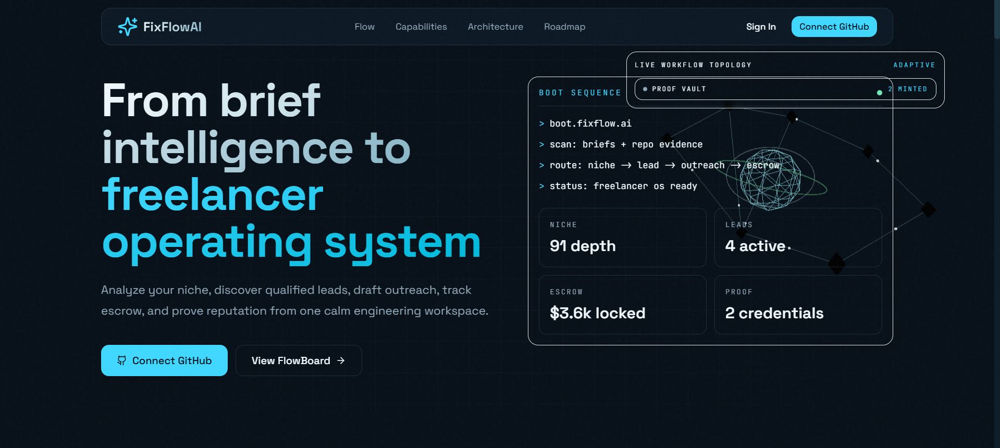
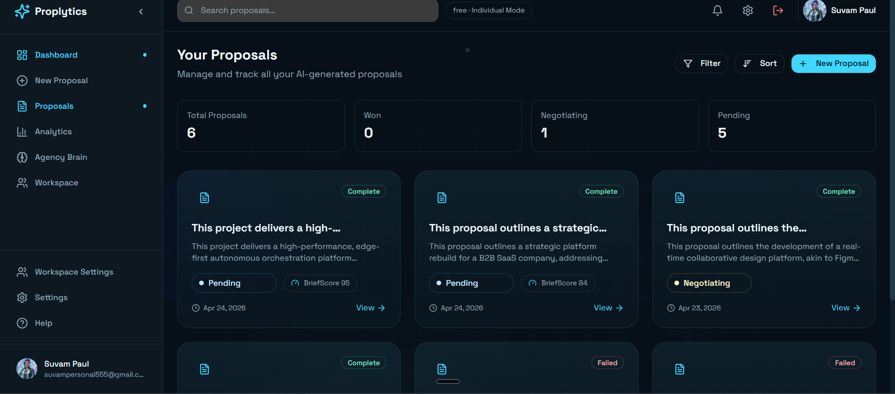
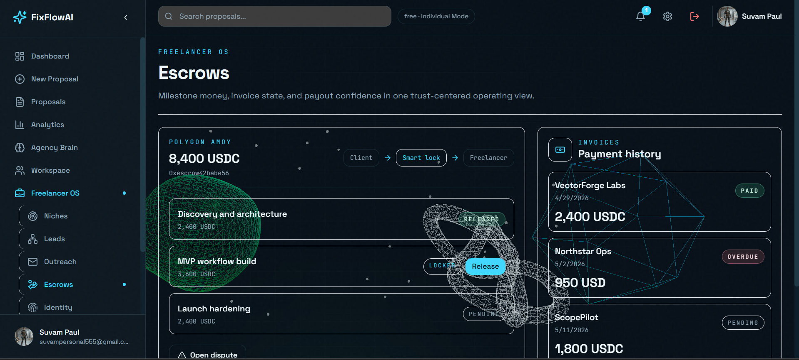
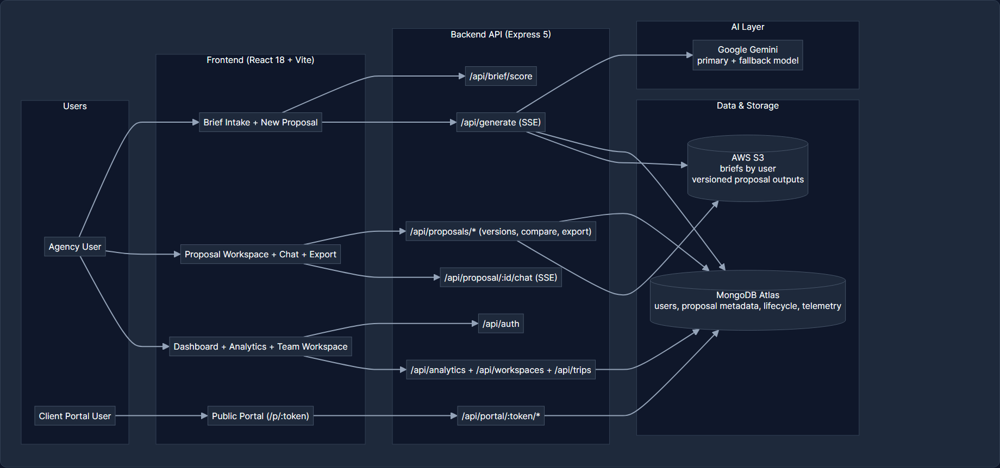
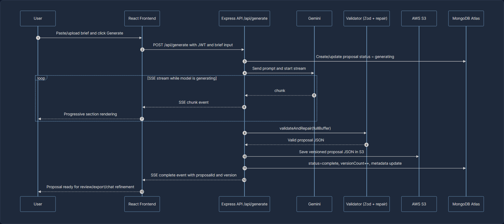
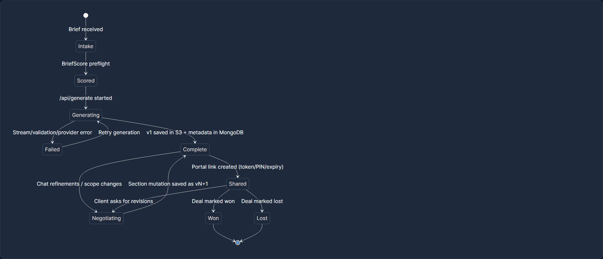

<div align="center">

```
██████╗ ██████╗  ██ ███╗ ██████╗ ██╗  ██╗   ██╗████████╗██╗ ██████╗███████╗
██╔══██╗██╔══██╗██╔═══██╗██╔══██╗██║  ╚██╗ ██╔╝╚══██╔══╝██║██╔════╝██╔════╝
██████╔╝██████╔╝██║   ██║██████╔╝██║   ╚████╔╝    ██║   ██║██║     ███████╗
██╔═══╝ ██╔══██╗██║   ██║██╔═══╝ ██║    ╚██╔╝     ██║   ██║██║     ╚════██║
██║     ██║  ██║╚██████╔╝██║     ███████╗██║      ██║   ██║╚██████╗███████║
╚═╝     ╚═╝  ╚═╝ ╚═════╝ ╚═╝     ╚══════╝╚═╝      ╚═╝   ╚═╝ ╚═════╝╚══════╝
```

### *Paste a brief. Get a proposal. Close faster.*



<br/>

[](https://react.dev)
[](https://developer.mozilla.org/en-US/docs/Web/JavaScript)
[](https://vite.dev)
[](https://nodejs.org)
[](https://aws.amazon.com)
[](https://mongodb.com/atlas)
[](LICENSE)
[]()

<br/>

> **AI-powered client brief → structured proposal generator · Streaming JSON · Confidence Grid · Built for agencies and freelancers**

</div>

---

## ❓ The Problem Nobody Talks About

<div align="center">

| Agencies Deal With | But Proposals Are Built With |
|:---:|:---:|
| **$50K–$500K project scopes** | **Copy-paste from old proposals** |
| **48-hour turnaround pressure** | **3–5 days of manual writing** |
| **Complex technical requirements** | **Guesswork on effort estimates** |
| **Multiple stakeholders needing clarity** | **Inconsistent, unstructured docs** |

</div>

<br/>

The gap between **receiving a client brief** and **delivering a polished proposal** costs agencies thousands of hours per year in manual effort.

The typical proposal workflow looks like this:
- Read a 5-page brief carefully (30 min)
- Identify features, risks, and unknowns (1–2 hours)
- Estimate effort per feature with the team (2–4 hours)
- Write the proposal document (4–8 hours)
- Review, revise, format, and export (2–3 hours)

**Total: 10–17 hours per proposal.** For an agency sending 4 proposals per week, that's **200+ hours/month** burned on document creation alone.

> **This is not a writing problem. It is a structured analysis problem.** An LLM that can parse intent, extract requirements, and output structured JSON can collapse 15 hours of work into 30 seconds — if the pipeline is built correctly.

---

## 🧠 Why We Built Proplytics

<div align="center">

```
The Real Problem We Solved
══════════════════════════════════════════════════════════════════

    Client Brief Arrives              What Currently Happens
    ──────────────────               ──────────────────────

    "We need an AI dashboard         → Read entire brief
     integrated with Salesforce       → Manually list features
     with real-time analytics..."     → Guess effort estimates
                                      → Write 8-page proposal
                                      → Review and revise
                                      → Format and export PDF

    Total time to proposal: 2 days   Cost per proposal: ~$1,200

    ══════════════════════════════════════════════════════════════

    With Proplytics:

    "We need an AI dashboard         → Paste the brief
     integrated with Salesforce       → Press Generate
     with real-time analytics..."     → Get structured proposal
                                      → Review confidence scores
                                      → Export PDF

    Total time to proposal: < 30s    Cost per proposal: < $0.05
```

</div>

<br/>

We built Proplytics because the intersection of **streaming LLMs** and **structured JSON output** finally makes it possible to transform raw client briefs into complete, confidence-scored technical proposals — not with a chatbot that guesses, but with a pipeline that extracts, structures, validates, and presents.

This is not a template filler. Proplytics is a **deterministic analysis pipeline** where the LLM acts as an elite consultant, extracting features, risks, and effort estimates from the client's own words. **The Confidence Grid shows exactly how sure the AI is about every recommendation.**

---

## 🎯 Our Approach & Solution

### The Core Insight

Most AI proposal tools generate long text first and try to structure it later. Proplytics does the reverse: **generate schema-constrained JSON first, then render interactive proposal UI from that structured output.**

<div align="center">

```
                    PROPLYTICS DELIVERY PIPELINE
    ╔════════════════════════════════════════════════════════════╗
    ║                                                            ║
    ║  Brief Input (Text or PDF/DOCX upload)                    ║
    ║        │                                                   ║
    ║        ▼                                                   ║
    ║  ┌──────────────────────────────┐                          ║
    ║  │ BriefScore Preflight         │  ← Quality diagnostics   ║
    ║  │ /api/brief/score             │    + improvement prompts ║
    ║  └───────────────┬──────────────┘                          ║
    ║                  │                                           ║
    ║                  ▼                                           ║
    ║  ┌──────────────────────────────┐                          ║
    ║  │ Prompt Builder + JSON Schema │  ← Strict output contract ║
    ║  └───────────────┬──────────────┘                          ║
    ║                  │                                           ║
    ║                  ▼                                           ║
    ║  ┌──────────────────────────────┐                          ║
    ║  │ Gemini Stream (/api/generate)│  ← SSE chunks to client   ║
    ║  └───────────────┬──────────────┘                          ║
    ║                  │                                           ║
    ║                  ▼                                           ║
    ║  ┌──────────────────────────────┐                          ║
    ║  │ Zod Validation + JSON Repair │  ← Fence strip/extract    ║
    ║  └───────────────┬──────────────┘                          ║
    ║                  │                                           ║
    ║                  ▼                                           ║
    ║  ┌──────────────────────────────┐                          ║
    ║  │ Persist + Versioning          │  ← S3 output/{u}/{p}/vN  ║
    ║  │ + Metadata index              │    + MongoDB metadata     ║
    ║  └───────────────┬──────────────┘                          ║
    ║                  │                                           ║
    ║                  ▼                                           ║
    ║  ┌──────────────────────────────┐                          ║
    ║  │ Proposal Workspace            │  ← Chat refine, diff,     ║
    ║  │ + Export + Share Portal       │    analytics, lifecycle   ║
    ║  └──────────────────────────────┘                          ║
    ║                                                            ║
    ╚════════════════════════════════════════════════════════════╝
```

</div>

### The Confidence Grid — Signature Feature



<div align="center">

| | Feature | Confidence | Complexity | What It Means |
|:---:|:---|:---:|:---:|:---|
| 🟢 | BriefScore preflight | **High (90%)** | Medium | Intake quality is scored before generation starts |
| 🟢 | LLM JSON streaming | **High (84%)** | High | End-to-end chunk streaming with progressive UI rendering |
| 🟢 | Confidence Grid UI | **High (86%)** | Medium | Per-feature confidence bars and complexity badges are live |
| 🟢 | Revision diff engine | **High (80%)** | Medium | Version compare endpoint with structured JSON diff |
| 🟢 | Multi-format export | **High (78%)** | Medium | PDF, JSON, and Markdown export from stored versions |
| 🟡 | Section mutation chat | **Medium (66%)** | High | Live negotiation updates with section-level version bumps |
| 🟡 | Portal telemetry + feedback | **Medium (63%)** | Medium | Share links, PIN gates, dwell/event tracking, feedback capture |
| 🟡 | Email-dependent workflows | **Medium (58%)** | Medium | OTP reset and outcome sends depend on SMTP configuration |

</div>

Every feature card in the proposal has a **colour-coded left accent**, a **confidence score bar**, and a **complexity badge** — all derived directly from the LLM's structured JSON output. This is what makes Proplytics proposals feel *premium*.



### What Makes Us Different

<div align="center">

| Competitor Approach | Proplytics Approach |
|:---|:---|
| One-shot generation with no intake quality check | BriefScore preflight + improvement prompts before generation |
| Generic blocks of AI text | Strict schema-constrained JSON from the model |
| Wait for full response before rendering | Streaming sections appear progressively in the workspace |
| “Trust us” black-box output | Confidence/complexity surfaced feature-by-feature |
| No post-generation workflow | In-app negotiate/refine chat with versioned section updates |
| Single document output | PDF + JSON + Markdown exports from versioned snapshots |
| No client visibility layer | Secure public portal with PIN/expiry, analytics, and feedback |

</div>

---

## 🏗️ Architecture

### Visual Architecture Overview

#### 1) System Architecture Map



#### 2) Proposal Generation Flow (End-to-End)



#### 3) Proposal Lifecycle Workflow



<div align="center">

```
┌──────────────────────────────────────────────────────────────────────────────┐
│                                  USER APP                                   │
│                     React 18 + Vite + Zustand + React Query                 │
│                                                                              │
│  /new (brief intake + score)  /proposal/:id (workspace + chat + export)     │
│  /dashboard (pipeline list)    /analytics (win/loss + confidence insights)   │
│  /p/:token (public client portal with PIN + tracking + feedback)             │
└──────────────────────────────────────┬───────────────────────────────────────┘
                                       │ HTTPS + JWT
                                       ▼
┌──────────────────────────────────────────────────────────────────────────────┐
│                         BACKEND API — Express 5                              │
│                                                                              │
│  Auth & Access         Intelligence             Proposal Lifecycle            │
│  • /api/auth/*         • /api/brief/score      • /api/proposals/*            │
│  • JWT + refresh       • /api/generate (SSE)   • /versions + compare         │
│  • GitHub OAuth        • prompt + schema guard • export (pdf/json/md)        │
│  • OTP reset (SMTP)    • json repair pipeline  • outcome (won/lost)          │
│                                                                              │
│  Collaboration & Client View                                                  │
│  • /api/proposal/:id/chat (SSE, mutate sections)                              │
│  • /api/proposals/:id/portal (share links, PIN, expiry)                       │
│  • /api/portal/:token/* (public verify/event/feedback)                        │
│  • /api/analytics/proposals                                                   │
└───────────────┬────────────────────────────┬─────────────────────────────────┘
                │                            │
                ▼                            ▼
      ┌───────────────────────┐    ┌────────────────────────────┐
      │ MongoDB Atlas         │    │ AWS S3                     │
      │ • users/auth tokens   │    │ • briefs/{userId}/...      │
      │ • proposal metadata   │    │ • output/{userId}/{id}/vN  │
      │ • deal lifecycle      │    │ • versioned JSON snapshots │
      │ • portal telemetry    │    │                            │
      └───────────┬───────────┘    └──────────────┬─────────────┘
                  │                               │
                  └──────────────┬────────────────┘
                                 ▼
                     ┌──────────────────────────┐
                     │ Google Gemini via SDK    │
                     │ • primary + fallback     │
                     │ • guard on key failures  │
                     │ • structured JSON stream │
                     └──────────────────────────┘
```

</div>

### Key Architecture Decisions

<div align="center">

| Decision | Why We Made It | What It Enables |
|:---|:---|:---|
| **Schema-first generation** | Unstructured responses are hard to validate safely | Deterministic rendering + safer downstream automation |
| **SSE over fetch stream parsing** | Need token-by-token updates for long responses | Live section reveal and better perceived performance |
| **S3 versioned proposal blobs** | Full proposal payloads are document-like | Cheap immutable versions + compare/export by version |
| **MongoDB metadata index** | Fast querying for dashboard and lifecycle status | Pagination, filtering, analytics, portal ownership checks |
| **Proposal chat section mutator** | Editing one section should not regenerate everything | Targeted updates + automatic version increments |
| **Portal token + optional PIN model** | Clients need low-friction but controlled access | Public share links with expiry, tracking, and feedback |
| **Gemini guard + fallback model** | API keys/model availability can fail at runtime | Faster recovery from quota/auth/model issues |
| **Puppeteer + markdown/json export** | Different stakeholders want different handoff formats | Browser-quality PDF plus machine-readable exports |

</div>

---

## ⚙️ Technology Stack

<div align="center">

| Layer | Technology | Version | Purpose |
|:---:|:---:|:---:|:---|
| **Frontend Framework** | React | 18.3 | SPA with route-level lazy loading |
| **Language** | JavaScript | ES2022+ | Shared frontend/backend language |
| **Build Tool** | Vite | 5.3 | Fast local dev + optimized production bundles |
| **Routing** | React Router DOM | 6.23 | Protected routes + public portal routes |
| **Server State** | TanStack React Query | 5.99 | API caching + async state synchronization |
| **Client State** | Zustand | 5.0 | Auth, streaming proposal buffer/state |
| **Animation** | Framer Motion | 11.2 | Page transitions + section animations |
| **3D Rendering** | Three.js + R3F + Drei | 0.165 / 8.16 / 9.106 | Landing hero visuals |
| **Styling** | Tailwind CSS | 3.4 | Utility-first design system |
| **Icons / Feedback** | Lucide React + React Hot Toast | 0.396 / 2.6 | Iconography + notifications |
| | | | |
| **Backend Runtime** | Node.js + Express | Express 5.2 | API routes, auth, SSE streaming |
| **Auth & Security** | JWT + bcryptjs + helmet + express-rate-limit | — | Access/refresh auth, hashing, headers, throttling |
| **Data Layer** | Mongoose + MongoDB Atlas | 9.4 | Users, proposal metadata, portal metrics |
| **File Parsing** | pdf-parse / mammoth | 2.4 / 1.12 | PDF/DOCX brief extraction |
| **LLM Provider** | Google Gemini (`@google/genai`) | 1.50 | Structured JSON generation + chat refinement |
| **Schema Validation** | Zod | 4.3 | Request validation + output contracts |
| **Diff Engine** | jsondiffpatch | 0.7 | Version comparison for proposal history |
| **PDF Engine** | Puppeteer | 24.42 | Browser-grade export rendering |
| **Email Delivery** | Nodemailer (SMTP) | 8.0 | OTP + lifecycle email delivery |
| | | | |
| **Object Storage** | AWS S3 + AWS SDK v3 | 3.1034 | Brief uploads + versioned proposal JSON |
| **Database** | MongoDB Atlas | — | Proposal index + lifecycle/portal analytics |
| **Frontend Host (optional)** | Vercel / Amplify / static hosting | — | Deploy built SPA |
| **Backend Host (optional)** | Node runtime / container (Docker present) | — | API deployment flexibility |
| **Testing** | Node test runner + Playwright | 1.59 (Playwright) | Backend service tests + E2E suite |

</div>

---

## ✨ Features

<div align="center">

| | Feature | Description | Status |
|:---:|:---|:---|:---:|
| 📋 | **Brief Intake (Paste / Upload)** | Paste text or upload PDF/DOCX/TXT via signed URL flow | ✅ Live |
| 🧠 | **BriefScore Quality Gate** | Scores scope/technical/timeline/budget/stakeholder/success signal before generation | ✅ Live |
| 🤖 | **AI Proposal Generation** | Structured proposal JSON generated from brief using strict schema prompts | ✅ Live |
| ⚡ | **Streaming Output** | SSE stream with progressive section reveal in the UI | ✅ Live |
| 📊 | **Confidence Grid** | Per-feature confidence %, complexity, and visual confidence styling | ✅ Live |
| ⏱️ | **Effort + Timeline + Risk Views** | Dedicated cards for effort allocation, phases, and mitigations | ✅ Live |
| 🗂️ | **Proposal Dashboard** | Proposal listing with lifecycle states (pending / negotiating / won / lost) | ✅ Live |
| 🔄 | **Revision History + Diff** | Versioned snapshots with side-by-side compare endpoint | ✅ Live |
| 📤 | **Export (PDF / JSON / Markdown)** | Download proposal artifacts from any stored version | ✅ Live |
| 🔐 | **Auth Suite (JWT + GitHub OAuth)** | Email/password auth, refresh token rotation, GitHub sign-in | ✅ Live |
| 🔁 | **Forgot Password with OTP** | Email OTP request + password reset flow | 🟡 SMTP-dependent |
| 💬 | **Negotiate & Refine Chat** | Proposal Q&A and section-level mutation with automatic new versions | ✅ Live |
| 🌐 | **Client Share Portal** | Public tokenized portal with optional PIN + expiry windows | ✅ Live |
| 📈 | **Portal + Outcome Analytics** | Section dwell tracking, feedback capture, win/loss and confidence analytics | ✅ Live |
| 🧠 | **Agency Brain** | Pattern extraction, calibration insights, and pre-generation prompt steering | ✅ Live |
| 🪜 | **TriProposal** | Lean, Standard, and Premium strategy generation with side-by-side comparison | ✅ Live |
| 👥 | **Team Workspace** | Shared workspace, invite flow, role-aware access, comments, and live presence | ✅ Live |
| 🧩 | **Plan & Mode Gating** | Individual vs Team entry mode plus Free / Standard / Pro capability enforcement | ✅ Live |
| 📧 | **Outcome Email Sending** | Send kickoff or follow-up sequence emails from won/lost flows | 🟡 SMTP-dependent |
| 💳 | **Usage tiers / billing** | Metadata-driven pricing tiers and access controls without payment processing yet | 🟡 Pricing live, billing future |

</div>

---

## 🧭 Modes & Plans

<div align="center">

| Mode | Plan | Price | Unlocks |
|:---:|:---|:---:|:---|
| **Individual** | Free | **$0/mo** | Core brief scoring, single proposal generation, dashboard, chat, export, client portal |
| **Individual** | Standard | **$10/mo** | Agency Brain insights + calibration-aware generation |
| **Individual** | Pro | **$25/mo** | TriProposal generation + bundle portal sharing |
| **Team** | Free | **$0/mo** | Shared workspace, comments, presence, invite flow, 2-member cap |
| **Team** | Standard | **$10/mo** | Agency Brain for workspace corpus, calibration-aware generation, 5-member cap |
| **Team** | Pro | **$25/mo** | TriProposal, bundle sharing, 10-member cap |

</div>

The app now supports **two entry contexts** on landing/auth:
- **Individual mode** routes into `/dashboard` and uses the user's personal proposal history and plan.
- **Team mode** routes into `/workspace` and applies capabilities from the active workspace plan.

Core new routes:
- `/agency-brain`
- `/tri/:tripId`
- `/workspace`
- `/workspace/settings`
- `/join/:token`

---

## 📂 Project Structure

```
proplytics/
│
├── 📁 src/
│   ├── App.jsx                         ← Router + auth check + route transitions
│   ├── main.jsx                        ← React entrypoint
│   ├── 📁 pages/
│   │   ├── Landing.jsx                 ← Marketing landing + 3D hero
│   │   ├── Dashboard.jsx               ← Proposal pipeline overview
│   │   ├── NewProposal.jsx             ← Brief intake + BriefScore + Agency Brain + TriProposal launch
│   │   ├── ProposalResult.jsx          ← Full workspace (export/chat/revisions/share/comments/presence)
│   │   ├── ProposalPortal.jsx          ← Public client portal `/p/:token` (single or bundle)
│   │   ├── Analytics.jsx               ← Outcome + confidence analytics
│   │   ├── AgencyBrain.jsx             ← Institutional proposal intelligence dashboard
│   │   ├── TriProposal.jsx             ← Lean / Standard / Premium comparison view
│   │   ├── Workspace.jsx               ← Team proposal feed and activity
│   │   ├── WorkspaceSettings.jsx       ← Workspace plan, members, and invite controls
│   │   ├── JoinWorkspace.jsx           ← Invite redemption flow
│   │   ├── Login.jsx / Register.jsx    ← Auth pages
│   │   ├── Settings.jsx                ← Theme/profile UI preferences
│   │   └── Help.jsx                    ← In-app FAQ
│   ├── 📁 components/
│   │   ├── agencyBrain/                ← Insight cards, calibration UI, pattern strength indicators
│   │   ├── analytics/                  ← Win-rate and comparison visualizations
│   │   ├── auth/                       ← Route guards and auth helpers
│   │   ├── briefScore/                 ← Brief scoring cards and diagnostics
│   │   ├── comments/                   ← Section comments, approvals, review threads
│   │   ├── dashboard/                  ← Proposal cards + empty states
│   │   ├── landing/                    ← Hero and marketing sections
│   │   ├── layout/                     ← Sidebar/navbar shell
│   │   ├── portal/                     ← Share modal, portal metrics, feedback UI
│   │   ├── proposal/                   ← Confidence/risk/effort/timeline/export/revision UI
│   │   ├── proposalChat/               ← Negotiate/refine chat pane + update overlays
│   │   ├── triproposal/                ← Strategy toggles, loading columns, comparison components
│   │   ├── workspace/                  ← Presence stack, invites, members, activity feed
│   │   ├── winloss/                    ← Deal status + won/lost outcome modals
│   │   └── ui/                         ← Reusable design primitives
│   ├── 📁 hooks/
│   │   ├── useStreamingProposal.js     ← `/api/generate` stream parser with strategy/calibration support
│   │   ├── useBriefScore.js            ← Intake quality scoring hook
│   │   ├── useProposalChat.js          ← Chat stream + section mutation events
│   │   ├── usePortalTracking.js        ← Public portal dwell/event tracking
│   │   ├── useTriGeneration.js         ← Parallel strategy generation orchestration
│   │   ├── usePresence.js              ← Workspace proposal presence heartbeat/polling
│   │   └── useWorkspace.js             ← Workspace summary/profile hydration
│   ├── 📁 stores/                      ← Zustand stores (`auth`, `proposal`, `theme`, `agencyBrain`, `workspace`)
│   ├── 📁 lib/                         ← Proposal normalizers, streaming helpers, utils
│   └── 📁 config/
│       └── api.js                      ← Axios instance + token refresh interceptor
│
├── 📁 backend/
│   ├── src/
│   │   ├── index.js                    ← Express app + route registration
│   │   ├── config/env.js               ← Environment validation
│   │   ├── db/mongoose.js              ← Mongo connection
│   │   ├── middleware/                 ← auth/cors/rate-limit/error handlers
│   │   ├── models/                     ← User, Proposal, Portal, Workspace, Trip, AgencyPattern, Presence schemas
│   │   ├── routes/                     ← auth, generate, proposals, chat, portal, analytics, agency-brain, trips, workspaces
│   │   ├── services/                   ← LLM, brief score, S3, export, portal, lifecycle, workspace, agency brain logic
│   │   ├── prompts/                    ← Prompt templates for generation/outcomes
│   │   ├── schemas/                    ← Zod schemas + section contracts
│   │   └── test/                       ← Node test suite for core services
│   ├── Dockerfile                      ← Backend container image
│   ├── task-definition.json            ← ECS task definition template
│   └── .env.example                    ← Backend env template
│
├── 📁 reference/                      ← Design reference files
│   ├── proposal_builder_tech_architecture.html
│   ├── proposal_builder_master_form.html
│   └── README.md                     ← Style reference
│
├── package.json                       ← Frontend scripts + dependencies
├── playwright.config.js               ← E2E test configuration
├── tests/e2e/                         ← Playwright scenarios
├── vite.config.js                     ← Vite config (dev port 3001)
├── tailwind.config.js                 ← Tailwind theme tokens
└── scripts/                           ← Deployment helper scripts
```

---

## 🚀 Quick Start

### Prerequisites

```bash
node --version         # Node 18+
npm --version          # npm 9+
mongo --version        # Optional local Mongo shell (Atlas recommended)
```

### Local Development

```bash
# 1. Clone
git clone https://github.com/Suvam-paul145/Proplytics.git
cd Proplytics

# 2. Install frontend dependencies
npm install

# 3. Install backend dependencies
npm --prefix backend install

# 4. Configure backend environment
#   Copy backend/.env.example to backend/.env
#   Fill required values (MongoDB URI, JWT secrets, S3 bucket, Gemini key)

# 5. Start backend API
npm --prefix backend run dev
# API: http://localhost:5000

# 6. Start frontend app
npm run dev
# App: http://localhost:3001

# 7. Run backend tests
npm --prefix backend test

# 8. Run the standard repo verification
npm run check

# 9. Optional end-to-end tests
npm run test:e2e

# 10. Build for production
npm run build
npm run preview
```

### Environment URL Reference

For the exact local, testing, and main URLs now used by the app, plus the GitHub OAuth callback and auth endpoint matrix, see [reference/ENVIRONMENT_URLS.md](/C:/Users/suvam/Desktop/VS%20code/Projects/Proplytics/reference/ENVIRONMENT_URLS.md).

---

## 🧩 AI Pipeline — How It Works

<div align="center">

| Step | Stage | What Happens | Technology |
|:---:|:---|:---|:---|
| **1** | Brief Intake + Scoring | Accept pasted text or uploaded file and score brief quality before generation (scope/tech/timeline/budget/stakeholders/success criteria). | `/api/brief/score`, heuristic + Gemini structured scoring |
| **2** | Hydration + Prompt Build | Load uploaded brief content from S3 when needed, normalize/truncate text, then build strict schema-constrained prompt. | `briefHydrationService`, `promptBuilder`, JSON schema contract |
| **3** | Streaming Generation | Stream structured model output to the frontend via SSE while the workspace progressively renders parseable sections. | `/api/generate`, fetch stream reader, partial section extraction |
| **4** | Validation + Repair | Attempt direct parse, fence stripping, and JSON object extraction; reject if schema cannot be satisfied. | Zod proposal schema + repair strategies |
| **5** | Persistence + Versioning | Save validated proposal to S3 under `output/{userId}/{proposalId}/v{n}.json` and store metadata in MongoDB. | AWS SDK v3 + Mongoose |
| **6** | Post-Generation Workflows | Enable compare/export/chat-mutation/portal sharing against the stored versioned proposal state. | `jsondiffpatch`, Puppeteer, proposal chat mutator, portal service |

</div>

---

## ⚠️ Technical Risks & Mitigations

<div align="center">

| Risk | Severity | Mitigation |
|:---|:---:|:---|
| Gemini key invalid/revoked/leaked | 🔴 **85%** | Guard layer pauses generation after hard auth failures and surfaces actionable recovery guidance |
| Provider quota / temporary overload | 🟡 **68%** | Exponential retry + model fallback (`GEMINI_MODEL` → `GEMINI_FALLBACK_MODEL`) |
| Malformed streamed JSON | 🟡 **62%** | Multi-stage repair + strict Zod contract before persistence |
| Long generation latency for large briefs | 🟡 **58%** | SSE keepalive + progressive UI sections + timeout guard (`STREAM_TIMEOUT_MS`) |
| SMTP-dependent flows unavailable | 🟡 **55%** | Graceful degradation for OTP/outcome email features when SMTP is not configured |
| Public portal misuse risk | 🟡 **50%** | Tokenized links + optional PIN + expiry + per-proposal ownership checks |
| Export rendering drift in edge layouts | 🟡 **46%** | Browser rendering via Puppeteer and HTML escaping in templates |
| Storage growth over many versions | 🟢 **32%** | Versioned key strategy + explicit delete of all versions on proposal removal |

</div>

---

## 💼 Business Plan & Scalability

### The Market Opportunity

<div align="center">

| Metric | Value | Source |
|:---|:---:|:---|
| Global Professional Services Market | **$6.4T** | Statista |
| Agencies sending 4+ proposals/week | **68%** | HubSpot Agency Survey |
| Average time per proposal (manual) | **15 hours** | Proposify State of Proposals |
| Average cost per proposal | **~$1,200** | U.S. BLS (analyst hourly rate) |
| Win rate with fast turnaround (<24h) | **40% higher** | Proposify |
| Cost per Proplytics proposal | **< $0.05** | LLM API pricing |

</div>

### Revenue Model

<div align="center">

```
┌─────────────────────────────────────────────────────────────────┐
│                    PRICING TIERS                                │
├──────────────────┬──────────────────┬───────────────────────────┤
│   🆓 FREE        │  💼 PROFESSIONAL  │  🏢 AGENCY                │
│   $0/month       │  $39/month        │  $149/month               │
├──────────────────┼──────────────────┼───────────────────────────┤
│ • 5 proposals/mo │ • 50 proposals   │ • Unlimited proposals     │
│ • Paste-only     │ • PDF/DOCX upload│ • Custom brand templates  │
│ • Basic PDF      │ • Confidence Grid│ • Team workspaces         │
│ • 1 user         │ • Revision hist. │ • Client email delivery   │
│                  │ • Priority LLM   │ • API access              │
│                  │ • 3 users        │ • SSO / SAML auth         │
│                  │                  │ • Unlimited users         │
└──────────────────┴──────────────────┴───────────────────────────┘
```

</div>

### Scalability Path

<div align="center">

| Traffic Level | Infrastructure | Monthly Cost | Concurrent Users |
|:---|:---|:---:|:---:|
| **MVP / Demo** | Single backend service + MongoDB M0 + S3 | **Low** | ~100 |
| **Early Adopters (500 users)** | Containerized API + Atlas M10 + object storage | **Moderate** | ~300 |
| **Growth (5K users)** | Autoscaled containers + Atlas M30 + CDN-backed frontend | **Medium** | ~3,000 |
| **Scale (50K users)** | Multi-region container services + managed DB scaling + CDN | **High** | ~30,000 |

</div>

---

## 🔒 Security

<div align="center">

| Layer | Implementation |
|:---|:---|
| **Authentication** | Access/refresh JWT flow with token rotation, plus GitHub OAuth option |
| **Credential Storage** | Passwords hashed with bcrypt before persistence |
| **Password Recovery** | OTP reset flow via email (enabled when SMTP config is present) |
| **Authorization** | Personal ownership checks plus workspace membership/role enforcement for shared proposals |
| **Public Sharing Controls** | Tokenized single-proposal and bundle portal URLs with optional PIN + expiry windows |
| **File Upload Safety** | Whitelisted MIME types/extensions (PDF/DOCX/TXT) + signed upload URLs |
| **Input Validation** | Zod validation on request payloads and generated JSON contracts |
| **API Hardening** | Helmet headers, CORS middleware, global and auth-specific rate limiting |
| **Output Safety** | HTML escaping in export templates to avoid script injection in generated artifacts |
| **Secrets Handling** | Environment-based secret loading via validated config (`env.js`) |

</div>

---

## 🗺️ Roadmap

<div align="center">

| Timeline | Feature | Status |
|:---:|:---|:---:|
| ✅ Done | React SPA with dashboard, generation workspace, proposal result, analytics, and public portal pages | Released |
| ✅ Done | Brief intake via text + file upload (PDF/DOCX/TXT) | Released |
| ✅ Done | BriefScore diagnostics and readiness signal before generation | Released |
| ✅ Done | SSE-based proposal streaming with progressive rendering | Released |
| ✅ Done | Schema-validated proposal persistence with S3 versioning | Released |
| ✅ Done | Revision history + compare diff endpoint | Released |
| ✅ Done | Proposal export in PDF, JSON, and Markdown | Released |
| ✅ Done | JWT auth + refresh + GitHub OAuth | Released |
| ✅ Done | Client share portal (token, PIN, expiry, feedback, section telemetry) | Released |
| ✅ Done | Deal lifecycle tracking (`pending`, `negotiating`, `won`, `lost`) + outcome packs | Released |
| ✅ Done | Analytics page (win rate, confidence comparison, brief score comparison, feature leaderboard) | Released |
| ✅ Done | Individual vs Team entry mode and plan-gated routing | Released |
| ✅ Done | Agency Brain insight extraction + calibration injection | Released |
| ✅ Done | TriProposal parallel generation + comparison page | Released |
| ✅ Done | Team workspace collaboration, comments, approvals, and presence | Released |
| ✅ Done | Bundle sharing portals for multi-strategy proposal delivery | Released |
| 🚧 In Progress | Hardening SMTP-backed OTP and outcome email delivery across environments | Active |
| 🚧 In Progress | Profile/settings persistence beyond local store state | Active |
| 📅 Planned | Brand templates and white-label export customization | Planned |
| 💡 Future | Stripe-backed billing and subscription lifecycle automation | Future |
| 💡 Future | Deeper longitudinal proposal performance benchmarking | Future |

</div>

---

## 👨‍💻 Team

<div align="center">

| | Suvam Paul |
|:---:|:---|
| **Role** | Full-Stack AI Engineer · Product Architect |
| **Focus** | End-to-end: LLM pipeline, Node.js backend, React frontend, AWS deployment |
| **Stack** | JavaScript · React · Node.js · Python · AWS · MongoDB · LLM APIs |
| **GitHub** | [@Suvam-paul145](https://github.com/Suvam-paul145) |

</div>

---

## 📜 License

This project is licensed under the **MIT License** — see the [LICENSE](LICENSE) file for details.

---

<div align="center">

```
Built with obsession · Designed for agencies · Powered by structured AI

        "The fastest proposal wins the deal."

  ─────────────────────────────────────────────────────────────
  Proplytics · github.com/Suvam-paul145/Proplytics · MIT
  ─────────────────────────────────────────────────────────────
```

[](https://github.com/Suvam-paul145/Proplytics)

</div>
