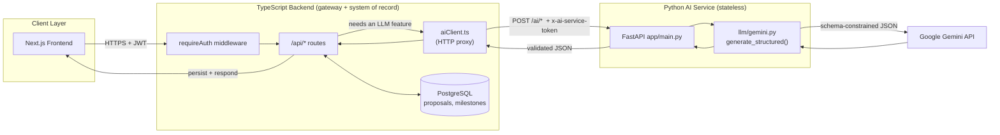
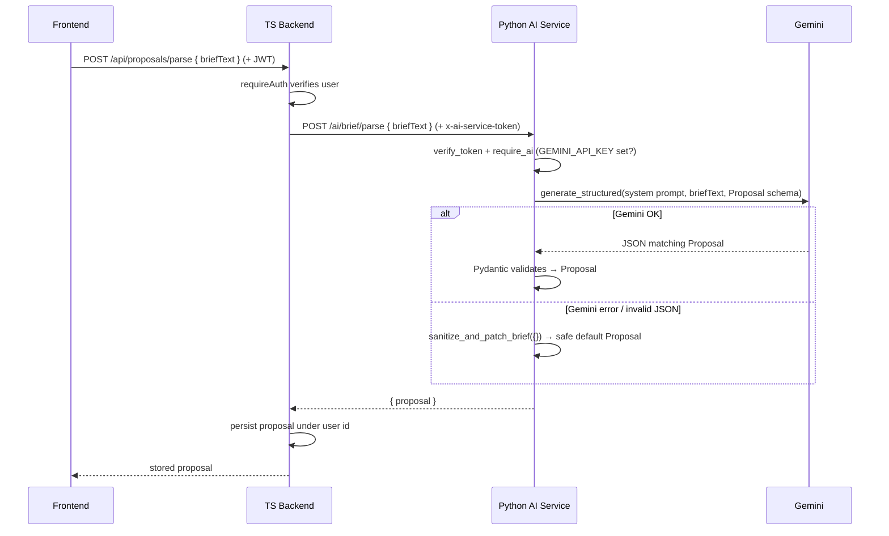
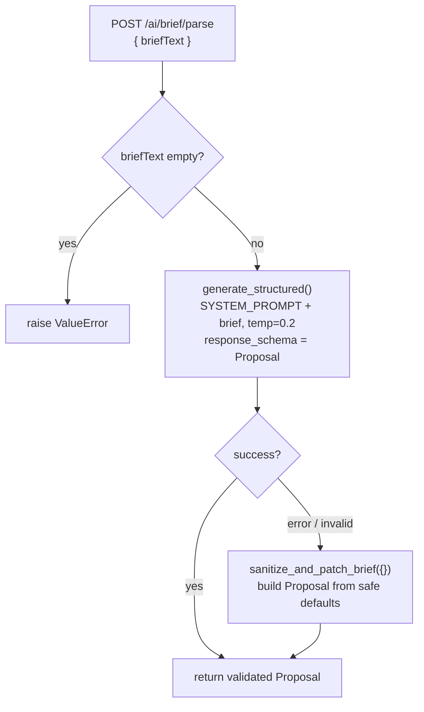
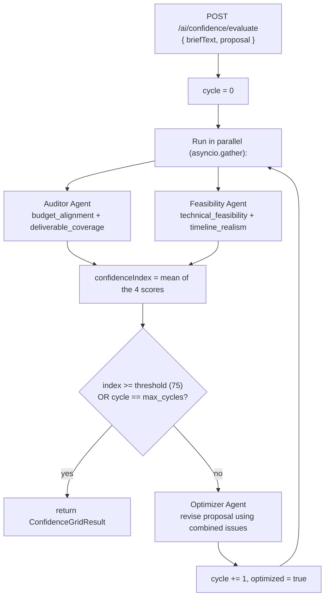
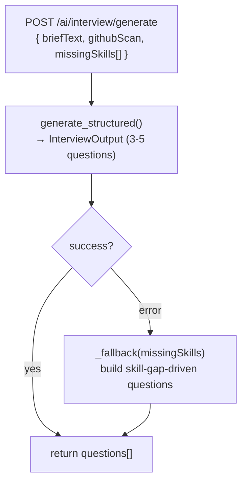
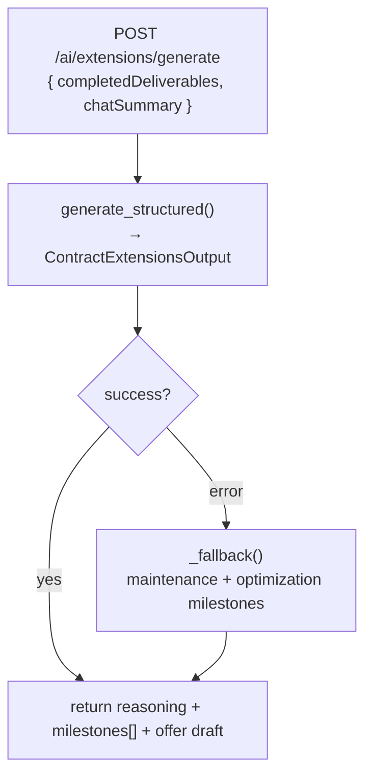
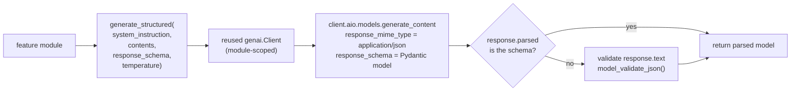

# FixFlowAI — AI Service Guide

> Onboarding reference for anyone working inside `ai-service/`.
> Read this top-to-bottom once, then keep the diagrams handy while coding.

---

## 1. What the AI Service Is

The AI service is a **stateless Python (FastAPI) microservice** that owns all four
LLM-powered features. It does exactly three things per request:

1. Validate the incoming JSON (Pydantic).
2. Call **Google Gemini** with a schema-constrained prompt.
3. Return validated JSON.

It **never** touches the database, payments, escrow, or auth. The **TypeScript
backend is the gateway and system of record** — the frontend never calls this
service directly.

```
Frontend  →  TS Backend (auth, DB, escrow, payments)  →  Python AI Service  →  Gemini
                        (system of record)                  (stateless LLM)
```

**Golden rule:** if a task needs to persist data, decide money, or check a user's
identity, it does **not** belong here. This service is pure "text in → structured
JSON out".

---

## 2. The Four AI Features (Overview)

| ID | Feature | What it does | AI Endpoint | Backend Endpoint (public) |
|----|---------|--------------|-------------|---------------------------|
| **AI-001** | Semantic Brief Parsing | Turns an unstructured client brief into a strict, structured `Proposal` (features, risks, timeline, weekly delivery plan, effort, market, impact). | `POST /ai/brief/parse` | `POST /api/proposals/parse` |
| **AI-002** | Confidence Grid + Self-Correction | Runs two agents (Auditor + Feasibility) in parallel, averages 4 scores into a confidence index, and auto-revises the proposal if it scores below threshold. | `POST /ai/confidence/evaluate` | `POST /api/proposals/evaluate` |
| **AI-003** | Interview Generation | Generates 3–5 targeted technical vetting questions from a brief, a candidate's GitHub scan, and detected skill gaps. | `POST /ai/interview/generate` | `POST /api/interview-questions` |
| **AI-004** | Contract Extensions | Suggests 1–3 follow-up milestones + a ready-to-send client offer draft, based on completed deliverables and chat history. | `POST /ai/extensions/generate` | `POST /api/contract-extensions` |
| — | Health check | Reports status, whether AI is enabled, and the active model. | `GET /health` | `GET /api/health` |

**Design pattern shared by all four:** every feature calls Gemini through one
helper (`generate_structured`) and wraps it in a **fallback**. If Gemini errors
or returns junk, the feature returns a safe, valid default instead of failing the
request. The API never hard-crashes on an LLM hiccup.

---

## 3. Codebase Map

```
ai-service/
├── app/
│   ├── main.py                 # FastAPI app: routes, auth guard, request models
│   ├── config.py               # Env-driven settings (API key, model, threshold, token)
│   ├── llm/
│   │   └── gemini.py           # Single async wrapper: generate_structured(...)
│   ├── features/               # One module per AI feature (the business logic)
│   │   ├── brief_parser.py         # AI-001 + sanitize_and_patch_brief fallback
│   │   ├── confidence_grid.py      # AI-002 multi-agent + self-correction loop
│   │   ├── interview.py            # AI-003 + skill-gap fallback
│   │   └── extensions.py           # AI-004 + maintenance-suggestion fallback
│   └── schemas/                # Pydantic models = the JSON contract with the TS backend
│       ├── proposal.py             # The big shared Proposal shape
│       ├── confidence.py           # Auditor/Feasibility/GridResult
│       ├── interview.py            # InterviewQuestion / InterviewOutput
│       └── extensions.py           # ExtensionMilestone / ContractExtensionsOutput
├── requirements.txt
├── smoke_test.py
└── README.md
```

**Where things go when you add a feature:**
- New endpoint → `main.py` (route + request model).
- New business logic → new file in `features/`.
- New input/output shape → new Pydantic model in `schemas/`.
- Never call the Gemini SDK directly — always go through `llm/gemini.py`.

---

## 4. Top-Level Architecture



**Read it as:** the frontend only ever talks to the TS backend. The backend
authenticates, reads/writes the DB, and — only for the four AI features — proxies
to this Python service via `aiClient.ts`. The Python service is the only thing
that talks to Gemini.

---

## 5. Request Flow (end-to-end, using AI-001 as the example)



The same round-trip shape applies to all four features — only the endpoint,
request body, and response schema change.

---

## 6. Low-Level: Inside Each Feature

### AI-001 — Semantic Brief Parsing (`features/brief_parser.py`)



- Output is the large **`Proposal`** object: `project_summary`, `features[]`,
  `risks[]`, `timeline[]`, `delivery_plan{weeks, roadmap, backlog, notificationDefaults}`,
  `effort[]`, `market[]`, `impact[]`.
- The fallback (`sanitize_and_patch_brief`) coerces *any* malformed object into a
  valid `Proposal` — it fills every required field with sane defaults so the
  response always validates.

### AI-002 — Confidence Grid + Self-Correction (`features/confidence_grid.py`)



- Two agents evaluate **in parallel**; each has its own fallback returning a
  neutral score of 70 if it errors, so the loop never blocks.
- `confidenceIndex` = average of the 4 sub-scores.
- If below `CONFIDENCE_THRESHOLD` (default 75), the **Optimizer** rewrites the
  proposal once (`MAX_CORRECTION_CYCLES`, default 1) and re-evaluates.
- Result includes both evaluations, the final index, an `optimized` flag, and the
  `finalProposal`.

### AI-003 — Interview Generation (`features/interview.py`)



- Each question carries: `question`, `rationale`, `expectedKeywords[]`,
  `idealAnswerSummary`.
- Fallback builds up to 3 questions seeded from `missingSkills` plus generic
  planning/experience questions.

### AI-004 — Contract Extensions (`features/extensions.py`)



- Output: `extensionReasoning`, `suggestedMilestones[]` (title, description,
  estimatedDuration, complexity, estimatedBudgetPct), and a ready-to-send
  `extensionOfferDraft` message.

---

## 7. The Gemini Wrapper (`llm/gemini.py`)

Every feature funnels through one function. Learn this and you understand 90% of
the service.



Key points:
- The `genai.Client` is created **once** and reused across requests.
- Gemini is constrained to the Pydantic `response_schema`, so output is
  structured JSON by construction.
- If the SDK doesn't populate `.parsed`, it falls back to manually validating the
  raw text. Empty text raises — which triggers the feature-level fallback.

---

## 8. Request / Response Contracts (quick reference)

| Endpoint | Request body | Response |
|----------|--------------|----------|
| `POST /ai/brief/parse` | `{ briefText: string }` | `{ proposal: Proposal }` |
| `POST /ai/confidence/evaluate` | `{ briefText: string, proposal: Proposal }` | `ConfidenceGridResult` `{ auditor, feasibility, confidenceIndex, optimized, finalProposal }` |
| `POST /ai/interview/generate` | `{ briefText, githubScan, missingSkills[] }` | `{ questions: InterviewQuestion[] }` |
| `POST /ai/extensions/generate` | `{ completedDeliverables, chatSummary }` | `{ extensionReasoning, suggestedMilestones[], extensionOfferDraft }` |
| `GET /health` | — | `{ status, aiEnabled, model }` |

> The Pydantic models in `app/schemas/` **mirror** the TS types in
> `backend/src/types/ai.ts`. If you change a shape on one side, change it on the
> other or the contract breaks.

---

## 9. Configuration (`app/config.py`, from `.env`)

| Variable | Default | Purpose |
|----------|---------|---------|
| `GEMINI_API_KEY` | _(empty)_ | Enables AI. If empty, `aiEnabled=false` and feature routes return **503**. |
| `GEMINI_MODEL` | `gemini-2.5-flash` | Which Gemini model to call. |
| `PORT` | `8000` | Service port. |
| `CONFIDENCE_THRESHOLD` | `75` | AI-002 minimum acceptable confidence index. |
| `MAX_CORRECTION_CYCLES` | `1` | AI-002 max self-correction passes. |
| `AI_SERVICE_TOKEN` | _(empty)_ | Optional shared secret. If set, callers must send the `x-ai-service-token` header. Must match `AI_SERVICE_TOKEN` in `backend/.env`. |

---

## 10. Getting Started (local)

```bash
cd ai-service
python -m venv .venv
.venv\Scripts\activate          # Windows  (macOS/Linux: source .venv/bin/activate)
pip install -r requirements.txt
copy .env.example .env           # then set GEMINI_API_KEY
uvicorn app.main:app --reload --port 8000
```

- Interactive Swagger docs: `http://localhost:8000/docs`
- Quick sanity check: `python smoke_test.py`
- To connect the TS backend, set `AI_SERVICE_URL=http://localhost:8000` (and
  matching `AI_SERVICE_TOKEN` if used) in `backend/.env`.

---

## 11. Working Rules (so you don't break the contract)

1. **Stay stateless.** No DB, no payments, no auth logic beyond the token guard.
2. **Schema-first.** Define/extend the Pydantic model in `schemas/` before writing
   feature logic.
3. **Always call Gemini via `generate_structured`** — never the SDK directly.
4. **Always ship a fallback.** Every feature must return valid JSON even when
   Gemini fails. Follow the existing `_fallback()` / `sanitize_and_patch_*`
   pattern.
5. **Keep both sides in sync.** A schema change here needs the mirror change in
   `backend/src/types/ai.ts`.
6. **Add the route in `main.py`** with a request model + `Depends(verify_token)`
   + `require_ai()` guard, matching the existing four.
