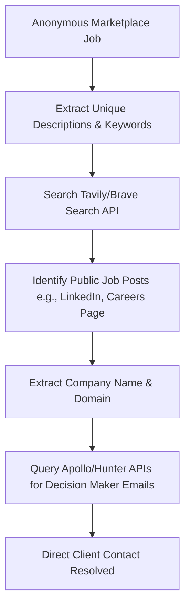
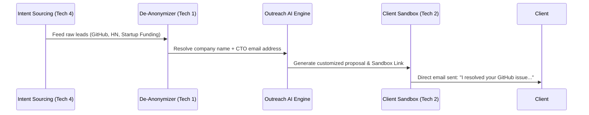

# Feasibility Study: Direct Outreach & Sourcing Engine
**Author:** Principal Feasibility Study Engineer  
**Project:** FixFlowAI / Bunchhh  
**Status:** Research & Proposal  

---

## Executive Summary

This feasibility study evaluates **four advanced techniques** for connecting onboarded freelancers directly with clients, bypassing the high fees and bidding friction of traditional marketplaces (Upwork, Fiverr). 

Instead of forcing clients to register on our platform, we propose a hybrid system that aggregates external job posts, de-anonymizes the hiring entities, and routes outreach through a frictionless, self-contained payment/escrow sandbox.

---

## Detailed Feasibility Breakdown

### Technique 1: Cross-Platform Job Fingerprinting & De-Anonymization

*Finds anonymous marketplace clients by matching their job descriptions against public job boards and corporate databases, resolving their direct contact emails.*

#### Feasibility Metrics
*   **Technical Feasibility (8.5/10):** High-medium. Extracting unique phrases and querying search engines (Tavily, Brave) is simple. Finding the exact hiring manager email requires integrating standard B2B enrichment APIs (Apollo.io, Hunter.io, Clay).
*   **Operational & Legal Feasibility (9/10):** High. This process queries open-web search indices and corporate public contact directories. It does not violate terms of service because it operates entirely outside of the marketplace's authenticated walls.
*   **Risk Profile:** Low. The primary risk is a "false positive" match (emailing the wrong person or company due to similar job descriptions). This is mitigated by run-time semantic similarity checks (using cosine similarity on embeddings of the job descriptions).
*   **Implementation Complexity:** Moderate. Requires setting up search query algorithms and B2B API integrations.

> [!TIP]
> **Where it Wins:** **Accuracy and Personalization.** This technique is the best for high-ticket contracts where a personalized email directly to a CTO or VP of Engineering yields a high response rate.

---

### Technique 2: The "Zero-Onboarding" Proposal Sandbox

*A secure, read-only landing page generated dynamically for each pitch, allowing external clients to negotiate milestones and fund escrow deposits without registering an account.*

#### Feasibility Metrics
*   **Technical Feasibility (9.5/10):** Very High. Built entirely inside our own MERN stack. The backend generates a secure tokenized URL (`/proposal/:uuid`). The client interacts with a clean React page.
*   **Operational & Legal Feasibility (10/10):** Perfect. We own 100% of the software and data layer. Stripe payments and Smart Contract escrows are fully compliant under standard business operations.
*   **Risk Profile:** Extremely Low. We must ensure the UUID links are cryptographically secure and rate-limited to prevent brute-forcing.
*   **Implementation Complexity:** Low. Simply exposes existing backend models (Leads, Escrow) via token-authenticated guest endpoints.

> [!IMPORTANT]
> **Where it Wins:** **Friction Reduction & Trust.** It eliminates the largest barrier to direct hiring (client onboarding friction and payment risk). Clients get the trust of an escrow system (funded via Stripe or Crypto) with zero setup effort.

---

### Technique 3: Browser Automation (Proxy Bidding)

*Freelanders submit bids on our dashboard; our backend uses Puppeteer/Playwright to log into their Upwork/Fiverr accounts and programmatically place the bid on the external platform.*

#### Feasibility Metrics
*   **Technical Feasibility (4/10):** Low. Marketplace platforms deploy advanced anti-bot measures (Cloudflare Turnstile, browser fingerprinting, device checks, and CAPTCHAs). 
*   **Operational & Legal Feasibility (2/10):** Critical Failure Risk. Using browser automation to post bids directly violates Upwork and Fiverr Terms of Service. It frequently leads to the permanent suspension of the freelancer's profile.
*   **Risk Profile:** Extremely High. Freelancers risk losing their source of income. Maintenance overhead is high as scraping scripts break every time the platform updates its UI.
*   **Implementation Complexity:** Very High. Requires running residential proxy networks, cookie session management, and CAPTCHA bypass services.

> [!CAUTION]
> **Where it Wins:** **Volume & Coverage.** This technique only wins if you prioritize volume and automation over risk. Because of account suspension risks, this should **not** be a primary feature.

---

### Technique 4: Intent-Driven Sourcing (Sourcing Beyond Upwork)

*Scrapes active hiring intent signals from developer-native platforms (GitHub issues, HackerNews "Who is hiring" posts, Reddit, and startup funding alerts) rather than traditional marketplaces.*

#### Feasibility Metrics
*   **Technical Feasibility (9/10):** High. APIs for GitHub (issues API), Reddit (JSON endpoints), HackerNews (Firebase API), and startup directories are open, structured, and free.
*   **Operational & Legal Feasibility (10/10):** Perfect. Sourcing from open-developer networks is highly welcomed by companies who are actively struggling to find niche engineering talent.
*   **Risk Profile:** Low. The data is structured, public, and clean. No anti-scraping blocks to bypass.
*   **Implementation Complexity:** Low. Requires scheduled cron jobs (built using BullMQ/Redis) to pull posts and classify them using LLM structured outputs (Zod).

> [!TIP]
> **Where it Wins:** **Blue Ocean (Zero Competition).** Since these jobs are not listed on crowded freelance marketplaces, there is zero bidding competition. Pitching a CTO who just posted a "help wanted" issue on a GitHub repository or announced a seed round has a 10x higher reply rate.

---

## Comparative Matrix: Where Each Technique Wins

| Feature / Criteria | Technique 1: De-Anonymization | Technique 2: Zero-Onboarding Sandbox | Technique 3: Proxy Bidding | Technique 4: Intent Sourcing |
| :--- | :---: | :---: | :---: | :---: |
| **Development Cost** | Medium | Low | Very High | Low |
| **Account Ban Risk** | None | None | Extremely High | None |
| **Client Conversion** | High | **Winner (10/10)** | Low | High |
| **Data Quality** | High | N/A (Internal) | Medium | **Winner (9.5/10)** |
| **Bidding Competition** | Medium | N/A | High (Crowded) | **Winner (None)** |
| **Primary Value** | Locates direct contacts | Eliminates payment friction | Automates busywork | Finds untapped leads |

---

## Architectural Recommendation & Phased Rollout Plan

To achieve the highest success rate with the lowest risk, we recommend a **three-phased rollout** that discards Technique 3 (Proxy Bidding) and combines the remaining three into a single cohesive pipeline:

### Phase 1: Sourcing & Sandbox Setup (Month 1)
*   Build the public-facing **Zero-Onboarding Sandbox** (Technique 2) to allow guest checkout and payment milestone creation.
*   Create the GitHub/HN parser (Technique 4) to source high-quality, developer-native jobs.

### Phase 2: De-Anonymization Pipeline (Month 2)
*   Integrate Tavily Search and B2B enrichment APIs (Apollo/Hunter) to match sourced job details with hiring manager emails.
*   Establish automated similarity matching to prevent false-positive contact matches.

### Phase 3: Outbound Automation (Month 3)
*   Wire the parsed leads, resolved emails, and sandbox URLs into an automated outreach queue using **BullMQ** to handle email cycles.
