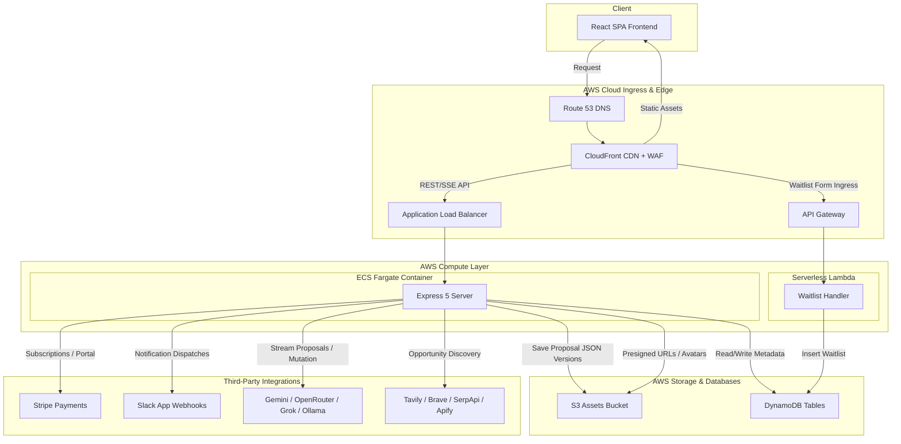
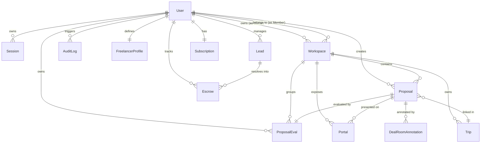
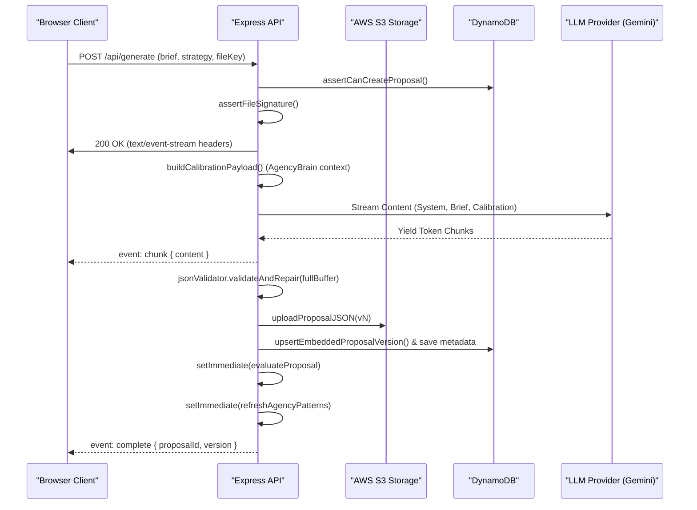
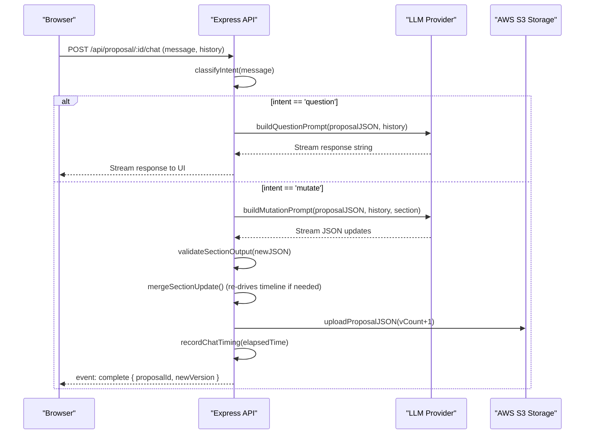

# FixFlowAI Technical Architecture & Reverse-Engineering Documentation

This document provides a comprehensive, low-level technical documentation and reverse-engineering report of the **FixFlowAI** platform. Every finding here is derived directly from the source code, configurations, schemas, and directories present in the repository.

---

## 1. Executive System Overview & Tech Stack

FixFlowAI is a **Decentralized Freelancer Operating System (OS)** and proposal automation platform. It is designed to take a developer's GitHub identity and automate:
- **Niche Positioning & Analysis**: Mapping repository data, commits, and languages to market niches and rate ceilings.
- **Lead Discovery & Hunting**: Scrapes freelance opportunities from developer networks and job marketplaces, automatically scoring matches against the user's profile.
- **Smart-Escrow Payments & Reputation**: Facilitates milestone-based payments and mints ZK-proof credentials.
- **AI Proposal Generation**: Hydrates client briefs (written or uploaded PDFs/DOCX) into high-fidelity proposals using LLM provider pipelines.

### Core Tech Stack

#### React Frontend (Vite)
- **Framework & Routing**: React 18 (with Vite) and `react-router-dom` v6.
- **Styling & Theme**: Vanilla CSS variables combined with Tailwind CSS v3. The design uses a dark-glass theme ("Cosmic Dark-Glass") with HSL variables.
- **Motion & 3D**: `framer-motion` for spring-physics animations and page transitions; `@react-three/fiber` and `three` for interactive particle fields.
- **State Management**: Zustand for auth, theme, and workspace states; `@tanstack/react-query` for API caching.

#### Node.js Backend (Express)
- **Framework**: Express 5.
- **Database Layer**: DynamoDB client (`@aws-sdk/client-dynamodb` and `@aws-sdk/lib-dynamodb`) wrapped in a custom Mongoose-like model library (`dynamoModel.js`).
- **AI/LLM Coordinator**: Integration with Google Gemini SDK (`@google/genai`), falling back to OpenRouter, xAI (Grok), and Ollama.
- **Third-Party Services**: Stripe API for payments, Slack API for incoming webhooks and OAuth, nodemailer for transaction mailing.
- **Scraping & Parsing**: Apify, Tavily, Brave Search, and SerpApi for leads; `pdf-parse`, `mammoth` (DOCX), and `puppeteer` for brief parsing.

#### Smart Contracts (Hardhat)
- **Solidity Environment**: Solidity v0.8.24, OpenZeppelin v4.9.6, Hardhat.
- **Mocking status**: Smart contracts exist inside `contracts/` and have Hardhat tests, but **are completely mocked** at the backend routing/service layer (`freelancer.js`). Ethers/web3 dependencies are not loaded by the running Express backend.

#### Serverless Waitlist (Lambda)
- **Infrastructure**: AWS Lambda function writing to `fixflowai_waitlist` DynamoDB table.

---

## 2. Project Codebase & Module Responsibilities

The codebase is organized as follows:

```
FixFlowAI/
├── .github/workflows/          # Github CI/CD Pipeline
├── apps/                       # Target monorepo directories (currently placeholder READMEs only)
│   ├── api/
│   └── web/
├── backend/                    # Express 5 backend server
│   ├── src/
│   │   ├── config/             # Zod environment validation (env.js)
│   │   ├── db/                 # DynamoDB configuration & custom model wrapper
│   │   ├── middleware/         # Security, rate-limit, auth, and audit log middlewares
│   │   ├── models/             # DynamoDB collections schemas (User, Workspace, Proposal, etc.)
│   │   ├── prompts/            # System & mutation prompts for LLM coordination
│   │   ├── routes/             # REST endpoints (auth, freelancer, billing, generate, portals)
│   │   ├── schemas/            # Zod schemas for validation (section validation, won/lost schemas)
│   │   └── services/           # Platform core logic (LLM coordinator, AgencyBrain, notifications, etc.)
│   └── Dockerfile              # Backend container build script
├── contracts/                  # Hardhat project with Solidity smart contracts
│   └── src/
│       ├── FixFlowEscrow.sol   # Multi-milestone escrow contract
│       └── MockERC20.sol       # Mock token contract
├── docs/                       # Feasibility studies and implementation roadmaps
├── lambda/                     # Waitlist microservice
│   └── waitlist/
│       └── index.js            # Node AWS Lambda handler for waitlist signup
├── src/                        # React Frontend (Vite)
│   ├── components/             # Custom UI widgets (GlassCard, ParticleField, EscrowPipeline)
│   ├── config/                 # Axios configuration and API endpoints (api.js)
│   ├── hooks/                  # React Query hooks connecting UI to API
│   ├── pages/                  # Route layouts (FlowBoard, IdentityVault, ProposalResult)
│   ├── stores/                 # Zustand state stores (authStore, workspaceStore)
│   └── index.css               # CSS Design system, fonts, glass classes
└── package.json                # Root package configuration
```

---

## 3. High-Level System Architecture

The high-level architecture maps the interactions between the browser, edge networks, containerized application hosting, serverless handlers, database layers, and external LLM/Payment API providers.



---

## 4. Database Documentation & Models

FixFlowAI uses **Amazon DynamoDB** as its primary database. However, rather than utilizing a standard document-based database client directly, the backend wraps DynamoDB in a custom emulation layer (`dynamoModel.js`) which mimics **Mongoose** (MongoDB object modeling).

### DynamoDB Emulation Layer (`dynamoModel.js`)
- **Primary Keys**: Every document is automatically assigned a UUID for `_id`, `id`, and a custom model-specific key (`idField`, e.g. `proposalId` or `userId`).
- **Timestamps**: If `timestamps: true` is set, `createdAt` and `updatedAt` strings are automatically managed as ISO strings.
- **Table Scans (Scalability Warning)**: In the custom `dynamoModel.js`, the query implementation for actions like `find`, `findOne`, `updateMany`, etc., works by issuing a full **ScanCommand** on DynamoDB to load all records into memory, and then filtering them programmatically using a custom `matchesFilter` helper.
  > [!WARNING]
  > This custom client layer has severe scalability limitations for production workloads. Because it issues full table scans for basic filters, queries will grow in latency and cost linearly as the size of the tables increases.

### Entity Schema Dictionary

#### 1. User
Stores registration details, authentication providers, plan limits, and Stripe metadata.
- `_id` / `id` / `userId` (String, UUID)
- `email` (String, Unique)
- `passwordHash` (String, Redacted)
- `role` (String: `'client'`, `'freelancer'`, `'developer'`, default `'client'`)
- `selectedPlan` / `plan` (String: `'free'`, `'solo'`, `'pro'`, `'agency'`, `'scale'`)
- `teamPlanPreference` (String)
- `defaultEntryMode` (String: `'individual'`, `'team'`)
- `currentWorkspaceId` (String, reference to Workspace)
- `avatar` / `avatarKey` (String)
- `timezone` / `theme` (String)
- `authProvider` (String: `'email'`, `'github'`, `'google'`)
- `githubId` / `githubUsername` / `googleId` (String)
- `usageCount` / `usageLimit` (Number, defaults: `0` / `5`)
- `proposalLimit` (Number, default `5`)
- `proposalsThisMonth` (Number)
- `resetDate` (ISO Date String)
- `stripeCustomerId` / `subscriptionStatus` (String)
- `subscriptionCurrentPeriodEnd` (ISO Date String)
- `subscriptionSeats` (Number)
- `failedLoginCount` / `lockedUntil` (Number / ISO Date String)
- `tokenVersion` (Number, default `0`)

#### 2. Workspace
Supports team features and workspaces.
- `_id` / `id` / `workspaceId` (String, UUID)
- `name` / `slug` (String)
- `plan` (String)
- `ownerId` (String, reference to User)
- `members` (Array of objects: `{ userId, role, joinedAt, invitedBy }`)
- `invitePending` (Array of objects: `{ inviteId, email, role, tokenHash, inviterId, expiresAt, status }`)
- `roleDefinitions` (Array of objects: `{ roleId, name, permissions: [], system: Boolean }`)
- `slack` (Object: `{ teamId, teamName, channelId, channelName, webhookUrlEncrypted, status }`)

#### 3. Session
Auth token lookup and replay attack prevention.
- `_id` (String)
- `userId` (String, reference to User)
- `refreshTokenHash` (String)
- `userAgent` / `ipAddress` (String)
- `expiresAt` / `revokedAt` / `lastUsedAt` / `replayDetectedAt` (ISO Date Strings)

#### 4. Proposal
Proposal metadata. The actual JSON proposal payload is version-controlled and stored in S3.
- `_id` / `proposalId` (String, UUID)
- `userId` / `createdBy` (String, reference to User)
- `workspaceId` (String, reference to Workspace, nullable)
- `title` / `projectSummary` / `briefSnapshot` (String)
- `briefSignals` (Object: `{ industries: [], tech: [], keywords: [] }`)
- `status` (String: `'generating'`, `'complete'`, `'failed'`)
- `strategy` (String: `'lean'`, `'standard'`, `'premium'`)
- `tripId` (String, reference to Trip, nullable)
- `dealStatus` (String: `'pending'`, `'negotiating'`, `'won'`, `'lost'`)
- `lossReason` (String)
- `wonOutcome` / `lostOutcome` (Object, stores generated onboarding checklists or nurture email sequences)
- `s3Key` (String, pointer to the latest proposal JSON version in S3)
- `versionCount` (Number, default `1`)
- `proposalVersions` (Array of objects: `{ version, s3Key, data }` — serves as local DB fallback storage)
- `chatTimingStats` (Object tracking duration of questions vs mutations per section)

#### 5. ProposalEval
Scores compiled asynchronously right after a proposal is successfully generated.
- `_id` (String)
- `proposalId` (String, reference to Proposal)
- `userId` (String, reference to User)
- `workspaceId` (String, reference to Workspace, nullable)
- `generatedAt` (ISO Date String)
- `evalScores` (Object: `{ completenessScore, riskCoverage, effortSpecificity, deliveryPlanQuality, briefToProposalAlignment }`)
- `totalEvalScore` (Number)
- `briefLength` / `generationTimeMs` (Number)
- `estimatedCostUsd` (Number)

#### 6. Portal
Stores analytics and configuration for guest-accessed Client Portals ("Deal Rooms").
- `_id` (String)
- `proposalId` (String, reference to Proposal)
- `workspaceId` (String, reference to Workspace, nullable)
- `portalType` (String: `'single'`, `'bundle'`)
- `proposalIds` (Array of Strings)
- `expiryAt` (ISO Date String)
- `pinHash` (String)
- `viewCount` (Number)
- `sectionMetrics` (Object tracking view count and dwell time in ms for each proposal section: `summary`, `features`, `risks`, `timeline`, `effort`, `market`, `impact`)
- `dealRoomTierSelection` (Object: `{ proposalId, strategy, clientEmail, selectedAt }`)

#### 7. FreelancerProfile
Freelancer identity dashboard profile settings.
- `userId` / `_id` (String, reference to User)
- `did` (String, decentralized identity identifier)
- `walletAddresses` (Object: `{ fixflow, usdc, matic }`)
- `profiles` (Object: `{ upwork: { headline, summary, rate }, linkedin, personal }`)
- `agentConfig` (Object: `{ leadHunter, outreachWriter, escrowWatcher, credentialMinter }`)
- `githubScan` (Object: `{ repos: [], languages: [], commits: Number, scannedAt }`)
- `onboardedAt` (ISO Date String)

#### 8. Lead
Sourced opportunities mapped to the freelancer profile.
- `_id` (String)
- `userId` (String, reference to User)
- `status` (String: `'new'`, `'qualified'`, `'contacted'`, `'replied'`, `'won'`, `'lost'`)
- `score` (Number, 0..100)
- `source` (String: `'reddit'`, `'hn'`, `'upwork'`, `'fiverr'`, etc.)
- `sourceUrl` / `externalId` (String)
- `projectDescription` / `role` (String)
- `rateRange` (Array: `[min, max]`)
- `match` (Object: `{ score, threshold, eligible, skillsMatched, skillsMissing, githubEvidence, rationale }`)
- `bid` (Object: `{ status, draft, submittedAt }`)
- `draftMessage` (Object: `{ subject, body, wordCount, tokens }`)

#### 9. Escrow
Milestone-based payment tracking records.
- `_id` (String)
- `userId` (String, reference to User)
- `leadId` (String, reference to Lead)
- `clientDid` / `freelancerDid` (String)
- `buyerAddress` / `sellerAddress` (String)
- `contractAddress` (String)
- `chain` (String, e.g. `'Polygon Amoy'`)
- `totalAmount` (Number)
- `currency` (String, e.g. `'USDC'`)
- `state` (String: `'CREATED'`, `'FUNDED'`, `'MILESTONE_SUBMITTED'`, `'MILESTONE_APPROVED'`, `'RELEASED'`, `'DISPUTED'`)
- `milestones` (Array of objects: `{ name, amount, status: 'pending'|'locked'|'released', releasedAt }`)

#### 10. AuditLog
Security logs.
- `userId` / `sessionId` (String, references to User / Session)
- `eventType` (String: `'api_request'`, `'security_violation'`, etc.)
- `action` / `entityType` / `entityId` (String)
- `method` / `endpoint` / `statusCode` (String / Number)
- `ipAddress` / `userAgent` / `country` / `city` (String)
- `requestId` (String)
- `riskLevel` (String: `'low'`, `'medium'`, `'high'`, `'critical'`)
- `success` (Boolean)
- `metadata` (Object, fields masked by `maskSensitive`)
- `responseTimeMs` (Number)

---

## 5. Entity Relationship Diagram (ERD)

The following diagram represents the complete entity schema connections and multiplicities.



---

## 6. Major Platform Data Flows

### A. AI Proposal Generation Flow (SSE + S3 Versioning)
1. **User Action**: The client uploads a document (PDF/DOCX) or submits a brief description on `/dashboard/new-proposal`, selecting a strategy (`lean`, `standard`, or `premium`).
2. **File Signature check**: The backend checks magic bytes of files before scanning (`assertFileSignature`).
3. **SSE Connection**: The client starts a `POST` request to `/api/generate`. The server flushes headers and locks in a `text/event-stream` connection.
4. **Hydration**: The brief text is extracted (via PDF-parse or Mammoth for Word documents).
5. **Insights Integration**: If the account plan supports *Agency Brain*, the backend compiles historical win/loss insights relevant to the brief (`buildCalibrationPayload`) and injects it as context to calibrate the LLM.
6. **LLM Execution**: The backend streams chunks from the LLM provider coordinator (`gemini` -> fallback `openrouter` etc.) to the client.
7. **Zod Repair**: Once generation completes, the backend validates the JSON against schemas. If structure violations occur, it attempts recursive repairing (`jsonValidator.js`).
8. **Versioning & S3 Persistence**: The new version is written to S3 (`output/{userId}/{proposalId}/vN.json`). A metadata record is stored in DynamoDB, alongside a copy of the JSON payload embedded inside the `Proposal` document's `proposalVersions` array (acting as fallback database storage).
9. **Async Hooks**: The server asynchronously fires two tasks:
   - `evaluate(proposal)` to compile quality scores.
   - `refreshAgencyPatternsForProposal` to update workspace trends.



### B. Proposal Collaborative Chat Flow (Intent Routing)
1. **User Action**: A user types a message in the proposal workspace side-chat.
2. **Intent Classification**: The system determines if the user is asking a question (`intent: 'question'`) or asking to change the proposal (`intent: 'mutate'`).
3. **Execution**:
   - **Question**: System uses `buildQuestionPrompt` with the current S3 proposal JSON and conversation history. LLM yields answers.
   - **Mutation**: System uses `buildMutationPrompt` targeting the specific section (e.g. `timeline` or `risks`). The LLM yields a modified structured JSON block matching that section's Zod schema.
4. **Persistence on Mutation**:
   - The JSON block is validated. If it changes `timeline`, a refreshed delivery plan (weeks, roadmap milestones, and backlogs) is automatically derived.
   - The server uploads a new version (`vN+1`) of the full proposal to S3 and updates DynamoDB.
   - Telemetry tracks actual execution times (`recordChatTiming`) to calibrate future ETAs.



---

## 7. Integrations & Communication Patterns

FixFlowAI integrates with several external service APIs using custom routing and fallback patterns.

### 1. Multi-Provider LLM Fallback Service
The system enforces a priority order of API calls (`env.LLM_PROVIDER_ORDER`, e.g. `gemini,openrouter,xai,ollama`).
- **Gemini**: Directly utilizes `@google/genai` (SDK model `gemini-3-flash-preview`). It is guarded by two layers:
  - `geminiGuard.js`: Implements circuit-breaker capabilities (cooling off API keys on 401/403 credential errors for 15 minutes, bypassing to fallback providers).
  - `geminiModelCoordinator.js`: Implements local queueing and concurrency delays based on Requests Per Minute (RPM) limits to avoid hitting rate limits (429).
- **Fallbacks**: If Gemini is rate-limited beyond the queue window or credentials fail, the server falls back dynamically to OpenRouter, xAI (Grok), or local Ollama instances, reporting success or failure metrics to `rateLimitMonitor` to update health weights.

### 2. Slack Integration (OAuth + Encrypted Webhooks)
- **Setup**: Teams click "Connect Slack" on `/dashboard/settings/workspace` to trigger authorization. The state token is signed via HMAC-SHA-256 (`secretCrypto.js`) to prevent CSRF.
- **Key Storage**: The returned Slack webhook URL is encrypted using `aes-256-gcm` prior to database save (`webhookUrlEncrypted`).
- **Delivery**: When events occur (e.g. invite accepted, backlog item moved, escrow milestones funded), the notification worker decrypts the URL and sends structured Slack Blocks.

### 3. Payment Processing (Stripe Webhooks)
- **Ingress**: Stripe webhook requests arrive at `/api/billing/webhook`. Express routes this endpoint *before* applying JSON parsing middleware to preserve the raw body buffer.
- **Verification**: The signature is verified using `constructWebhookEvent(rawBody, signature, secret)`.
- **Sync**: Webhooks trigger user state updates (`syncCheckoutSession`, `syncSubscription`, `resetMonthlyProposalUsage`).

---

## 8. Authentication, Authorization, & Security Model

The platform enforces multiple layers of application-level security and access controls.

### Authentication & Token Management
- **In-Memory JWT Tokens**: Access tokens are stored strictly in-memory (local Javascript variables in `authToken.js`), completely protecting the application from Cross-Site Scripting (XSS) attacks designed to steal sessions.
- **Secure Cookies**: Refresh tokens are stored in HTTP-Only, Secure, SameSite=Lax cookies, locked down to the `/api/auth` path.
- **CSRF Protection**: All mutate actions (`POST`, `PUT`, `DELETE`, `PATCH`) must present a valid token in the `X-CSRF-Token` header. The token is verified against the user's session state.

### File Signature Verification
To prevent shell uploads and extension spoofing, the system inspects the first bytes (magic signatures) of all incoming files:
- **PDF**: `%PDF-`
- **DOCX**: `50 4B 03 04` (PK zip header)
- **PNG**: `89 50 4E 47`
- **JPEG**: `FF D8 FF`
- **WEBP**: `RIFF` ... `WEBP`

### Input Protection
- **Prompt Injection Guard**: The LLM client runs regex checks (`detectPromptInjection`) on all incoming user inputs to detect adversarial instructions (e.g., "ignore previous instructions"). If flagged, it blocks the query and writes a critical-level security incident log.
- **Audit Masking**: The audit logger intercepts API requests and uses `maskSensitive` to redact passwords, credit card numbers, JWT tokens, and OTP secrets from the metadata payload prior to storing logs.

---

## 9. Visual Architecture and Dependency Maps

### System Dependency Map

```
                     +---------------------------------------+
                     |          React SPA Client             |
                     +---------------------------------------+
                                         |
                                         v
                     +---------------------------------------+
                     |         Express 5 Router              |
                     +---------------------------------------+
                                         |
                                         +-----------------------+
                                         |                       |
                                         v                       v
                     +-----------------------+       +-----------------------+
                     |  custom dynamoModel   |       |  llm/modelCoordinator |
                     +-----------------------+       +-----------------------+
                                 |                               |
                                 v                               v
                     +-----------------------+       +-----------------------+
                     |   DynamoDB Client     |       |  llm/client (Gemini)  |
                     +-----------------------+       +-----------------------+
                                                                 |
                                                                 v
                                                     +-----------------------+
                                                     |  providerRegistry     |
                                                     +-----------------------+
                                                                 |
                                        +------------------------+-----------------------+
                                        |                        |                       |
                                        v                        v                       v
                             +--------------------+    +--------------------+  +--------------------+
                             |  OpenRouter Client |    |   xAI (Grok) API   |  |   Ollama (Local)   |
                             +--------------------+    +--------------------+  +--------------------+
```

---

## 10. Verified Findings vs. Assumptions

To maintain strict reverse-engineering integrity, the following outlines what has been verified directly in the codebase versus what is assumed or missing evidence.

### Verified Codebase Facts (100% Proven)
1. **Mocked Web3 Infrastructure**: Freelancer OS features, including Soulbound Reputation NFT, ZK-Credentials, and escrow milestone release, **are completely mocked** inside the Express backend routes (`freelancer.js`). The Solidity contracts located in `contracts/` are not compiled, deployed, or referenced by the running Node backend application.
2. **In-Memory Token Security**: The client React application stores JWT access tokens in local memory (`authToken.js`) and relies on CSRF header verification for all state-changing endpoints.
3. **Scan-Based DB Queries**: The custom DynamoDB model layer maps database tables to classes but performs all filtered database searches by executing full table scans (`ScanCommand`) and filtering records in Node.js memory.
4. **SSE Streaming**: Proposal generation and Niche Analysis are streamed in real time to the browser via Server-Sent Events (`text/event-stream`), rather than standard polling or WebSockets.
5. **Waitlist Isolation**: The waitlist feature is hosted independently as a separate AWS Lambda microservice that writes straight to a `fixflowai_waitlist` table, bypassing the main Express server.

### Insufficient Evidence in the Repository (No Assertions Made)
- **Outbound Email Senders**: The system defines SMTP configurations for transactional emails, but there is no evidence of an actual external SMTP server setup or configuration details in the repository.
- **Solidity Arbitrator Identity**: The `FixFlowEscrow.sol` constructor expects an `arbitrator` address. There is no code in the backend showing how this address is initialized, nor how keys are managed for dispute resolutions.
- **KYC/KYB Integration**: The escrow launch plan mentions adding KYC gates, but no integration code or external KYC provider libraries exist in this version of the repository.
