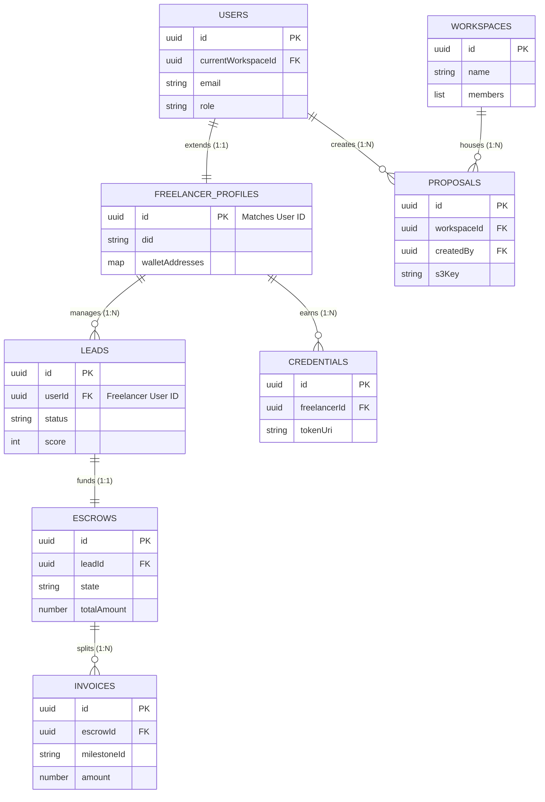

# FixFlowAI - Database Schema & Entity Relationships

This document details the database architecture of **FixFlowAI**. It covers the physical and logical structure of the primary data store (Amazon DynamoDB) and the transient store (Upstash Serverless Redis), mapping both high-level and low-level relationships.

---

## 🗺️ 1. High-Level Entity-Relationship (ER) Diagram

The diagram below illustrates the logical relationships between the core entities of FixFlowAI.



---

## 🔗 2. Relationship Architecture

### High-Level Relationship Map
```
  ┌──────────────┐          ┌──────────────┐          ┌───────────────────┐
  │     User     │1       1│  Freelancer  │1       * │    Credential     │
  │  (Auth & RP) ├─────────┤   Profile    ├──────────┤ (Soulbound proof) │
  └──────┬───────┘         └──────┬───────┘          └───────────────────┘
         │1                       │1
         │                        │
         │*                       │*
  ┌──────┴───────┐          ┌─────┴────────┐
  │  Workspace   │1       * │     Lead     │
  │ (Team context)├─────────┤ (Opp & pipeline)
  └──────┬───────┘          └─────┬────────┘
         │1                       │1
         │                        │
         │*                       │1
  ┌──────┴───────┐          ┌─────┴────────┐
  │   Proposal   │1       1 │    Escrow    │
  │ (JSON / S3)  ├─────────┤ (Razorpay/Web3)
  └──────────────┘          └─────┬────────┘
                                  │1
                                  │
                                  │*
                            ┌─────┴────────┐
                            │   Invoice    │
                            │(Milestone records)
                            └──────────────┘
```

### Low-Level Primary/Foreign Key Mappings

| Parent Entity | Parent Key | Child Entity | Child Key (FK) | Rel Type | Purpose |
| :--- | :--- | :--- | :--- | :--- | :--- |
| **Users** | `_id` | **FreelancerProfiles** | `_id` | `1:1` | Directly binds authentication credentials and identity to a freelancer's operational profile. |
| **Users** | `_id` | **Workspaces** | `members[n].userId` | `M:N` | Identifies which users have read/write access to a specific shared workspace context. |
| **Workspaces** | `_id` | **Proposals** | `workspaceId` | `1:N` | Scopes proposals under a team organizational boundary for access control and analytics. |
| **Users** | `_id` | **Proposals** | `createdBy` | `1:N` | Audits which specific user (freelancer or manager) generated the proposal document. |
| **FreelancerProfiles**| `_id` | **Leads** | `userId` | `1:N` | Maps discovery board pipeline leads to the specific freelancer pursuing them. |
| **Leads** | `_id` | **Escrows** | `leadId` | `1:1` | Binds financial locks and routes directly to the negotiated client lead. |
| **Escrows** | `_id` | **Invoices** | `escrowId` | `1:N` | Splits the locked escrow vault into individual milestone billing payouts. |
| **FreelancerProfiles**| `_id` | **Credentials** | `freelancerId` | `1:N` | Links earned Soulbound DID token certificates to the developer's Web3 identity. |

---

## 📋 3. Detailed DynamoDB Schema Reference

### Table 1: Users
Stores authentication, billing identifiers, and notification preferences.

* **Primary Key:** `_id` (UUID String)

| Attribute | Data Type | Constraints / Enum | Description |
| :--- | :--- | :--- | :--- |
| `email` | String | Unique, valid email | The login email for the user. |
| `passwordHash` | String | Argon2 / Bcrypt | Secure hashed password string. |
| `role` | String (Enum) | `'freelancer' \| 'client' \| 'developer'` | Operational role permissions. |
| `selectedPlan` | String (Enum) | `'free' \| 'solo' \| 'pro' \| 'agency'` | Tier governing API usage limits. |
| `defaultEntryMode` | String (Enum) | `'individual' \| 'team'` | Sets dashboard loading defaults. |
| `currentWorkspaceId`| UUID String | Matches `Workspaces._id` | The workspace currently active in user session. |
| `notificationPreferences`| Map | `{ email: Boolean, slack: Boolean }` | User channel opt-ins. |
| `proposalsThisMonth`| Number | Integer | Running count used for rate limit checks. |
| `stripeCustomerId` | String | Valid Stripe Cust ID | Reference pointer for subscription billing. |
| `subscriptionStatus`| String | `'active' \| 'past_due' \| 'none'` | Current plan billing status. |

---

### Table 2: FreelancerProfiles
Stores professional profiles, Web3 wallets, agent triggers, and scanned code data.

* **Primary Key:** `_id` (UUID String, maps 1:1 to `Users._id`)

| Attribute | Data Type | Structure | Description |
| :--- | :--- | :--- | :--- |
| `did` | String | W3C DID Format | Decentralized Identity string for Web3 signing. |
| `walletAddresses` | Map | `{ native: string, usdc: string, matic: string }` | Wallet destinations for milestone payouts. |
| `profiles` | Map | `{ upwork: map, linkedin: map, personal: map }` | Biographies and portfolio texts per network feed. |
| `agentConfig` | Map | `{ leadHunter: bool, outreachWriter: bool, escrowWatcher: bool, credentialMinter: bool }` | Automated task toggles for AI agent operations. |
| `githubScan` | Map | `{ repos: array, languages: map, commits: number, lastScanned: Date }` | Raw developer metrics captured from GitHub Scanner. |
| `onboardedAt` | String (Date) | ISO-8601 Timestamp | Registration completion time. |

---

### Table 3: Workspaces
Manages shared folders, projects, integrations, and workspace permissions.

* **Primary Key:** `_id` (UUID String)

| Attribute | Data Type | Structure | Description |
| :--- | :--- | :--- | :--- |
| `name` | String | Min 3 chars, max 50 | Custom display name of the workspace. |
| `plan` | String (Enum) | `'free' \| 'pro' \| 'agency' \| 'scale'` | Plan assigned to the corporate workspace. |
| `notificationDefaults`| Map | `{ email: bool, slack: bool }` | Shared notification defaults. |
| `slack` | Map | `{ connected: bool, teamName: string, webhookUrl: string }` | Configuration settings for Slack workspace hooks. |
| `members` | List of Maps | `[ { userId: UUID, role: string, joinedAt: Date } ]` | Group access membership list. |
| `invitePending` | List of Maps | `[ { email: string, token: string, sentAt: Date } ]` | Pending email invitations. |

---

### Table 4: Leads
Contains scraped/input opportunities and tracks pipeline matching analytics.

* **Primary Key:** `_id` (UUID String)

| Attribute | Data Type | Structure / Enum | Description |
| :--- | :--- | :--- | :--- |
| `userId` | UUID String | FK -> `FreelancerProfiles._id` | Freelancer tracking this lead. |
| `status` | String (Enum) | `'new' \| 'qualified' \| 'contacted' \| 'replied' \| 'won' \| 'lost'` | Kanban Pipeline board stage. |
| `score` | Number | Integer (`0-100`) | Niche match rating against developer's GitHub. |
| `source` | String | e.g., `'Upwork' \| 'Reddit' \| 'HN'` | Lead aggregator discovery origin. |
| `sourceUrl` | String | HTTP URL | Link pointing to the original listing. |
| `projectDescription`| String | Long Text | Brief of project requirements. |
| `budget` | Map | `{ amount: number, rate: 'fixed'\|'hourly', currency: string }` | Extracted pricing expectation. |
| `match` | Map | `{ skillsMatched: array, skillsMissing: array, githubEvidence: array, rationale: array }` | Detailed evaluation breakdown of the match score. |
| `bid` | Map | `{ status: string, draftProposalId: UUID, submittedAt: Date }` | Proposal tracking statistics. |
| `company` | Map | `{ name: string, size: number, stack: array }` | Metadata regarding client entity. |
| `draftMessage` | Map | `{ subject: string, body: string, tone: string }` | AI-generated cold outreach draft. |

---

### Table 5: Proposals
Metadata mapping to versioned proposals stored as JSON files on AWS S3.

* **Primary Key:** `_id` (UUID String)

| Attribute | Data Type | Structure / Enum | Description |
| :--- | :--- | :--- | :--- |
| `s3Key` | String | Valid S3 key string | Path location of proposal body in S3 Bucket. |
| `projectSummary` | String | Short text summary | Client brief extraction preview. |
| `status` | String (Enum) | `'generating' \| 'ready' \| 'failed'` | Proposal document generation status. |
| `strategy` | String (Enum) | `'lean' \| 'standard' \| 'premium'` | Target structural budget blueprint selection. |
| `workspaceId` | UUID String | FK -> `Workspaces._id` | Associated organization context. |
| `createdBy` | UUID String | FK -> `Users._id` | Originator identifier. |
| `dealStatus` | String (Enum) | `'pending' \| 'negotiating' \| 'won' \| 'lost'` | Commercial pipeline status. |
| `briefScore` | Map | `{ scope: number, technical: number, timeline: number }` | Evaluated preflight briefs quality marks. |
| `versionCount` | Number | Integer | Revision increments tracker. |
| `chatTimingStats` | Map | `{ views: number, lastViewed: Date }` | Client share portal telemetry metrics. |
| `comments` | List of Maps | `[ { section: string, text: string, senderId: UUID } ]` | In-portal discussion boards. |

---

### Table 6: Escrows
Coordinates smart agreements and tracks milestone releases.

* **Primary Key:** `_id` (UUID String)

| Attribute | Data Type | Structure / Enum | Description |
| :--- | :--- | :--- | :--- |
| `leadId` | UUID String | FK -> `Leads._id` | Binds escrow to source opportunity. |
| `clientDid` | String | W3C DID Format | Client Web3 public identifier. |
| `freelancerDid` | String | W3C DID Format | Freelancer Web3 public identifier. |
| `buyerAddress` | String | Hex Address / Account | Funding payment source. |
| `sellerAddress` | String | Hex Address / Bank AC | Funding release target destination. |
| `state` | String (Enum) | `'CREATED' \| 'FUNDED' \| 'RELEASED' \| 'DISPUTED'` | High-level status of the financial contract. |
| `totalAmount` | Number | Floating point | Sum total locked in escrow. |
| `currency` | String | `'USDC' \| 'INR'` | Payment medium denomination. |
| `milestones` | List of Maps | `[ { id: UUID, title: string, percentage: number, funded: bool, approved: bool } ]` | Milestone chunks and completion markers. |
| `razorpayPaymentId`| String | Razorpay Virtual AC ID | Audit trail reference for fiat transactions. |
| `contractAddress` | String | EVM Smart Contract Address | Transaction target address (for Web3). |
| `chain` | String | `'Polygon Amoy' \| 'Mainnet'` | Target Web3 deployment chain. |

---

### Table 7: Credentials (Soulbound DID)
*Added for detailed tracking of minted certificates.*

* **Primary Key:** `_id` (UUID String)

| Attribute | Data Type | Structure | Description |
| :--- | :--- | :--- | :--- |
| `freelancerId` | UUID String | FK -> `FreelancerProfiles._id` | Recipient developer profile. |
| `escrowId` | UUID String | FK -> `Escrows._id` | Proof of completed project reference. |
| `tokenId` | String | Hex / Numeric | Minted NFT token tokenID on Polygon. |
| `tokenUri` | String | IPFS Hash / S3 HTTPS Link | Metadata containing the proof details. |
| `mintedAt` | String (Date) | ISO Timestamp | Mint transaction execution timestamp. |

---

### Table 8: Invoices (Milestone Records)
*Added for tracking billing history for audits and taxes.*

* **Primary Key:** `_id` (UUID String)

| Attribute | Data Type | Structure / Enum | Description |
| :--- | :--- | :--- | :--- |
| `escrowId` | UUID String | FK -> `Escrows._id` | Master contract linking escrows. |
| `milestoneId` | UUID String | Key from Escrow list | Targeting milestone. |
| `amount` | Number | Decimal | Released payout value. |
| `status` | String (Enum) | `'draft' \| 'unpaid' \| 'paid' \| 'refunded'` | Payout state. |
| `releasedAt` | String (Date) | ISO Timestamp | Disbursement transfer timestamp. |

---

### Table 9: Sessions (Authentication & Activity Tracking)
Tracks logged-in active sessions, rotation secrets, and enforces custom revocation policies.

* **Primary Key:** `_id` (UUID String)

| Attribute | Data Type | Structure | Description |
| :--- | :--- | :--- | :--- |
| `userId` | UUID String | FK -> `Users._id` | Direct link to the owner account. |
| `refreshTokenHash` | String | SHA-256 Hashed string | Hashed value of the current active rotation secret. |
| `userAgent` | String | Browser User-Agent | Telemetry identifying the browser environment. |
| `ipAddress` | String | IPv4 / IPv6 Address | Client IP captured during login or token refresh. |
| `expiresAt` | String (Date) \| Null | ISO Timestamp \| Null | Set to `null` to disable automatic session timeouts. |
| `revokedAt` | String (Date) \| Null | ISO Timestamp \| Null | Populated if logged out within 24 hours of creation. |
| `lastUsedAt` | String (Date) | ISO Timestamp | Records the timestamp of last token refresh activity. |
| `replayDetectedAt` | String (Date) \| Null | ISO Timestamp \| Null | Triggered if token replay/hijack is detected. |
| `createdAt` | String (Date) | ISO Timestamp | Captured during initial authentication (login/oauth). |
| `updatedAt` | String (Date) | ISO Timestamp | Recorded during state modifications. |

#### Database Session Constraints:
1. **Never Automatically Expired**: `expiresAt` is initialized to `null`. The backend bypasses expiry validation for such sessions.
2. **Conditional Logout Revocation**:
   - If `Date.now() - createdAt <= 24 hours` when hitting `/logout`, write timestamp to `revokedAt`. Subsequent bearer validation requests will fail with `UnauthorizedError`.
   - If `Date.now() - createdAt > 24 hours`, `revokedAt` remains `null`. The session record remains perpetually valid in DynamoDB even after the user logs out.


---

## 🏎️ 4. Redis Transient Schema

We utilize **Upstash Serverless Redis** to handle high-frequency cache reads, distributed locks, and real-time queues.

### Key Map & Structure

| Key Pattern | Redis Type | TTL (Time-To-Live) | Purpose |
| :--- | :--- | :--- | :--- |
| `ratelimit:<userId>` | String | 60 Seconds | Binds user API calls to standard sliding window limits (e.g. 100 requests/min). |
| `ratelimit:ip:<ipAddress>` | String | 60 Seconds | Rate limits anonymous access (e.g. portal page reads). |
| `cache:gemini:<briefHash>` | String | 24 Hours | Stores raw JSON outputs of proposal prompts to prevent duplicate LLM calls. |
| `bull:scraping-queue:active` | Set | None | BullMQ active scraper queue references. |
| `bull:scraping-queue:jobs:<jobId>`| Hash | 7 Days | Tracks status, payload briefs, and errors for Tavily & Apify runs. |
