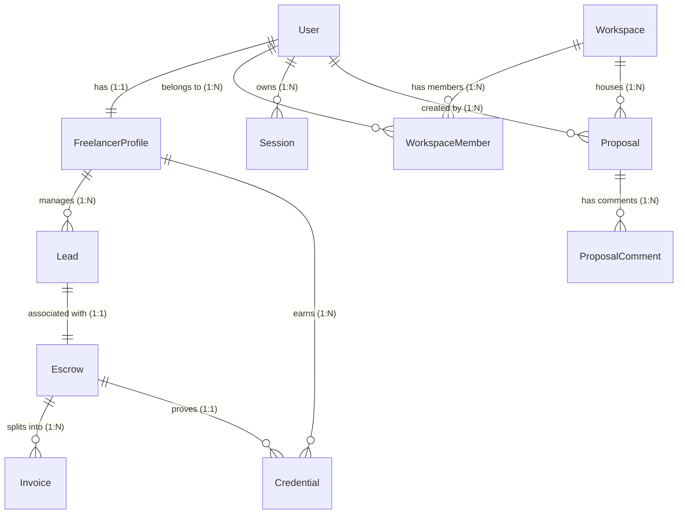

# FixFlowAI - Relational Database Schema & Prisma Model Specifications

This document details the database architecture of **FixFlowAI**. It specifies the relational schema using **PostgreSQL** as the primary storage layer (with **Prisma ORM**) and **Redis** as the session, rate limiting, and job queue cache layer.

---

## 🗺️ 1. Entity-Relationship (ER) Diagram

The following diagram maps out the relational database layout for the Next-Gen PostgreSQL architecture:



---

## 🔗 2. Database Model Schema (schema.prisma)

This is the production-ready Prisma schema definition representing our PostgreSQL database:

```prisma
datasource db {
  provider = "postgresql"
  url      = env("DATABASE_URL")
}

generator client {
  provider = "prisma-client-js"
}

// ==========================================
// ENUMS
// ==========================================

enum Role {
  GUEST
  USER
  MANAGER
  ADMIN
  SUPER_ADMIN
}

enum Plan {
  FREE
  SOLO
  PRO
  AGENCY
  SCALE
  STANDARD
  ENTERPRISE
}

enum EntryMode {
  INDIVIDUAL
  TEAM
}

enum LeadStatus {
  NEW
  QUALIFIED
  CONTACTED
  REPLIED
  WON
  LOST
}

enum ProposalStatus {
  GENERATING
  READY
  FAILED
}

enum DealStatus {
  PENDING
  NEGOTIATING
  WON
  LOST
}

enum EscrowState {
  CREATED
  FUNDED
  RELEASED
  DISPUTED
}

enum InvoiceStatus {
  DRAFT
  UNPAID
  PAID
  REFUNDED
}

// ==========================================
// MODELS
// ==========================================

model User {
  id                      String            @id @default(uuid()) @db.Uuid
  email                   String            @unique
  passwordHash            String
  role                    Role              @default(USER)
  selectedPlan            Plan              @default(FREE)
  defaultEntryMode        EntryMode         @default(INDIVIDUAL)
  currentWorkspaceId      String?           @db.Uuid
  stripeCustomerId        String?           @unique
  subscriptionStatus      String            @default("none") // active, past_due, none
  tokenVersion            Int               @default(0)
  createdAt               DateTime          @default(now())
  updatedAt               DateTime          @updatedAt
  
  // Relations
  profile                 FreelancerProfile?
  sessions                Session[]
  workspaces              WorkspaceMember[]
  proposalsCreated        Proposal[]
  comments                ProposalComment[]

  @@index([email])
}

model FreelancerProfile {
  id              String       @id @db.Uuid
  did             String?      @unique
  walletAddresses Json?        // { native: string, usdc: string, matic: string }
  profiles        Json?        // Biographies/Headline feeds: { upwork: string, linkedin: string }
  agentConfig     Json         // { leadHunter: boolean, outreachWriter: boolean, escrowWatcher: boolean }
  githubScan      Json?        // { repos: array, languages: map, commits: number }
  onboardedAt     DateTime?
  createdAt       DateTime     @default(now())
  updatedAt       DateTime     @updatedAt

  // Relations
  user            User         @relation(fields: [id], references: [id], onDelete: Cascade)
  leads           Lead[]
  credentials     Credential[]
}

model Workspace {
  id                   String            @id @default(uuid()) @db.Uuid
  name                 String
  plan                 Plan              @default(FREE)
  notificationDefaults Json?             // Default notification preferences
  slack                Json?             // { connected: boolean, webhookUrl: string }
  createdAt            DateTime          @default(now())
  updatedAt            DateTime          @updatedAt

  // Relations
  members              WorkspaceMember[]
  proposals            Proposal[]
}

model WorkspaceMember {
  id          String    @id @default(uuid()) @db.Uuid
  workspaceId String    @db.Uuid
  userId      String    @db.Uuid
  role        String    @default("member")
  joinedAt    DateTime  @default(now())

  // Relations
  workspace   Workspace @relation(fields: [workspaceId], references: [id], onDelete: Cascade)
  user        User      @relation(fields: [userId], references: [id], onDelete: Cascade)

  @@unique([workspaceId, userId])
}

model Lead {
  id                 String            @id @default(uuid()) @db.Uuid
  userId             String            @db.Uuid
  status             LeadStatus        @default(NEW)
  score              Int               @default(0)
  source             String
  sourceUrl          String?
  projectDescription String            @db.Text
  budget             Json?             // { amount: number, rate: "fixed"|"hourly", currency: string }
  matchDetails       Json?             // { skillsMatched: string[], skillsMissing: string[], githubEvidence: string[] }
  bid                Json?             // { status: string, draftProposalId: string }
  company            Json?             // { name: string, size: number, stack: string[] }
  draftMessage       Json?             // { subject: string, body: string }
  createdAt          DateTime          @default(now())
  updatedAt          DateTime          @updatedAt

  // Relations
  freelancer         FreelancerProfile @relation(fields: [userId], references: [id], onDelete: Cascade)
  escrow             Escrow?
}

model Proposal {
  id               String            @id @default(uuid()) @db.Uuid
  s3Key            String
  projectSummary   String            @db.Text
  status           ProposalStatus    @default(GENERATING)
  strategy         String            @default("standard")
  workspaceId      String            @db.Uuid
  createdBy        String            @db.Uuid
  dealStatus       DealStatus        @default(PENDING)
  briefScore       Json?             // { scope: number, technical: number, timeline: number }
  versionCount     Int               @default(1)
  chatTimingStats  Json?             // { views: number, lastViewed: Date }
  createdAt        DateTime          @default(now())
  updatedAt        DateTime          @updatedAt

  // Relations
  workspace        Workspace         @relation(fields: [workspaceId], references: [id], onDelete: Cascade)
  creator          User              @relation(fields: [createdBy], references: [id], onDelete: Cascade)
  comments         ProposalComment[]
}

model ProposalComment {
  id         String   @id @default(uuid()) @db.Uuid
  proposalId String   @db.Uuid
  senderId   String   @db.Uuid
  section    String
  text       String   @db.Text
  createdAt  DateTime @default(now())

  // Relations
  proposal   Proposal @relation(fields: [proposalId], references: [id], onDelete: Cascade)
  sender     User     @relation(fields: [senderId], references: [id], onDelete: Cascade)
}

model Escrow {
  id                 String      @id @default(uuid()) @db.Uuid
  leadId             String      @unique @db.Uuid
  clientDid          String?
  freelancerDid      String?
  buyerAddress       String?
  sellerAddress      String?
  state              EscrowState @default(CREATED)
  totalAmount        Decimal     @db.Decimal(12, 2)
  currency           String      @default("USDC")
  milestones         Json        // [{ id: string, title: string, percentage: number, approved: boolean }]
  razorpayPaymentId  String?
  contractAddress    String?
  chain              String?     // Polygon Amoy, Polygon Mainnet
  createdAt          DateTime    @default(now())
  updatedAt          DateTime    @updatedAt

  // Relations
  lead               Lead        @relation(fields: [leadId], references: [id], onDelete: Cascade)
  invoices           Invoice[]
  credential         Credential?
}

model Credential {
  id           String            @id @default(uuid()) @db.Uuid
  freelancerId String            @db.Uuid
  escrowId     String            @unique @db.Uuid
  tokenId      String?
  tokenUri     String?
  mintedAt     DateTime          @default(now())

  // Relations
  freelancer   FreelancerProfile @relation(fields: [freelancerId], references: [id], onDelete: Cascade)
  escrow       Escrow            @relation(fields: [escrowId], references: [id], onDelete: Cascade)
}

model Invoice {
  id          String        @id @default(uuid()) @db.Uuid
  escrowId    String        @db.Uuid
  milestoneId String
  amount      Decimal       @db.Decimal(12, 2)
  status      InvoiceStatus @default(DRAFT)
  releasedAt  DateTime?

  // Relations
  escrow      Escrow        @relation(fields: [escrowId], references: [id], onDelete: Cascade)
}

model Session {
  id               String    @id @default(uuid()) @db.Uuid
  userId           String    @db.Uuid
  refreshTokenHash String
  userAgent        String
  ipAddress        String
  device           String?
  browser          String?
  country          String?
  fingerprint      String?
  expiresAt        DateTime?
  revokedAt        DateTime?
  lastUsedAt       DateTime  @default(now())
  replayDetectedAt DateTime?
  createdAt        DateTime  @default(now())
  updatedAt        DateTime  @updatedAt

  // Relations
  user             User      @relation(fields: [userId], references: [id], onDelete: Cascade)

  @@index([userId])
}
```

---

## 🏎️ 3. Redis Transient Schema Reference

FixFlow AI relies on **Redis** for managing transient runtime data structures including user sessions, rate limiting, and scraper job queues.

### A. Session Store Layout
* **Key Pattern**: `session:<sessionId>`
* **Type**: Hash
* **TTL**: Dynamic (typically matches the Refresh Token lifespan, e.g., 30 days; initialized as permanent if no automatic expiry is desired).
* **Fields**:
  - `userId`: String
  - `device`: String
  - `browser`: String
  - `ipAddress`: String
  - `country`: String
  - `fingerprint`: Hex String
  - `lastActivity`: ISO String

### B. Rate Limiting sliding windows
* **Key Pattern**: `ratelimit:<action>:<identifier>` (e.g. `ratelimit:login:usr_123`, `ratelimit:api:198.51.100.42`)
* **Type**: Sorted Set (ZSET)
* **TTL**: Matches the window cooldown (e.g. 60 seconds to 10 minutes).
* **Description**: Uses a Redis transaction containing `ZADD`, `ZREMRANGEBYSCORE`, and `ZCARD` to execute high-precision rate-limiting without race conditions.

### C. BullMQ Scraper Jobs Queue
* **Key Pattern**: `bull:scraping-queue:*`
* **Type**: Hybrid (Lists, Sets, and Hashes)
* **TTL**: 7 Days (for completed job histories).
* **Description**: Handles job registration, locking, and concurrency tracking for active Apify/Tavily scraping tasks.
