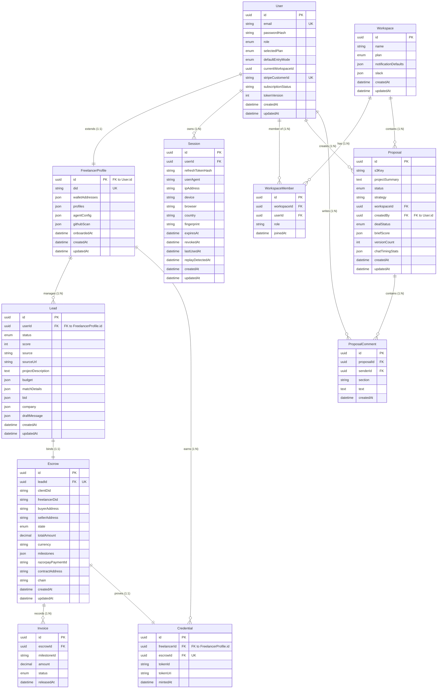

# FixFlow AI - Entity Relationship Diagram & API Contracts

This document contains the physical Entity Relationship Diagram (ERD) and the comprehensive REST API contracts for **FixFlow AI**.

---

## 🗺️ 1. Entity Relationship Diagram (ERD)

The following diagram defines the relational structure, primary keys, foreign keys, and structural relationships mapped to the PostgreSQL database.



---

## 🔌 2. API Contracts

All API requests must communicate over HTTPS. Non-public endpoints require verification of authentication cookies (`ff_refresh` / `Bearer` JWT Access Tokens in the `Authorization` header) and protection against CSRF using double-submit cookies via the `X-CSRF-Token` header.

---

### A. Authentication & Session Services

#### 1. Register Account
* **Endpoint**: `POST /api/auth/register`
* **Authentication Required**: No (Public)
* **Request Headers**:
  - `Content-Type: application/json`
* **Request Body**:
  ```json
  {
    "email": "dev@fixflowai.com",
    "password": "Password123!",
    "name": "Alex Mercer",
    "role": "freelancer",
    "selectedPlan": "solo",
    "defaultEntryMode": "individual"
  }
  ```
* **Success Response (`201 Created`)**:
  - Sets Access & Refresh cookies.
  - Body:
    ```json
    {
      "user": {
        "id": "usr_9f83a4b2-c0e8-4682-8419-3f7c001859ae",
        "email": "dev@fixflowai.com",
        "name": "Alex Mercer",
        "role": "freelancer",
        "selectedPlan": "solo",
        "createdAt": "2026-06-18T21:30:00Z"
      },
      "accessToken": "eyJhbGciOi...",
      "csrfToken": "csrf_abc123..."
    }
    ```
* **Error Responses**:
  - `400 Bad Request` (Invalid payload structure / disposable email blocked).
  - `409 Conflict` (Email already registered).

#### 2. Login
* **Endpoint**: `POST /api/auth/login`
* **Authentication Required**: No (Public)
* **Rate Limit**: Max 5 requests/minute per IP.
* **Request Body**:
  ```json
  {
    "email": "dev@fixflowai.com",
    "password": "Password123!"
  }
  ```
* **Success Response (`200 OK`)**:
  - Sets cookies.
  - Body: same as Register Account.
* **Error Responses**:
  - `401 Unauthorized` (Invalid credentials / locked account).

#### 3. Refresh Access Token
* **Endpoint**: `POST /api/auth/refresh`
* **Authentication Required**: Yes (Refresh Token Cookie present)
* **Request Headers**:
  - `X-CSRF-Token: csrf_abc123...`
* **Success Response (`200 OK`)**:
  - Rotates both Access & Refresh tokens.
  - Body:
    ```json
    {
      "accessToken": "eyJhbGciOiNew...",
      "csrfToken": "csrf_newabc..."
    }
    ```
* **Error Responses**:
  - `401 Unauthorized` (Invalid or replayed token).

#### 4. Logout
* **Endpoint**: `POST /api/auth/logout`
* **Authentication Required**: Yes
* **Request Headers**:
  - `Authorization: Bearer <token>`
  - `X-CSRF-Token: csrf_abc123...`
* **Behavior**:
  - Clears refresh cookie on client.
  - If duration since session creation is $\le 24$ hours, updates `revokedAt` in the database.
* **Success Response (`200 OK`)**:
  ```json
  {
    "message": "Logged out successfully"
  }
  ```

---

### B. Freelancer Profiles & GitHub Scanner

#### 1. Fetch Profile
* **Endpoint**: `GET /api/freelancer/profile`
* **Authentication Required**: Yes
* **Success Response (`200 OK`)**:
  ```json
  {
    "id": "usr_9f83a4b2-c0e8-4682-8419-3f7c001859ae",
    "did": "did:key:z6Mku...",
    "walletAddresses": {
      "native": "0x123...",
      "usdc": "0x456...",
      "matic": "0x789..."
    },
    "agentConfig": {
      "leadHunter": true,
      "outreachWriter": false,
      "escrowWatcher": true
    },
    "githubScan": {
      "repos": ["portfolio", "proposal-generator"],
      "languages": { "TypeScript": 70, "Rust": 30 },
      "commits": 412,
      "lastScanned": "2026-06-18T20:00:00Z"
    }
  }
  ```

#### 2. Execute GitHub Scan
* **Endpoint**: `POST /api/freelancer/github-scan`
* **Authentication Required**: Yes
* **Request Body**:
  ```json
  {
    "githubUsername": "alexmercer"
  }
  ```
* **Success Response (`202 Accepted`)**:
  ```json
  {
    "message": "GitHub profile scanning initiated in background.",
    "scanJobId": "job_gh_9f83..."
  }
  ```

---

### C. Leads Pipeline

#### 1. List Leads
* **Endpoint**: `GET /api/leads`
* **Query Parameters**:
  - `status`: filter by pipeline status (e.g. `qualified`, `new`)
* **Success Response (`200 OK`)**:
  ```json
  [
    {
      "id": "led_3c8f12b4...",
      "score": 88,
      "source": "Reddit",
      "projectDescription": "Looking for a Rust developer to build a JSON parser",
      "budget": { "amount": 2500, "rate": "fixed", "currency": "USDC" },
      "status": "qualified"
    }
  ]
  ```

#### 2. Update Lead Status (Kanban Drag-and-Drop)
* **Endpoint**: `PATCH /api/leads/:leadId`
* **Request Body**:
  ```json
  {
    "status": "won"
  }
  ```
* **Success Response (`200 OK`)**:
  ```json
  {
    "id": "led_3c8f12b4...",
    "status": "won",
    "updatedAt": "2026-06-18T21:30:00Z"
  }
  ```

---

### D. Proposal Workspace

#### 1. Create Proposal
* **Endpoint**: `POST /api/proposals`
* **Request Body**:
  ```json
  {
    "workspaceId": "wsp_7b12...",
    "brief": "Build a React component to display token telemetry analytics.",
    "strategy": "premium"
  }
  ```
* **Success Response (`201 Created`)**:
  ```json
  {
    "proposalId": "prp_5e3d...",
    "status": "generating",
    "createdAt": "2026-06-18T21:30:00Z"
  }
  ```

#### 2. Stream Proposal Document (Server-Sent Events)
* **Endpoint**: `GET /api/proposals/:proposalId/stream`
* **Authentication Required**: Yes (token passed as query parameter for EventSource validation: `?token=eyJhbGciOi...`)
* **Headers Response**:
  - `Content-Type: text/event-stream`
  - `Cache-Control: no-cache`
  - `Connection: keep-alive`
* **SSE Message Frames**:
  - Event: `proposal_chunk`
    ```json
    { "text": "Creating features list..." }
    ```
  - Event: `proposal_done`
    ```json
    { "proposalId": "prp_5e3d...", "s3Key": "proposals/prp_5e3d/v1.json" }
    ```

---

### E. Portal & Telemetry (Client-Facing Share)

#### 1. Create Public Share Portal
* **Endpoint**: `POST /api/portals`
* **Request Body**:
  ```json
  {
    "proposalId": "prp_5e3d...",
    "pinGated": true,
    "pin": "4892",
    "expiryHours": 48
  }
  ```
* **Success Response (`201 Created`)**:
  ```json
  {
    "portalId": "ptl_2d8c...",
    "shareUrl": "https://fixflowai.com/portals/ptl_2d8c",
    "expiryAt": "2026-06-20T21:30:00Z"
  }
  ```

#### 2. Submit Telemetry (Section Dwell Metrics)
* **Endpoint**: `POST /api/portals/:portalId/telemetry`
* **Authentication Required**: No (Public Client interaction)
* **Request Body**:
  ```json
  {
    "section": "features_grid",
    "dwellTimeSeconds": 45
  }
  ```
* **Success Response (`204 No Content`)**: None.

---

### F. Escrow Payments

#### 1. Initialize Escrow
* **Endpoint**: `POST /api/escrows`
* **Request Body**:
  ```json
  {
    "leadId": "led_3c8f12b4...",
    "currency": "USDC",
    "totalAmount": 10000.00,
    "milestones": [
      { "title": "Setup & APIs", "percentage": 30 },
      { "title": "Launch Component", "percentage": 70 }
    ]
  }
  ```
* **Success Response (`201 Created`)**:
  ```json
  {
    "escrowId": "esc_1a2b3c...",
    "state": "CREATED",
    "milestones": [
      { "id": "m_1", "title": "Setup & APIs", "percentage": 30, "approved": false },
      { "id": "m_2", "title": "Launch Component", "percentage": 70, "approved": false }
    ],
    "razorpayPaymentId": "pay_vaccount_1234"
  }
  ```

#### 2. Approve Milestone Completion (Payout Trigger)
* **Endpoint**: `POST /api/escrows/:escrowId/milestones/:milestoneId/approve`
* **MFA Verification Required**: Yes (for Manager/Admin step-up)
* **Request Headers**:
  - `X-MFA-Token: 981242` (TOTP code)
* **Success Response (`200 OK`)**:
  ```json
  {
    "escrowId": "esc_1a2b3c...",
    "milestoneId": "m_1",
    "approved": true,
    "payoutStatus": "released",
    "invoiceId": "inv_9081a..."
  }
  ```
