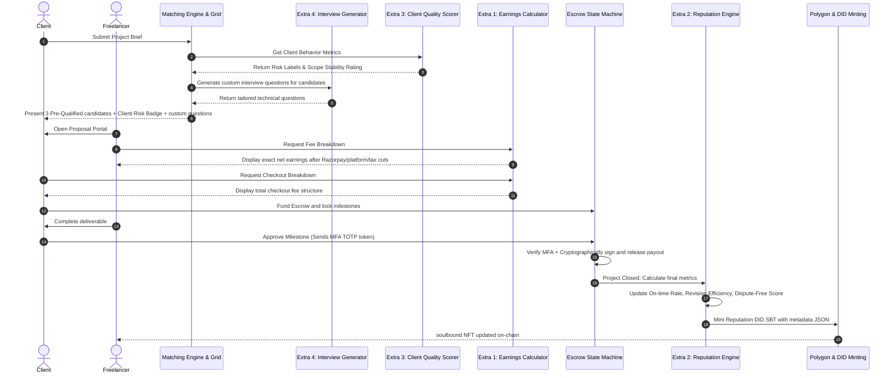
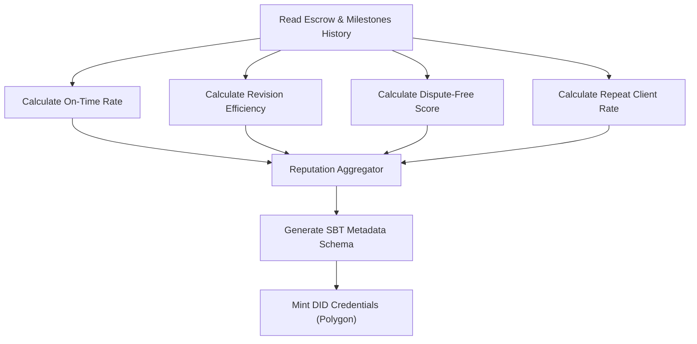

# FixFlow AI - Client & Freelancer Problem Resolution Roadmap

This document outlines the **Extra Implementation Modules** required on top of the five core subsystems to fully resolve the strategic client and freelancer pain points identified in [market_positioning_and_uvps.md](file:///c:/Users/suvam/Desktop/VS%20code/Projects/FixFlowAI/docs/market_positioning_and_uvps.md).

It acts as an architectural blueprint and implementation guide for developers and LLM agents to build out the remaining high-value features.

---

## 🗺️ 1. Problem Resolution & Code Gap Analysis

The table below maps the strategic value propositions (UVPs) against what is **currently implemented** in the codebase and highlights the **extra technical modules** needed to bridge the remaining gaps.

| Paradigm | Pain Point | Core UVP | Current Code State | Extra Module Needed (Gaps) |
| :--- | :--- | :--- | :--- | :--- |
| **Freelancer** | **Fees Eat Earnings** | Transparent Earnings Engine | Schema records total amount. No fee separation. | **Extra Module 1**: `earningsCalculator.js` to calculate tiered platform, payment, and tax cuts. |
| **Freelancer / Client** | **Opaque Algorithms / Trust** | Verifiable Reputation & DID | Credential records minting state; no metrics. | **Extra Module 2**: `reputationCalculator.js` to compute verified metrics for Soulbound Token metadata. |
| **Freelancer** | **Unreliable Clients** | Client Quality Scoring | Lead records static `company` JSON. | **Extra Module 3**: `clientScoring.js` to compute Scope Stability, Payment Speed, and Risk Labels. |
| **Client** | **Hiring Takes Too Long** | Fast Hire & Vetting | Matches leads based on skills score. | **Extra Module 4**: `interviewGenerator.ts` to auto-generate technical vetting questions per candidate. |
| **Freelancer** | **Constant Income Hustle** | Workspace Retention | Persistent workspaces exist. | **Extra Module 5**: `contextExtensions.ts` to vectorize historical context and suggest follow-up milestones. |
| **Security** | **Payment Hijacking Risks** | Secure MFA Payout Release | FSM transitions are audited. | **Extra Module 6**: Integrates MFA OTP directly inside `escrowStateMachine.ts` with crypto signatures. |

---

## 🎨 2. Visual Architecture & Workflow

### A. End-to-End Extra Modules Interaction
This sequence diagram shows how the new modules integrate with the existing proposal and escrow lifecycle to solve client and freelancer friction points.



---

## ⚙️ 3. Detailed Specifications for Extra Modules

### 💸 Extra Module 1: The Transparent Earnings Calculator
*   **File Location**: [earningsCalculator.js](file:///c:/Users/suvam/Desktop/VS%20code/Projects/FixFlowAI/backend/src/skills/earningsCalculator.js)
*   **Target Pain Point**: Freelancer Fee anxiety.
*   **Functional Description**: Processes raw milestones, extracts platform fees, Razorpay gateway fees, and TDS/GST taxes to show transparent numbers.

#### Code Implementation Blueprint
```typescript
export interface FeeBreakdown {
  grossAmount: number;
  platformFee: number;
  paymentGatewayFee: number;
  withholdingTax: number;
  netFreelancerEarnings: number;
  totalClientCheckout: number;
}

export function calculateEarningsBreakdown(
  grossAmount: number,
  platformPlan: 'FREE' | 'SOLO' | 'PRO' | 'AGENCY',
  taxCountryCode: string = 'IN'
): FeeBreakdown {
  // 1. Tiered Platform Commission Rule
  const platformRates = { FREE: 0.10, SOLO: 0.05, PRO: 0.03, AGENCY: 0.02 };
  const platformRate = platformRates[platformPlan] || 0.10;
  const platformFee = grossAmount * platformRate;

  // 2. Razorpay Payment Gateway Fee (2% + fixed charges)
  const razorpayRate = 0.02;
  const razorpayFixed = 3.0; // In local currency units e.g., INR/USD equivalent
  const paymentGatewayFee = (grossAmount * razorpayRate) + razorpayFixed;

  // 3. Tax Withholding Rules (e.g., TDS default for India: 1%)
  let withholdingTax = 0;
  if (taxCountryCode === 'IN') {
    withholdingTax = grossAmount * 0.01;
  }

  // 4. Client Checkout Premium (e.g., 1.5% checkout processing)
  const clientProcessingFee = grossAmount * 0.015;

  const netFreelancerEarnings = grossAmount - platformFee - paymentGatewayFee - withholdingTax;
  const totalClientCheckout = grossAmount + clientProcessingFee;

  return {
    grossAmount,
    platformFee,
    paymentGatewayFee,
    withholdingTax,
    netFreelancerEarnings: Math.max(0, parseFloat(netFreelancerEarnings.toFixed(2))),
    totalClientCheckout: parseFloat(totalClientCheckout.toFixed(2))
  };
}
```

---

### 🛡️ Extra Module 2: The Multi-Dimensional Reputation Engine
*   **File Location**: [reputationCalculator.js](file:///c:/Users/suvam/Desktop/VS%20code/Projects/FixFlowAI/backend/src/skills/reputationCalculator.js)
*   **Target Pain Point**: Opaque ratings & trust verification.
*   **Functional Description**: Aggregates raw history from `FreelancerProfile` and `Escrow` transactions to generate mathematical reputation scores.



#### SBT Metadata Schema (`sbt-metadata.json`)
```json
{
  "name": "FixFlow AI Verifiable Reputation SBT",
  "description": "Verification of performance milestones and trust indicators for the DID profile.",
  "image": "ipfs://QmReputationBadgeHash",
  "attributes": [
    { "trait_type": "OnTimeRate", "value": 94.5 },
    { "trait_type": "RevisionEfficiency", "value": 91.2 },
    { "trait_type": "RepeatClientRate", "value": 30.0 },
    { "trait_type": "DisputeFreeRate", "value": 99.0 },
    { "trait_type": "VerificationStandard", "value": "FixFlow AI Consensus Engine v1" }
  ]
}
```

---

### 💼 Extra Module 3: Client Quality Scorer & Risk Labeler
*   **File Location**: [clientScoring.js](file:///c:/Users/suvam/Desktop/VS%20code/Projects/FixFlowAI/backend/src/skills/clientScoring.js)
*   **Target Pain Point**: Toxicity, late payments, and scope creep.
*   **Functional Description**: Evaluates client historical transactions to assign warning indicators on incoming Leads.

#### Behavior Scoring Metrics Formula
*   **Scope Stability Score**: Measures frequency of milestone changes:
    $$\text{Stability} = \max\left(0, 100 - \left( \frac{\text{Milestone Edits Count}}{\text{Total Milestones}} \times 100 \right)\right)$$
*   **Payment Speed**: Average hours elapsed between deliverable submission and release approval.
*   **Risk Label Criteria**:
    - If Stability Score $< 60$ $\rightarrow$ label `"SCOPE CREEP RISK"` (High priority)
    - If Average Payment Speed $> 72$ hours $\rightarrow$ label `"LATE PAYER RISK"`
    - If Dispute Rate $> 10\%$ $\rightarrow$ label `"HIGH DISPUTE RATE WARNING"`
    - Otherwise $\rightarrow$ label `"PREMIUM CLIENT"`

---

### ⏱️ Extra Module 4: Dynamic Interview Question Generator
*   **File Location**: [interviewGenerator.ts](file:///c:/Users/suvam/Desktop/VS%20code/Projects/FixFlowAI/backend/src/skills/interviewGenerator.ts)
*   **Target Pain Point**: Slow vetting and screening fatigue.
*   **Functional Description**: When the `Confidence Grid` detects missing skill match details (`skillsMissing`), it triggers Gemini to generate tailored questions.

#### Prompts Engineering Framework
```typescript
export async function generateTargetedQuestions(
  projectBrief: string,
  candidateGithubScan: string,
  missingSkills: string[]
): Promise<string[]> {
  const systemPrompt = `
    You are an elite Technical Recruiter. You are hiring for a project. 
    Analyze the project brief and the candidate's GitHub scan data.
    Identify the gaps in their skills matching the profile (e.g. ${missingSkills.join(', ')}).
    Generate 3 targeted, extremely specific, non-generic technical questions that will verify if the candidate can build the missing requirements. Do not ask generic questions.
  `;
  
  // Call Gemini SDK returning structured string array
  // return callGeminiAPI(systemPrompt, projectBrief);
  return [];
}
```

---

### 🔁 Extra Module 5: Contextual Contract Extensions
*   **File Location**: [contextExtensions.ts](file:///c:/Users/suvam/Desktop/VS%20code/Projects/FixFlowAI/backend/src/skills/contextExtensions.ts)
*   **Target Pain Point**: Client-freelancer retention, matching churn.
*   **Functional Description**: Vectorizes the final deliverables text and chats of a closing workspace to generate extension suggestions automatically.

```
+------------------+     +--------------------+     +------------------------+
| Deliverable Data | --> | Vector Embeddings  | --> | Gemini Prompting Layer |
| & Workspace Chat |     | (PgVector / Redis) |     | - Suggest Milestones   |
+------------------+     +--------------------+     + - Draft Extension Brief|
                                                    +-----------+------------+
                                                                |
                                                                v
                                                    +------------------------+
                                                    | One-Click Repeat Offer |
                                                    +------------------------+
```

---

### 🔐 Extra Module 6: Secure MFA-Escrow Payout Flow
*   **File Location**: Integrated directly inside [escrowStateMachine.ts](file:///c:/Users/suvam/Desktop/VS%20code/Projects/FixFlowAI/backend/src/skills/escrowStateMachine.ts)
*   **Target Pain Point**: Cryptographic transaction security and session-hijack protection.
*   **Implementation Constraints**:
    - Any milestone status change to `Approved` or `Funds_Released` must carry a verifiable MFA TOTP token (`X-MFA-Token`) in the request header.
    - Inside the state machine, verify the token signature using the user's secret *prior* to database transaction execution.
    - Chained audit hashes must include the verified MFA validation stamp to prevent admin backdoors.

---

## 🚀 4. Step-by-Step Implementation Sprint

Here is the recommended execution path to implement these extra components:

```
[Sprint 1: Escrow & Fees]
  ├── Implement Extra 1 (earningsCalculator.js)
  └── Implement Extra 6 (MFA verification on milestone releases)
            │
            ▼
[Sprint 2: Trust & Reputation]
  ├── Implement Extra 3 (clientScoring.js)
  └── Implement Extra 2 (reputationCalculator.js + SBT Metadata)
            │
            ▼
[Sprint 3: AI Vetting & Extensions]
  ├── Implement Extra 4 (interviewGenerator.ts)
  └── Implement Extra 5 (contextExtensions.ts vector matching)
```

---

## 📂 5. Target File Index
Create and link these files directly in the codebase:
1. `backend/src/skills/earningsCalculator.js` $\rightarrow$ Calculates fees.
2. `backend/src/skills/reputationCalculator.js` $\rightarrow$ Evaluates Trust.
3. `backend/src/skills/clientScoring.js` $\rightarrow$ Rates clients.
4. `backend/src/skills/interviewGenerator.ts` $\rightarrow$ Formulates vetting Qs.
5. `backend/src/skills/contextExtensions.ts` $\rightarrow$ Drives contract retention.
