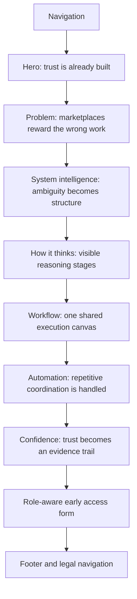
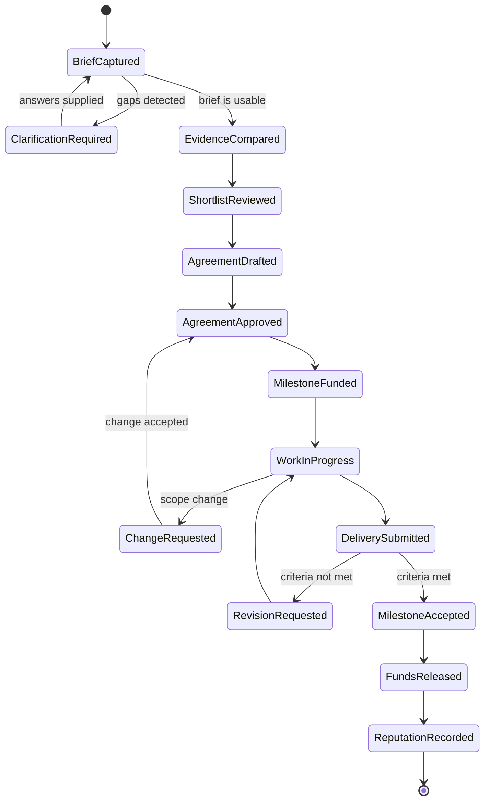

# FixFlowAI Landing Page Redesign and Implementation Plan

## 1. Document purpose

This is the source-of-truth specification for the FixFlowAI public landing page. It combines market research, positioning, page copy, visual direction, interaction behavior, component architecture, responsive rules, accessibility requirements, and implementation acceptance criteria.

The page must introduce one connected operating system for four audiences:

- **Clients** who need a clear brief, trustworthy recommendations, controlled scope, and protected payments.
- **Freelancers** who need qualified opportunities, proof-led positioning, clearer agreements, and reliable milestone payments.
- **Agencies** who need reusable intake, team proof, proposal governance, client visibility, and delivery control.
- **Developers** who need their real work to carry more weight than profile optimization, plus scoped execution and evidence-backed reputation.

The landing page is not a marketplace directory and must not imitate the familiar search-first or gig-card patterns used by incumbent platforms. It should make the product feel like a trust and execution layer that replaces marketplace noise with structured decisions.

## 2. Product statement

**FixFlowAI turns an unstructured project request into a verified working agreement, then keeps scope, evidence, milestones, escrow, delivery, and reputation connected in one workspace.**

### Primary positioning

FixFlowAI is the trust infrastructure between a client request and completed work.

### Supporting value pillars

1. **Clarity before matching:** parse the brief, expose ambiguity, identify risks, and make requirements reviewable.
2. **Proof before persuasion:** compare relevant work evidence instead of rewarding profile polish or bid volume.
3. **Agreement before execution:** turn decisions into scoped milestones, acceptance criteria, responsibilities, and payment states.
4. **Visibility during delivery:** give every party one current view of scope, proof, approvals, funds, and changes.
5. **Reputation after outcomes:** convert completed work into a durable evidence trail rather than a shallow rating alone.

## 3. Research synthesis

Research focused on the public landing pages and positioning of established marketplaces, curated networks, and newer talent platforms. The objective is to understand category conventions without reproducing their layouts.

| Platform | Public UX pattern | What it communicates well | What FixFlowAI should not copy | FixFlowAI opportunity |
| --- | --- | --- | --- | --- |
| Upwork | Search/category-led marketplace, broad supply, job posting, proposals, profiles | Breadth and familiarity | A page dominated by talent search, profile cards, bidding, or generic social proof | Lead with the transformation from raw brief to protected work |
| Fiverr | Service/gig discovery, category browsing, fast purchase framing | Immediate discoverability | Commodity service tiles, price-first comparison, or visual density built around gigs | Show structured project decisions and mutual accountability |
| Freelancer.com | Large global network, bids, portfolios, feedback, milestone payments | Clear marketplace mechanics | Bid-count urgency and lowest-price competition | Treat payment protection as one state in a complete trust lifecycle |
| Toptal | Premium scarcity, rigorous vetting, fast curated matching | Trust through selection | Elite-only exclusivity as the entire product story | Show how evidence and confidence are produced, not merely asserted |
| Contra | Editorial discovery, creative community, project showcases, commission-free payments | Brand personality and creator affinity | Portfolio-gallery-first storytelling that hides operational complexity | Combine editorial restraint with an explicit execution system |
| Arc | Vetted remote talent, speed to interview, specialist hiring | A concise speed-and-quality promise | A single recruiting funnel focused only on employers | Serve both sides of a project from intake through delivery |
| Lemon.io | Developer specialization, curated matching, visible technical categories | Developer-specific confidence | A recruiter-style talent carousel | Make technical proof and project evidence part of the workflow canvas |
| Braintrust | Multiple connected products across marketplace, recruiting, and automation | Platform breadth and enterprise utility | Product-card grids and AI feature naming without a single narrative | Present FixFlowAI as one continuous reasoning and trust loop |

### Category conclusions

- Most platforms start with **supply discovery**. FixFlowAI should start with **project clarity**.
- Most platforms ask users to trust a profile, badge, or network claim. FixFlowAI should show **how confidence is assembled from evidence**.
- Payment protection is usually isolated as a feature. FixFlowAI should show it as a **visible state machine connected to acceptance criteria and delivery**.
- Incumbent landing pages separate hiring, proposal, payment, and project management. FixFlowAI should present them as **one continuous system**.
- The strongest differentiation is not “more AI.” It is **less uncertainty and less coordination debt**.

## 4. Current FixFlowAI site audit

The current public site already introduces useful product language: autonomous scoping, barrier-free onboarding, collaborative proposal workspaces, milestone payments, and escrow. The redesign should preserve that strategic direction while correcting the following issues:

- Large empty vertical areas interrupt the narrative and can look like failed loading or animation states.
- The pale-purple treatment is close to common AI-product styling and does not express the product's operational seriousness.
- Several problems and capabilities appear as separate statements instead of one visible cause-and-effect system.
- The four audiences are not given equally clear entry paths.
- Product proof is described more often than demonstrated through a tangible interface state.
- The current information rhythm delays the strongest product signal.

The redesign therefore uses a dense but calm white editorial canvas, visible workflow logic in the first viewport, varied full-width section bands, and working local interactions.

## 5. Creative direction

### Design concept

**Editorial systems map.** The page should resemble a carefully designed operating manual crossed with a live product workflow. It uses strong typography, rule lines, numbered stages, evidence trails, annotated system states, and controlled color to make a complex product understandable without turning every idea into a card.

### Non-negotiable visual rules

- Light mode only.
- True white and cool neutral surfaces; no cream or beige cast.
- No glassmorphism, neon, glowing orbs, bokeh, or decorative AI blobs.
- No generic bento-grid feature section.
- No repeated centered-heading-plus-three-cards pattern.
- No giant isolated hero heading with a mostly empty viewport.
- No gradients except a subtle brand treatment inside the supplied logo itself.
- Borders are structural rules, not decoration.
- Cards are used only for product states, repeated evidence events, and form controls; maximum radius is 8px.
- UI copy is concise and factual. Do not use unsupported metrics or invented customer quotes.
- The official logo at `frontend/public/official-logo.png` is mandatory.

### Palette

| Token | Value | Use |
| --- | --- | --- |
| `--canvas` | `#FFFFFF` | Primary page background |
| `--canvas-muted` | `#F7F8FA` | Alternating operational bands |
| `--surface` | `#F1F5F9` | Product rails and selected states |
| `--ink` | `#0F172A` | Primary type and controls |
| `--muted` | `#64748B` | Secondary text |
| `--line` | `#D9E0E8` | Rules and boundaries |
| `--brand` | `#2563EB` | Primary actions and active system paths |
| `--brand-deep` | `#173EA5` | Hover and emphasis |
| `--signal` | `#16A34A` | Verified, funded, and accepted states |
| `--warning` | `#C2410C` | Scope risk and unresolved states |
| `--violet` | `#6D4AFF` | Small secondary brand accent sampled from logo |

Color balance must remain mostly white, graphite, and cool gray. Blue indicates current system action, green indicates verified state, orange indicates risk, and violet is used sparingly for brand continuity.

### Typography

- Primary family: `Inter`, loaded locally through a direct font file or served through a performant web-font request; fallback `Arial`, sans-serif.
- Display: 64px desktop, 52px tablet, 40px mobile; weight 650-700; line-height 1.02-1.08.
- Section heading: 46px desktop, 38px tablet, 32px mobile; weight 650; line-height 1.08-1.15.
- Subheading: 24px desktop, 21px tablet, 19px mobile.
- Body large: 18px / 1.65.
- Body: 16px / 1.6.
- UI control: 14px / 1.2, weight 600.
- Caption and system labels: 12px / 1.35, weight 650.
- Letter spacing: `0` throughout.

### Grid and spacing

- Twelve-column desktop grid.
- Maximum content width: 1280px.
- Maximum structural width: 1440px.
- Desktop gutters: 40px; tablet: 28px; mobile: 20px.
- Spacing scale: 8, 12, 16, 24, 32, 48, 64, 96, 128px.
- Section padding: 112-128px desktop, 80-96px tablet, 64-72px mobile.
- Buttons and controls: 4px radius. Product canvases and repeatable event rows: 6-8px radius.

### Motion language

- Scroll progress is a 2px blue line at the top of the viewport.
- Headings reveal by line or word with 20-40ms stagger and 450-650ms duration.
- Workflow links draw from source to destination when a stage activates.
- Hero workflow runs automatically once, then remains user-controlled.
- Sticky storytelling changes one product canvas instead of stacking multiple screenshots.
- Parallax is limited to 4-6px and disabled under reduced-motion preference.
- Desktop cursor treatment is a small ring that expands over interactive targets; it must never obscure the native pointer or appear on touch devices.
- All motion must stop or reduce when `prefers-reduced-motion: reduce` is active.

## 6. Landing page information architecture



### Navigation

Visible items:

- Official FixFlowAI logo and wordmark
- Problem
- Intelligence
- Workflow
- Trust
- `Request access` primary action
- Mobile menu button using a Lucide menu icon

Behavior:

- Header becomes solid white with a bottom rule after the first 24px of scroll.
- Navigation anchors scroll to exact section headings.
- Current section receives a quiet blue underline, not a pill.
- Mobile navigation opens as a full-width white panel below the header and locks background scroll.

## 7. Section-by-section content and behavior

### 7.1 Hero

**Heading:** Work moves when trust is already built.

**Supporting copy:** FixFlowAI turns a raw project brief into a verified plan, proof-led match, protected milestones, and one shared delivery record.

**Primary CTA:** Request early access

**Secondary CTA:** Watch the system think

**Audience rail:** Built for clients / freelancers / agencies / developers

#### Visual

The left side owns the message and CTAs. The right side is a code-native workflow canvas, not a decorative illustration. It contains four states:

1. Brief received
2. Proof checked
3. Scope agreed
4. Escrow ready

A restrained line system connects the states. When the user activates the demo, the selected state advances and its explanation changes. The canvas uses blue for active reasoning, green for completed states, and orange only when displaying ambiguity or scope risk.

#### First viewport rules

- The brand, literal offer, and working product signal must all be visible without scrolling.
- The bottom of the viewport must reveal the next section's problem statement.
- Do not add a badge, pretitle, launch date, fake customer count, or artificial metric.

### 7.2 Problem

**Heading:** The old marketplace makes everyone do the wrong work.

This section is an open four-column editorial comparison on desktop and a ruled vertical list on mobile. It is not a collection of floating cards.

| Audience | Current burden | FixFlowAI shift |
| --- | --- | --- |
| Client | Rewrite the same brief, screen noisy bids, chase proof, arbitrate unclear scope | Start with one structured request and receive explainable options |
| Freelancer | Optimize a profile, repeat proposals, accept ambiguous work, chase payment | Reuse verified evidence and enter work with a clear agreement |
| Agency | Rebuild intake, coordinate fragmented approvals, prove team fit repeatedly | Standardize intake, team proof, proposal controls, and client visibility |
| Developer | Translate real engineering work into marketplace language | Let repositories, shipped work, and technical evidence support confidence |

Interaction: hovering or focusing an audience reveals its “before” and “after” path in a thin diagram beneath the row. Mobile uses a tap-controlled disclosure with correct `aria-expanded` state.

### 7.3 System intelligence

**Heading:** System intelligence replaces marketplace guesswork.

**Copy:** FixFlowAI does not hide the decision behind an AI label. It shows what was understood, what remains uncertain, which proof matters, and what must be agreed before work begins.

Five connected stages:

1. **Raw brief** - original client intent remains visible.
2. **Parsed intelligence** - outcomes, constraints, dependencies, missing details, and risk are structured.
3. **Proof graph** - relevant project, repository, delivery, and domain evidence is linked to requirements.
4. **Confidence grid** - fit is explained by evidence strength, not a single opaque score.
5. **Scoped milestones** - outputs, acceptance criteria, owners, timing, and funding states are assembled.

Visual: a horizontal processing rail on desktop; an ordered vertical track on mobile. The active stage changes on click and through scroll progress. The lower inspection area shows a realistic example for the selected stage.

### 7.4 How it thinks

**Heading:** From raw request to protected execution.

The section uses sticky copy on the left and a single changing product canvas on the right.

| Step | System action | User value |
| --- | --- | --- |
| Intake | Capture goals, constraints, files, stakeholders, and unknowns | One source brief instead of repeated onboarding |
| Parse | Detect scope gaps, dependencies, contradictions, and risk | Problems surface before proposals become commitments |
| Match | Compare requirements against relevant evidence | Shortlists become explainable and defensible |
| Compose | Build proposal sections, assumptions, milestones, and acceptance criteria | Agreements start from shared facts |
| Lock funds | Connect approved work to an explicit escrow state | Payment expectations become visible before delivery |
| Workspace | Track evidence, approvals, changes, delivery, and reputation | The relationship keeps its context from start to finish |

Each step advances the canvas. Keyboard users can move between steps with buttons. Scroll-triggered changes must not prevent manual control.

### 7.5 Workflow visualization

**Heading:** One workspace keeps the deal honest.

Visual: a swimlane canvas with four lanes: Client, FixFlowAI, Talent, Escrow. Horizontal phases are Brief, Match, Agreement, Build, Approval, and Outcome.

Core interactive states:

- `Brief`: show unresolved items and who must answer them.
- `Match`: show a proof source attached to a requirement.
- `Agreement`: show milestone output, acceptance rule, and owner.
- `Build`: show a delivery event and requested change.
- `Approval`: show accepted or revision-needed status.
- `Outcome`: show released funds and a reputation proof event.

The default active phase is Agreement because it is the product's bridge between selection and execution. Phase buttons are a segmented control with stable dimensions. Clicking a phase updates the detail rail, highlights connected nodes, and announces the state change in an `aria-live` region.

### 7.6 Automation showcase

**Heading:** Automation without hiding the reasoning.

This is a full-width dark-ink-on-light operational table, not a grid of feature cards.

| Repetitive work removed | Automated behavior | Human control retained |
| --- | --- | --- |
| Proposal rebuilding | Reusable proposal structure assembled from brief and proof | Edit assumptions, pricing, milestones, and exclusions |
| Client follow-up | Portal requests missing inputs and records decisions | Approve the final agreement and each change |
| Payment chasing | Escrow state follows approved milestones | Client controls funding; release follows acceptance rules |
| Context switching | Files, messages, decisions, proof, and delivery events stay linked | Participants choose what becomes contractual evidence |
| Reputation rebuilding | Completed outcomes create structured proof events | Users review what becomes part of their public or private record |

The table supports row focus and a compact before/after animation. Avoid the phrase “AI does everything.”

### 7.7 Customer confidence

**Heading:** Trust is not a profile badge. It is a trail.

**Copy:** Every important claim should point back to a source, decision, acceptance event, or completed outcome.

Evidence timeline:

1. Requirement captured
2. Risk acknowledged
3. Proof connected
4. Agreement signed
5. Milestone funded
6. Delivery submitted
7. Outcome accepted
8. Reputation updated

The section must avoid fabricated testimonials. It may show realistic product-event examples clearly labeled as interface examples, such as “Repository linked to API reliability requirement” or “Milestone 02 accepted against three criteria.”

### 7.8 Final CTA and onboarding

**Heading:** Start with a brief. Leave with a working agreement.

**Copy:** Join the early-access group for your role. We will use your onboarding path to shape the workflows that matter before launch.

Role selector options:

- Client
- Freelancer
- Agency
- Developer

Required fields:

- Work email
- Role
- Submit button: `Request early access`

Behavior:

- Selecting a role changes one sentence beneath the selector to explain the relevant onboarding outcome.
- Email is validated in the browser.
- Submission currently creates a local success state because no waitlist endpoint is present in the frontend repository.
- The success state says: `You are on the early-access list. We will contact you with the [role] onboarding path.`
- Production integration must replace only the submit handler and retain all loading, error, and success states.

### 7.9 Footer

- Official brand mark and one-sentence product definition
- Product anchors: Intelligence, Workflow, Trust
- Audience anchors: Clients, Freelancers, Agencies, Developers
- Company placeholders only when routes exist; do not create dead legal links
- Copyright uses current year automatically
- Contact uses the existing public site contact destination when available

## 8. Product workflow diagram



## 9. Visual concept references

The generated concepts are implementation references rather than production UI assets. All interface text and controls must remain code-native.

1. [`01-hero-problem.png`](./assets/landing-concepts/01-hero-problem.png) - first viewport and problem section.
2. [`02-system-intelligence.png`](./assets/landing-concepts/02-system-intelligence.png) - reasoning pipeline and protected-execution steps.
3. [`03-workflow-automation.png`](./assets/landing-concepts/03-workflow-automation.png) - swimlane workflow and automation table.
4. [`04-trust-cta.png`](./assets/landing-concepts/04-trust-cta.png) - evidence trail and role-aware CTA.

The logo rendered by Image Gen is approximate and must not be used. The implementation uses the official supplied mark.

## 10. React implementation architecture

```text
src/
  App.tsx
  main.tsx
  index.css
  components/
    Brand.tsx
    CursorField.tsx
    RevealText.tsx
    ScrollProgress.tsx
    SectionHeading.tsx
  data/
    landing.ts
  hooks/
    useActiveSection.ts
    useReducedMotion.ts
    useSmoothScroll.ts
  sections/
    Navigation.tsx
    Hero.tsx
    Problem.tsx
    SystemIntelligence.tsx
    HowItThinks.tsx
    Workflow.tsx
    Automation.tsx
    Trust.tsx
    FinalCta.tsx
    Footer.tsx
  store/
    useLandingStore.ts
```

### Library responsibilities

- **React + TypeScript + Vite:** component model, static build, strict typing.
- **Tailwind CSS:** utility availability and build-time styling support; bespoke component styling remains token-driven in `index.css` to preserve the art direction.
- **Framer Motion:** heading reveals, presence transitions, button and workflow state motion.
- **GSAP:** scroll-linked section progression where sticky storytelling needs precise control.
- **Lenis:** smooth scrolling on pointer devices; disabled for reduced motion.
- **Zustand:** shared active workflow stage, selected audience, and demo playback state.
- **Lucide React:** interface icons only.
- **Three.js / React Three Fiber / Drei / Matter.js:** installed as approved future visualization dependencies, but not loaded on the landing-page critical path. The chosen design is deliberately code-native 2D to protect readability, accessibility, and performance.

### State model

```ts
type Audience = 'client' | 'freelancer' | 'agency' | 'developer'
type WorkflowPhase = 'brief' | 'match' | 'agreement' | 'build' | 'approval' | 'outcome'

interface LandingState {
  audience: Audience
  heroStep: number
  intelligenceStep: number
  workflowPhase: WorkflowPhase
  demoRunning: boolean
}
```

Store selectors must subscribe to the smallest required slice to avoid page-wide rerenders. Static content arrays live outside components. Heavy optional visualization packages must not be imported into the main bundle.

## 11. Accessibility requirements

- Semantic landmarks: `header`, `nav`, `main`, `section`, `footer`.
- One `h1`; section headings use `h2`; nested UI headings use `h3`.
- Skip link appears on keyboard focus.
- All buttons have visible focus rings with at least 3:1 contrast.
- All interactive diagrams have equivalent text and keyboard controls.
- No information is communicated through color alone.
- Minimum body contrast target is WCAG AA.
- Form labels are persistent and not replaced by placeholders.
- Status changes use restrained `aria-live="polite"` regions.
- Mobile menu correctly manages `aria-expanded`, `aria-controls`, focus return, and Escape closing.
- Reduced motion disables smooth scrolling, cursor effects, autoplay, parallax, and scroll-scrub animation.
- Decorative lines are hidden from assistive technologies.

## 12. Responsive behavior

### Desktop: 1200px and above

- Full navigation.
- Hero uses a 5/7 column composition.
- System rails remain horizontal.
- Workflow swimlanes expose all actors and phases.
- Sticky storytelling operates within bounded section heights.

### Tablet: 768-1199px

- Header keeps essential navigation until labels no longer fit, then switches to mobile menu.
- Hero becomes 6/6 or stacked based on available height.
- Workflow canvas retains horizontal scrolling only inside the canvas, with a visible phase selector above it.
- Type sizes step down at explicit breakpoints.

### Mobile: below 768px

- Stacked composition with 20px gutters.
- Hero canvas follows the CTAs and fits the viewport width without clipping.
- Editorial columns become ruled rows.
- All horizontal process rails become vertical tracks.
- Sticky sections revert to normal document flow.
- Tables become labeled row groups rather than unreadable horizontally compressed cells.
- Minimum interactive target is 44px.
- No hover-only information.

## 13. SEO and metadata

### Title

`FixFlowAI | From project brief to protected delivery`

### Meta description

`FixFlowAI structures project briefs, connects proof to requirements, creates clear milestones, protects payments, and keeps delivery evidence in one shared workspace.`

### Structured content

- Use a descriptive canonical URL when production routing is available.
- Add Open Graph and Twitter metadata using the official logo or a future approved social image.
- Keep product claims factual and consistent with implemented workflows.
- Use meaningful anchor text; avoid “learn more.”

## 14. Performance requirements

- Target under 200KB compressed first-load JavaScript excluding React, with motion code tree-shaken where practical.
- Do not import R3F, Drei, Three.js, or Matter.js into the critical route unless a future approved 3D or physics interaction requires them.
- The official logo must include explicit width and height to prevent layout shift.
- Prefer CSS lines and semantic HTML for diagrams; SVG paths are acceptable for connections.
- No scroll listeners that set React state every frame; use requestAnimationFrame, passive listeners, motion values, or refs.
- Long downstream sections may use `content-visibility: auto` with sensible intrinsic size.
- Respect browser cache headers in deployment.
- Build must pass TypeScript strict mode.

## 15. Implementation phases

### Phase 1: Foundation

- Add Vite entry files, scripts, metadata, Tailwind/PostCSS configuration, and global tokens.
- Normalize the supplied logo filename without deleting the original asset.
- Build shared brand, button, heading, reveal, progress, and cursor primitives.

### Phase 2: First viewport

- Implement navigation, hero copy, CTAs, interactive trust workflow, and audience rail.
- Verify at 1536x1024 against `01-hero-problem.png`.
- Confirm the next section is visible at the viewport edge.

### Phase 3: Narrative system

- Implement Problem, System Intelligence, and How It Thinks.
- Add manual controls before scroll-linked behavior.
- Connect GSAP scroll progression and reduced-motion fallback.

### Phase 4: Execution and confidence

- Implement Workflow, Automation, Trust, final CTA, and footer.
- Add Zustand state coordination and role-aware form success.

### Phase 5: Verification

- Run TypeScript and production build.
- Test page identity, nonblank rendering, console health, and framework overlay absence.
- Test hero demo, intelligence selection, workflow phase selection, mobile menu, role selection, validation, and success state.
- Compare desktop and mobile screenshots against the concept system.
- Check keyboard navigation and reduced-motion behavior.
- Remove temporary QA files.

## 16. Acceptance criteria

The landing page is complete only when all of the following are true:

- The official logo renders sharply and no generated logo substitute remains.
- The first viewport communicates the offer, audience, action, and product mechanism.
- The Problem, Intelligence, How It Thinks, Workflow, Automation, Trust, and CTA sections appear in the specified order.
- There are no unsupported metrics, customer logos, testimonials, or performance claims.
- Hero demo and workflow controls update real local UI state.
- CTA role selection changes onboarding copy and form submission reaches a visible success state.
- Desktop and mobile layouts have no clipping, overlap, accidental horizontal page scroll, or unreadable controls.
- All interactions are keyboard reachable and have visible focus.
- Reduced-motion preference produces a usable static experience.
- Production build succeeds with strict TypeScript.
- Browser console has no relevant errors or warnings.
- The final design remains white, editorial, asymmetric, and system-led rather than resembling a generic AI landing-page template.

## 17. Research sources

Public pages reviewed on June 20, 2026:

- [FixFlowAI](https://www.fixflowai.xyz/)
- [Upwork](https://www.upwork.com/)
- [Fiverr](https://www.fiverr.com/)
- [Freelancer.com](https://www.freelancer.com/)
- [Toptal](https://www.toptal.com/)
- [Contra](https://contra.com/)
- [Arc](https://arc.dev/)
- [Lemon.io](https://lemon.io/)
- [Braintrust](https://www.usebraintrust.com/)

Some marketplace home pages presented automated-access challenges during research. In those cases, conclusions were limited to their official public page descriptions and indexed official copy; no third-party claims were used as product facts.

## 18. LLM execution directive

When this document is handed to an implementation model, the model must:

1. Treat sections 5-16 as binding product and design requirements.
2. Read the existing repository before changing code.
3. Use the supplied logo and concept references; never invent a replacement logo.
4. Keep all real interface text and controls code-native.
5. Preserve the specified section order, visible copy, palette, spacing, and container model.
6. Implement functional local interactions, not static mockups.
7. Avoid fake APIs and unsupported product claims.
8. Ask for clarification only when a missing business rule blocks a safe implementation; otherwise make the conservative choice defined here.
9. Verify production build, browser rendering, mobile behavior, accessibility basics, and interaction state before reporting completion.
10. Record any necessary deviation with its reason and user impact.
