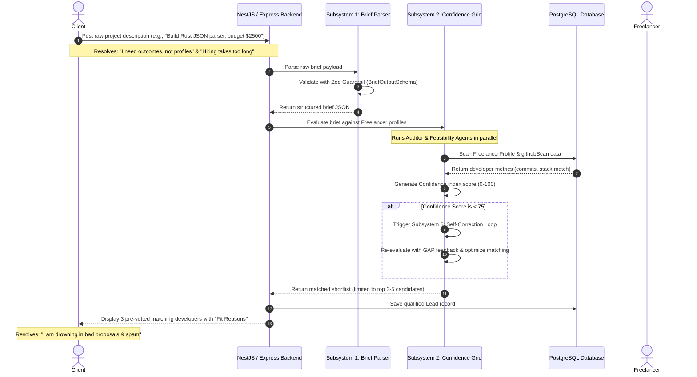
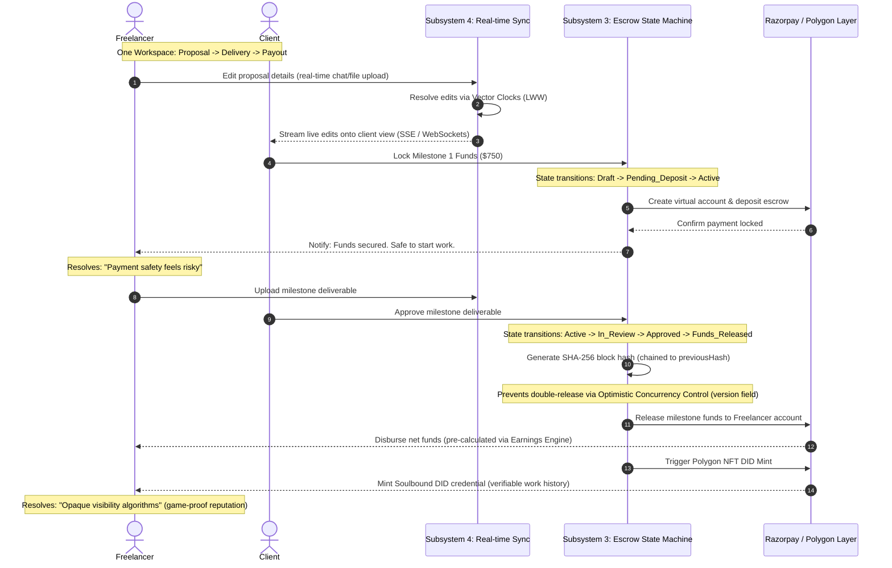

# FixFlow AI - Market Positioning, Pain Points & Value Propositions

This document details the core positioning strategy for **FixFlow AI**, mapping the key pain points of both freelancers and clients on traditional web2 freelance marketplaces to the unique value propositions (UVPs) and technical subsystems of FixFlow AI. 

Its goal is to provide a single, unified reference for both developers and LLMs to understand *why* features exist, *what* user needs they fulfill, and *how* they link back to the system design, API contracts, and database models.

---

## 🎯 1. Core Platform Positioning

Traditional platforms (such as Upwork, Fiverr, Freelancer.com, and PeoplePerHour) act as simple, high-friction bulletin boards characterized by open bidding chaos, opaque algorithms, high fee overheads, and fragmented communication channels. 

**FixFlow AI** is positioned as a **Trust-First, Risk-Free, Outcome-Based Workspace** that manages the entire lifecycle of a project—from brief to payout—with built-in guarantees for both parties.

> [!IMPORTANT]
> **Core Value Mantra**:
> *"We do not just connect clients to freelancers. We remove hiring uncertainty, reduce proposal noise, and manage the whole delivery flow."*

---

## 🛠️ 2. The Freelancer Paradigm

Traditional platforms exploit freelancers with extractive fees, algorithm shifts, and fake listings. FixFlow AI shifts the balance by offering structural transparency, quality matching, and automated protections.

### A. Freelancer Pain Points vs. FixFlow AI Solutions

| # | Freelancer Pain Point | FixFlow AI Unique Value Proposition (UVP) | Technical Implementation / Solution Idea |
| :--- | :--- | :--- | :--- |
| **1** | **Too much competition, too little opportunity** Scarcity of real jobs, spam/bot bids, and wasted proposal credits. | **Verified-work marketplace, not open bidding chaos** Clients only see pre-qualified, credible talent. Genuine freelancers don't fight bots. | Verification engine, skills proof, and work-history checks. Leads are qualified automatically in the background. |
| **2** | **Fees eat earnings** Contracts are hit with up to 15-20% service fees, platform charges, and withdrawal penalties. | **Transparent earnings engine** Show exact net earnings after all platform fees, processing, and taxes *before* bid acceptance. | Financial breakdown card on proposal generation, factoring in platform fee rules, Razorpay cuts, and tax defaults. |
| **3** | **Opaque visibility algorithms** Sudden drops in profile ranking and gig visibility without explanation or recourse. | **Reputation that is harder to game** Replace basic star ratings with multi-dimensional, verifiable performance indicators. | Trust metrics including: on-time rate, revision efficiency, repeat client rate, brief clarity, and dispute-free delivery. |
| **4** | **Payment safety risks** Disputes, delayed client approvals, and the fear of working without guaranteed payout. | **"Protected payment by default"** Built-in escrow, milestone funding requirements, and auto-release timelines. | Secure Finite State Machine (FSM) escrow contracts enforcing locked funds before any work commences. |
| **5** | **Low-quality/unreliable clients** Clients who vanish mid-project, expand scope without pay, or bargain excessively. | **Client-quality scoring for freelancers** Allow freelancers to rate clients on scope stability, payment behavior, and communication. | Client review badges and "Risk Labels" displayed on incoming leads during the matching phase. |
| **6** | **Constant hustle vs. predictable income** One bad review or algorithm tweak ruins income streams, causing unpaid overwork. | **Workspace-driven client retention** A unified workspace that naturally encourages repeat engagements and long-term contracts. | Persistent workspaces containing history, vector-based context, and automated contract extensions. |

---

## 💼 3. The Client Paradigm

Clients suffer from information asymmetry: they do not know who to trust, they are overwhelmed by junk bids, and project delivery is messy and scattered. FixFlow AI filters the noise to deliver fast, verified outcomes.

### A. Client Pain Points vs. FixFlow AI Solutions

| # | Client Pain Point | FixFlow AI Unique Value Proposition (UVP) | Technical Implementation / Solution Idea |
| :--- | :--- | :--- | :--- |
| **1** | **"I do not know whom to trust"** Fear of hiring incompetent or scam talent, especially for core/technical work. | **Trust-first hiring** Every candidate is pre-qualified. Portfolios and skills are verified programmatically. | GitHub codebase scans, identity verification, wallet binds, and Soulbound NFT DID credentials. |
| **2** | **"I am drowning in bad proposals"** Drowning in copy-pasted, AI-generated spam and weak quality signals on open bids. | **Zero-noise shortlist** Never show 200 proposals. AI matching filters and returns the top 3–5 candidate options. | Multi-Agent Orchestration assessing skills, budget compatibility, and developer domain history to build shortlists. |
| **3** | **"Hiring takes too long"** Weeks spent posting, interviewing, collecting bids, and vetting profiles. | **Fast hire for urgent work** Get an instant matches shortlist in under 60 seconds with auto-generated interview questions. | Semantic brief parsing and profile scanning matching engines triggering instantly upon brief submission. |
| **4** | **"Communication is messy and scattered"** Juggling Slack, email, files, GitHub, and payment invoices. | **One workspace from brief to delivery** Unified project page mapping chats, files, deliverables, milestones, and approvals. | Real-time WebSocket sync servers, SSE streams, vector clocks, and client-facing shared portals. |
| **5** | **"Pricing is unclear/feels unfair"** Hidden markups, platform fees added at checkout, and wasted bidding credits. | **Transparent pricing & no wasted spend** Upfront milestone fee structures, clear platform percentages, and zero hidden costs. | Split-routing invoices and pre-calculated transaction parameters shown in portals. |
| **6** | **"I need outcomes, not profiles"** Resumes don't prove they can build *this* specific project. | **Outcome-based matching** Translate raw client project briefs directly into structured milestones and deliverables. | AI brief parsing and decomposition into concrete scopes, matching them to specialized capabilities. |

---

## 🔗 4. Connecting the Dots: Architectural Mapping

The value propositions listed above are not just marketing copy—they are directly wired into the database models, backend API controllers, and core design modules of the application.

```mermaid
graph TD
    classDef uvp fill:#e0f2fe,stroke:#0284c7,stroke-width:2px,color:#0369a1;
    classDef model fill:#f0fdf4,stroke:#16a34a,stroke-width:2px,color:#14532d;
    classDef subsystem fill:#faf5ff,stroke:#9333ea,stroke-width:2px,color:#581c87;
    classDef api fill:#fff7ed,stroke:#ea580c,stroke-width:2px,color:#7c2d12;

    %% Unique Value Propositions
    UVP1["Trust-First Hiring / Verified Marketplace"]:::uvp
    UVP2["Zero-Noise Match Shortlist"]:::uvp
    UVP3["Protected Payment Escrow"]:::uvp
    UVP4["Transparent Earnings Engine"]:::uvp
    UVP5["Unified Workspace Sync"]:::uvp
    UVP6["Client Quality Rating"]:::uvp

    %% Data Models
    M_Freelancer["FreelancerProfile Model"]:::model
    M_Lead["Lead Model (Match details, score)"]:::model
    M_Escrow["Escrow & Invoice Models"]:::model
    M_Proposal["Proposal Model"]:::model

    %% Subsystems
    S_Brief["1. Semantic Brief Parser"]:::subsystem
    S_Grid["2. Confidence Grid (Audits)"]:::subsystem
    S_Escrow["3. Escrow State Machine"]:::subsystem
    S_Sync["4. Real-time Vector Sync"]:::subsystem
    S_Correction["5. Self-Correction Loop"]:::subsystem

    %% API Endpoints
    A_Scan["POST /api/freelancer/github-scan"]:::api
    A_Leads["GET /api/leads"]:::api
    A_Proposals["POST /api/proposals"]:::api
    A_Escrows["POST /api/escrows"]:::api

    %% Mappings
    UVP1 --> M_Freelancer
    UVP1 --> A_Scan
    
    UVP2 --> S_Brief
    UVP2 --> S_Grid
    UVP2 --> M_Lead
    UVP2 --> A_Leads

    UVP3 --> S_Escrow
    UVP3 --> M_Escrow
    UVP3 --> A_Escrows

    UVP4 --> M_Escrow
    UVP4 --> S_Brief

    UVP5 --> S_Sync
    UVP5 --> M_Proposal

    UVP6 --> M_Lead
    UVP6 --> S_Grid
    
    S_Grid --> S_Correction
```

### Technical Mapping Matrix

| Unique Value Proposition (UVP) | Target Pain Point | Database Entities Involved | Core Engineering Subsystem / Code Mappings | Primary API Endpoints |
| :--- | :--- | :--- | :--- | :--- |
| **Trust-First Hiring** | Client: "Who do I trust?" Freelancer: "Spam & Bot bids" | `FreelancerProfile` `Credential` | **Soulbound DID Minting** on Polygon GitHub Scanner service | `GET /api/freelancer/profile` `POST /api/freelancer/github-scan` |
| **Zero-Noise Match Shortlist** | Client: "Drowning in proposals" Freelancer: "Job scarcity & competition" | `Lead` (retains `score` and `matchDetails` JSON) | **Subsystem 2: Confidence Grid** (Feasibility & Audit Agents calculating score) | `GET /api/leads` (returns pre-qualified shortlists) |
| **Outcome-Based Matching** | Client: "Outcomes, not profiles" Freelancer: "Unreliable brief/scope changes" | `Proposal` (retains versioning and structured content) | **Subsystem 1: Semantic Brief Parser** (converts raw text into Zod schemas) | `POST /api/proposals` (accepts raw text, returns structured proposal) |
| **Protected Payment Escrow** | Freelancer: "Payment safety risk" Client: "Scam/loss fear" | `Escrow` `Invoice` | **Subsystem 3: Escrow State Machine** (FSM transitions + cryptographic verification chains) | `POST /api/escrows` `POST /api/escrows/:escrowId/milestones/:milestoneId/approve` |
| **Transparent Earnings Engine** | Freelancer: "Fees eat earnings" Client: "Hidden commission fees" | `Escrow` (`totalAmount`, `milestones` JSON) | **Subsystem 1 & 3 integration**: fee extraction calculators pre-populating client/freelancer quotes | `POST /api/escrows` (returns split payments including platform commission) |
| **Unified Workspace Sync** | Client: "Messy, scattered comms" Freelancer: "Fragmented tools" | `Proposal` `ProposalComment` `Workspace` | **Subsystem 4: Real-time Sync Server** (WebSocket multiplexing, causal Vector Clocks, LWW) | `GET /api/proposals/:proposalId/stream` (SSE) WebSocket connection frames |
| **Client Quality Rating** | Freelancer: "Unreliable/toxic clients" | `Lead` (`company` JSON contains client score) | **Consensus Auditing**: Freelancer ratings of client metrics fed back into semantic matching | `PATCH /api/leads/:leadId` (updating Kanban status and rating clients) |

---

## 🔄 5. Key Operational Workflows

Below are the end-to-end visual workflows mapping how the FixFlow AI architecture delivers on its value propositions in practice.

### A. The Client Outcome & Matching Sequence (Zero-Noise matching)
This sequence illustrates how a client's unstructured brief is parsed, verified, matched, and presented as a high-quality shortlist of 3 candidates, bypassing traditional bid-bidding chaos.

---

### B. The Unified Delivery & Protected Escrow Cycle
This workflow tracks how the workspace brings proposal collaboration, milestones, payments, and reputation DIDs into a single workspace, addressing the payment safety and communication friction.

---

## 🚀 6. Developer Guidelines for Future Feature Implementation

When implementing code changes or introducing new features to the **FixFlow AI** project, engineers and LLM agents must respect the following integration constraints:

### 1. Maintain Schema Rigidity
Never bypass the **Zod schema validations** in `briefParser.ts`. If you add new data fields (e.g., client quality ratings or transparent tax rates), first append them to the Zod schemas and DB Prisma model schemas. This ensures Gemini API payloads remain structured and fully typed.

### 2. Safeguard the Escrow FSM
Any changes to payment releases, invoices, or milestone completions must route strictly through the state transitions defined in `escrowStateMachine.ts`. Never perform direct updates to the `Escrow` or `Invoice` table status fields without writing a cryptographic audit log and checking the `version` field.

### 3. Respect the Vector Clock Logic
When implementing client dashboard additions, ensure all state updates sent over WebSockets carry vector clock logs to prevent sync conflicts between the client and freelancer portal pages. Refer to the conflict resolution rules in `optimisticSync.ts`.

### 4. Feed the Reputation DID
When creating new freelancer metrics (such as revision rates or response latency), ensure they are archived inside the `githubScan` or `profiles` JSON fields in the `FreelancerProfile` table. This allows the Multi-Agent matching engine to query them and dynamically generate the Confidence Index.
