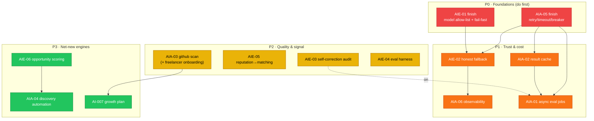
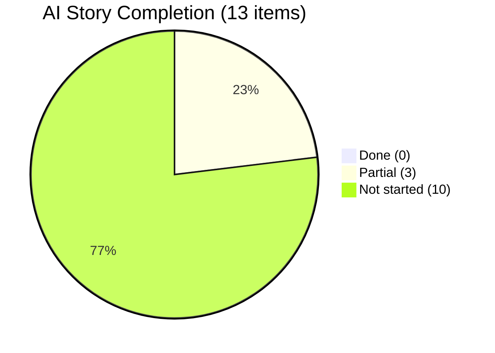

# FixFlowAI — AI Features Implementation Status & Priority Board

> **⚠️ Superseded for AI-service status (2026-07-19).** The tables below (from the 2026-07-05 pass) are **stale**: re-verification against `ai-service/app/` shows `AIE-01/02/03/06/07/08`, `AIA-02/03/06/07`, `AI-007`, `BUG-02/05` are all **done** in code. The current, code-verified AI-service board is [`docs/stories/ai-service/README.md`](../../stories/ai-service/README.md), which also tracks the two new improvement stories **AIE-09** (confidence-grid hybrid scoring) and **AIE-10** (brief-parser ungrounded numbers).
>
> **What this is:** the single, current source of truth for **what is built, what is partial, and what is not started** across the AI layer — verified against the actual `ai-service/` and `backend/` code (not just the specs). It re-prioritizes every **incomplete** story and shows the recommended build order.
> **Last verified:** 2026-07-05 (against `ai-service/app/` + `backend/src/`).
> **How to use:** pick the next unblocked item from §3, open its story file for the step-by-step, and check it off in §2 when the "Done When" boxes pass.

---

## 1. Feature-Level Status (AI-001 … AI-007)

| ID | Feature | Core logic | Route | UI | Verdict |
|:---|:---|:---:|:---:|:---:|:---|
| AI-001 | Semantic Brief Parsing | ✅ `brief_parser.py` | ✅ `/api/proposals/parse` | ✅ | **Built** — hardening left (AIE-01/02) |
| AI-002 | Confidence Grid + Self-Correction | ✅ `confidence_grid.py` | ✅ `/api/proposals/evaluate` | ✅ | **Built** — audit/async left (AIE-03/AIA-01) |
| AI-003 | Interview & Vetting Generation | ✅ `interview.py` | ✅ `/api/interview-questions` | ✅ | **Built** — real inputs missing (AIA-03) |
| AI-004 | Contract Extensions | ✅ `extensions.py` | ✅ `/api/contract-extensions` | ✅ | **Built** |
| AI-005 | Opportunity Intelligence & Scoring | ❌ none | ❌ none | ❌ | **Not built** (AIE-06 + AIA-04) |
| AI-006 | Freelancer-Client Matching | ✅ `matchingEngine.ts` | ✅ `/api/leads/match` | ✅ | **Built** — stale reputation signal (AIE-05) |
| AI-007 | Freelancer Growth Plan *(new, from roles)* | ❌ none | ❌ none | ❌ | **Not built** — see [ai_007](./ai_007_freelancer_growth_plan.md) |

> **AI-007 is new.** It was introduced by the role-based platform specs (`../roles/02_freelancer_confidence_growth_plan.md`) and needs a Gemini feature (`/ai/growth/plan`) plus a deterministic confidence score. It is tracked here alongside the original six.

---

## 2. Story Status (verified against code)

Legend: 🟢 Done · 🟡 Partial · 🔴 Not started

### AI Engineer

| ID | Story | Priority | Status | What's actually left |
|:---|:---|:---:|:---:|:---|
| AIE-01 | Prompt brand + model config | 🔴 Critical | 🟡 ~70% | Model allow-list in `config.py`; `modelValid` on `/health`; fail-fast on invalid id |
| AIE-02 | Brief-parser honest fallback | 🔴 Critical | 🔴 0% | `{proposal, source, degradedReason}` on `/ai/brief/parse`; 503 on hard-config fail; `degraded` persisted; `ai.fallback` metric |
| AIE-03 | Confidence-grid audit/regression | 🟡 High | 🟡 ~30% | `CONFIDENCE_MIN_IMPROVEMENT`; optimizer-failure returns `optimized:false`; regression guard; per-cycle audit trail |
| AIE-04 | Eval harness | 🟡 High | 🔴 0% | `ai-service/eval/` golden set + runner + regression gate |
| AIE-05 | Reputation into matching | 🟡 High | 🔴 0% | Enrich roster via `reputationCalculator.js` before `generateShortlist`; TTL cache; no-history baseline |
| AIE-06 | Opportunity scoring design | 🟡 High | 🔴 0% | `Opportunity` schema + `extract_opportunity()` + deterministic scorer + dedupe key |

### AI Automation Engineer

| ID | Story | Priority | Status | What's actually left |
|:---|:---|:---:|:---:|:---|
| AIA-05 | Gemini call resilience | 🔴 Critical | 🟡 ~20% | Error classification; retry+backoff+jitter; per-call timeout; circuit breaker; `ai.call` telemetry — inside existing `generate_structured()` |
| AIA-01 | Async eval jobs | 🔴 Critical | 🔴 0% | TS `jobsRepository` + worker; `/api/proposals/evaluate` → `202 {jobId}`; `GET /api/jobs/:id`; idempotency |
| AIA-02 | Gemini result cache | 🟡 High | 🔴 0% | `app/cache.py` (`AiCache` protocol + TTL impl); wire into wrapper; never cache fallback |
| AIA-03 | GitHub scan pipeline | 🟡 High | 🔴 0% | `app/automation/github_scan.py`; deterministic `missing_skills`; background job; feeds AI-003 **and** freelancer onboarding (roles doc 01) |
| AIA-04 | Discovery automation | 🟡 High | 🔴 0% | Source-policy gate + connectors + normalize/dedupe + scheduler + `/api/opportunities` |
| AIA-06 | AI observability | 🟡 High | 🔴 0% | `app/telemetry.py` events; structured logs; metrics; alarms; `requestId` correlation |

---

## 3. Re-Prioritized Build Order (remaining work only)

Foundations first — later items depend on earlier ones. Priority reflects **blocking power × business value**, not the original static label.

### The ordered list

| # | Story | Priority | Why now |
|:--:|:---|:---:|:---|
| 1 | **AIE-01** finish | 🔴 P0 | Tiny; correctness baseline; a bad model id should fail at boot |
| 2 | **AIA-05** finish | 🔴 P0 | Every later AI call rides on it; unblocks AIE-02/AIA-01/AIA-02/AIA-04 |
| 3 | **AIE-02** | 🔴 P1 | Stops fabricated proposals looking real; needs AIA-05's classification |
| 4 | **AIA-06** | 🟡 P1 | Without it, fallback rate is invisible; pairs with AIE-02 metric |
| 5 | **AIA-02** | 🟡 P1 | Direct cost/latency win on the most expensive calls |
| 6 | **AIA-01** | 🔴 P1 | Required for serverless (AI-002 exceeds 29s); needs AIA-05 |
| 7 | **AIE-03** | 🟡 P2 | Audit/regression guard on top of async eval |
| 8 | **AIE-05** | 🟡 P2 | Pure TS; independent; makes matching trustworthy |
| 9 | **AIA-03** | 🟡 P2 | Powers AI-003 **and** the new freelancer GitHub onboarding (roles doc 01) |
| 10 | **AIE-04** | 🟡 P2 | Ongoing quality gate once features stabilize |
| 11 | **AIE-06** | 🟡 P3 | Designs the AI-005 contract |
| 12 | **AIA-04** | 🟡 P3 | Builds AI-005 plumbing against AIE-06 |
| 13 | **AI-007** | 🟡 P3 | New growth-plan engine; reuses AIA-03 scan output |

---

## 4. Reconciliation with the Role-Based Platform (roles/)

The `roles/` specs added features that intersect the AI backlog. Mapping so nothing is built twice:

| Roles feature | AI backlog item | Action |
|:---|:---|:---|
| Freelancer deep GitHub scan (roles doc 01) | **AIA-03** | AIA-03 **is** the scan engine. Extend its output to the segmented shape (`skills`/`projects`/`experience`) the onboarding UI streams. |
| Progressive segment streaming (roles doc 01) | *new automation concern* | Add SSE segment events on top of AIA-03's job; tracked as AIA-03 follow-up (see story update). |
| Freelancer confidence score + growth plan (roles doc 02) | **AI-007** (new) | New feature spec [ai_007](./ai_007_freelancer_growth_plan.md); Gemini `/ai/growth/plan` + deterministic confidence. |
| Verified skills → matching (roles doc 01) | **AIE-05** + AI-006 | Scan-derived skills replace seed skills; reputation wiring (AIE-05) stays as-is. |
| Developer project planning (roles doc 03) | reuses **AI-001** | No new AI work — brief parser generates the plan. |

---

## 5. Progress Snapshot

- **Shipped features:** AI-001, 002, 003, 004, 006 (core generation + UI).
- **Partial stories:** AIE-01, AIE-03, AIA-05 (foundations near-done).
- **Biggest remaining efforts:** AI-005 (AIE-06 + AIA-04) and AI-007 (net-new engines).

---

## 6. Cross-References

| Document | Relevance |
|:---|:---|
| [AI Features Index](./README.md) | Feature registry + dependency map |
| [Implementation Playbook](./ai_features_implementation_playbook.md) | Step-by-step per-feature build |
| [Story Backlog](./stories/README.md) | The 12 engineering stories |
| [AI-007 Growth Plan](./ai_007_freelancer_growth_plan.md) | New feature spec |
| [Roles specs](../roles/README.md) | Where new AI needs originate |
