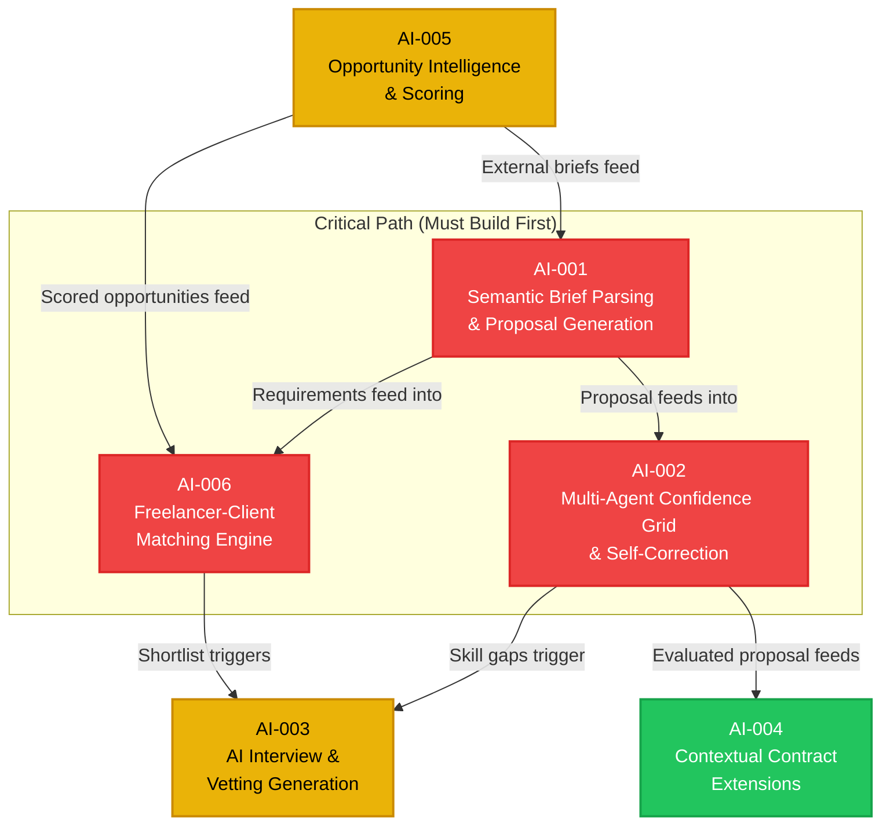

# FixFlowAI — AI Features Index & Dependency Map

> Master reference for all AI-powered features in FixFlowAI. Each feature has its own dedicated implementation guide linked below.

---

## Feature Registry

| ID | Feature Name | Priority | Backend Status | Frontend Status | Doc |
|:---|:---|:---:|:---:|:---:|:---|
| `AI-001` | Semantic Brief Parsing & Proposal Generation | 🔴 Critical | ✅ Built | ❌ Mock only | [ai_001_semantic_brief_parsing.md](./ai_001_semantic_brief_parsing.md) |
| `AI-002` | Multi-Agent Confidence Grid & Self-Correction | 🔴 Critical | ✅ Built | ❌ Mock only | [ai_002_confidence_grid_self_correction.md](./ai_002_confidence_grid_self_correction.md) |
| `AI-003` | AI Interview & Technical Vetting Generation | 🟡 High | ✅ Built | ❌ No UI | [ai_003_interview_vetting_generation.md](./ai_003_interview_vetting_generation.md) |
| `AI-004` | Contextual Contract Extensions & Retention | 🟢 Medium-High | ✅ Built | ❌ No widget | [ai_004_contextual_contract_extensions.md](./ai_004_contextual_contract_extensions.md) |
| `AI-005` | Opportunity Intelligence & Smart Scoring | 🟡 High | ❌ Not built | ❌ No board | [ai_005_opportunity_intelligence_scoring.md](./ai_005_opportunity_intelligence_scoring.md) |
| `AI-006` | Freelancer-Client Matching & Lead Scoring | 🔴 Critical | ⚠️ Partial | ❌ No UI | [ai_006_smart_matching_lead_scoring.md](./ai_006_smart_matching_lead_scoring.md) |

---

## Dependency Graph

The AI features form a directed pipeline — each feature feeds into the next:

---

## Implementation Order (Recommended)

### Wave 1 — The Core Intelligence Loop (Weeks 1–3)
1. **AI-001**: Semantic Brief Parsing → because everything starts with a structured brief
2. **AI-002**: Confidence Grid → validates the output of AI-001

### Wave 2 — Matching & Vetting (Weeks 4–5)
3. **AI-006**: Matching Engine → uses AI-001 output to score freelancers
4. **AI-003**: Interview Generation → triggered by skill gaps from AI-006

### Wave 3 — Discovery & Retention (Weeks 6–8)
5. **AI-005**: Opportunity Intelligence → external lead discovery pipeline
6. **AI-004**: Contract Extensions → retention after project completion

---

## Shared AI Infrastructure

All six features share these common resources:

| Resource | Used By | Notes |
|:---|:---|:---|
| Google Gemini API (`gemini-2.5-pro`) | AI-001, AI-002, AI-003, AI-004, AI-005 | Single API key, shared rate limits |
| Zod Schema Validation | AI-001, AI-002, AI-005 | Type-safe output enforcement |
| `sanitizeAndPatchBrief()` fallback | AI-001 | Graceful degradation on schema failures |
| BullMQ job queues | AI-005 | Background processing for discovery |
| PostgreSQL (Prisma) | All | Persistence for proposals, evaluations, matches |

---

## Gemini API Cost Projections

| Feature | Calls Per Operation | Operations/Day (est.) | Daily Cost |
|:---|:---:|:---:|:---|
| AI-001: Brief Parsing | 1 | 10 | ~$0.30 |
| AI-002: Confidence Grid | 2-3 | 10 | ~$0.90 |
| AI-003: Interview Gen | 1 | 5 | ~$0.15 |
| AI-004: Extensions | 1 | 3 | ~$0.09 |
| AI-005: Post Extraction | 1 per post | 50 | ~$1.50 |
| AI-006: Fit Reasons | 1 per shortlist | 10 | ~$0.30 |
| **Total** | | | **~$3.24/day ≈ $97/month** |

---

## Cross-References

| Document | Location |
|:---|:---|
| Backend Connectivity Roadmap | [architecture/backend_connectivity_roadmap.md](../architecture/backend_connectivity_roadmap.md) |
| Market Positioning & UVPs | [product_strategy/market_positioning_and_uvps.md](../product_strategy/market_positioning_and_uvps.md) |
| Core Skills Manual | [core_subsystems/skills.md](../core_subsystems/skills.md) |
| Frontend Gaps & Requirements | [frontend/frontend_gaps_and_requirements.md](../frontend/frontend_gaps_and_requirements.md) |
| Extra Implementation Roadmap | [core_subsystems/extra_implementation_roadmap.md](../core_subsystems/extra_implementation_roadmap.md) |
