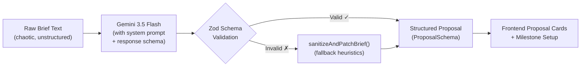
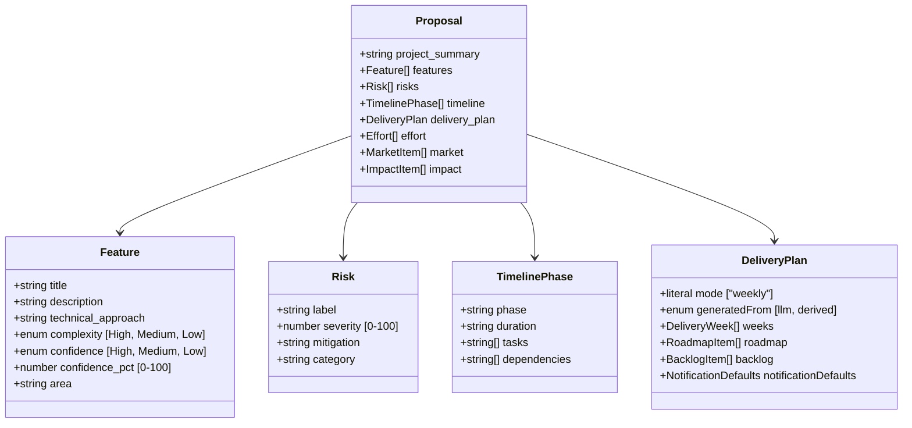

# FixFlowAI — Semantic Brief Parsing & AI Proposal Generation

> **Feature**: Convert chaotic, unstructured client briefs into deterministic, structured JSON proposals using Google Gemini with Zod schema enforcement and self-healing fallbacks.

---

## Feature Identity

| Field | Value |
|:---|:---|
| **Feature ID** | `AI-001` |
| **Priority** | 🔴 Critical (Core pipeline — nothing works without this) |
| **Backend Skill** | [brief_parser.py](../../ai-service/app/features/brief_parser.py) |
| **Gemini Model** | `gemini-3.5-flash` (default) · fallback `gemini-3.1-flash-lite` — via Python AI Service proxy |
| **Status** | ✅ Built (Python AI service) · ✅ TS route `/api/proposals/parse` wired · ✅ Frontend `BriefIntelligence.jsx` UI integrated |

---

## 1. What This Feature Does

A freelancer or the platform itself receives a raw client brief — which could be anything from a polished RFP document to a casual Slack message like *"Need someone to build me a Stripe to Razorpay migration, keep it seamless, budget around $25K."*

This AI feature takes that messy text and produces a **fully structured project proposal** containing:

- **Project Summary** — 2-4 sentence strategic overview
- **Feature Cards** — Each with title, description, technical approach, complexity rating, confidence score, and functional area
- **Risk Analysis** — Labeled risks with severity scores, mitigation strategies, and categories
- **Timeline Phases** — Named phases with durations, task lists, and dependency chains
- **Weekly Delivery Plan** — Mapped to phases, with goals, tasks (owner, status, notify flags), deliverables, and dependencies
- **Effort Breakdown** — Category-level percentage allocations with timeframes
- **Market Analysis** — Trend indicators and relevance scores for strategic context
- **Impact Assessment** — Business impact items with scores and categories



---

## 2. How the AI Works (Technical Deep-Dive)

### 2.1 The Prompt Architecture

The system prompt positions Gemini as a **"lead architect and enterprise consultant"** with strict rules:

1. **Extract** implicit/explicit specifications, SLAs, timeline constraints, budget figures, and dependencies
2. **Formulate** realistic confidence indices and identify development complexity
3. **Keep** feature counts realistic — draft actionable, complete deliverables
4. **Output** strict JSON conforming to the schema — no markdown, no extra prose

**Temperature**: `0.2` (low creativity, high determinism — we want structured output, not creative writing)

**Response Mime Type**: `application/json` — forces Gemini into JSON-only mode

**Response Schema**: The full `ProposalSchema` is passed as a native Gemini JSON schema constraint, so the model's output is structurally constrained at the API level before Zod even validates it.

### 2.2 The Double-Validation Pattern

This is the key architectural innovation — **two layers of schema enforcement**:

```
Layer 1: Gemini Native Schema
├── responseSchema passed to Gemini API config
├── Forces model to output valid JSON with correct types
└── Prevents structural hallucinations (missing fields, wrong types)

Layer 2: Zod Runtime Validation
├── ProposalSchema.parse(rawObject) after JSON.parse
├── Catches edge cases Gemini's schema enforcement misses
├── Provides typed TypeScript objects downstream
└── On failure → triggers sanitizeAndPatchBrief() fallback
```

### 2.3 The Self-Healing Fallback Engine

If Zod validation fails (schema drift, model errors, malformed JSON), the `sanitizeAndPatchBrief()` function activates:

- **For strings**: Falls back to descriptive defaults (e.g., `"Core Module Deployment"`)
- **For numbers**: Clamps to valid ranges (e.g., `confidence_pct` clamped to 0-100, defaults to 75)
- **For enums**: Falls back to safe middle values (e.g., `complexity` → `"Medium"`)
- **For arrays**: Ensures at least one item exists (injects a safe default card)
- **For nested objects**: Recursively patches each level independently

**The guarantee**: `parseBrief()` **never crashes**. It always returns a valid `Proposal` object — either from Gemini directly or from the fallback engine. The frontend can always render something.

---

## 3. The Output Schema (ProposalSchema)



---

## 4. Implementation Steps

### Step 4.1 — Create the API Route

**File**: `backend/src/routes/proposals.ts`

**Endpoint**: `POST /api/proposals`

**Process**:
1. Authenticate the request via JWT middleware
2. Validate request body: `{ workspaceId: string, brief: string, strategy?: string }`
3. Create a Proposal record in PostgreSQL with status `GENERATING`
4. Call `parseBrief(brief, process.env.GEMINI_API_KEY)` from `briefParser.ts`
5. On success: update Proposal status to `READY`, store the structured JSON
6. On fallback: still save the patched proposal, but flag `generatedFrom: "derived"` in the delivery plan
7. Return the full `Proposal` object to the frontend

### Step 4.2 — Add SSE Streaming (Optional Enhancement)

**Endpoint**: `GET /api/proposals/:proposalId/stream`

For a premium UX, stream the proposal generation in chunks using Server-Sent Events:

```
Event: proposal_chunk → { "section": "features", "progress": 40 }
Event: proposal_chunk → { "section": "risks", "progress": 60 }
Event: proposal_chunk → { "section": "timeline", "progress": 80 }
Event: proposal_done → { "proposalId": "prp_5e3d...", "status": "READY" }
```

The frontend `ProposalGenerator.jsx` would replace its current `setInterval` mock with an `EventSource` listener.

### Step 4.3 — Frontend Integration

**Changes to `ProposalGenerator.jsx`**:
- Replace the hardcoded `sections` array and `setInterval` simulation with a real API call
- Use `EventSource` for streaming or a simple `fetch` + loading state for non-streaming
- On `proposal_done`, populate the Zustand store with the actual Gemini-generated proposal data
- Render feature cards, risk cards, timeline phases, and the delivery plan from real data

**Changes to `BriefIntelligence.jsx`**:
- The "Parse Brief" button should submit the text to `POST /api/proposals` instead of using `setTimeout` mock parsing
- The scope stability score should come from the actual Gemini analysis (brief quality indicators), not from `text.length < 100`

---

## 5. Prompt Engineering Guidelines

### What makes a good brief (for the AI):
| Signal | Impact on Output Quality |
|:---|:---|
| Mentions specific technologies (React, Rust, PostgreSQL) | Higher confidence scores, more precise technical_approach |
| Includes budget range ($5K-$10K) | Enables realistic effort breakdown percentages |
| Specifies timeline constraints ("need by August") | Produces tighter, more realistic phase durations |
| Lists deliverables explicitly | Feature cards directly map to requirements |
| Vague/short briefs ("just make it work") | Triggers clarification questions and lower confidence scores |

### Potential Improvements:
- **Chain-of-Thought Prompting**: Add a pre-analysis step where Gemini first identifies the brief's ambiguity level, then generates the proposal with appropriate confidence adjustments
- **RAG Enhancement**: Feed similar past proposals from the database as few-shot examples to Gemini for better output calibration
- **Multi-Round Clarification**: If brief quality is below a threshold, auto-generate clarification questions before proposal generation

---

## 6. Testing & Verification

| Test Case | Expected Behavior |
|:---|:---|
| Well-structured brief with budget + tech stack | Proposal with high confidence scores (85%+), all fields populated |
| Ambiguous one-liner brief | Fallback activates, moderate confidence (50-70%), default safe values |
| Empty brief text | Throws error: "Brief content is empty" — never reaches Gemini |
| Invalid API key | Falls back to `sanitizeAndPatchBrief()` with generic defaults |
| Gemini returns malformed JSON | Zod catches it, fallback patches missing fields |
| Very long brief (10K+ words) | Should still process correctly — Gemini handles long context |

---

## Cross-References

| Document | Relevance |
|:---|:---|
| [skills.md](../core_subsystems/skills.md) | Subsystem 1 specification |
| [backend_connectivity_roadmap.md](../architecture/backend_connectivity_roadmap.md) | Phase 2, Step 2.1 |
| [erd_and_api_contracts.md](../architecture/erd_and_api_contracts.md) | `POST /api/proposals` contract |
| [frontend_implementation_guide.md](../frontend/frontend_implementation_guide.md) | ProposalGenerator integration |
| [AI-002: Confidence Grid](./ai_002_confidence_grid_self_correction.md) | Downstream consumer of this feature's output |
