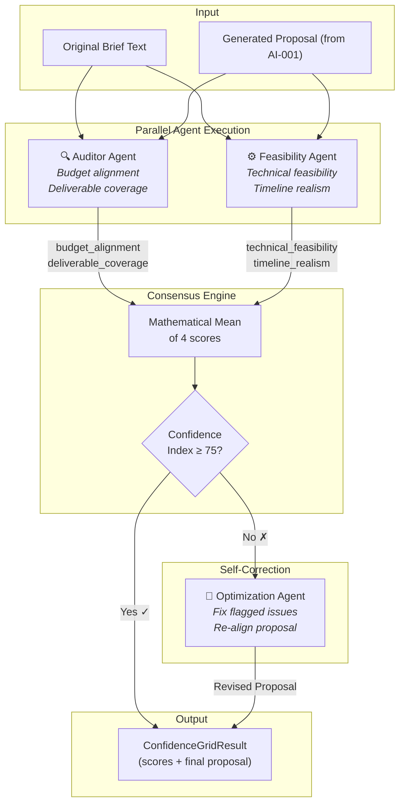
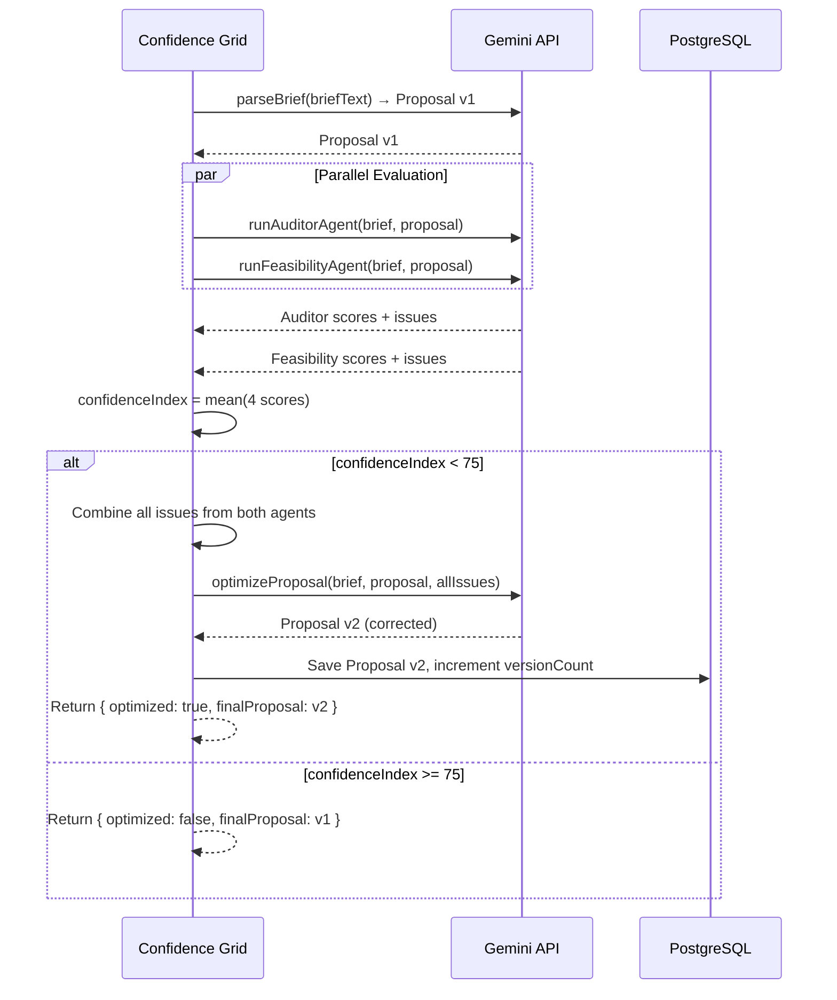

# FixFlowAI — Multi-Agent Confidence Grid & Self-Correction Engine

> **Feature**: Run parallel AI "persona agents" (Auditor + Feasibility) to evaluate proposal quality with mathematical consensus scoring, and autonomously self-correct proposals that fall below the confidence threshold.

---

## Feature Identity

| Field | Value |
|:---|:---|
| **Feature ID** | `AI-002` |
| **Priority** | 🔴 Critical (Quality gate — prevents bad proposals from reaching clients) |
| **Backend Skill** | [confidence_grid.py](../../ai-service/app/features/confidence_grid.py) |
| **Gemini Model** | `gemini-3.5-flash` (both agents; optimizer may use `gemini-3.1-pro` for hard cases) · fallback `gemini-3.1-flash-lite` — via Python service proxy |
| **Depends On** | [AI-001: Semantic Brief Parsing](./ai_001_semantic_brief_parsing.md) |
| **Status** | ✅ Built (Python AI service) · ✅ TS route `/api/proposals/evaluate` wired · ✅ Frontend `EvidenceConfidence.jsx` UI integrated |

---

## 1. What This Feature Does

After a proposal is generated by `AI-001` (the brief parser), it needs to be **validated** before being shown to the client. Raw LLM output is non-deterministic — it can hallucinate timelines, miss deliverables, or produce budget-misaligned features.

The Confidence Grid solves this by running **two independent AI agents in parallel**, each evaluating the proposal from a different perspective:



---

## 2. The Two AI Agents

### 2.1 The Auditor Agent

**Persona**: *"Lead Auditor for FixFlow AI"*

**What it evaluates**:
| Metric | Score Range | What It Checks |
|:---|:---:|:---|
| `budget_alignment_score` | 0-100 | Do the proposed features and costs match any stated or implied budget constraints in the brief? |
| `deliverable_coverage_score` | 0-100 | Are all requested deliverables, features, and milestones in the brief fully accounted for? |

**Additional output**:
- `issues[]` — Specific problems found (e.g., *"Milestone 3 includes blockchain minting but no budget was allocated for gas fees"*)
- `findings` — Detailed narrative explanation of the evaluation

**Prompt temperature**: `0.1` (extremely deterministic — auditing should be consistent)

### 2.2 The Feasibility Agent

**Persona**: *"Lead Technical Feasibility Agent for FixFlow AI"*

**What it evaluates**:
| Metric | Score Range | What It Checks |
|:---|:---:|:---|
| `technical_feasibility_score` | 0-100 | Are the recommended tech stack and approaches realistic and achievable? |
| `timeline_realism_score` | 0-100 | Are phase durations, task dependencies, and weekly plans logically consistent? |

**Additional output**: Same `issues[]` + `findings` structure as the Auditor.

### 2.3 Why Two Agents Instead of One

A single "evaluate this proposal" prompt would conflate budget concerns with technical concerns, making it harder to:
- **Debug** which dimension is causing low scores
- **Self-correct** — the optimizer needs to know *specifically* what failed
- **Display** to users — the frontend shows separate audit vs. feasibility scores

Running them in **parallel** (Promise.all) also cuts evaluation time in half.

---

## 3. The Mathematical Consensus Engine

The **Confidence Index** is the arithmetic mean of the four individual scores:

```
                budget_alignment + deliverable_coverage + technical_feasibility + timeline_realism
Confidence Index = ─────────────────────────────────────────────────────────────────────────────────
                                                           4
```

**Score interpretation**:
| Range | Meaning | Action |
|:---:|:---|:---|
| 90-100 | Exceptional proposal | Ship directly to client |
| 75-89 | Good proposal with minor gaps | Ship with advisory notes |
| 50-74 | Significant issues detected | **Trigger self-correction** |
| 0-49 | Major problems | Self-correct, then flag for human review |

---

## 4. The Self-Correction Loop (Subsystem 5)

When the Confidence Index drops below **75**, the system automatically activates the **Optimization Agent** — a third Gemini call that receives:

1. The original brief text
2. The current proposal draft
3. The combined issues list from both agents

**The optimization prompt instructs Gemini to**:
- Align deliverables with the budget
- Refine technical approaches for better feasibility
- Re-align timeline durations and week schedules
- Correct overlapping or missing task mappings



**Key design choice**: The self-correction runs **once**. If the optimized proposal still scores below 75, it's returned as-is with `optimized: true` — the system doesn't loop indefinitely. This prevents infinite Gemini API calls and ensures bounded execution time.

---

## 5. The Output Interface

```typescript
interface ConfidenceGridResult {
  auditor: {
    budget_alignment_score: number;      // 0-100
    deliverable_coverage_score: number;  // 0-100
    issues: string[];
    findings: string;
  };
  feasibility: {
    technical_feasibility_score: number; // 0-100
    timeline_realism_score: number;      // 0-100
    issues: string[];
    findings: string;
  };
  confidenceIndex: number;   // Mean of 4 scores
  optimized: boolean;        // True if self-correction was triggered
  finalProposal: Proposal;   // The proposal to display (v1 or v2)
}
```

---

## 6. Implementation Steps

### Step 6.1 — Create the Evaluation API Route

**File**: `backend/src/routes/proposals.ts`

**Endpoint**: `POST /api/proposals/:proposalId/evaluate`

**Process**:
1. Authenticate the request via JWT middleware
2. Fetch the Proposal record + original brief text from PostgreSQL
3. Call `runAuditorAgent()` and `runFeasibilityAgent()` via `Promise.all`
4. Compute `confidenceIndex`
5. If below threshold → call `optimizeProposal()` with combined issues
6. Update Proposal record: save `briefScore` JSON, increment `versionCount` if optimized
7. Return the full `ConfidenceGridResult`

### Step 6.2 — Frontend Integration

**Target component**: `EvidenceConfidence.jsx`

**Current state**: Displays hardcoded/mock confidence data

**Changes needed**:
- Call `POST /api/proposals/:id/evaluate` when the user navigates to the confidence tab
- Display the 4 individual scores as radial gauges or progress bars
- Show the combined `confidenceIndex` as the headline metric
- Display the `issues[]` as a collapsible list under each agent section
- If `optimized: true`, show a badge: *"⚡ Self-corrected — proposal was automatically improved"*
- Add a "Re-evaluate" button that re-triggers the endpoint

### Step 6.3 — Cost Optimization

Each evaluation triggers **2-3 Gemini API calls** (Auditor + Feasibility + optional Optimizer). To manage costs:
- Cache evaluation results in the Proposal record — don't re-evaluate unless the proposal is modified
- Add a `lastEvaluatedAt` timestamp to avoid redundant evaluations
- Rate-limit evaluations to max 3 per proposal per hour

---

## 7. Fallback Behavior

Both agents have built-in fallback returns if the Gemini API fails:

```
Auditor fallback:  { budget_alignment: 70, deliverable_coverage: 70, 
                     issues: ["Auditor agent failed, fallback applied"] }

Feasibility fallback: { technical_feasibility: 70, timeline_realism: 70,
                        issues: ["Feasibility agent failed, fallback applied"] }
```

This ensures the system **never blocks** the user workflow — even if Gemini is down, the proposal still gets a neutral score and proceeds.

---

## 8. Testing & Verification

| Test Case | Expected Behavior |
|:---|:---|
| Well-matched proposal + brief | Both agents score 80+ → `optimized: false` |
| Proposal missing key brief deliverables | Auditor `deliverable_coverage` drops → issues list populated |
| Unrealistic 1-week timeline for complex project | Feasibility `timeline_realism` drops → self-correction triggers |
| Both agents fail (API key invalid) | Fallback scores (70 each) → `confidenceIndex = 70` → self-correction triggers |
| Self-correction produces better proposal | `optimized: true`, `versionCount` increments |

---

## Cross-References

| Document | Relevance |
|:---|:---|
| [skills.md](../core_subsystems/skills.md) | Subsystems 2 & 5 specification |
| [AI-001: Brief Parsing](./ai_001_semantic_brief_parsing.md) | Upstream — produces the proposal this feature evaluates |
| [AI-003: Interview Generation](./ai_003_interview_vetting_generation.md) | Can be triggered when skill gaps are detected |
| [backend_connectivity_roadmap.md](../architecture/backend_connectivity_roadmap.md) | Phase 2, Step 2.2 |
