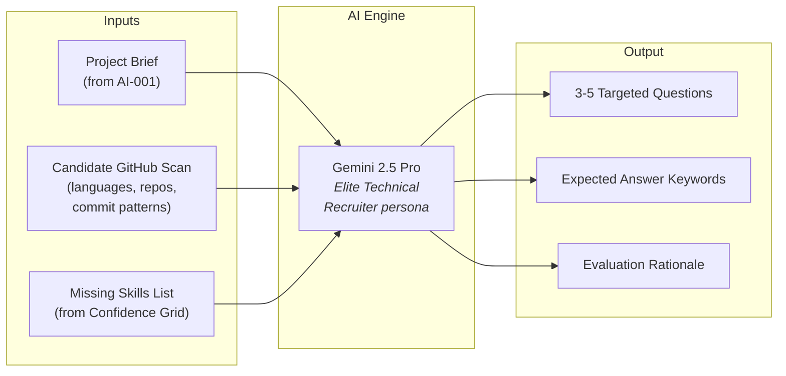
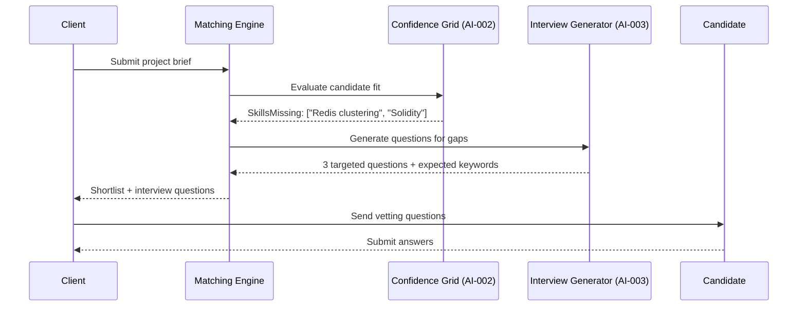
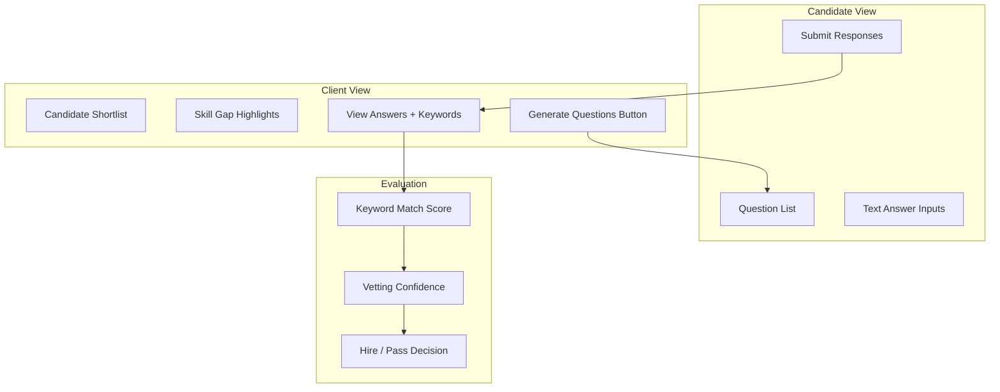

# FixFlowAI — AI-Powered Interview & Technical Vetting Generation

> **Feature**: Auto-generate custom, non-generic technical interview questions based on project requirements, candidate GitHub scan data, and detected skill gaps — powered by Gemini.

---

## Feature Identity

| Field | Value |
|:---|:---|
| **Feature ID** | `AI-003` |
| **Priority** | 🟡 High (Solves "hiring takes too long" — Client Pain Point #3) |
| **Backend Skill** | [interview.py](../../ai-service/app/features/interview.py) |
| **Gemini Model** | `gemini-2.5-pro` (via Python AI Service proxy) |
| **Depends On** | [AI-002: Confidence Grid](./ai_002_confidence_grid_self_correction.md) (for skill gap detection) |
| **Status** | ✅ Built (Python AI service) · ✅ TS route `/api/interview-questions` wired · ✅ Frontend `EvidenceConfidence.jsx` UI integrated |

---

## 1. What This Feature Does

Traditional freelance platforms force clients to manually vet candidates through generic profile reviews — *"Does their portfolio look good? Do they have 5 stars?"*

FixFlowAI replaces this with **AI-generated, project-specific technical questions** that test whether a candidate can actually build what the client needs.



---

## 2. The Intelligence Pipeline

### 2.1 When It Triggers

The interview generation is **not a standalone action** — it's triggered by the matching pipeline:

1. Client submits a brief → **AI-001** generates a structured proposal
2. **AI-002** runs the Confidence Grid → identifies skill gaps between project requirements and candidate profiles
3. If `skillsMissing.length > 0` → the matching engine calls **AI-003** to generate vetting questions for the shortlisted candidates



### 2.2 The Prompt Architecture

**Persona**: *"Elite Technical Recruiter"*

**System Instruction**:
The AI is told it is hiring for a specific project. It receives:
- The full project brief (what needs to be built)
- The candidate's GitHub scan data (what they've actually built before)
- The specific missing skills that need verification

**Critical constraint**: *"Generate 3 targeted, extremely specific, non-generic technical questions that will verify if the candidate can build the missing requirements. Do not ask generic questions."*

This means the AI won't ask *"What is Redis?"* — it will ask *"In the context of this billing migration project, how would you handle Redis cluster key expiration during a hot failover while maintaining Razorpay webhook deduplication?"*

### 2.3 Question Anatomy

Each generated question includes:

```typescript
interface InterviewQuestion {
  question: string;           // The specific technical question
  expectedKeywords: string[]; // Key terms a good answer should mention
  rationale: string;          // Why this question matters for this project
  skillTested: string;        // Which missing skill this verifies
  difficulty: 'intermediate' | 'advanced' | 'expert';
}
```

---

## 3. Input Data Sources

### 3.1 Project Brief

Comes from the structured proposal generated by AI-001. The interview generator uses:
- **Feature descriptions** — to understand what needs to be built
- **Technical approach** — to generate questions about implementation choices
- **Risk items** — to create scenario-based questions about mitigation

### 3.2 GitHub Scan Data

Stored in `FreelancerProfile.githubScan` as a JSON blob. Contains:
- **Languages used** — ranked by percentage across repositories
- **Repository topics** — libraries, frameworks, platforms the candidate works with
- **Commit frequency** — activity indicators
- **README quality** — proxy for documentation capability

The AI uses this to **avoid asking about things the candidate clearly knows** (e.g., if they have 50 React repos, don't ask basic React questions) and **focus on the actual gaps**.

### 3.3 Missing Skills List

Generated by the Confidence Grid when comparing project requirements against the candidate's profile:

```
Project needs: [React, Node.js, Redis, Solidity, PostgreSQL]
Candidate has: [React, Node.js, PostgreSQL]
Missing:       [Redis, Solidity]
```

Only the missing skills generate questions.

---

## 4. Implementation Steps

### Step 4.1 — Create the API Route

**File**: `backend/src/routes/interviews.ts`

**Endpoint**: `POST /api/interviews/generate`

**Request body**:
```json
{
  "briefText": "Migrate Stripe to Razorpay...",
  "candidateGithubScan": { "languages": [...], "repos": [...] },
  "missingSkills": ["Redis clustering", "Polygon smart contracts"]
}
```

**Process**:
1. Authenticate via JWT middleware
2. Validate inputs with Zod (briefText required, missingSkills must be non-empty array)
3. Call `generateInterviewQuestions()` from `interviewGenerator.ts`
4. Return the array of questions with rationales and expected keywords

### Step 4.2 — Create the Frontend Interview Center

**New component**: `InterviewCenter.jsx` (or integrate into existing `Overview.jsx`)

**Two-sided interface**:

#### Client Side:
- Displays the candidate shortlist with their matching scores
- Shows detected skill gaps highlighted in red/amber
- **"Generate Vetting Questions"** button → calls the API
- Renders generated questions with expected keywords (visible to client only)
- Shows candidate's submitted answers alongside expected keywords for comparison

#### Freelancer/Candidate Side:
- Receives the questions (without seeing expected keywords)
- Text input areas for each answer
- Submit button → stores answers in the backend
- Optional: timed responses to add urgency signal

#### Evaluation Panel:
- Side-by-side comparison: question → candidate answer → expected keywords
- Keyword match percentage indicator
- Overall "Vetting Score" calculation
- Flag system for plagiarism detection (future enhancement)



### Step 4.3 — Database Support

Add an `InterviewSession` model to Prisma:

```
InterviewSession:
  id          UUID
  proposalId  → Proposal
  candidateId → FreelancerProfile
  questions   Json[]    (generated questions array)
  answers     Json[]    (submitted answers array)
  score       Float?    (vetting score, computed after evaluation)
  status      Enum [PENDING, SUBMITTED, EVALUATED]
  createdAt   DateTime
  evaluatedAt DateTime?
```

---

## 5. Advanced Enhancements

### 5.1 AI-Evaluated Answers (Future)

Instead of manual keyword matching, feed the candidate's answers back to Gemini for AI evaluation:

```
Prompt: "You are evaluating a candidate's technical interview answers.
For each question, compare the candidate's answer against the expected 
keywords and the project context. Score each answer 0-100 and provide 
specific feedback on gaps."
```

### 5.2 Live Coding Challenges (Future)

For highly technical roles, extend the interview generator to produce:
- Code snippet challenges (e.g., *"Write a Redis key expiration handler..."*)
- System design prompts (e.g., *"Design the webhook deduplication layer..."*)
- Architecture review exercises (given a diagram, identify problems)

### 5.3 Portfolio Verification

Cross-reference the candidate's GitHub repos with their claimed experience:
- Verify they've actually used the technologies listed on their profile
- Check commit history authenticity (time distribution, commit patterns)
- Flag potential portfolio inflation

---

## 6. Testing & Verification

| Test Case | Expected Behavior |
|:---|:---|
| Candidate with 0 missing skills | No questions generated — candidate auto-passes |
| 3 missing skills (Redis, Solidity, Docker) | Exactly 3 targeted questions, one per skill |
| Brief mentions "urgent migration" | Questions include scenario-based urgency handling |
| Candidate has extensive GitHub activity | Questions are advanced/expert level, not basic |
| New candidate with minimal GitHub | Questions are intermediate level |
| Gemini API failure | Graceful error — return empty questions with "Generation failed" flag |

---

## Cross-References

| Document | Relevance |
|:---|:---|
| [extra_implementation_roadmap.md](../core_subsystems/extra_implementation_roadmap.md) | Extra Module 4 specification |
| [AI-002: Confidence Grid](./ai_002_confidence_grid_self_correction.md) | Upstream — provides the `missingSkills` input |
| [frontend_gaps_and_requirements.md](../frontend/frontend_gaps_and_requirements.md) | Requirement 3: Dynamic Vetting UI |
| [market_positioning_and_uvps.md](../product_strategy/market_positioning_and_uvps.md) | Client Pain Point #3: "Hiring takes too long" |
