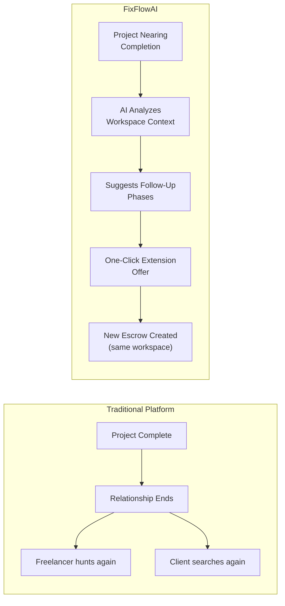
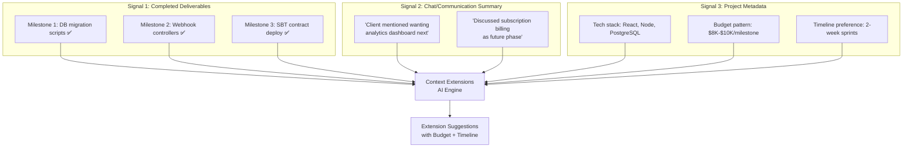
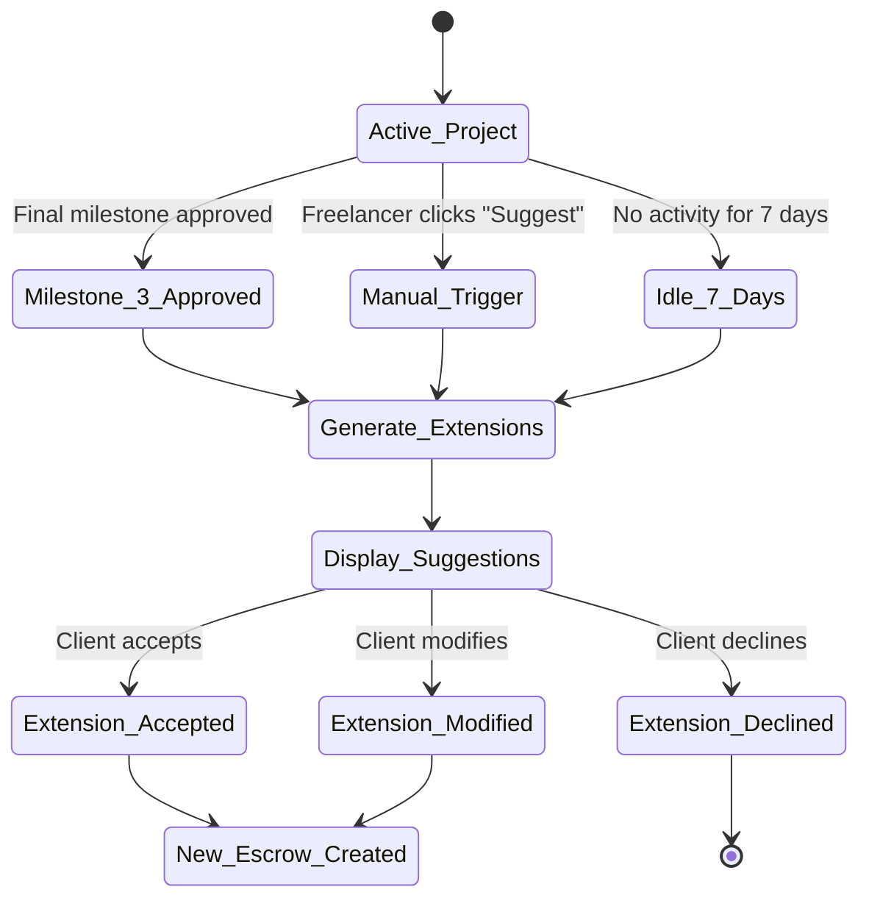
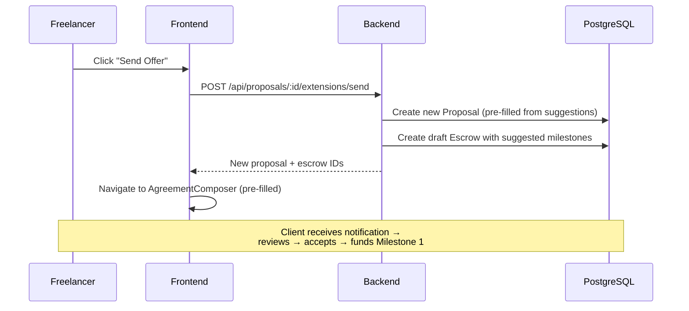

# FixFlowAI — AI Contextual Contract Extensions & Retention Engine

> **Feature**: When a project nears completion, use AI to analyze workspace history (deliverables, chat context, scope patterns) and proactively suggest follow-up phases — turning one-off contracts into recurring revenue relationships.

---

## Feature Identity

| Field | Value |
|:---|:---|
| **Feature ID** | `AI-004` |
| **Priority** | 🟢 Medium-High (Retention multiplier — solves "constant income hustle") |
| **Backend Skill** | [extensions.py](../../ai-service/app/features/extensions.py) |
| **Gemini Model** | `gemini-2.5-pro` (via Python AI Service proxy) |
| **Depends On** | Completed milestones (Escrow FSM) + workspace history |
| **Status** | ✅ Built (Python AI service) · ✅ TS route `/api/contract-extensions` wired · ✅ Frontend `DeliveryControl.jsx` UI integrated |

---

## 1. The Problem It Solves

On traditional platforms, when a project ends, the relationship dies. Freelancers go back to bidding. Clients go back to searching. Both waste time and money starting from scratch.

**FixFlowAI's insight**: If you've delivered a Stripe-to-Razorpay migration, the client probably also needs webhook monitoring, a subscription management dashboard, or payment analytics. The AI should suggest these **before the client even thinks to ask**.



---

## 2. How the AI Works

### 2.1 Input Signals

The extension engine collects three categories of contextual data:



### 2.2 The Prompt Architecture

The function `generateContractExtensions()` sends Gemini:

1. **Completed deliverables list** — what was actually built
2. **Chat summary** — conversational signals about future needs
3. **System instruction** — positions the AI as a "Senior Client Success Manager" who should:
   - Identify logical next phases based on what was delivered
   - Propose 2-3 concrete, scoped milestones with budgets
   - Draft a professional offer message the freelancer can send
   - Include technical reasoning for why each extension makes sense

### 2.3 Output Structure

```typescript
interface ContractExtension {
  reasoning: string;                    // Why these extensions make sense
  suggestedMilestones: {
    title: string;
    description: string;
    estimatedBudget: number;
    estimatedDuration: string;
    technicalJustification: string;
  }[];
  offerMessage: string;                 // Pre-drafted message for the client
  retentionScore: number;               // 0-100 likelihood client will accept
  upsellType: 'enhancement' | 'maintenance' | 'new_phase' | 'optimization';
}
```

---

## 3. Trigger Conditions

The extension engine doesn't run continuously — it activates at specific moments:

| Trigger | When It Fires | Why |
|:---|:---|:---|
| **Last milestone approved** | When the final milestone in an escrow transitions to `Approved` or `Funds_Released` | The project is wrapping up — prime moment for retention |
| **Manual trigger** | Freelancer clicks "Suggest Next Phase" in the delivery dashboard | Freelancer wants to proactively extend |
| **Auto-prompt on idle** | 7 days after last activity in an active workspace with no new milestones | Client engagement is cooling — re-engage with suggestions |



---

## 4. Implementation Steps

### Step 4.1 — Create the API Route

**File**: `backend/src/routes/proposals.ts`

**Endpoint**: `POST /api/proposals/:proposalId/extensions`

**Process**:
1. Authenticate via JWT middleware
2. Fetch the Proposal record + its associated Escrow + completed milestones
3. Fetch any stored chat/communication summaries from the workspace
4. Call `generateContractExtensions(completedDeliverables, chatSummary, apiKey)`
5. Return the extension suggestions

### Step 4.2 — Frontend Widget Integration

**Target component**: [DeliveryControl.jsx](../../frontend/src/sections/dashboard/DeliveryControl.jsx)

**Widget placement**: Bottom of the delivery dashboard, appears when final milestone is nearing completion

**UI Elements**:

1. **Trigger Button**: *"🔮 Suggest Next Phase"* — appears when ≥80% of milestones are complete
2. **Suggestions Modal**:
   - Extension reasoning paragraph
   - 2-3 suggested milestone cards, each showing:
     - Title and description
     - Estimated budget (following the client's existing budget pattern)
     - Estimated duration
     - Technical justification
   - Pre-drafted offer message (editable by freelancer)
   - Retention score indicator (*"85% likelihood of acceptance"*)
3. **Action Buttons**:
   - *"Send Offer to Client"* → sends the message + creates a draft agreement
   - *"Modify Suggestions"* → opens editing mode
   - *"Dismiss"* → hides the widget

### Step 4.3 — One-Click Extension Flow

When the freelancer sends the offer and the client accepts:



---

## 5. The Retention Intelligence Layer

### 5.1 Retention Score Calculation

The AI estimates how likely the client is to accept based on:

| Signal | Weight | Logic |
|:---|:---:|:---|
| Chat mentions of future work | 30% | If chat contains "next", "phase 2", "also need" → high signal |
| Client has funded all milestones on time | 20% | Reliable payer → more likely to continue |
| Scope stability was high (few edits) | 15% | Smooth project → good experience → repeat |
| Technical continuity | 20% | Extension uses same tech stack → lower switching cost |
| Budget match | 15% | Suggested budget is within client's historical range |

### 5.2 Upsell Type Classification

The AI categorizes extensions to help the freelancer position the offer correctly:

| Type | Example | Positioning Strategy |
|:---|:---|:---|
| `enhancement` | "Add analytics dashboard to the billing system" | *"Building on what we delivered..."* |
| `maintenance` | "Monthly monitoring + bug fixes for the deployed system" | *"Protecting your investment..."* |
| `new_phase` | "Phase 2: Mobile app with same backend" | *"The natural next step..."* |
| `optimization` | "Performance tuning + caching layer" | *"Getting more value from what exists..."* |

---

## 6. Advanced Enhancements

### 6.1 Vector-Based Context Memory (Future)

Currently, the extension engine works with structured data (milestones + summary). A future enhancement would:
- Embed all workspace communications into a vector store (e.g., Pinecone, pgvector)
- Use RAG (Retrieval-Augmented Generation) to surface specific client quotes and needs
- Generate even more personalized suggestions

### 6.2 Timing Optimization (Future)

Use historical data to determine the **optimal moment** to suggest extensions:
- Too early → client feels pressured
- Too late → client has already started looking elsewhere
- Sweet spot → 1-2 days after the second-to-last milestone is approved

### 6.3 Auto-Generated Case Studies (Future)

After a project completes, auto-generate a case study document from the deliverables and metrics — freelancer can use this for their portfolio + the extension offer.

---

## 7. Testing & Verification

| Test Case | Expected Behavior |
|:---|:---|
| All milestones completed + chat mentions "next phase" | High retention score (85+), `upsell_type: "new_phase"` |
| All milestones completed, no future signals | Moderate retention score (50-60), `upsell_type: "maintenance"` |
| Only 1 of 5 milestones complete | Widget doesn't appear (trigger condition not met) |
| Chat contains "this is our last project" | Low retention score, suggestions are gentle/optional |
| Manual trigger by freelancer mid-project | Generates suggestions but notes "project still in progress" |

---

## Cross-References

| Document | Relevance |
|:---|:---|
| [extra_implementation_roadmap.md](../core_subsystems/extra_implementation_roadmap.md) | Extra Module 5 specification |
| [frontend_gaps_and_requirements.md](../frontend/frontend_gaps_and_requirements.md) | Requirement 4: Contextual Extensions Widget |
| [market_positioning_and_uvps.md](../product_strategy/market_positioning_and_uvps.md) | Freelancer Pain Point #6: "Constant income hustle" |
| [backend_connectivity_roadmap.md](../architecture/backend_connectivity_roadmap.md) | Phase 4, Step 4.2 |
