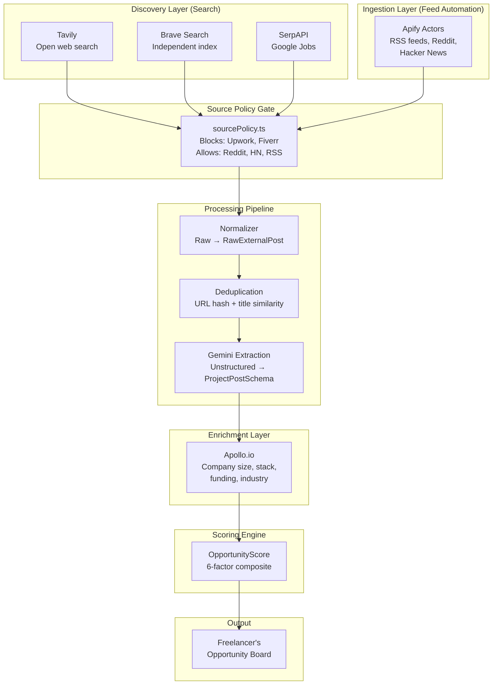
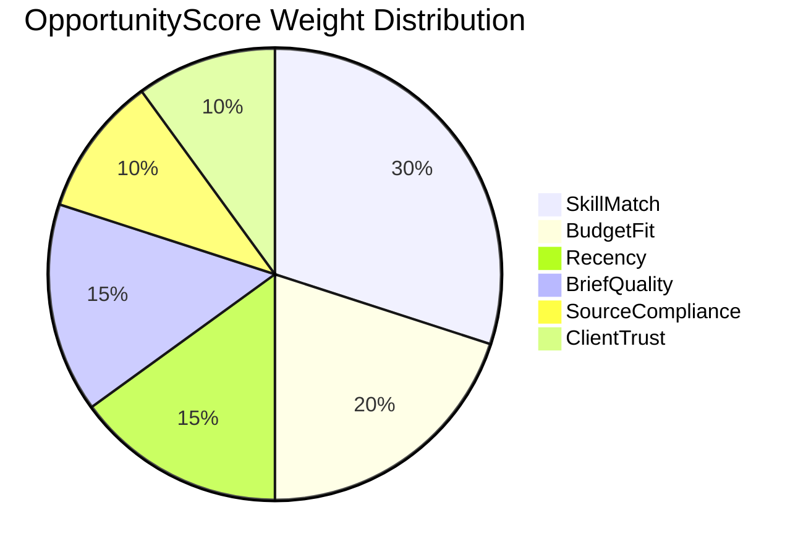
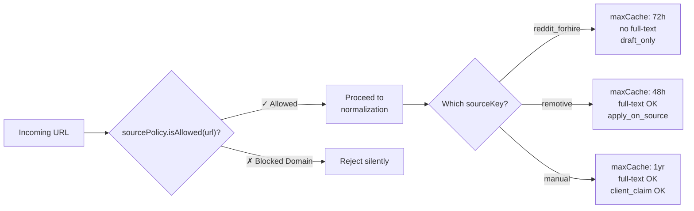

# FixFlowAI — AI Opportunity Intelligence & Smart Scoring Engine

> **Feature**: A multi-source discovery pipeline that uses AI to search the open web for freelance opportunities, normalize raw posts into structured project data, score them with a composite algorithm, and deliver a ranked feed to each freelancer.

---

## Feature Identity

| Field | Value |
|:---|:---|
| **Feature ID** | `AI-005` |
| **Priority** | 🟡 High (Core value differentiator — solves "too much competition, too little opportunity") |
| **Backend Module** | New — `backend/src/services/opportunityScoreService.ts` + connectors |
| **AI Components** | Gemini (post extraction) + Mathematical scoring formula |
| **External APIs** | Tavily, Brave Search, SerpAPI, Apify, Apollo.io |
| **Depends On** | Source Policy Gate, BullMQ queues, PostgreSQL |
| **Status** | ✅ Full spec in [opportunity_intelligence_implementation.md](../core_subsystems/opportunity_intelligence_implementation.md) · ❌ Not implemented |

---

## 1. What This Feature Does

Traditional platforms force freelancers to manually scroll through hundreds of job listings, competing with bots and spam bidders. FixFlowAI **automatically discovers relevant opportunities across the open web** and delivers a curated, scored feed.



---

## 2. The AI Components (Two Distinct Uses)

### 2.1 AI Component 1: Gemini Post Extraction

Raw search results and feed items come in wildly different formats — a Reddit post looks nothing like a Google Jobs listing. The AI normalizes them all into a single `ProjectPostSchema`:

**Input**: Raw, unstructured post data (title, snippet, URL, source metadata)

**AI task**: Extract structured project information using the same Gemini + Zod pattern as the brief parser:

```
Raw Reddit post: "[Hiring] Need a full-stack dev to build a 
Shopify → custom platform migration. React + Node preferred. 
Budget ~$5K. DM me. Posted in r/forhire"

        ↓ Gemini extraction ↓

ProjectPostSchema {
  title: "Shopify to Custom Platform Migration"
  requiredSkills: ["React", "Node.js", "Shopify API"]
  estimatedBudget: { min: 4000, max: 6000, currency: "USD" }
  projectType: "migration"
  urgency: "medium"
  briefQualityScore: 65
  scamIndicators: []
}
```

**Why AI is necessary here**: Different sources use different language, formatting, and conventions. A regex-based parser would break constantly. Gemini handles the semantic understanding — *"DM me"* doesn't mean direct message is required, it means the contact method; *"~$5K"* means approximately $5,000.

### 2.2 AI Component 2: The OpportunityScore Formula

This is **not a Gemini call** — it's a **mathematical composite score** that weights multiple signals into a single 0-100 ranking per opportunity per freelancer:

```
OpportunityScore = w₁·SkillMatch + w₂·BudgetFit + w₃·Recency 
                   + w₄·BriefQuality + w₅·SourceCompliance 
                   + w₆·ClientTrust - ScamPenalty
```

| Factor | Weight | What It Measures | Data Source |
|:---|:---:|:---|:---|
| **SkillMatch** | 30% | Overlap between freelancer's skills and project's `requiredSkills` | Freelancer profile vs. extracted skills |
| **BudgetFit** | 20% | Does the project's estimated budget match the freelancer's rate range? | Extracted budget vs. freelancer settings |
| **Recency** | 15% | How fresh is the post? (Decays over 7 days) | Post timestamp |
| **BriefQuality** | 15% | How well-structured is the original post? (Gemini-scored) | AI extraction output |
| **SourceCompliance** | 10% | How reliable is the source? (RSS > search result) | Source policy `riskLevel` |
| **ClientTrust** | 10% | Is the company/poster trustworthy? (Apollo enrichment) | Apollo data → `computeClientTrustScore()` |
| **ScamPenalty** | -20% max | Red flags: too-good-to-be-true budgets, crypto spam, etc. | AI scam detection |



---

## 3. Source Architecture

### 3.1 Discovery Sources (Search-Based)

| Source | API | Schedule | Cost/Query |
|:---|:---|:---:|:---|
| **Tavily** | `@tavily/core` | Every 4 hours | ~$0.01/query |
| **Brave Search** | REST API | Every 4 hours | ~$0.005/query |
| **SerpAPI** | Google Jobs engine | Every 8 hours | ~$0.01/query |

### 3.2 Ingestion Sources (Feed-Based)

| Source | Method | Schedule | Cost |
|:---|:---|:---:|:---|
| **Remotive** | RSS feed | Every 2 hours | Free |
| **WeWorkRemotely** | RSS feed | Every 2 hours | Free |
| **Himalayas** | RSS feed | Every 2 hours | Free |
| **Reddit r/forhire** | Apify or Reddit API | Every 6 hours | ~$0.002/post |
| **HN "Who's Hiring"** | HN Firebase API | Monthly thread | Free |

### 3.3 The Source Policy Gate

**Critical safety mechanism**: Every URL passes through `sourcePolicy.ts` before storage. This gate enforces:

- **Blocked domains**: Upwork, Fiverr, Freelancer.com, PeoplePerHour, TopTal, Guru
- **Per-source rules**: Attribution requirements, cache TTL limits, full-text storage permissions, whether FixFlow can facilitate applications
- **Risk levels**: `low` → `medium` → `high` → `blocked`



---

## 4. Implementation Steps

### Step 4.1 — Source Policy Gate (Day 1)

Create `backend/src/connectors/sourcePolicy.ts` with all source definitions. This must exist before any connector is built.

### Step 4.2 — Discovery Connectors (Days 2-4)

Build the three search connectors in parallel:

```
backend/src/connectors/search/
├── tavilyConnector.ts      ← Tavily web search
├── braveConnector.ts       ← Brave independent index
└── serpApiConnector.ts     ← Google Jobs (contract filter)
```

Wire them into `discoveryService.ts` — runs all three in parallel, deduplicates by URL.

### Step 4.3 — Ingestion Workers (Days 5-7)

Build the feed ingestion actors:

```
backend/src/connectors/apify/
├── actors/rssIngestionActor.ts
├── actors/redditForHireActor.ts
└── actors/hnWhoIsHiringActor.ts
```

Alternatively (per the [alternative platforms doc](../core_subsystems/opportunity_intelligence_alternative_platforms.md)), skip Apify entirely and use direct API calls with `rss-parser` npm package + HN's free Firebase API + Reddit's official Data API.

### Step 4.4 — Normalization + Gemini Extraction (Days 8-9)

Build the normalization pipeline:
1. Raw results → `RawExternalPost` schema (store with source attribution)
2. `RawExternalPost` → Gemini extraction → `ProjectPostSchema`
3. Deduplication service (URL hash + Levenshtein title similarity)

### Step 4.5 — Apollo Enrichment (Days 10-11)

Build `apolloEnrichment.ts`:
- Detect company name/domain from extracted post data
- Call Apollo Organization Enrichment API
- Compute `ClientTrustScore` from enrichment data
- Store enrichment on the Opportunity record

### Step 4.6 — Scoring Engine (Day 12)

Build `opportunityScoreService.ts`:
- Calculate all 6 factors + scam penalty
- Produce per-freelancer ranked opportunity lists
- Store as Opportunity records linked to FreelancerProfile

### Step 4.7 — Frontend Opportunity Board (Days 13-16)

Build the new Opportunity Board dashboard tab (see [frontend_gaps_and_requirements.md](../frontend/frontend_gaps_and_requirements.md) Requirement 1):

- Filter controls: skills, budget range, source type, sort by score/recency
- Opportunity cards with enrichment data, source badges, score breakdown tooltip
- "Draft Proposal" action → pre-fills the brief parser with opportunity context
- "Apply on Source" action → external link to the original post

---

## 5. Scam Detection Intelligence

The AI includes built-in scam detection during the Gemini extraction phase:

| Red Flag | Penalty | Example |
|:---|:---:|:---|
| Budget too high for scope | -15 | "$50K for a simple landing page" |
| Crypto payment demands | -20 | "Pay in BTC only" |
| Personal info requests | -20 | "Send SSN and bank details to apply" |
| No company or identity | -10 | Anonymous poster with no verifiable info |
| Copy-paste template posting | -5 | Same text posted across 10 subreddits |
| Urgency pressure tactics | -5 | "MUST start today or offer expires" |

---

## 6. Cost Projections

| Component | Monthly Cost (MVP) | At Scale |
|:---|:---|:---|
| Tavily (4 searches/day × 30 days) | ~$1.20 | ~$12 |
| Brave Search (4 searches/day × 30 days) | ~$0.60 | ~$6 |
| SerpAPI (3 searches/day × 30 days) | ~$0.90 | ~$9 |
| Apollo.io (50 enrichments/month) | Free tier | $49/month |
| Gemini (extraction calls) | ~$2-5 | ~$20-50 |
| **Total** | **~$5-8/month** | **~$50-100/month** |

---

## 7. Testing & Verification

| Test Case | Expected Behavior |
|:---|:---|
| Tavily returns Reddit r/forhire post | Post passes source gate, normalized to `RawExternalPost` |
| Brave returns Upwork result | **Blocked** by source policy — never stored |
| Duplicate URL from Tavily + Brave | Deduplicated to single entry |
| Post mentions "React" + freelancer knows React | High SkillMatch factor (90+) |
| Post from anonymous Reddit account, no budget | Low BriefQuality + low ClientTrust → lower overall score |
| Apollo enrichment finds funded startup | ClientTrust score increases (+25) |
| Post contains "send crypto to apply" | ScamPenalty -20 applied |

---

## Cross-References

| Document | Relevance |
|:---|:---|
| [opportunity_intelligence_implementation.md](../core_subsystems/opportunity_intelligence_implementation.md) | Full technical implementation spec |
| [opportunity_intelligence_alternative_platforms.md](../core_subsystems/opportunity_intelligence_alternative_platforms.md) | Alternative tools and cost analysis |
| [client_project_ingestion_feasibility.md](../core_subsystems/client_project_ingestion_feasibility.md) | Legal/compliance feasibility assessment |
| [frontend_gaps_and_requirements.md](../frontend/frontend_gaps_and_requirements.md) | Requirement 1: Opportunity Board UI |
| [market_positioning_and_uvps.md](../product_strategy/market_positioning_and_uvps.md) | Freelancer Pain Point #1: "Too much competition" |
