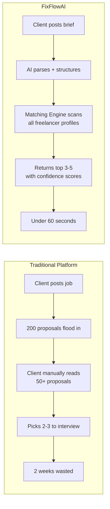
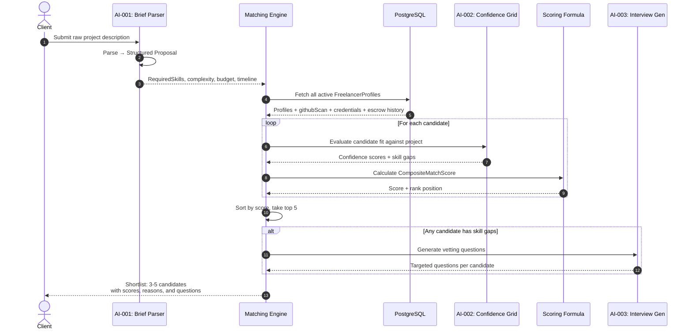
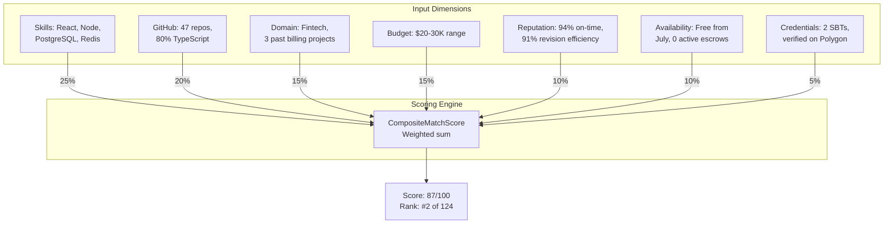
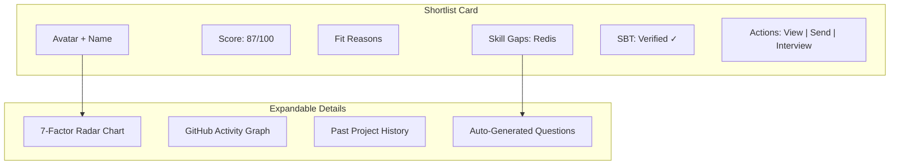
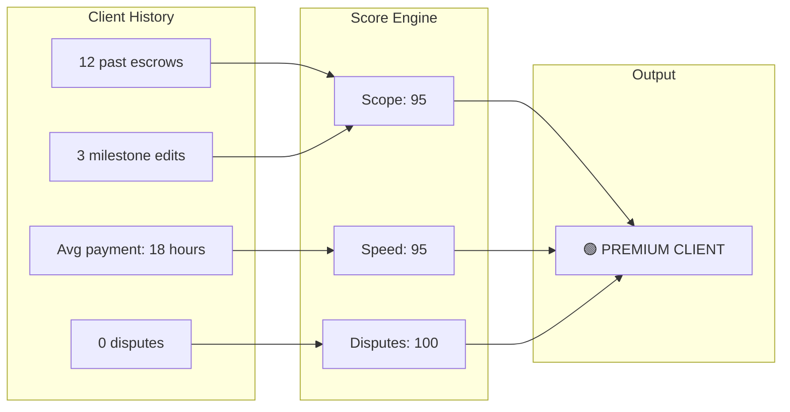

# FixFlowAI — AI Freelancer-Client Matching & Smart Lead Scoring

> **Feature**: Multi-dimensional AI matching engine that translates raw client briefs into shortlists of 3-5 pre-qualified freelancers using semantic profile scanning, skill gap analysis, and composite trust scoring — eliminating the open-bidding chaos of traditional platforms.

---

## Feature Identity

| Field | Value |
|:---|:---|
| **Feature ID** | `AI-006` |
| **Priority** | 🔴 Critical (Core UVP — "Zero-noise shortlist" and "Trust-first hiring") |
| **Backend Modules** | Confidence Grid (reused) + new `matchingEngine.ts` |
| **AI Components** | Gemini (profile analysis) + Mathematical scoring |
| **Depends On** | [AI-001](./ai_001_semantic_brief_parsing.md) (structured brief), FreelancerProfile, GitHub scan data |
| **Status** | ⚠️ Partially designed in specs · ❌ No dedicated module exists |

---

## 1. The Problem

On Upwork, a single job posting receives 50-200 proposals. The client has no way to efficiently filter them — they're drowning in spam bids, AI-generated cover letters, and portfolio padding. Simultaneously, qualified freelancers waste hours writing proposals that never get read.

**FixFlowAI's solution**: The client sees **only 3-5 pre-qualified candidates**, selected by the AI matching engine. No bidding war. No spam. No noise.



---

## 2. The Matching Pipeline (End-to-End)



---

## 3. The Matching Dimensions

### 3.1 Seven-Factor Composite Score

The matching engine evaluates each freelancer across seven dimensions:

```
CompositeMatchScore = Σ (wᵢ × factorᵢ) for i = 1..7
```

| # | Factor | Weight | What It Measures | Data Source |
|:---|:---|:---:|:---|:---|
| 1 | **SkillOverlap** | 25% | % of project's required skills present in freelancer's profile | `FreelancerProfile.skills` vs. project `requiredSkills` |
| 2 | **GitHubSignal** | 20% | Code-verified skill evidence from GitHub activity | `FreelancerProfile.githubScan` (languages, repos, commit frequency) |
| 3 | **DomainExperience** | 15% | Has the freelancer worked in this industry/domain before? | Past proposal `area` fields + escrow completion history |
| 4 | **BudgetAlignment** | 15% | Does the freelancer's rate range match the project budget? | `FreelancerProfile.rateRange` vs. project estimated budget |
| 5 | **ReputationScore** | 10% | On-time rate, revision efficiency, dispute-free rate | Calculated by [reputationCalculator.js](../../backend/src/skills/reputationCalculator.js) |
| 6 | **AvailabilityFit** | 10% | Is the freelancer available for the project's timeline? | `FreelancerProfile.availability` + active escrow count |
| 7 | **SBTCredentials** | 5% | Has the freelancer earned verified Soulbound Tokens? | `Credential` records (Polygon-verified) |



### 3.2 Skill Overlap Calculation

This is the most critical factor. It uses a **Jaccard-like similarity** with domain-specific enhancements:

```
                    |ProjectSkills ∩ FreelancerSkills|
SkillOverlap = ────────────────────────────────────────── × 100
                    |ProjectSkills ∪ FreelancerSkills|
```

**Enhancements over basic Jaccard**:
- **Synonym mapping**: "Postgres" = "PostgreSQL", "JS" = "JavaScript"
- **Hierarchy awareness**: "React" implies "JavaScript" — partial credit for parent skills
- **Recency weighting**: Skills used in the last 6 months via GitHub count double

### 3.3 GitHub Signal Scoring

The GitHub scan provides **code-verified** skill evidence:

| GitHub Metric | What It Proves | Score Contribution |
|:---|:---|:---|
| Language % across repos | Actually uses the language (not just claims it) | 0-30 points |
| Repo count in relevant frameworks | Has real projects, not just tutorials | 0-25 points |
| Recent commit frequency | Actively coding, not dormant | 0-20 points |
| README quality (average) | Can document and communicate | 0-15 points |
| Star count on relevant repos | Community validation | 0-10 points |

---

## 4. Shortlist Generation

### 4.1 The Selection Algorithm

```
1. Fetch all active FreelancerProfiles from DB
2. Filter by hard constraints:
   - Must have ≥50% skill overlap (eliminate obvious mismatches)
   - Must be available (no conflicting active escrows)
   - Must be verified (identity check passed)
3. Score each candidate using the 7-factor formula
4. Sort by CompositeMatchScore descending
5. Take top 5 (configurable, default 5)
6. For each top candidate:
   a. Generate "Fit Reasons" — human-readable explanations
   b. Identify skill gaps (required - present)
   c. If gaps exist → trigger AI-003 for interview questions
7. Return shortlist with scores, reasons, gaps, and questions
```

### 4.2 "Fit Reasons" Generation

For each shortlisted candidate, the AI generates human-readable explanations:

```json
{
  "candidateId": "fp_7a49...",
  "compositeScore": 87,
  "fitReasons": [
    "Has 3 years of production React + Node experience verified by GitHub (47 repos)",
    "Completed 2 similar fintech billing migrations on FixFlowAI with 95% on-time rate",
    "Budget alignment: freelancer rates ($8-12K/milestone) match project budget ($24.5K total)",
    "Soulbound credential: Verified Billing Integration Specialist (minted Jan 2026)"
  ],
  "skillGaps": ["Redis clustering (not found in GitHub repos)"],
  "riskFlags": []
}
```

These are generated by Gemini using the candidate's profile data and the project requirements — not hardcoded templates.

---

## 5. Implementation Steps

### Step 5.1 — Build the Matching Engine

**File**: `backend/src/services/matchingEngine.ts`

**Core function**: `generateShortlist(structuredBrief: Proposal, limit?: number): Promise<MatchResult[]>`

**Process**:
1. Extract `requiredSkills`, `complexity`, `budget`, `timeline` from the structured brief
2. Query PostgreSQL for active FreelancerProfiles with basic skill overlap filter
3. For each candidate, compute all 7 scoring factors
4. Calculate `CompositeMatchScore` as weighted sum
5. Sort and take top N
6. For each top candidate:
   - Call Gemini to generate "Fit Reasons" (batch for efficiency)
   - Compute skill gaps
7. Return ranked `MatchResult[]`

### Step 5.2 — Create the API Route

**Endpoint**: `POST /api/leads/match`

**Request**: `{ proposalId: string, limit?: number }`

**Response**: 
```json
{
  "shortlist": [
    {
      "freelancerId": "...",
      "name": "...",
      "compositeScore": 87,
      "factorBreakdown": { "skillOverlap": 92, "githubSignal": 85, ... },
      "fitReasons": ["..."],
      "skillGaps": ["..."],
      "riskFlags": [],
      "interviewQuestions": [...]  // if gaps exist
    }
  ],
  "totalCandidatesEvaluated": 124,
  "matchDurationMs": 3200
}
```

### Step 5.3 — Frontend Integration

**Target**: The `Overview.jsx` or a new `MatchResults.jsx` component

**UI Elements**:
1. **Candidate Cards**: Show photo, name, composite score, top 3 fit reasons
2. **Score Breakdown Popover**: Radar chart showing 7 scoring dimensions
3. **Skill Gap Badges**: Red indicators for missing skills + auto-generated interview questions
4. **SBT Badge**: Polygon-verified credential icon next to verified candidates
5. **Action Buttons**: "View Profile", "Send Proposal", "Schedule Interview"



---

## 6. Client Quality Scoring (Reverse Matching)

The matching engine isn't one-directional. When a freelancer receives a lead, FixFlowAI also scores the **client** using [clientScoring.js](../../backend/src/skills/clientScoring.js):

| Metric | Formula | Risk Label |
|:---|:---|:---|
| **Scope Stability** | `max(0, 100 - (milestoneEdits / totalMilestones × 100))` | `< 60` → `SCOPE_CREEP_RISK` |
| **Payment Speed** | Average hours from deliverable submission to release approval | `> 72h` → `LATE_PAYER_RISK` |
| **Dispute Rate** | `disputes / totalEscrows × 100` | `> 10%` → `HIGH_DISPUTE_RISK` |
| **Combined** | Weighted average of above | All clear → `PREMIUM_CLIENT` |

This ensures freelancers can make informed decisions — they see the client's risk profile before accepting work.



---

## 7. Advanced Enhancements

### 7.1 Semantic Matching (Future)

Instead of keyword skill overlap, use embeddings:
- Embed project requirements using Gemini's embedding model
- Embed freelancer profiles (GitHub READMEs + past proposals)
- Use cosine similarity for more nuanced matching
- Catches cases like: project needs "payment processing" → freelancer has "Stripe API" experience

### 7.2 Learning from Outcomes (Future)

Track which matches succeed (escrow completed) vs. fail (dispute or dropout):
- Feed success signals back into weight calibration
- Over time, the formula automatically adjusts to prioritize factors that predict good outcomes

### 7.3 Team Matching (Future)

For complex projects requiring multiple skill domains:
- Generate **team compositions** instead of individual matches
- Example: "React frontend dev + Solidity backend dev + DevOps engineer"
- Optimize for complementary skills, timezone overlap, and past collaboration history

---

## 8. Testing & Verification

| Test Case | Expected Behavior |
|:---|:---|
| Brief needs React + Node, candidate has both | High SkillOverlap (90+), high overall score |
| Brief needs Solidity, candidate has 0 blockchain repos | Low SkillOverlap, skill gap flagged, interview questions generated |
| Candidate has 5-star reputation + 2 SBTs | ReputationScore and SBTCredentials boost total |
| Candidate has 3 active escrows (overcommitted) | AvailabilityFit drops, ranked lower |
| Client has 4 past disputes | `HIGH_DISPUTE_RISK` label shown to freelancer |
| 200 candidates, limit=5 | Only top 5 returned, sorted by CompositeMatchScore |
| Brief budget is $5K, candidate rates at $50K | BudgetAlignment factor near 0 → dropped from shortlist |

---

## Cross-References

| Document | Relevance |
|:---|:---|
| [market_positioning_and_uvps.md](../product_strategy/market_positioning_and_uvps.md) | UVPs: "Zero-Noise Shortlist", "Trust-First Hiring", "Fast Hire" |
| [extra_implementation_roadmap.md](../core_subsystems/extra_implementation_roadmap.md) | Extra Module 3 (Client Scoring), Module 4 (Interview Gen) |
| [AI-001: Brief Parsing](./ai_001_semantic_brief_parsing.md) | Upstream — provides structured project requirements |
| [AI-002: Confidence Grid](./ai_002_confidence_grid_self_correction.md) | Used for per-candidate skill gap detection |
| [AI-003: Interview Generation](./ai_003_interview_vetting_generation.md) | Downstream — generates questions for skill gaps |
| [skills.md](../core_subsystems/skills.md) | clientScoring.js, reputationCalculator.js specs |
