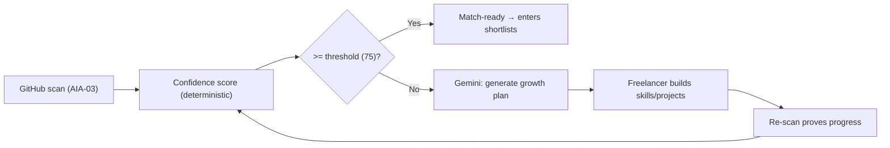
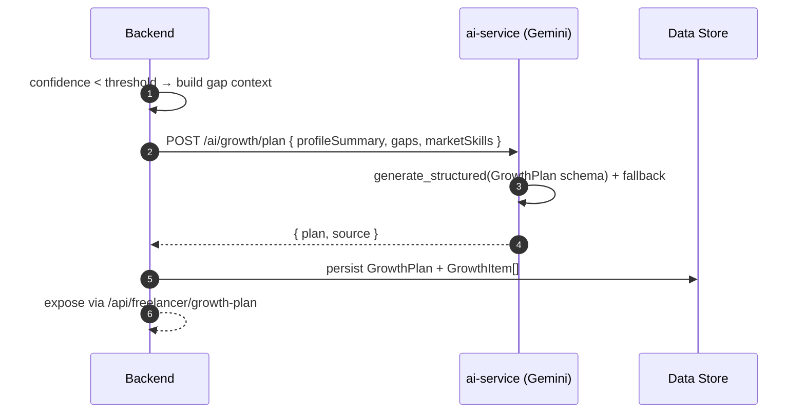
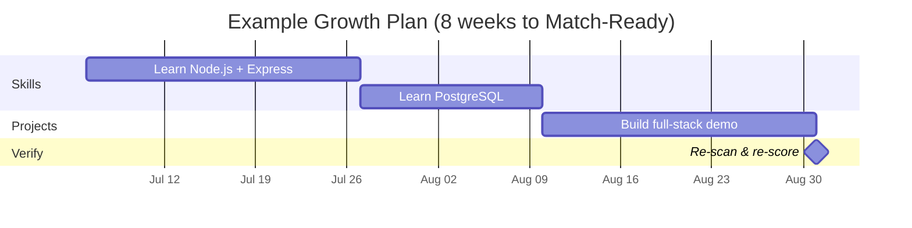

# FixFlowAI — AI Freelancer Growth Plan Engine

> **Feature:** After a freelancer's GitHub scan (AIA-03 / roles doc 01), FixFlowAI computes a **Profile Confidence Score**. When it falls below the match-ready threshold, this engine generates a **personalized, time-boxed growth plan** — which skills to learn and which projects to build, each with an estimated timeline — so early-career freelancers can reach eligibility fairly. Progress is proven by re-scan, never self-asserted.

---

## Feature Identity

| Field | Value |
|:---|:---|
| **Feature ID** | `AI-007` |
| **Priority** | 🟡 High (equity + retention lever) |
| **AI components** | Gemini (growth-plan generation) + **deterministic** confidence score (no LLM) |
| **New AI endpoint** | `POST /ai/growth/plan` (Python `ai-service`) |
| **Backend** | `growthPlanRepository.ts` + `/api/freelancer/confidence`, `/api/freelancer/growth-plan` |
| **Depends on** | [AIA-03 GitHub scan](./stories/AIA-03-github-scan-pipeline.md), [roles doc 02](../roles/02_freelancer_confidence_growth_plan.md) |
| **Status** | ❌ Not built |

---

## 1. Why This Exists

The matching engine (AI-006) rewards proven skills and real projects. A talented but early-career freelancer with a thin GitHub would rarely surface — unfair, and it shrinks the talent pool. AI-007 turns "not ready" into "here's exactly how to get ready, and by when," and every improvement is verified by code on the next scan.



---

## 2. Two Components (One Deterministic, One LLM)

### 2.1 Profile Confidence Score (deterministic — no Gemini)

Keep it explainable and cheap, like `matchingEngine.ts`:

```
ProfileConfidence =
    0.30 * SkillBreadthDepth     (# verified skills × avg per-skill confidence)
  + 0.25 * ProjectStrength       (# strong projects, stars, domain clarity)
  + 0.20 * Recency               (activity in last 6–12 months)
  + 0.15 * ContributionVolume    (commit cadence, sustained activity)
  + 0.10 * Documentation         (README quality)
```

Bands: `EMERGING 0–49` · `DEVELOPING 50–74` · `MATCH_READY 75–100`. Threshold reuses `CONFIDENCE_THRESHOLD` semantics (default 75).

### 2.2 Growth Plan (Gemini via `generate_structured`)

Follows the exact hardened pattern of the other AI features (system prompt → schema-constrained output → honest fallback).



---

## 3. Schema (Pydantic — mirrors the AI-service pattern)

```python
# ai-service/app/schemas/growth.py
from typing import Literal, Optional
from pydantic import BaseModel, Field

class GrowthItem(BaseModel):
    type: Literal["skill", "project"]
    title: str = Field(min_length=1)
    why: str = Field(min_length=1)
    difficulty: Literal["easy", "medium", "hard"]
    estimatedWeeks: int = Field(ge=1, le=52)
    order: int
    provesSkills: list[str] = []

class GrowthPlan(BaseModel):
    reasoning: str = Field(min_length=1)
    targetConfidence: int = Field(ge=0, le=100, default=75)
    totalTimelineWeeks: int = Field(ge=1, le=104)
    skillItems: list[GrowthItem]
    projectItems: list[GrowthItem]

class GrowthPlanResponse(BaseModel):
    plan: GrowthPlan
    source: Literal["llm", "fallback"]     # honest provenance (AIE-02 convention)
    degradedReason: Optional[str] = None
```

Backend persistence models (`ProfileConfidence`, `GrowthPlan`, `GrowthItem`) are defined in [`../roles/04_schema_and_api_changes.md`](../roles/04_schema_and_api_changes.md) §6.

---

## 4. Timeline Output (what the freelancer sees)



- Each item status: `not_started → in_progress → done`.
- **Completion is proven by re-scan**, not a checkbox — when the new repo appears, confidence rises automatically.
- The freelancer may update **item status only**; they cannot edit AI-generated content or timelines (tamper-proof, consistent with read-only skills).

---

## 5. API Surface

| Method | Endpoint | Role | Purpose |
|:---|:---|:---|:---|
| `GET` | `/api/freelancer/confidence` | freelancer | Score, band, factor breakdown |
| `GET` | `/api/freelancer/growth-plan` | freelancer | Active plan + items + timeline |
| `PATCH` | `/api/freelancer/growth-plan/items/:id` | freelancer | Update **status only** |
| `POST` | `/api/freelancer/growth-plan/regenerate` | freelancer | Regenerate after major change |
| `POST` | `/ai/growth/plan` | internal | Gemini generation (ai-service) |

---

## 6. Implementation Steps

1. **Confidence scorer (deterministic).** Compute from the AIA-03 scan output; persist `ProfileConfidence`; expose `/api/freelancer/confidence` + band badge.
2. **AI endpoint.** Add `app/schemas/growth.py` + `app/features/growth.py` (`generate_growth_plan()` using `generate_structured` + fallback) + `POST /ai/growth/plan` in `main.py`. Add TS type + `aiClient.generateGrowthPlan()`.
3. **Persistence + routes.** `growthPlanRepository.ts` (mirror `proposalRepository.ts`); `/api/freelancer/growth-plan` endpoints.
4. **Trigger.** After scan completes and confidence < threshold, generate + persist the plan.
5. **Re-scan loop.** On re-scan, recompute confidence; mark plan `achieved` when threshold reached.
6. **Guardrails.** Item edits are status-only; market-skill inputs come from platform matching data, not self-report.

---

## 7. Fairness & Anti-Gaming

- Confidence and completion are always tied to code evidence via re-scan.
- Recommendations reflect real hiring demand (from matching/opportunity data), not a freelancer's claims.
- Tone is encouraging and specific — a growth path, not a rejection.

---

## 8. Done When

- [ ] Deterministic confidence score + band computed from scan; `/api/freelancer/confidence` live.
- [ ] `POST /ai/growth/plan` follows the hardened LLM pattern with honest `source` marker.
- [ ] `GrowthPlan`/`GrowthItem` persisted; `/api/freelancer/growth-plan` live.
- [ ] Item status editable; AI content/timelines are not.
- [ ] Re-scan recomputes confidence and can flip the plan to `achieved`.
- [ ] `python -m compileall app` and `npm run build` pass.

---

## 9. Cross-References

| Document | Relevance |
|:---|:---|
| [Roles doc 02 — Confidence & Growth Plan](../roles/02_freelancer_confidence_growth_plan.md) | Product spec + UX |
| [Roles doc 04 — Schema & API](../roles/04_schema_and_api_changes.md) | Persistence models |
| [AIA-03 GitHub Scan](./stories/AIA-03-github-scan-pipeline.md) | Produces the scan this consumes |
| [AI-006 Matching](./ai_006_smart_matching_lead_scoring.md) | Where match-ready freelancers land |
| [Implementation Status](./IMPLEMENTATION_STATUS.md) | Priority board (P3) |
