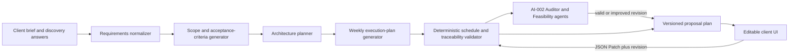

# AI-008 — Deep Proposal, Editable Timeline, and Visual Planning Implementation Plan

**Status:** Proposed implementation plan  
**Owner:** AI Builder / Client Workspace  
**Primary users:** Clients creating a project proposal; freelancers reviewing the approved execution plan  
**Scope:** The five-step AI Builder at `/dashboard/proposal-generator`, especially Structured scope, Intelligence analysis, Timeline & roles, and Review & finalize.

## 1. Outcome

Replace the current high-level proposal cards and phase-only milestone list with a decision-ready project plan:

- Every scope item explains the business outcome, detailed behaviour, acceptance criteria, dependencies, assumptions, non-functional requirements, and implementation approach.
- The technical-architecture view explains the components, integrations, data boundaries, security, failure handling, scaling, and feature-to-component mappings instead of repeating a single paragraph per feature.
- The timeline is a true week-by-week execution plan. Each week has an objective, workstreams, tasks, owner role, estimate, deliverables, dependencies, risk/watch-outs, and one or more completion checkpoints.
- A client can edit any planning content through normal form controls, save a durable draft, see validation feedback immediately, and retain a revision history.
- Charts and diagrams make schedule, capacity, dependencies, complexity, and risks easier to understand. They must use only deterministic data already in the plan; the UI must not present fabricated AI scores as facts.
- The approved plan remains separate from funded escrow milestones. Changing a task must never alter an escrow amount, payment state, or audit chain without a distinct client-confirmed conversion flow.

This implements FixFlowAI's trust-first promise: a client can inspect the evidence behind a proposal before matching talent or funding work, while a freelancer receives an unambiguous, reviewable definition of delivery.

## 2. Verified current state and the gap

The current implementation already has a useful foundation:

| Area | Existing implementation | Gap to close |
| --- | --- | --- |
| Proposal data | `Proposal` contains `features`, legacy `timeline`, `delivery_plan.weeks`, `risks`, and `effort`. | The rich weekly plan contains only labels, goals, basic tasks, deliverables, and dependencies; it lacks task detail, checkpoints, capacity, and client revision data. |
| AI generation | `ai-service/app/features/brief_parser.py` emits strict Pydantic `Proposal` JSON and sanitizes malformed output. | One broad generation step cannot consistently produce the architecture and schedule depth requested by the UI. |
| Quality | `ai-service/app/features/scoring.py` already checks continuity, overlap, dependency cycles, and task density for `delivery_plan.weeks`. | It does not validate detailed estimates, checkpoint coverage, role capacity, feature traceability, or client edits. |
| UI | `ProposalGenerator.jsx` displays feature cards and the legacy `timeline` phase/duration/task list. | It uses only `delivery_plan.roadmap` for a few scope badges; the existing weekly schedule is otherwise not visible or editable. |
| Persistence | Proposals persist in `proposalRepository.ts`; the stepper workflow is restored across devices. | There is no versioned plan document, partial update API, conflict protection, revision log, or proposal-content authorization rule. |
| Real-time | `syncServer.ts` and `optimisticSync.js` provide a proposal-room synchronization foundation. | They are not wired to durable, field-level timeline editing. |
| Financial milestones | Escrow milestones have an FSM, optimistic versioning, and chained audit blocks. | Planning milestones must not be treated as payment milestones or mutate that financial state. |

### Root cause

The current screen is not merely a presentation problem. `ProposalGenerator.jsx` is reading the compact `timeline` projection (`phase`, `duration`, `tasks`) and does not consume the separately generated `delivery_plan.weeks` structure. The data model and persistence layer also have no safe representation for client-owned edits. Therefore, adding larger cards alone would continue to produce and save an overview rather than a detailed, editable execution plan.

## 3. Product rules and non-negotiable boundaries

1. **AI suggestions are labelled as suggestions.** Any ambiguous input is recorded as an assumption or an open question; the generator must not invent integrations, compliance obligations, dates, team members, or budget commitments.
2. **The client owns planning edits.** A client may create, edit, reorder, add, remove, and restore plan content while the proposal is in draft/review. The UI uses controlled inputs and an inspector drawer, not `contentEditable` text.
3. **Approved content is reproducible.** The original generated baseline is retained; every saved edit has actor, timestamp, operation ID, revision, reason (when required), and previous-value hash.
4. **Financial state is isolated.** Planning checkpoints are delivery gates, not Razorpay/escrow transitions. A later explicit “Create escrow milestones from approved checkpoints” action must show a mapping and obtain confirmation.
5. **Conflict safety beats last-write-wins.** Disjoint edits may merge; overlapping edits produce a conflict view. No full-document PUT may overwrite another user's schedule.
6. **The current v1 proposal shape keeps working.** Existing proposals remain readable. A client explicitly generates a detailed plan for a v1 proposal; no silent migration changes the historical proposal text.
7. **Accessibility and small-screen usability are first-class.** Tables have a card alternative on mobile, charts have text/table summaries, all edits are keyboard reachable, and colours are never the only status signal.

## 4. Target experience by AI Builder section

### Step 2 — Structured scope

#### Scope outline

Replace the simple feature list with expandable **Scope modules**. Each module shows:

- business objective and affected actor(s);
- in-scope behaviour and explicit out-of-scope items;
- user journeys / business rules;
- acceptance criteria written as verifiable statements;
- linked deliverables, dependencies, assumptions, and unresolved questions;
- technical constraints, data entities, integrations, security/privacy controls, and service-level expectations;
- estimated role hours and the weeks where it is implemented;
- traceability links to architecture components, tasks, checkpoints, risks, and client acceptance.

Use a compact collapsed card by default. Selecting a card opens the same detail inspector used by the timeline, so clients do not face a wall of text. Show an “Uncovered requirement” banner when a brief requirement does not map to a module or acceptance criterion.

#### Technical architecture

Introduce an **Architecture overview** above detailed component cards. The overview is a zoomable, accessible SVG/CSS node-and-edge diagram; it is not a screenshot or hard-coded image. Each component card contains:

- responsibility and the feature/module IDs it supports;
- runtime, technology choice, data read/write boundaries, and external interfaces;
- input/output contract summary, error and retry policy, observability, security controls, and scaling strategy;
- upstream/downstream dependencies and failure impact;
- implementation decisions, alternatives rejected, and open technical decisions.

The existing `technical_approach` paragraph becomes the short summary, not the whole architecture.

### Step 3 — Intelligence analysis

Retain the risk and competitor tabs, but link each risk to affected modules, weeks, and checkpoints. Add a deterministic **coverage and readiness panel**:

- requirements mapped to scope modules;
- high-risk modules with planned mitigations;
- count of unresolved client decisions;
- confidence-grid evidence already produced by AI-002;
- schedule diagnostics from the deterministic validator.

Do not add an AI-generated “risk score” beyond the current deterministic severity derivation. The UI may chart the existing severity alongside the affected week and mitigation status.

### Step 4 — Timeline & roles

The Milestones tab becomes an **Execution plan** with three synchronized views:

1. **Timeline Gantt:** one column per week; rows for workstreams and checkpoints. Tasks span their planned weeks, dependency arrows are optional on wide screens, and blocked/over-capacity states use icons plus labels.
2. **Week board:** expandable Week 1 through Week N cards. Each card has an outcome, tasks, deliverables, dependencies, planned capacity, a client action, and checkpoint exit criteria/evidence.
3. **Plan table:** an accessible, filterable table for users who prefer detailed editing. It supports filters for module, role, owner, status, workstream, and checkpoint type.

The Required roles tab gains a role-capacity view. It shows role allocation across weeks, the largest capacity demand, and unassigned required work. This remains distinct from freelancer matching: it states roles/capacity needed, not a recommended person.

### Step 5 — Review & finalize

Present a client-readable approval pack: scope coverage, architecture decisions, week-by-week commitments, acceptance gates, risks, assumptions/open questions, capacity warnings, and the exact plan revision being approved. Approval locks the revision for review but permits “Reopen for editing”; reopening invalidates only Steps 4 and 5 approval and never changes a funded escrow milestone.

## 5. Target data architecture

### 5.1 Versioned source of truth

Add an optional `executionPlan` to `Proposal` and make it the source of truth for newly generated deep proposals. Keep `timeline` and `delivery_plan` as v1 projections during the migration window; do not make three independently editable schedules.

```ts
interface ExecutionPlan {
  schemaVersion: 2;
  projectStartDate?: string;             // client supplied; absent means relative Week 1
  planningAssumptions: Assumption[];
  openQuestions: OpenQuestion[];
  requirements: Requirement[];
  scopeModules: ScopeModule[];
  architecture: ArchitectureDocument;
  workstreams: Workstream[];
  teamCapacity: TeamCapacity[];
  weeks: PlanWeek[];
  checkpoints: Checkpoint[];
  risks: PlanRiskLink[];
  diagnostics: PlanDiagnostics;          // deterministic and recomputed, never LLM-authored
}

interface PlanWeek {
  id: string;
  weekNumber: number;
  label: string;
  objective: string;
  workstreamIds: string[];
  taskIds: string[];
  deliverableIds: string[];
  checkpointIds: string[];
  dependencyWeekIds: string[];
  clientActions: ClientAction[];
}

interface PlanTask {
  id: string;
  title: string;
  description: string;
  moduleId: string;
  workstreamId: string;
  ownerRoleId: string;
  estimateHours: number;
  startWeek: number;
  endWeek: number;
  dependencyTaskIds: string[];
  acceptanceCriteria: string[];
  evidenceRequired: string[];
  status: 'planned' | 'in_progress' | 'blocked' | 'done' | 'backlog';
  priority: 'must' | 'should' | 'could';
}

interface Checkpoint {
  id: string;
  title: string;
  type: 'design_review' | 'demo' | 'client_approval' | 'security_review' | 'release_readiness';
  weekNumber: number;
  ownerRoleId: string;
  blocking: boolean;
  exitCriteria: string[];
  evidenceRequired: string[];
  linkedTaskIds: string[];
  status: 'planned' | 'ready_for_review' | 'approved' | 'changes_requested';
}
```

`ScopeModule`, `Requirement`, `ArchitectureComponent`, `Workstream`, `TeamCapacity`, `Assumption`, `OpenQuestion`, and `PlanRiskLink` use stable IDs. Every reference must be an ID, never a title string, so renaming a task cannot break a dependency or chart.

### 5.2 Proposal-plan envelope and revision history

Persist the editable plan in a dedicated envelope attached to the proposal record. This avoids mutating the generated baseline and allows optimistic concurrency without overwriting unrelated proposal fields.

```ts
interface ProposalPlanDocument {
  proposalId: string;
  currentRevision: number;
  status: 'draft' | 'in_review' | 'approved' | 'superseded';
  generatedBaseline: ExecutionPlan;
  currentPlan: ExecutionPlan;
  approvedRevision?: number;
  lastValidatedAt: string;
  updatedAt: string;
}

interface ProposalPlanRevision {
  proposalId: string;
  revision: number;
  operationId: string;                   // idempotency key
  actorUserId: string;
  actorRole: 'client' | 'freelancer' | 'system';
  occurredAt: string;
  operations: JsonPatchOperation[];
  previousHash: string;
  entryHash: string;                     // SHA-256 chained audit evidence
  diagnosticsAfter: PlanDiagnostics;
}
```

Use a DynamoDB proposal-plan item plus revision items (or a dedicated `proposal_plan_revisions` table if the item-size limit would be exceeded). The current plan must stay under the DynamoDB 400 KB item limit; place attachments and large generated reports in S3 and persist immutable pointers. File and in-memory repositories must implement the same interface for local development and tests.

### 5.3 Compatibility strategy

1. Add `executionPlan?: ExecutionPlan` as an optional field in the Pydantic and TypeScript proposal contracts.
2. Continue reading existing v1 `timeline` and `delivery_plan` fields.
3. For a v1 proposal, show a “Generate detailed plan” action. It creates `executionPlan` while preserving the original proposal JSON as the baseline proposal.
4. For a v2 proposal, derive the legacy compact views from `executionPlan` only while old consumers still require them.
5. Remove legacy write paths only after every frontend/API consumer has been migrated and data exports support v2.

## 6. AI generation and deterministic validation

### 6.1 Pipeline



The first four stages can be a single structured Gemini call initially, provided the Pydantic schema is enforced. Keep the stages as separately testable functions so the schedule planner can later be split into bounded calls if prompt size or output quality requires it. AI-002 remains the independent critique/optimization path; it must receive the same v2 schema.

### 6.2 Prompt and schema precision rules

The generator prompt and Pydantic constraints must enforce these minimums for a non-degraded plan:

- Every scope module has at least two acceptance criteria, an explicit boundary, and links to one or more requirements.
- Every architecture component declares responsibility, interfaces, data boundary, operational failure handling, and linked modules.
- Every week has one measurable objective, at least one task or explicit client decision, at least one deliverable/checkpoint across active workstreams, and no unlinked dependency.
- Every task has one owner role, a bounded hour estimate, a week span, a linked module, acceptance criteria, and evidence expectations.
- Every blocking checkpoint has exit criteria, evidence requirements, owner role, and linked tasks.
- Missing business information is emitted as `assumption` or `openQuestion`, never silently filled with a claimed fact.
- The model emits qualitative complexity/priority only. Hours, capacity percentages, risk severity, coverage, and chart totals are calculated or validated by deterministic code.

### 6.3 New validators

Create a pure `timeline_validation.py` module (or evolve `scoring.py` while retaining pure functions) that returns structured `PlanDiagnostics`:

- unique IDs and valid cross-references;
- weeks are continuous, bounded, and no task ends before it starts;
- task/week dependency DAG has no cycle and no dependency scheduled after its dependent;
- each scope module is traceable to task(s), checkpoint(s), and an acceptance criterion;
- task hours by role/week do not exceed supplied capacity; warning at 85%, error at 100% by default;
- every high-severity risk has a mitigation task or checkpoint;
- blocking checkpoints cannot precede unfinished linked dependencies;
- no orphan deliverables, role IDs, or architecture components;
- chart inputs are non-negative, summed from source records, and include a text fallback.

Run this validator after AI generation and every accepted client patch. It recomputes `diagnostics`, capacity totals, scope coverage, and timeline-realism evidence; the client never submits those derived fields. An invalid edit returns `422` with field paths and repair suggestions. A valid-but-risky edit saves with warnings, preserving client agency.

### 6.4 Safe fallback

Extend `sanitize_and_patch_brief` so a degraded plan is visibly flagged and contains a minimal safe structure, not invented detail. A degraded timeline should contain only relative Week 1, clearly marked assumptions, and an “AI details unavailable — add or regenerate plan” notice. Do not auto-approve or create financial milestones from a degraded plan.

## 7. APIs, authorization, and concurrency

All endpoints require authentication, proposal ownership, Zod validation in the Node gateway, and Pydantic validation in the AI service. Editing and approval require the `client` role. Read access for an invited freelancer is read-only and only after the existing project/match authorization is in place.

| Method and route | Purpose | Request / response rules |
| --- | --- | --- |
| `POST /api/proposals/:id/plan/generate` | Create v2 plan for a proposal or regenerate a selected section. | Body: `scope: 'all' | 'architecture' | 'timeline'`, `preserveClientEdits`, optional planning inputs. Returns document plus diagnostics; never overwrites a current edited plan without `preserveClientEdits: false` and an explicit confirmation flag. |
| `GET /api/proposals/:id/plan` | Read current plan, baseline metadata, diagnostics, and revision. | `ETag`/revision returned for cache and conditional updates. |
| `PATCH /api/proposals/:id/plan` | Apply field-level client edits. | Body: `baseRevision`, UUID `operationId`, and RFC 6902-compatible operations. Return `{ plan, currentRevision, diagnostics, merged }`. |
| `GET /api/proposals/:id/plan/revisions` | List revision metadata and changed paths. | Paginated; does not expose other users' data. |
| `POST /api/proposals/:id/plan/revisions/:revision/restore` | Restore an earlier revision as a new revision. | Requires `baseRevision`; never deletes history. |
| `POST /api/proposals/:id/plan/approve` | Freeze a reviewed revision for Step 5. | Body must include `expectedRevision`; rejects errors/open required questions. |
| `POST /api/proposals/:id/plan/reopen` | Reopen an approved plan for edit. | Sets plan draft and invalidates proposal workflow approvals 4–5 only. |

`PATCH` rules:

1. Store an `operationId` and replay its original success response on retry.
2. If `baseRevision === currentRevision`, validate and commit atomically as `currentRevision + 1`.
3. If the base revision is stale, compare changed JSON Pointer paths. Auto-merge only disjoint paths; otherwise return `409` with current values, requested values, and changed-by metadata.
4. Use DynamoDB conditional writes on `currentRevision`; in file storage serialize through the existing write chain and make the same comparison before commit.
5. Broadcast only the accepted patch/revision to the existing proposal WebSocket room after persistence succeeds. REST remains authoritative when a client reconnects.

This is intentionally stricter than the stepper's current best-effort last-write-wins workflow save. Timeline content is contractual planning data and needs deterministic conflict behaviour.

## 8. Frontend implementation design

### 8.1 Component map

Keep `ProposalGenerator.jsx` as the route/stepper orchestrator and split new UI into focused reusable components:

```text
frontend/src/components/proposal/
  ProposalReadinessPanel.jsx
  ScopeModuleCard.jsx
  ScopeModuleInspector.jsx
  ArchitectureDiagram.jsx
  ArchitectureComponentCard.jsx
  ExecutionPlanToolbar.jsx
  TimelineGantt.jsx
  WeeklyPlanBoard.jsx
  PlanTaskTable.jsx
  TimelineInspector.jsx
  CheckpointCard.jsx
  CapacityBarChart.jsx
  RiskScheduleChart.jsx
  DependencyGraph.jsx
  PlanRevisionDrawer.jsx
  PlanConflictDialog.jsx
  PlanValidationSummary.jsx
```

Use existing `panel-*` styling tokens and Lucide icons. Implement charts in semantic HTML plus minimal inline SVG/CSS; do not introduce a charting dependency for this bounded set of visuals. Every SVG has `title`/`desc`, a data table/text alternative, focusable marks only when interactive, and respects reduced-motion preferences.

### 8.2 State and save behaviour

Extend `useLandingStore.js` with a namespaced plan slice:

- `proposalPlan`, `proposalPlanRevision`, `planDiagnostics`, `planSaveState`, `planConflict`, `planSelection`, `planHistory`;
- actions `loadProposalPlan`, `generateProposalPlan`, `applyPlanPatch`, `restorePlanRevision`, `approvePlan`, `reopenPlan`, and `resolvePlanConflict`;
- local unsaved patch queue keyed by `proposalId` for offline resilience; do not mark a patch saved until the server accepts its revision;
- optimistic updates only for valid local patches. Revert and surface field-level errors on `422` or conflict actions on `409`.

Add corresponding methods to `frontend/src/lib/api.js`. The proposal load flow fetches the plan after the persisted proposal so an existing plan is displayed on draft reload. The UI must abort in-flight plan requests when a client switches proposal drafts.

### 8.3 Editing interaction

- Each task/week/module/checkpoint has an Edit action that opens a labelled inspector drawer. A card itself is not an uncontrolled editor.
- Autosave after a 700–1,000 ms debounce on blur/change, plus an explicit Save button and a visible saving/saved/failed state.
- Task reordering uses keyboard controls (Move earlier/later) alongside pointer drag-and-drop. Drag updates `startWeek/endWeek`; it does not bypass validation.
- The Add actions create valid shell objects with IDs, required defaults, and visible validation fields. Remove actions require confirmation only when the item has references; otherwise they are reversible through revision restore.
- Dependencies use searchable ID-backed selectors, not free-text strings. An attempt to create a cycle is blocked with a direct explanation.
- A client may edit title, objective, tasks, owner role, estimates, dependencies, deliverables, client actions, checkpoint exit criteria, assumptions, and open questions while in draft/review.
- The inspector includes “Regenerate this section” with a diff preview. Applying AI regeneration creates a normal revision and preserves client edits outside the selected scope.

## 9. Required visualizations

| Visualization | Data source | Decision enabled | Placement |
| --- | --- | --- | --- |
| Scope coverage bars | Requirement → scope-module/task/checkpoint links, calculated by validator | Identify unplanned client requirements | Structured scope and Review |
| Architecture dependency diagram | Component IDs and interface/dependency links | Understand boundaries and failure blast radius | Technical architecture |
| Weekly Gantt | Task start/end weeks, workstream, status, checkpoints | See sequencing and delivery windows | Timeline & roles |
| Capacity vs demand bars | Sum of task hours per role/week versus client-supplied capacity | Prevent impossible staffing plans | Timeline & roles / Required roles |
| Dependency graph | Task/checkpoint DAG | Detect critical paths and blocked work | Timeline inspector |
| Risk-to-week bar chart | Existing deterministic severity, linked weeks, mitigation/checkpoint state | Focus review effort before risky weeks | Intelligence analysis and Review |
| Role allocation stacked bars | Task-hours grouped by role/workstream/week | See why a role is needed and when | Required roles |

Do not add a pie chart merely for decoration. Show values and units directly (for example, `28 h planned / 32 h capacity`) and expose the exact source records in a Details table.

## 10. Implementation sequence

### Week 1 — Contract, migrations, and deterministic rules

1. Define v2 Pydantic models in `ai-service/app/schemas/proposal.py` and mirrored TypeScript interfaces in `backend/src/types/ai.ts`.
2. Extract reusable plan IDs, legacy projections, and `PlanDiagnostics` into pure functions.
3. Add pure validation tests for references, cycles, capacity, checkpoints, traceability, and degraded fallback output.
4. Extend `Proposal` compatibly; add fixture migration helpers rather than breaking v1 test fixtures.
5. Document versioning and field ownership in this specification and API contracts.

**Checkpoint:** A v1 proposal loads unchanged; a schema-valid v2 fixture produces compact legacy projections and deterministic diagnostics.

### Week 2 — Deep AI generation and confidence integration

1. Extend `brief_parser.py` prompt, schema, sanitizer, and deterministic score derivation for v2 content.
2. Add a generation mode that enriches an existing v1 proposal without discarding its baseline.
3. Update AI-002 confidence-grid prompts/optimizer to receive and return v2 plan data without losing stable IDs or client-owned fields.
4. Add LLM mocked tests for missing assumptions, ambiguous dates, malformed nested content, and preservation of client changes during partial regeneration.

**Checkpoint:** The AI service returns depth-complete, schema-valid plan JSON or an explicitly degraded fallback; numeric diagnostics are still deterministic.

### Week 3 — Durable plan API and revision audit

1. Implement `ProposalPlanRepository` interface alongside `proposalRepository.ts` for memory, file, and DynamoDB providers.
2. Add plan create/read/patch/history/restore/approve/reopen routes to `backend/src/index.ts` with Zod request schemas, ownership and client-role checks.
3. Implement idempotency, conditional revision writes, SHA-256 revision chaining, validation-on-write, and `409` conflict payloads.
4. Add API client functions and integration tests for retry, stale revision, disjoint merge, overlap conflict, authorization, and v1 generation.

**Checkpoint:** Two clients cannot silently overwrite the same task; every accepted change has a verifiable revision record.

### Week 4 — Rich scope and architecture UI

1. Refactor `ProposalGenerator.jsx` to select v2 components while retaining v1 fallback rendering.
2. Build scope module cards/inspector, readiness panel, architecture diagram, architecture component cards, and validation summary.
3. Add plan store slice, loading/error/empty/degraded states, and Generate detailed plan action.
4. Verify responsive layouts, keyboard navigation, long text, and no-data assumptions.

**Checkpoint:** A client can understand why every scope and architecture element exists before reaching the timeline.

### Week 5 — Weekly editor, visualizations, and real-time updates

1. Implement Gantt, weekly board, task table, checkpoint cards, capacity/risk charts, and dependency graph.
2. Implement inspector editing, debounced patch save, revision drawer, conflict dialog, restore flow, and reopen/approval flow.
3. Wire accepted patches into the existing `optimisticSync` proposal room; reconnect always reloads the server revision.
4. Add responsive table-to-card transformations and chart text alternatives.

**Checkpoint:** A client edits a task/dependency/checkpoint, sees diagnostics update, refreshes, and sees the same accepted revision.

### Week 6 — Review handoff, escrow separation, and release quality

1. Build the Step 5 approval pack and lock/reopen UX.
2. Design, but do not automatically activate, the explicit mapping flow from approved checkpoints to draft escrow milestones. It must show amounts, approvers, and one-to-one mapping before any `createMilestone` call.
3. Run security, performance, accessibility, end-to-end, and migration checks; add metrics and feature flag rollout.
4. Update exports so Markdown/PDF include modules, architecture, weekly plan, checkpoints, assumptions, diagnostics, and revision identifier.

**Checkpoint:** Approval is revision-specific, escrow is untouched by plan edits, and the export matches the reviewed UI.

## 11. File-level change map

| File | Change |
| --- | --- |
| `ai-service/app/schemas/proposal.py` | Add optional v2 execution-plan models and strict field bounds. |
| `ai-service/app/features/brief_parser.py` | Generate/enrich deep plan, retain safe sanitizer, derive compact v1 projections, and tag degraded output. |
| `ai-service/app/features/scoring.py` or new `timeline_validation.py` | Pure cross-reference, capacity, checkpoint, traceability, and visual-data validators. |
| `ai-service/app/features/confidence_grid.py` | Preserve/examine v2 plan during evaluation and targeted regeneration. |
| `backend/src/types/ai.ts` | Mirror the complete v2 contract; avoid opaque `any` for planning data. |
| `backend/src/services/proposalPlanRepository.ts` (new) | Provider-independent current plan, revision, audit-chain, idempotency, and conditional update storage. |
| `backend/src/services/proposalRepository.ts` | Associate plan metadata with `StoredProposal`; do not add whole-plan overwrite methods. |
| `backend/src/index.ts` | Add validated, authenticated plan endpoints and map validation/conflict errors to `422`/`409`. |
| `frontend/src/lib/api.js` | Add plan API methods and optional request cancellation. |
| `frontend/src/store/useLandingStore.js` | Add plan slice, patch queue, conflict state, and durable hydration. |
| `frontend/src/sections/dashboard/ProposalGenerator.jsx` | Replace shallow tab rendering with v2 components plus v1 compatibility fallback. |
| `frontend/src/components/proposal/*` (new) | Focused scope, architecture, timeline, charts, edit, and revision components. |
| `backend/src/test/testSkills.ts` and new route tests | Exercise repository concurrency, authorization, plan conversion, and no-escrow-side-effect guarantees. |
| `ai-service/test_*.py` | Expand schema, validator, deterministic score, fallback, and AI-mock tests. |

## 12. Test and acceptance matrix

| Category | Must prove |
| --- | --- |
| Schema compatibility | Existing v1 saved proposals parse/load; v2 rejects dangling IDs, invalid enums, missing required task fields, and out-of-range estimates. |
| AI quality | Generated plan maps every extracted requirement; ambiguous inputs become assumptions/open questions; no fabricated numeric quality metric is displayed. |
| Schedule validation | Tests cover gaps, overlaps, task cycles, invalid spans, cross-week dependency ordering, role over-capacity, orphan references, missing blocking checkpoint evidence, and uncovered high risk. |
| Editing | Add/edit/delete/reorder/restore task, deliverable, checkpoint, owner, dependency, and client action all survive reload. |
| Concurrency | Same-field concurrent edits give `409`; disjoint edits merge; retry with same `operationId` is idempotent; revision hash chain verifies. |
| Authorization | Non-owner and freelancer cannot modify client plans; invited freelancer read scope is limited to authorized proposal. |
| Financial safety | All planning patches, approval, reopening, restoration, and regeneration result in zero calls to escrow transition/order/release APIs. |
| Accessibility | Keyboard-only edit/reorder, visible focus, screen-reader chart descriptions, colour-independent statuses, 200% zoom, and mobile card alternatives pass review. |
| Performance | Initial plan view loads summary first; diagrams/charts render lazily; patch response stays under the target budget; large plan export is streamed or generated asynchronously. |

Definition of done for this feature:

- A new AI-generated proposal provides a detailed scope, component-level architecture, and week-level plan with checkpoints.
- A client can safely edit plan content and recover any prior revision.
- The same detailed plan is visible in UI and export, with one source of truth.
- The schedule visualizations reveal capacity, dependency, risk, and coverage decisions from deterministic inputs.
- Approved/funded escrow records remain unchanged unless the client explicitly initiates a separate conversion flow.
- Frontend build/typecheck, backend build/typecheck/tests, AI-service tests, and browser-level critical-path tests pass.

## 13. Rollout, observability, and decisions needed

Ship behind `VITE_DEEP_PROPOSAL_PLAN_ENABLED` / backend feature flag. Enable first for internal/test client accounts, then new proposals, then opt-in v1 proposal enrichment. Record generation version, degraded/fallback rate, validator error/warning counts, edit-save success, conflict rate, time-to-approval, regeneration acceptance, and any conversion to escrow draft milestones. Never log full client brief or plan text in analytics events.

Default decisions made by this plan to keep implementation moving:

- Relative weeks are used until a client supplies a project start date.
- Capacity is entered by role as hours/week and defaults to “unknown”, producing a warning rather than inventing staffing availability.
- Client editing is allowed for proposal plans in draft/review; approval locks the revision but can be reopened with an audit event.
- Native SVG/CSS visualizations are used initially to avoid adding a charting dependency and to keep exported data deterministic.
- Planning checkpoints remain non-financial until a deliberate, confirmed escrow-mapping feature is approved.

Before release, confirm only the commercial policy for who may edit after a freelancer accepts: client-only, shared client/freelancer with conflict resolution, or client edit requests that require freelancer acknowledgement. The plan above implements the requested client-owned default safely.
