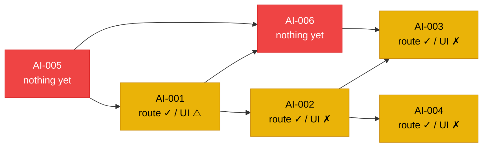
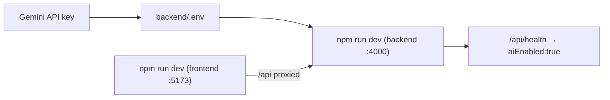
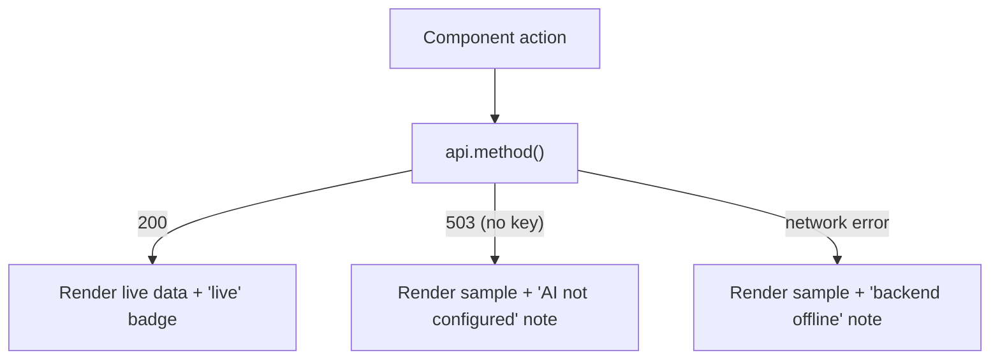
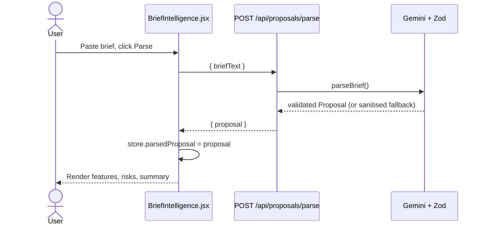
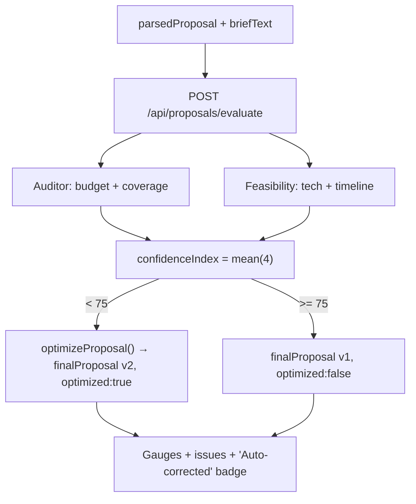
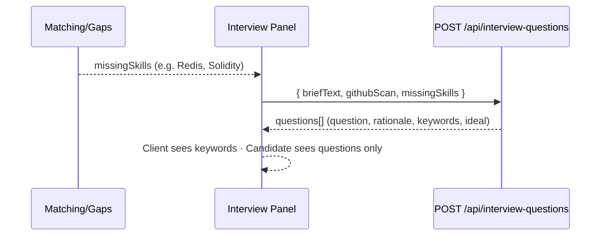
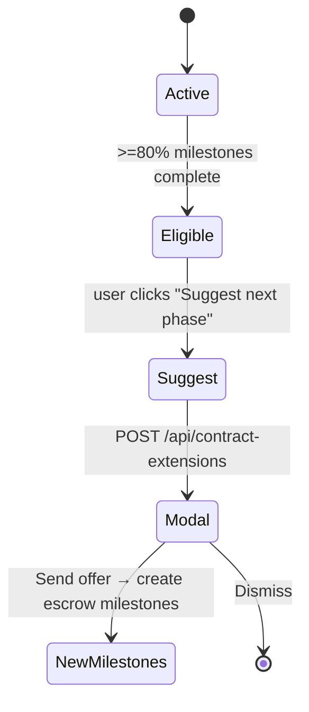
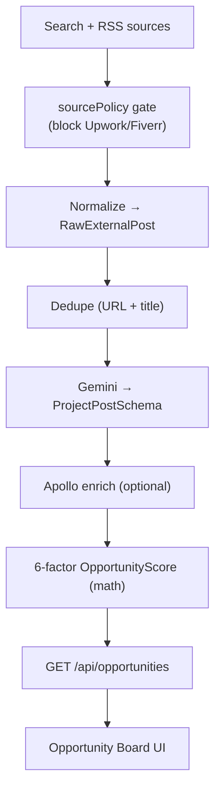
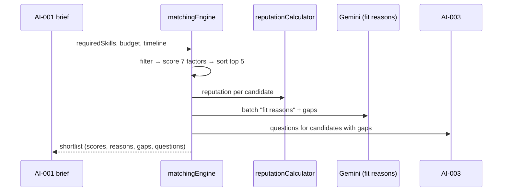
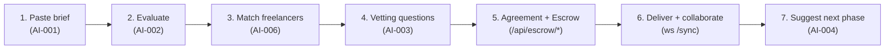

# FixFlowAI — AI Features Implementation Playbook

> **Purpose:** The six `ai_00X_*.md` specs describe *what* each feature is and *why* it exists. This playbook is the missing **"how do I actually make it work"** layer — a sequenced, step-by-step build guide that ties the specs to the real code in this repo. It favours **plain-English steps and diagrams over code**; you write the code, this tells you exactly what to do and in what order.

> **How to read this:** Start at Section 1 (current state) so you know what already exists, then Section 2 (one-time setup). After that, each feature has its own playbook (Sections 4–9) you can follow independently. Section 10 is the end-to-end test, Section 11 is the master checklist.

---

## 1. Current State Snapshot (read this first)

This reflects what is **actually wired today**, not the original spec assumptions. The earlier specs say "❌ No HTTP route" — that is now out of date for AI-001 through AI-004.

| Feature | Skill module | HTTP route | Frontend UI | What's left to do |
|:---|:---:|:---:|:---:|:---|
| **AI-001** Brief Parsing | ✅ `briefParser.ts` | ✅ `POST /api/proposals/parse` | ⚠️ Wired in `BriefIntelligence.jsx` | Render full proposal everywhere; optional SSE streaming |
| **AI-002** Confidence Grid | ✅ `confidenceGrid.ts` | ✅ `POST /api/proposals/evaluate` | ❌ Mock in `EvidenceConfidence.jsx` | Wire the evaluate call + score gauges |
| **AI-003** Interview Gen | ✅ `interviewGenerator.ts` | ✅ `POST /api/interview-questions` | ❌ None | Build an Interview panel UI |
| **AI-004** Contract Extensions | ✅ `contextExtensions.ts` | ✅ `POST /api/contract-extensions` | ❌ None | Add a "Suggest next phase" widget |
| **AI-005** Opportunity Intelligence | ❌ Not built | ❌ None | ❌ None | Build connectors → scoring → board (largest effort) |
| **AI-006** Matching Engine | ⚠️ Reuses calculators | ❌ None | ❌ None | Build `matchingEngine.ts` + `/api/leads/match` + shortlist UI |

Supporting endpoints already live: `/api/earnings`, `/api/reputation`, `/api/client-score`, the full `/api/escrow/*` state machine, and the `ws://…/sync` collaboration socket. The frontend API client (`frontend/src/lib/api.js`) already has typed methods for every endpoint above.

---

## 2. One-Time Setup (do this before any feature)

These steps make the AI calls actually reach Gemini. Without them, every AI endpoint returns a clean `503` and the UI falls back to sample data.

1. **Get a Gemini API key** from Google AI Studio.
2. **Create the backend env file.** Copy `backend/.env.example` to `backend/.env` and set `GEMINI_API_KEY`. Leave `GEMINI_MODEL=gemini-2.5-pro` and `PORT=4000`.
3. **Start the backend:** in `backend/`, run `npm install` once, then `npm run dev`. You should see `AI features ENABLED` in the log.
4. **Start the frontend:** in `frontend/`, run `npm install` once, then `npm run dev`. Vite proxies `/api` → `http://localhost:4000` automatically.
5. **Confirm the link:** open `http://localhost:4000/api/health` — it should report `"aiEnabled": true`.

> **Rule of thumb:** the deterministic features (earnings, reputation, client score, escrow) work with **no key**. Everything that calls Gemini (AI-001/002/003/004/005 extraction, AI-006 fit reasons) needs the key.

---

## 3. The Patterns You Will Reuse Everywhere

Learn these four patterns once; every feature below is an application of them.

### 3.1 The Gemini + Zod "double validation" pattern (backend)
Every AI skill already does this — you rarely need to touch it. The flow: build a prompt → ask Gemini with `responseMimeType: application/json` and a native response schema → `JSON.parse` → validate with a Zod schema → on failure, run a sanitiser that fills safe defaults so the function **never throws**. When you add a *new* AI skill (AI-005 extraction, AI-006 fit reasons), copy this shape from `briefParser.ts`.

### 3.2 The "thin route" pattern (backend)
A route does only: validate the request body → call the skill function with the env key → map known errors to status codes → return JSON. Keep business logic in the skill/service, not the route. See the existing routes in `backend/src/index.ts` as the template.

### 3.3 The API-client method pattern (frontend)
Never call `fetch` from a component. Add one method to `frontend/src/lib/api.js` (it already centralises base URL, JSON handling, and network-error detection), then call `api.something()` from the component.

### 3.4 The "graceful fallback" pattern (frontend)
Every AI-backed component should: call the API → on success show live data and a "live" badge → on failure (503 or network) show sample data and a small notice explaining why. `BriefIntelligence.jsx` is the reference implementation — copy its try/catch/finally structure.

---

## 4. AI-001 — Semantic Brief Parsing (finish the UI)

**State:** backend done, `BriefIntelligence.jsx` wired. Remaining work is rendering the full proposal and (optionally) streaming.

### Steps
1. **Confirm the round trip.** In the dashboard's Brief Ingestion tab, paste a brief and parse. With a key set, the "Parsed live by the Gemini brief parser" badge should appear and real feature/risk cards should render. If you see the orange fallback note, your key isn't set (revisit Section 2).
2. **Surface the proposal across tabs.** The parsed proposal lives in the Zustand store (`parsedProposal`). Make `ProposalGenerator.jsx` (already done) and any new proposal views read from that single source so the brief only has to be parsed once.
3. **Replace the fake scope score.** Today the scope-stability number is derived from `text.length`. Replace it with a real signal: average the `confidence_pct` across `parsedProposal.features`, or add a dedicated "brief quality" number to the parser's schema and read that.
4. **(Optional) Add streaming for premium UX.** Add a second backend route that streams Server-Sent Events as sections complete, and swap the component's loading spinner for an `EventSource` listener. This is a polish item, not required for correctness.

### Verify
- Well-formed brief → high-confidence feature cards.
- Empty brief → button stays disabled / 400 from API.
- Key removed → orange fallback note, UI still usable.

---

## 5. AI-002 — Confidence Grid (wire the evaluation UI)

**State:** backend route `POST /api/proposals/evaluate` exists; `EvidenceConfidence.jsx` is still mock. This is the highest-value next task.

### Steps
1. **Trigger evaluation from the proposal.** After AI-001 produces `parsedProposal`, call `api.evaluateProposal(briefText, parsedProposal)` — either automatically when the Evidence tab opens, or behind a "Run evaluation" button.
2. **Render the four scores.** The response gives `auditor.{budget_alignment_score, deliverable_coverage_score}` and `feasibility.{technical_feasibility_score, timeline_realism_score}`. Show each as a gauge/bar, and show `confidenceIndex` (their mean) as the headline number.
3. **Show the issues.** Render `auditor.issues[]` and `feasibility.issues[]` as two collapsible lists; show the `findings` narrative under each.
4. **Show self-correction state.** If `optimized === true`, display a badge ("⚡ Auto-corrected") and render `finalProposal` (the improved version) instead of the original.
5. **Cache the result.** Store the evaluation in the store keyed by proposal; only re-evaluate when the proposal changes or the user clicks "Re-evaluate" (each evaluation is 2–3 Gemini calls).

### Verify
- Strong proposal → index ≥ 75, `optimized:false`.
- Proposal missing deliverables → coverage score drops, issues populated, self-correction may trigger.
- Key invalid → both agents return neutral 70s (built-in fallback), UI still renders.

---

## 6. AI-003 — Interview & Vetting Generation (build the panel)

**State:** backend route `POST /api/interview-questions` exists; no UI.

### Steps
1. **Decide where it lives.** Simplest: a new "Vetting" sub-view, or a section inside the candidate/overview screen. It needs three inputs: `briefText`, a `githubScan` summary (string or object), and a `missingSkills` array.
2. **Source the inputs.** `briefText` comes from the active brief. `missingSkills` comes from AI-002 / AI-006 (the gap between required skills and candidate skills). For a first pass you can let the user type missing skills manually.
3. **Call the API.** `api.interviewQuestions(briefText, githubScan, missingSkills)` returns `{ questions: [...] }`, each with `question`, `rationale`, `expectedKeywords[]`, `idealAnswerSummary`.
4. **Render two views.** A **client view** that shows questions + expected keywords (for grading), and a **candidate view** that shows only the questions with answer inputs.
5. **(Optional) Add evaluation.** Compare submitted answers against `expectedKeywords` for a simple match score, or feed answers back to Gemini for AI grading (a future enhancement noted in the spec).

### Verify
- 0 missing skills → generic-but-relevant fallback questions still return (skill never blocks).
- 3 missing skills → ~3 targeted questions.
- Key removed → fallback question set returns (the skill self-heals), so the panel still works.

---

## 7. AI-004 — Contextual Contract Extensions (add the widget)

**State:** backend route `POST /api/contract-extensions` exists; no UI.

### Steps
1. **Pick the trigger.** Per the spec, show a "🔮 Suggest next phase" button in `DeliveryControl.jsx` when ≥80% of milestones are complete (you can read milestone state from the escrow store/endpoints).
2. **Gather inputs.** Two things: `completedDeliverables` (titles/descriptions of finished milestones — pull from the escrow milestones) and a `chatSummary` string (for now, a manual summary box or a static placeholder).
3. **Call the API.** `api.contractExtensions(completedDeliverables, chatSummary)` returns `extensionReasoning`, `suggestedMilestones[]` (title, description, duration, complexity, budget %), and a ready-to-send `extensionOfferDraft`.
4. **Render a suggestions modal.** Show the reasoning, the suggested milestone cards, and the editable offer draft. Add "Send offer", "Modify", "Dismiss" actions.
5. **(Optional) One-click extension.** "Send offer" can create new draft escrow milestones via `POST /api/escrow/milestones` and route the user into the Agreement Composer pre-filled.

### Verify
- Few milestones complete → button hidden.
- All complete + a chat summary mentioning future work → richer, more confident suggestions.
- Key removed → built-in fallback suggestions (support + optimization phases) still return.

---

## 8. AI-005 — Opportunity Intelligence (build from scratch — largest effort)

**State:** nothing built. This is a multi-day pipeline. Build it in the order below; each stage is independently testable.

### Build order (each bullet is a stage you can verify before moving on)
1. **Source Policy Gate first.** Create `backend/src/connectors/sourcePolicy.ts` defining allowed/blocked domains (block Upwork/Fiverr/etc.) and per-source rules (cache TTL, attribution, whether apply-on-source). Nothing else can run until this exists.
2. **Discovery connectors.** Add search connectors (Tavily, Brave, SerpAPI) that return raw results. Run them through the policy gate. Start with **one** connector to prove the path, then add the others.
3. **Ingestion connectors.** Add feed sources (Remotive/WWR/Himalayas RSS, Reddit r/forhire, HN "Who's hiring"). The `rss-parser` package + HN's free API is the cheapest route; Apify is optional.
4. **Normalize + dedupe.** Map every raw result into one `RawExternalPost` shape, then dedupe by URL hash + title similarity.
5. **Gemini extraction.** Reuse the AI-001 pattern to turn each `RawExternalPost` into a structured `ProjectPostSchema` (title, requiredSkills, budget, urgency, briefQuality, scamIndicators).
6. **Enrichment (optional).** Add Apollo.io company enrichment to compute a `ClientTrust` signal.
7. **Scoring engine.** Implement the 6-factor `OpportunityScore` (this is **math, not Gemini**): `SkillMatch·30 + BudgetFit·20 + Recency·15 + BriefQuality·15 + SourceCompliance·10 + ClientTrust·10 − ScamPenalty`.
8. **Expose + schedule.** Add `GET /api/opportunities` (ranked per freelancer) and run discovery/ingestion on a schedule (BullMQ or a simple cron) rather than on request.
9. **Frontend board.** Build an Opportunity Board tab: filters (skills, budget, source), scored cards with a score-breakdown tooltip, "Draft proposal" (pre-fills AI-001) and "Apply on source" actions.

### Verify
- A Reddit r/forhire URL passes the gate; an Upwork URL is silently blocked.
- Same post from two sources collapses to one entry.
- A "pay in crypto only" post gets a scam penalty and ranks low.

---

## 9. AI-006 — Matching Engine (build the shortlist)

**State:** the scoring inputs exist (`reputationCalculator.js`, `clientScoring.js`, GitHub scan data) but there is no matching module or route.

### Steps
1. **Create the engine.** Add `backend/src/services/matchingEngine.ts` with `generateShortlist(structuredBrief, limit=5)`. It needs a source of freelancer profiles — until the DB exists, start with an in-memory/seed list so you can build and test the math.
2. **Implement the 7-factor score.** `SkillOverlap·25 + GitHubSignal·20 + DomainExperience·15 + BudgetAlignment·15 + Reputation·10 + Availability·10 + SBTCredentials·5`. Reputation comes from `reputationCalculator.js`. Skill overlap is a Jaccard ratio with synonym mapping (Postgres=PostgreSQL) and parent-skill partial credit (React⇒JavaScript).
3. **Filter then rank.** Apply hard filters first (≥50% skill overlap, available, verified), then score, sort, take top N.
4. **Generate "fit reasons" with Gemini.** For the top candidates, batch one Gemini call to produce human-readable reasons and to identify skill gaps. Reuse the AI-001 prompt+schema pattern.
5. **Trigger AI-003 for gaps.** If a top candidate has skill gaps, call the interview generator to attach vetting questions.
6. **Add the route.** `POST /api/leads/match` taking `{ proposalId, limit }`, returning the shortlist with `compositeScore`, `factorBreakdown`, `fitReasons`, `skillGaps`, and `interviewQuestions`.
7. **Reverse-score the client.** When showing a lead to a freelancer, call `clientScoring.js` so the freelancer sees `SCOPE_CREEP_RISK` / `LATE_PAYER_RISK` / `PREMIUM_CLIENT` labels.
8. **Frontend.** Build shortlist cards (score, top fit reasons, skill-gap badges, SBT badge) with an expandable 7-factor radar chart.

### Verify
- Candidate with all required skills → high `SkillOverlap`, ranks top.
- Candidate with 0 blockchain repos for a Solidity brief → gap flagged, interview questions attached.
- Overcommitted candidate (many active escrows) → `AvailabilityFit` drops, ranks lower.

---

## 10. End-to-End Integration Test (the "happy path")

Once AI-001, 002, and 006 are wired, walk this full loop to prove the pipeline:

1. Parse a realistic brief → structured proposal renders.
2. Evaluate it → four scores + confidence index; self-correction badge if it was weak.
3. Match → a 3–5 candidate shortlist with fit reasons.
4. Generate vetting questions for a candidate with gaps.
5. Create escrow milestones and run a transition (Draft→…→Funds_Released) — confirm the audit chain verifies.
6. Open the same proposal in two browser tabs and confirm `ws /sync` propagates edits.
7. With milestones complete, generate contract extensions.

---

## 11. Master Build Checklist

Work top-to-bottom; earlier items unblock later ones.

- [ ] **Setup:** `.env` with `GEMINI_API_KEY`; both servers running; `/api/health` shows `aiEnabled:true`.
- [ ] **AI-001:** full proposal rendered from `parsedProposal`; real scope score; (optional) SSE streaming.
- [ ] **AI-002:** `EvidenceConfidence.jsx` calls `evaluateProposal`; gauges + issues + auto-correct badge; result cached.
- [ ] **AI-006:** `matchingEngine.ts` + `POST /api/leads/match`; shortlist UI; client reverse-scoring.
- [ ] **AI-003:** interview panel; inputs sourced from AI-006 gaps; client/candidate views.
- [ ] **AI-005:** source policy gate → connectors → normalize/dedupe → Gemini extraction → scoring → board.
- [ ] **AI-004:** "suggest next phase" widget in delivery; one-click extension into escrow.
- [ ] **E2E:** the Section 10 happy path passes end to end.

---

## 12. Troubleshooting Quick Reference

| Symptom | Likely cause | Fix |
|:---|:---|:---|
| Every AI call shows the orange fallback note | No `GEMINI_API_KEY` | Set it in `backend/.env`, restart backend |
| `/api/health` shows `aiEnabled:false` | Key missing or backend not reloaded | Re-check `.env`, restart `npm run dev` |
| Frontend AI calls 404 / fail | Backend not running or wrong port | Start backend on 4000; Vite proxy targets 4000 |
| `503` from an AI endpoint | Server has no key (by design) | This is the intended guard, not a bug |
| Confidence index always 70 | Both agents hit their fallback (Gemini failed) | Check key validity / Gemini quota |
| Opportunity board empty | Discovery not scheduled, or all sources blocked | Verify connectors run on schedule; check source policy |

---

## Cross-References

| Document | Relevance |
|:---|:---|
| [README.md (AI Features Index)](./README.md) | Feature registry + dependency map |
| [ai_001 … ai_006](./README.md) | The per-feature "what & why" specs |
| [skills.md](../core_subsystems/skills.md) | Backend skill module internals |
| [backend_connectivity_roadmap.md](../architecture/backend_connectivity_roadmap.md) | Phased backend integration |
| [frontend_implementation_guide.md](../frontend/frontend_implementation_guide.md) | Component-level integration |
| [opportunity_intelligence_implementation.md](../core_subsystems/opportunity_intelligence_implementation.md) | Full AI-005 technical spec |
