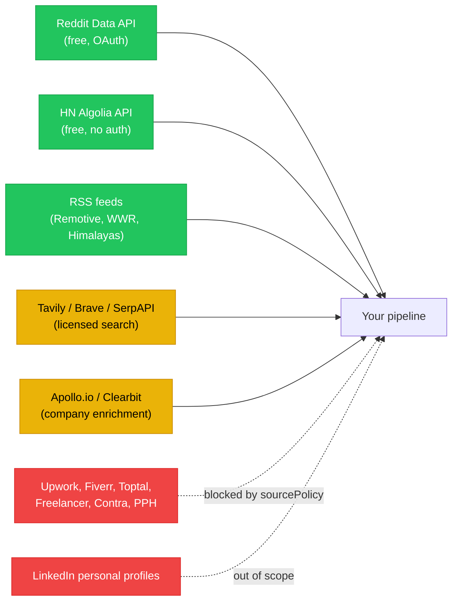
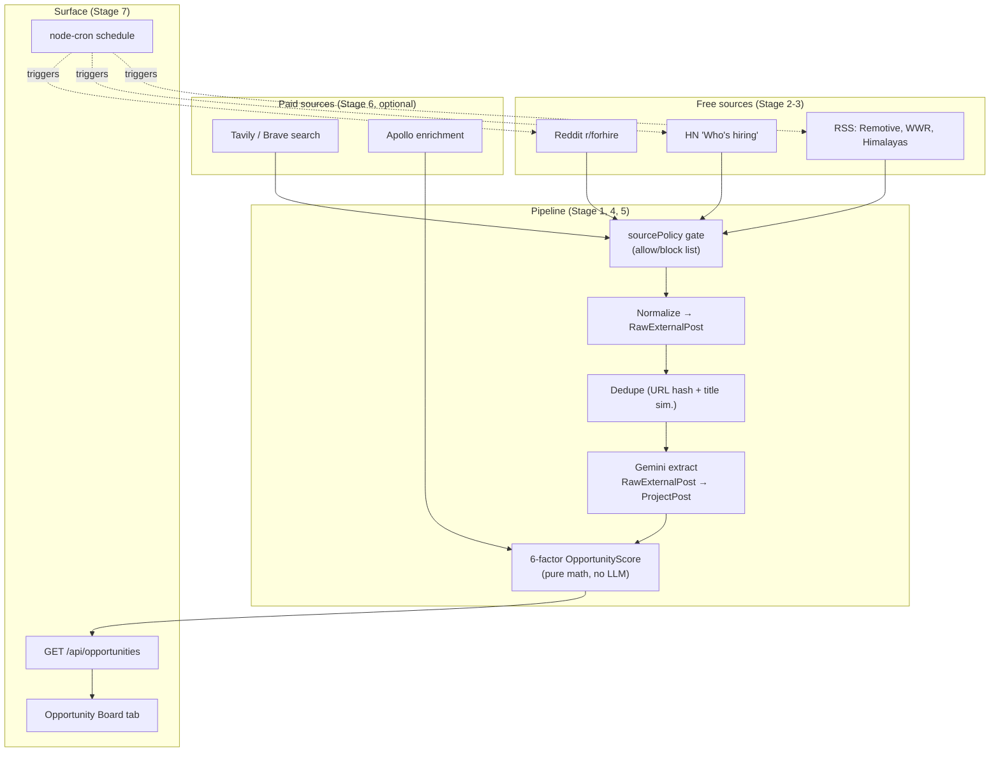
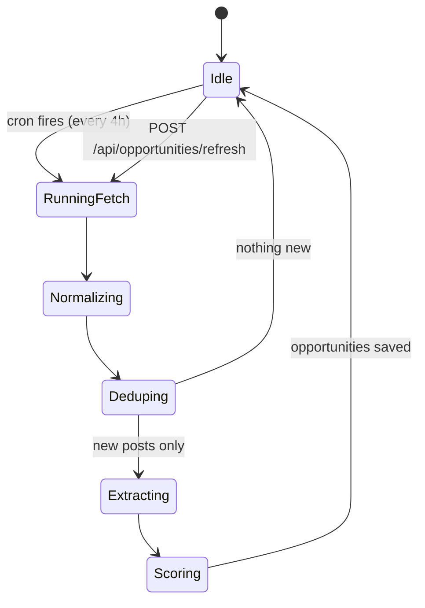
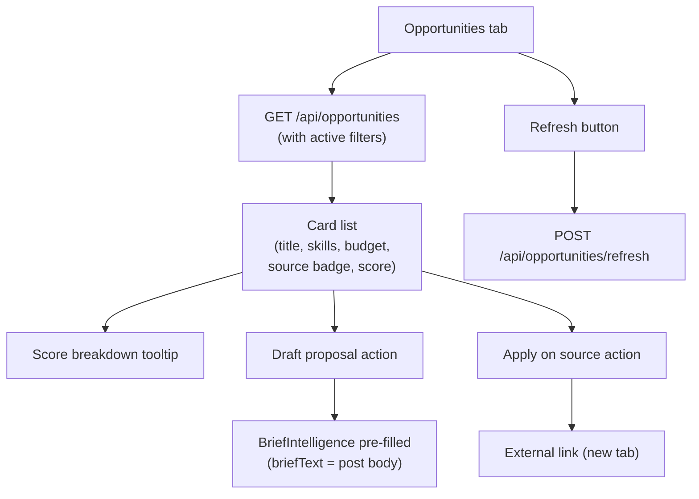

# AI-005 — Opportunity Intelligence Build Guide

> **Purpose:** A practical, sequenced build guide for **discovering external project leads (client data) legally**, normalizing them, scoring them, and surfacing them in the dashboard. This is the missing step-by-step "how to actually build it" layer between [ai_005_opportunity_intelligence_scoring.md](./ai_005_opportunity_intelligence_scoring.md) (the *what*) and the codebase (the *how*).
>
> **How to read this:** Sections 1–4 frame the problem. Section 5 is the 7-stage build order — follow it top-to-bottom. Each stage is independently testable; you can ship after Stage 5 (free sources only) and add paid sources later. Section 11 is the master checklist.

---

## 1. Scope of "client data" (read this first)

There is no single thing called "client data." When you hear "scrape clients," it almost always means one of three different things, with very different rules:

| Layer | What it is | Where it comes from | Legal posture |
|:---|:---|:---|:---|
| **Project leads** | "I need a Stripe→Razorpay migration, $5K, React stack" | Reddit, HN, RSS job boards, search results | ✅ Public posts, official APIs, RSS = fine |
| **Company enrichment** | Company size, industry, funding, tech stack | Apollo, Clearbit, ZoomInfo APIs | ✅ Licensed data, paid per credit |
| **Personal contacts** | Name, email, phone, LinkedIn URL of decision-makers | LinkedIn, contact-finder tools | ⚠️ Heavily restricted (GDPR/CCPA, LinkedIn ToS) — **out of scope for this guide** |

**This guide covers layers 1 and 2 only.** Layer 3 (personal PII) is a legal liability project, not a technical project — when you need it, route through consent-based flows (a freelancer connects their own LinkedIn, a client invites people themselves).

---

## 2. The "no scraping" foundation

You don't need a scraper to build this. Public APIs and RSS feeds cover ~80% of useful opportunity data, legally and predictably.



**Hard rules:**
- **Never scrape** Upwork, Fiverr, Freelancer.com, Toptal, Contra, PeoplePerHour, or LinkedIn. Their ToS prohibits it and they actively litigate.
- **Always honour `robots.txt`** on any public site you fetch.
- **Always rate-limit** your fetchers. A polite default is 1 request per second per source.
- **Always send a real `User-Agent`** identifying your service and a contact email.
- **Never store personal PII** without explicit consent of the person.

A single config file (`sourcePolicy.json`) enforces the blocklist for the whole pipeline — see Stage 1 below.

---

## 3. Architecture at a glance



The pipeline is **one direction, one storage tier**. Each connector produces `RawExternalPost`; the rest of the system never cares which source it came from.

---

## 4. File layout (the integration seam)

Everything new lives in two folders. Nothing existing changes except `index.ts` (one route + one cron call) and `.env.example` (new variables).

```
backend/
  data/
    source-policy.json              ← allow/block sources, per-source rules
  src/
    connectors/
      sourcePolicy.ts               ← reads source-policy.json, exports gate fns
      rssConnector.ts               ← generic RSS reader (Remotive/WWR/Himalayas)
      hnConnector.ts                ← HN Algolia API
      redditConnector.ts            ← Reddit Data API (OAuth)
      (later: tavilyConnector.ts, braveConnector.ts, apolloEnrichment.ts)
    services/
      opportunityRepository.ts      ← stores RawExternalPost + Opportunity (seed/HTTP/DB)
      opportunityNormalizer.ts      ← raw → RawExternalPost
      opportunityDedup.ts           ← URL hash + Levenshtein title sim
      opportunityExtractor.ts       ← Gemini call: RawExternalPost → ProjectPost
      opportunityScorer.ts          ← 6-factor OpportunityScore (pure math)
      opportunityScheduler.ts       ← node-cron wiring; calls all enabled connectors
    routes/
      opportunities.ts              ← GET /api/opportunities (+ filters)
```

**Why this shape:** every stage is a pure function. The scheduler is the only stateful runner. The repository is the only thing that touches storage. You can ship Stage 1–5 with a JSON seed repository today and swap it for Postgres later by implementing the same `OpportunityRepository` interface — the same pattern already used by `freelancerRepository.ts`.

---

## 5. The 7-stage build order

Each stage is independently testable. Ship after Stage 5 for a working free-sources MVP; Stage 6 and 7 are upgrades.

### Stage 1 — Source policy gate (the legal foundation)

**Goal:** A single source of truth for "which sources are allowed, which are blocked, and what rules apply to each."

1. Create `backend/data/source-policy.json` listing every source you intend to ingest from, with:
   - `sourceKey` (e.g. `"reddit_forhire"`), `displayName`, `urlDomain`, `riskLevel` (`low|medium|high|blocked`)
   - `enabled` (boolean — feature flag per source)
   - `cacheMaxHours` (TTL after which we re-fetch)
   - `storeFullText` (whether we may persist the full post body)
   - `attribution` (string shown to users when displaying)
   - `applyAction` (`apply_on_source | draft_only | client_claim`)
2. Add a blocklist section: `["upwork.com", "fiverr.com", "freelancer.com", "toptal.com", "contra.com", "peopleperhour.com", "linkedin.com"]`. Every URL the pipeline sees passes a domain check against this list **before anything else**.
3. Create `backend/src/connectors/sourcePolicy.ts` exporting:
   - `isAllowed(url: string): boolean` — domain check + blocklist
   - `getSourceRules(sourceKey: string): SourceRules | null`
   - `listEnabledSources(): SourceConfig[]` — drives the scheduler
4. **Test:** unit-test that a Reddit URL passes, an Upwork URL is blocked, a disabled source returns `enabled:false`.

> **Why data-driven:** when you decide to enable Tavily, you add an entry to `source-policy.json` — you don't write code or rebuild.

### Stage 2 — Repository (where leads live)

**Goal:** Storage for `RawExternalPost` and the derived `Opportunity` rows. Same pattern as `freelancerRepository.ts`.

1. Define the `OpportunityRepository` interface with: `saveRaw`, `findRawByUrlHash`, `saveOpportunity`, `listOpportunities(filters)`.
2. Implement two providers selectable via env (`OPPORTUNITY_PROVIDER=seed|sqlite|postgres`):
   - **seed**: in-memory `Map`, dumped to/loaded from a JSON file (`OPPORTUNITY_STORE_FILE`).
   - **future**: Postgres/Prisma — implement the same interface, change one env var.
3. **Test:** save a raw post, fetch it back by URL hash.

### Stage 3 — Free connectors

**Goal:** Three working sources with zero paid keys.

#### 3a. HN connector (start here — easiest, no auth)
- Endpoint: `https://hn.algolia.com/api/v1/search_by_date?tags=story&query=hiring` (and `query=for hire`).
- For each hit: build a `RawExternalPost` with `sourceKey: "hn_hiring"`, `url`, `title`, `body`, `postedAt`.
- Pass each through `sourcePolicy.isAllowed`.

#### 3b. RSS connector (using `rss-parser` npm package)
- Sources: `https://remotive.com/remote-jobs/feed`, `https://weworkremotely.com/categories/remote-programming-jobs.rss`, `https://himalayas.app/jobs/rss`.
- Parse with `rss-parser`, map each item → `RawExternalPost`.
- Respect each source's stated rate limits (RSS feeds tolerate ~hourly polling).

#### 3c. Reddit connector (Reddit Data API, OAuth client credentials)
- Register an app at https://www.reddit.com/prefs/apps → get `REDDIT_CLIENT_ID` + `REDDIT_CLIENT_SECRET`.
- Auth flow: `POST https://www.reddit.com/api/v1/access_token` with HTTP Basic auth → get bearer token (1-hour TTL, cache in memory).
- Fetch: `GET https://oauth.reddit.com/r/forhire/new.json` (and `/r/slavelabour/new.json` for cheap jobs).
- Use a real `User-Agent: FixFlowAI/0.1 (contact: you@example.com)` — Reddit rejects generic ones.

**Test each connector independently:** call it from a `node --eval` snippet, log the first 3 results. Don't move on until all three return real data.

### Stage 4 — Normalize + dedupe

**Goal:** Every connector funnels through one shape; duplicates collapse.

1. **Normalize** (`opportunityNormalizer.ts`): every source's result becomes one shape:
   ```
   RawExternalPost {
     sourceKey: string
     url: string
     urlHash: string         ← SHA-256(url) for fast lookup
     title: string
     body: string             ← may be empty for some sources
     author?: string
     postedAt: ISODateString
     fetchedAt: ISODateString
     raw: unknown             ← the original payload (for debugging)
   }
   ```
2. **Dedupe** (`opportunityDedup.ts`): two checks before saving:
   - **URL hash match** — same `urlHash` in the repo already → skip.
   - **Title similarity** — Levenshtein distance / max(len(a), len(b)) < 0.15 against recent (<48h) posts from any source → mark as duplicate, link them.

3. **Test:** feed the same post from Reddit and HN, confirm only one `RawExternalPost` is stored, with both source attributions linked.

### Stage 5 — Gemini extraction + scoring

**Goal:** Convert messy raw posts into structured `ProjectPost` and rank them per freelancer.

#### 5a. Extraction (`opportunityExtractor.ts`)
- Same pattern as `briefParser.ts`: Zod schema + Gemini `responseSchema` + sanitiser fallback.
- Output shape (`ProjectPostSchema`):
  ```
  ProjectPost {
    title: string
    summary: string
    requiredSkills: string[]
    estimatedBudget?: { min?: number; max?: number; currency: string }
    projectType: enum [migration, mvp, feature, fix, audit, ongoing]
    urgency: enum [low, medium, high]
    durationWeeks?: number
    briefQualityScore: number  ← 0-100, how well-structured the original post is
    scamIndicators: string[]   ← e.g. ["crypto-only payment", "asks for SSN"]
  }
  ```
- Cache the extraction: if a `RawExternalPost` already has a `ProjectPost` attached, don't re-call Gemini.

#### 5b. Scoring (`opportunityScorer.ts`) — math, not LLM
- Compute six factors per opportunity per freelancer:
  ```
  OpportunityScore = w₁·SkillMatch + w₂·BudgetFit + w₃·Recency
                   + w₄·BriefQuality + w₅·SourceCompliance + w₆·ClientTrust
                   − ScamPenalty
  ```
- Weights default to `30/20/15/15/10/10`, configurable via env (same pattern as `MATCH_W_*`).
- `Recency`: decays linearly to 0 over 7 days from `postedAt`.
- `SourceCompliance`: pulled from `sourcePolicy.json` per-source `riskLevel`.
- `ScamPenalty`: sum from `scamIndicators` (each entry contributes a penalty defined in `data/scam-penalties.json` — also data-driven).
- This is a **pure function**: `score(opportunity, freelancerProfile) → ScoredOpportunity`. Reuse the same testing approach as `matchingEngine.ts`.

**Test:** end-to-end smoke: a real HN post → normalized → deduped → extracted (with real Gemini key) → scored against the Maya Chen seed freelancer.

> **Ship checkpoint:** you can ship the product here. Stage 6 and 7 are upgrades.

### Stage 6 — Paid sources (optional upgrades)

Add these only when free sources stop being enough — each is one new file dropping into the existing pipeline.

| Source | What it adds | Cost | New env vars |
|:---|:---|:---|:---|
| **Tavily** | Broader web search, beyond fixed sites | ~$0.01/query, free tier 1000/mo | `TAVILY_API_KEY` |
| **Brave Search** | Independent index, less Google bias | ~$0.005/query | `BRAVE_SEARCH_API_KEY` |
| **SerpAPI (Google Jobs)** | Mainstream job listings | ~$0.01/query, 100 free/mo | `SERPAPI_KEY` |
| **Apollo** | Company enrichment → boosts `ClientTrust` factor | Free tier 100 credits/mo, paid plans from $49/mo | `APOLLO_API_KEY` |

Each follows the same pattern: connector file → returns `RawExternalPost[]` → goes through the gate → same dedup/extract/score path. The `sourcePolicy.json` entry decides if it's enabled.

### Stage 7 — Scheduling + API + UI

#### 7a. Scheduler (`opportunityScheduler.ts`)
- Use `node-cron` (one process-local cron, no Redis required for v1).
- Read `OPPORTUNITY_DISCOVERY_CRON` from env (default `"0 */4 * * *"` — every 4 hours).
- On tick: `listEnabledSources()` → run each connector in parallel → pipe through dedup/extract → save scored opportunities.
- Add a manual trigger: `POST /api/opportunities/refresh` (gated, so a button on the dashboard can trigger an immediate run for the demo).

#### 7b. API endpoint (`routes/opportunities.ts`)
- `GET /api/opportunities` with query filters: `skills`, `minBudget`, `maxBudget`, `source`, `minScore`, `sortBy`, `limit`.
- Returns ranked, scored opportunities for the requesting freelancer.

#### 7c. Frontend Opportunity Board
- Add `Opportunities` tab to the sidebar (sibling of `Matches`).
- Cards show: title, summary, required skills, budget range, source badge with attribution, score breakdown tooltip.
- Actions: **Draft proposal** (pre-fills `BriefIntelligence` with the opportunity context), **Apply on source** (external link to original post).
- Same graceful-fallback pattern: if `/api/opportunities` returns empty, show "No opportunities yet — refresh discovery" CTA.

---

## 6. Data shapes (the contract between stages)

These are the only three shapes the pipeline cares about. Define each as a Zod schema in the corresponding file so validation is consistent.

```text
RawExternalPost   (from connectors, before any AI)
└── sourceKey, url, urlHash, title, body, author?, postedAt, fetchedAt, raw

ProjectPost       (after Gemini extraction)
└── title, summary, requiredSkills, estimatedBudget?, projectType,
    urgency, durationWeeks?, briefQualityScore, scamIndicators

ScoredOpportunity (after scoring; what the frontend consumes)
└── opportunityId, projectPost, sourceKey, postedAt, score,
    factorBreakdown {skillMatch, budgetFit, recency, briefQuality,
                     sourceCompliance, clientTrust, scamPenalty}
```

Make every transition a pure function: `(input) → (output)`. No global state, no DB inside scorer, no fetch inside normalizer. This makes the pipeline testable in isolation and trivially replaceable.

---

## 7. .env contract (what gets added)

These all go into `backend/.env.example`. Leave empty values to disable a source — the scheduler skips disabled ones.

```dotenv
# AI-005: Opportunity Intelligence — data source provider & store
OPPORTUNITY_PROVIDER=seed                # seed | sqlite | postgres
OPPORTUNITY_STORE_FILE=./data/opportunities.store.json
OPPORTUNITY_SOURCES_FILE=./data/source-policy.json
OPPORTUNITY_DISCOVERY_CRON=0 */4 * * *   # every 4 hours by default

# Free sources (Stage 3)
REDDIT_CLIENT_ID=
REDDIT_CLIENT_SECRET=
REDDIT_USER_AGENT=FixFlowAI/0.1 (contact: you@example.com)

# Paid sources (Stage 6, optional)
TAVILY_API_KEY=
BRAVE_SEARCH_API_KEY=
SERPAPI_KEY=
APOLLO_API_KEY=

# Optional: override scoring weights (defaults 30/20/15/15/10/10)
OPP_W_SKILL=
OPP_W_BUDGET=
OPP_W_RECENCY=
OPP_W_BRIEF_QUALITY=
OPP_W_SOURCE=
OPP_W_CLIENT_TRUST=
```

Note: no source is ever named in code. Adding a new source = a new connector file + a new entry in `source-policy.json` + (optionally) a new env var.

---

## 8. Scheduling — why `node-cron`, not n8n

The pipeline only needs *time-based triggers*. Three options, ranked:

| Option | When to choose | Tradeoff |
|:---|:---|:---|
| **`node-cron` in the API process** | v1 / single instance | Simplest, zero infra. Dies with the process. |
| **BullMQ + Redis** | Multiple instances, retries, observability | Adds Redis dep. Already in your planned stack. |
| **n8n / external workflow** | Non-developers manage sources | Adds another service to host. Splits AI-005 across two systems. |

**Recommendation:** ship with `node-cron`. Migrate to BullMQ when you horizontally scale the API. Use n8n only if non-engineers need to add sources — even then, only for the *fetching* stage, posting results into `POST /api/opportunities/ingest`.



---

## 9. Frontend integration

The Opportunity Board is one new dashboard view, following the existing `panel-*` design system used by `MatchResults.jsx`. Same shape, different data:



Reuse the API client pattern in `frontend/src/lib/api.js`:
- `api.opportunities.list(filters)`
- `api.opportunities.refresh()`

Same graceful fallback as the other features: backend unreachable → empty state with a clear CTA.

---

## 10. Cost projection (when you turn on paid sources)

| Component | Free MVP | At ~1K active freelancers |
|:---|:---|:---|
| Reddit Data API | $0 | $0 |
| HN Algolia API | $0 | $0 |
| RSS feeds | $0 | $0 |
| Gemini extraction (1 call/new post) | ~$2/mo at 30 posts/day | ~$15/mo |
| Tavily (optional) | Free tier 1K/mo | ~$12/mo |
| Apollo enrichment (optional) | Free tier 100/mo | ~$49/mo |
| Server (1 vCPU, runs cron + API) | covered by existing hosting | covered |
| **Total** | **~$2/mo** | **~$30–80/mo** |

Compare with paid platform fees that 1000 freelancers would otherwise pay ($50K+/year aggregate to Upwork) — this is the right business equation.

---

## 11. Master build checklist

Tick top to bottom. Each level unblocks the next.

- [ ] **Stage 1 — Policy gate**: `source-policy.json` + `sourcePolicy.ts` with `isAllowed`, `getSourceRules`, `listEnabledSources`. Unit-tested.
- [ ] **Stage 2 — Repository**: `OpportunityRepository` interface; seed provider working; env-switch confirmed.
- [ ] **Stage 3 — Free connectors**: HN, RSS, Reddit returning real `RawExternalPost[]`. Each callable independently.
- [ ] **Stage 4 — Normalize + dedupe**: URL hash + title-similarity dedup verified with two-source duplicate test.
- [ ] **Stage 5 — Extract + score**: Gemini extraction with Zod fallback; 6-factor scorer pure function; smoke-test passes against seed freelancer.
- [ ] **Stage 6 — Paid sources** (optional): Tavily and Apollo added, gated by env keys.
- [ ] **Stage 7 — Schedule + API + UI**: cron runs every 4h; `GET /api/opportunities` filters & sorts; Opportunity Board renders with score breakdowns.
- [ ] **Compliance**: every URL passes the gate; no PII stored; `robots.txt` respected on any direct fetch.

---

## 12. Troubleshooting quick reference

| Symptom | Cause | Fix |
|:---|:---|:---|
| `/api/opportunities` returns empty after deploy | Scheduler hasn't run yet | Call `POST /api/opportunities/refresh` once manually |
| Reddit returns 401 | Missing/expired bearer token | Reauthenticate; verify `REDDIT_USER_AGENT` is non-generic |
| Reddit returns 429 | Rate-limited | Honour the `X-Ratelimit-Reset` header; back off connector |
| All scores are ~50 | `ProjectPost.briefQualityScore` returning fallback | Check Gemini extraction logs; usually means key missing → 503 fallback hit |
| Same post appearing twice | Dedup window too short | Increase Levenshtein lookback from 48h to 72h in `opportunityDedup.ts` |
| Tavily charges higher than expected | No source-key filter — fetching too broadly | Tighten `tavilyConnector.ts` query templates |
| Cron not firing | `node-cron` expression invalid | Validate with https://crontab.guru |

---

## 13. Where to read more in this repo

| Document | Why it matters |
|:---|:---|
| [ai_005_opportunity_intelligence_scoring.md](./ai_005_opportunity_intelligence_scoring.md) | The "what & why" spec (problem framing, score formula derivation) |
| [opportunity_intelligence_implementation.md](../core_subsystems/opportunity_intelligence_implementation.md) | Original technical implementation spec |
| [opportunity_intelligence_alternative_platforms.md](../core_subsystems/opportunity_intelligence_alternative_platforms.md) | Comparison of connector tools (Apify vs direct API) |
| [client_project_ingestion_feasibility.md](../core_subsystems/client_project_ingestion_feasibility.md) | Legal & compliance feasibility |
| [ai_features_implementation_playbook.md](./ai_features_implementation_playbook.md) | Section 8 has the 9-stage high-level summary this guide expands |
| `backend/src/services/freelancerRepository.ts` | Pattern reference for `OpportunityRepository` |
| `backend/src/services/matchingEngine.ts` | Pattern reference for env-configurable weights & pure-function scoring |
| `backend/src/skills/briefParser.ts` | Pattern reference for Gemini + Zod extraction with fallback |

---

## 14. Two honest reminders

1. **Don't store PII you don't need.** The pipeline never has to keep author personal info — only the source attribution and the post content. Store the minimum that lets you display attribution and link back to the original.
2. **Re-read the gate before every new source.** The `sourcePolicy.json` is the single defense between you and a takedown. Don't bypass it "just this once" for a high-value source — add the source properly with its real rules.

When you're ready to start building, begin at Stage 1 and resist the temptation to skip ahead. The gate is small, dull code, and the rest of the pipeline depends on it being right.
