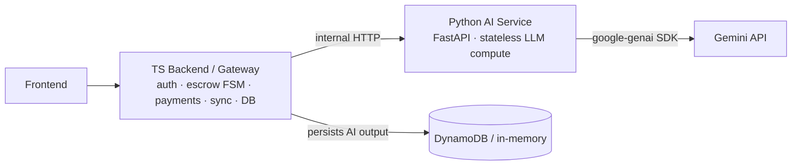

# FixFlowAI — AI Layer Migration to Python (FastAPI)

> **Goal:** Move the four LLM-powered AI features out of the TypeScript backend into a dedicated, stateless Python (FastAPI) service, while keeping auth, escrow FSM, payments, sync, and all persistence in TypeScript.

---

## 1. Architecture



**Boundary rules**
- Python is **stateless**: inputs in → validated JSON out. It never touches the DB or Razorpay.
- TS remains the **only** internet-facing API and the **system of record**. It persists proposals/evaluations via `proposalRepository`.
- The frontend never calls Python directly. Only the TS backend calls it (private network + optional shared-secret header).
- **Schema parity is the contract.** The Pydantic models in Python mirror the TS/Zod `Proposal` shape field-for-field.

---

## 2. What moves vs. what stays

| Feature / file | Destination |
|---|---|
| `skills/briefParser.ts` (AI-001) | → Python `app/features/brief_parser.py` |
| `skills/confidenceGrid.ts` (AI-002) | → Python `app/features/confidence_grid.py` |
| `skills/interviewGenerator.ts` (AI-003) | → Python `app/features/interview.py` |
| `skills/contextExtensions.ts` (AI-004) | → Python `app/features/extensions.py` |
| `auth/*`, `routes/auth.ts` | Stay TS |
| `skills/escrowStateMachine.ts`, `services/escrowService.ts`, `milestoneRepository.ts` | Stay TS |
| `services/paymentService.ts`, `skills/earningsCalculator.js` | Stay TS |
| `skills/syncServer.ts` | Stay TS |
| `services/matchingEngine.ts` (AI-006), `reputationCalculator.js`, `clientScoring.js` | Stay TS (deterministic; move only if they become ML-driven) |
| `services/proposalRepository.ts`, `userRepository.ts`, `freelancerRepository.ts` | Stay TS |

---

## 3. Endpoint mapping (TS route → Python endpoint)

| TS route (stays, now proxies) | Python endpoint (owns the logic) |
|---|---|
| `POST /api/proposals/parse` | `POST /ai/brief/parse` |
| `POST /api/proposals/evaluate` | `POST /ai/confidence/evaluate` |
| `POST /api/interview-questions` | `POST /ai/interview/generate` |
| `POST /api/contract-extensions` | `POST /ai/extensions/generate` |

Example flow (brief parse): FE → TS `/api/proposals/parse` (auth check) → TS calls Python `/ai/brief/parse` → Python calls Gemini, returns validated proposal JSON → **TS persists via `proposalRepository`** → returns to FE.

---

## 4. Python service layout

```
ai-service/
├── requirements.txt
├── .env.example
├── README.md
└── app/
    ├── main.py              # FastAPI app + routes + optional shared-secret auth
    ├── config.py            # settings from env (key, model, threshold, token)
    ├── llm/gemini.py        # async google-genai wrapper
    ├── schemas/
    │   ├── proposal.py      # Proposal + all sub-models (mirror of Zod)
    │   ├── confidence.py    # Auditor/Feasibility/ConfidenceGridResult
    │   ├── interview.py
    │   └── extensions.py
    └── features/
        ├── brief_parser.py      # AI-001
        ├── confidence_grid.py   # AI-002 (+ self-correction)
        ├── interview.py         # AI-003
        └── extensions.py        # AI-004
```

---

## 5. TS-side changes

1. **New** `backend/src/types/ai.ts` — plain-TS `Proposal` + `ConfidenceGridResult` types (no Zod), so `proposalRepository` and routes keep compiling after the skills are removed.
2. **New** `backend/src/services/aiClient.ts` — thin HTTP client to the Python service (`parseBrief`, `evaluateProposal`, `generateInterviewQuestions`, `generateContractExtensions`). Reads `AI_SERVICE_URL` (+ optional `AI_SERVICE_TOKEN`).
3. **Edit** `backend/src/index.ts` — swap the 4 skill imports/call-sites for `aiClient`; replace the `requireGeminiKey` guard with an `AI_SERVICE_URL` check; report `aiEnabled` from that in `/api/health`.
4. **Edit** `backend/src/services/proposalRepository.ts` — import `Proposal` from `../types/ai.js`.
5. **Trim** `backend/src/test/testSkills.ts` — remove Test 1 (brief sanitize) and Test 8 (interview/extension fallbacks); those now live in Python.
6. **Delete** `briefParser.ts`, `confidenceGrid.ts`, `interviewGenerator.ts`, `contextExtensions.ts`.
7. **Env**: `GEMINI_API_KEY` / `GEMINI_MODEL` now belong to the Python service. TS gains `AI_SERVICE_URL` (+ optional `AI_SERVICE_TOKEN`).

---

## 6. Parity notes

- Prompts are ported verbatim except the brand typo is fixed (**"Dixflow AI" → "FixFlow AI"**).
- Fallback/sanitization behavior is preserved: on any Gemini/validation error, each feature returns the same safe defaults the TS code did, so the API never hard-fails the workflow.
- AI-002 keeps: parallel Auditor + Feasibility, mean-of-4 `confidenceIndex`, single self-correction cycle when `< 75` (threshold/cycles now env-configurable).

---

## 7. Run locally

```bash
# Python AI service
cd ai-service
python -m venv .venv && .venv\Scripts\activate      # Windows
pip install -r requirements.txt
copy .env.example .env                                # set GEMINI_API_KEY
uvicorn app.main:app --reload --port 8000

# TS backend (separate terminal)
cd backend
# set AI_SERVICE_URL=http://localhost:8000 in backend/.env
npm run dev
```
