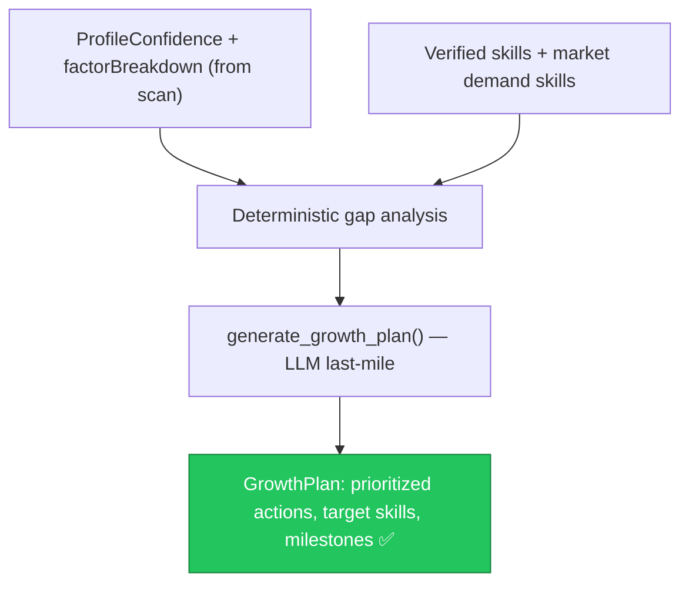

# AI-007 — Freelancer Confidence Growth Plan Engine (New Feature)

> **Role**: AI Engineer · **Priority**: 🟡 High · **Effort**: ~2.5 days
> **Status**: 🔴 Not started. No `/ai/growth/plan` route or growth feature module exists.

---

## Story Identity

| Field | Value |
|:---|:---|
| **Story ID** | `AI-007` |
| **Owner** | AI Engineer |
| **Files** | `ai-service/app/schemas/growth.py` (new), `ai-service/app/features/growth.py` (new), `ai-service/app/main.py` |
| **Depends on** | AIA-03 (skill-gap bridge), GitHub scan engine (built) |

---

## 1. Current Problem

The role-based platform specs introduced a freelancer **confidence score + growth plan** (see [ai_007 spec](../ai_007_freelancer_growth_plan.md)), but nothing implements it. The GitHub scan already produces a `ProfileConfidence` (`score`, `band`, `factorBreakdown`) — what's missing is the feature that turns that breakdown into a **personalized, actionable growth plan**: which skills to strengthen, which project gaps to fill, and what concrete steps move a freelancer from `emerging` → `developing` → `match_ready`.

The confidence **score itself must stay deterministic** (already produced by `confidence_agent`); the LLM only phrases the *plan*, grounded in measured factors — never inventing numbers.

---

## 2. Why It Matters

- **Retention & value**: A growth plan turns a passive confidence score into an engagement loop that improves match-readiness.
- **Reuses existing signal**: The scan's `factorBreakdown` (skill breadth/depth, project strength, recency, contribution volume, documentation) is exactly the input a plan needs.
- **Trust**: Deterministic scoring + grounded LLM phrasing avoids fabricated advice.

---

## 3. Step-Wise Solution

### Step 3.1 — `GrowthPlan` schema
Define `schemas/growth.py`: `currentBand`, `targetBand`, `overallScore`, `prioritizedActions[]` (each: `factor`, `action`, `impact`, `effort`), `targetSkills[]`, and `suggestedProjects[]`.

### Step 3.2 — Deterministic gap analysis
Compute, from `factorBreakdown`, which factors are weakest and how far each is from the next band threshold. This ranking is pure math and testable — it decides *what* to improve.

### Step 3.3 — LLM last-mile
`generate_growth_plan(confidence, skills, experience)` uses `generate_structured()` to phrase concrete, grounded actions constrained to `GrowthPlan`, with a deterministic fallback plan (mirror interview/extensions fallback pattern) so it never hard-fails.

### Step 3.4 — Route
Expose `POST /ai/growth/plan` (guarded by `verify_token`, `require_ai` for the LLM phrasing; still returns the deterministic plan if AI disabled). Add to `/health` feature list.

---

## 4. Done When

- [ ] `GrowthPlan` schema validates.
- [ ] Deterministic gap analysis ranks weakest factors relative to band thresholds.
- [ ] `generate_growth_plan()` returns grounded actions with a safe fallback.
- [ ] `POST /ai/growth/plan` is wired and returns a plan with AI on **and** off.
- [ ] The confidence score is never re-computed or altered by the LLM.
- [ ] Unit tests cover gap ranking + fallback.
- [ ] `python -m compileall app` passes cleanly.

---

## 5. Cross-References

| Document | Relevance |
|:---|:---|
| [ai_007_freelancer_growth_plan.md](../ai_007_freelancer_growth_plan.md) | Feature spec |
| [github.py](../../../../ai-service/app/schemas/github.py) | `ProfileConfidence` + `factorBreakdown` input |
| [AIA-03](./AIA-03-deterministic-skill-gap-bridge.md) | Shared skill-gap logic |
