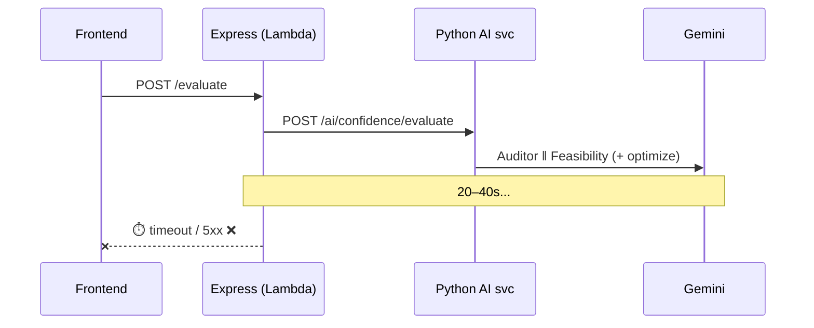
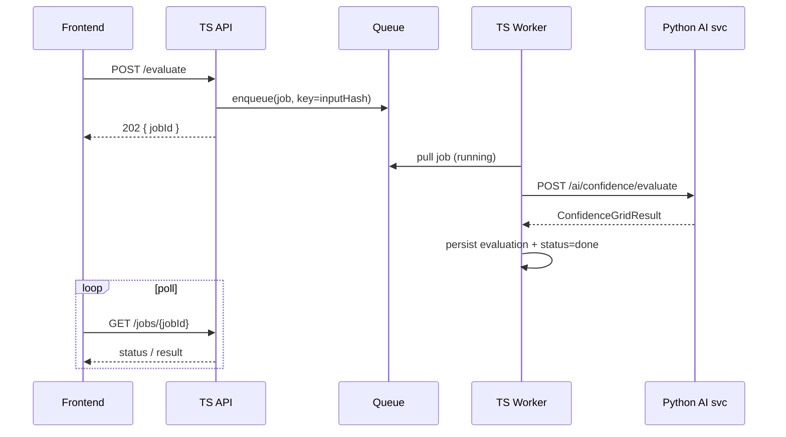

# AIA-01 — Convert Blocking AI-002 Evaluation to Async Job + Poll

> **Role**: AI Automation Engineer · **Priority**: 🔴 Critical · **Effort**: ~3 days

---

## Story Identity

| Field | Value |
|:---|:---|
| **Story ID** | `AIA-01` |
| **Owner** | AI Automation Engineer |
| **Files** | `backend/src/index.ts`, new TS jobs layer (`backend/src/services/jobsRepository.ts` + worker), `backend/src/services/aiClient.ts`; Python `ai-service/app/features/confidence_grid.py` (compute, already built) |
| **Depends on** | [AIA-05 Resilience](./AIA-05-gemini-call-resilience.md) |

---

## 1. Current Problem

`POST /api/proposals/evaluate` calls `aiClient.evaluateProposal()` **synchronously inside the request**, which does a blocking HTTP call to the Python service's `POST /ai/confidence/evaluate`. That Python endpoint runs two parallel Gemini requests (Auditor + Feasibility) and, when the score is low, an additional `optimize_proposal()` call. On `gemini-2.5-pro` this can take tens of seconds — and **both** hops (browser→TS and TS→Python) are held open the whole time.

```ts
// backend/src/index.ts (gateway) — blocks until Python finishes
const result = await evaluateProposal(briefText, proposal);
res.json(result);
```

The [serverless migration plan](../../architecture/serverless_migration_plan.md) and go-live Phase 5 both flag this: on API Gateway/Lambda the request will hit the 29–30s timeout and the client gets a 5xx even though work may still be running. There's also no way to retry or de-duplicate an evaluation.



---

## 2. Why It Matters

- Blocking evaluation is incompatible with the planned serverless deployment.
- No job model means no retries, no idempotency, and no progress visibility for a multi-cycle correction.
- The job/queue and persistence layer belongs in the **TS gateway** (system of record); the worker simply calls the existing Python compute endpoint.

---

## 3. Step-Wise Solution

### Step 3.1 — Add a jobs store (TS)
Create a `jobsRepository` (mirror the existing repository pattern): `{ jobId, type, status: 'queued'|'running'|'done'|'failed', inputHash, result?, error?, createdAt, updatedAt }`. `inputHash` (brief + proposal + model) enables idempotency.

### Step 3.2 — Enqueue instead of execute (TS)
`POST /api/proposals/evaluate` becomes:
1. Validate input (as today).
2. Compute `inputHash`; if a recent `done` job exists, return it (idempotent short-circuit).
3. Create a `queued` job, enqueue it, return `202 { jobId }`.

### Step 3.3 — Worker calls the Python endpoint
A worker (BullMQ locally / SQS+Lambda in prod, per serverless plan §3.7) pulls the job, sets `running`, calls `aiClient.evaluateProposal()` (→ Python `/ai/confidence/evaluate`, which already uses the resilient wrapper), then writes `done` + `result` or `failed` + `error`.

### Step 3.4 — Poll endpoint (TS)
`GET /api/jobs/:jobId` returns status and, when `done`, the `ConfidenceGridResult`. The frontend polls (or subscribes) instead of holding a long request.

### Step 3.5 — Idempotency + retry policy
Use `inputHash` as the queue job key to coalesce duplicate submissions. Configure bounded retries for transient failures (the Python wrapper classifies these — AIA-05); permanent failures fail fast.

### Step 3.6 — Persist evaluation on completion (TS)
On `done`, if a `proposalId` was supplied, call `getProposalRepository().setEvaluation(proposalId, result)` from the worker (same effect the route has today, moved to the worker).



---

## 4. Done When

- [ ] `POST /api/proposals/evaluate` returns `202 { jobId }` and never blocks on the Python call.
- [ ] A TS worker calls the Python evaluate endpoint and writes `done`/`failed` with result/error.
- [ ] `GET /api/jobs/:jobId` returns status and final result.
- [ ] Duplicate submissions coalesce via `inputHash`.
- [ ] Evaluation persistence happens in the worker; `npm run build` passes.

---

## 5. Cross-References

| Document | Relevance |
|:---|:---|
| [Serverless Migration Plan §3.7](../../architecture/serverless_migration_plan.md) | Async AI job pattern |
| [Go-Live Roadmap Phase 5](../../go_live_roadmap.md) | Long-running AI-002 task |
| [AIE-03 Self-Correction](./AIE-03-confidence-grid-self-correction.md) | The logic this job runs |
| [AIA-05 Resilience](./AIA-05-gemini-call-resilience.md) | Retry classification |
