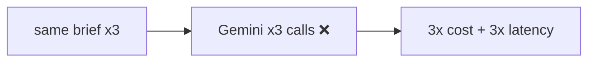
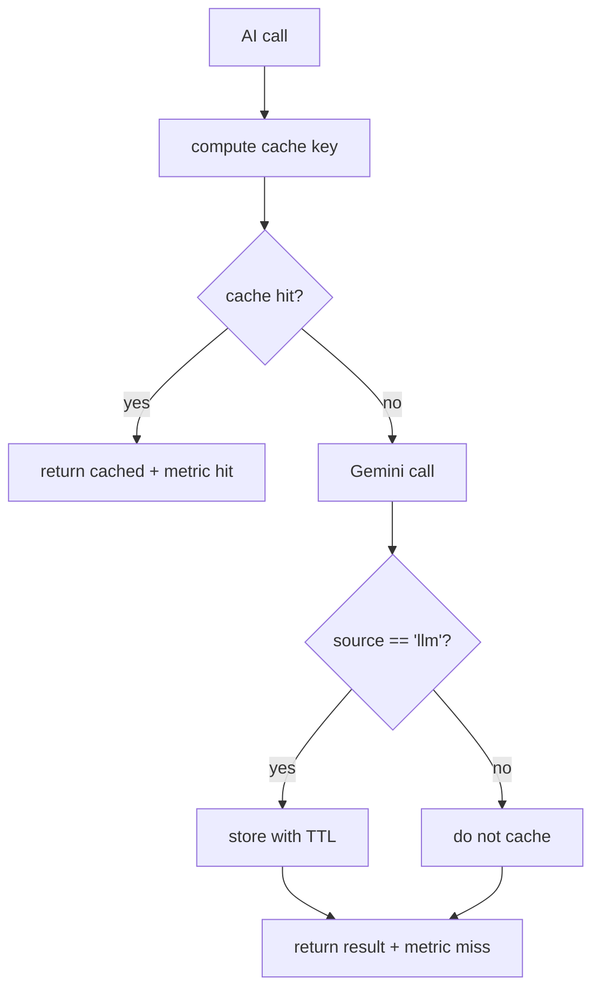

# AIA-02 — Gemini Result Cache Layer

> **Role**: AI Automation Engineer · **Priority**: 🟡 High · **Effort**: ~2 days

---

## Story Identity

| Field | Value |
|:---|:---|
| **Story ID** | `AIA-02` |
| **Owner** | AI Automation Engineer |
| **Files** | new `ai-service/app/cache.py`, wired into `ai-service/app/llm/gemini.py` |
| **Pairs with** | [AIA-05 Resilience](./AIA-05-gemini-call-resilience.md) |

---

## 1. Current Problem

Every AI feature hits Gemini fresh on every call. `parse_brief`, `process_confidence_grid`, `generate_interview_questions`, and `generate_contract_extensions` all route through `generate_structured()` in `ai-service/app/llm/gemini.py`, which calls `client.aio.models.generate_content` with **no caching**. Identical or near-identical inputs (a user re-running the same brief, a retried request, a demo replayed) pay full cost and latency each time.

The [cost analysis](../../architecture/cost_analysis_1000_users.md) and AI features README both assume repeat traffic; without caching, spend scales linearly with clicks rather than with unique work.

---

## 2. Why It Matters

- Direct, measurable cost reduction on the most expensive operations (AI-002 makes 2–3 calls each).
- Lower latency improves UX and reduces serverless timeout pressure.
- A cache keyed on a schema version prevents stale results after a prompt/schema change.

---

## 3. Step-Wise Solution

### Step 3.1 — Define the cache key
`key = sha256(feature + model + prompt_version + schema_version + normalized_input)`. Normalizing input (trim/lowercase where safe) increases hit rate. `PROMPT_VERSION`/`SCHEMA_VERSION` constants live in `ai-service/app/config.py` and are bumped on any prompt/schema change to auto-invalidate.

### Step 3.2 — Pick a backend
- **Local/dev**: in-memory dict with TTL, or Redis if already running.
- **Prod**: DynamoDB table with TTL attribute (per go-live Phase 5 "AI result caching → DynamoDB-backed cache"), or ElastiCache Redis.

Abstract behind an `AiCache` protocol in `app/cache.py` (`get(key)`, `set(key, value, ttl)`) so the store is swappable.

### Step 3.3 — Wrap reads/writes
In `generate_structured()` (or a thin `cached_generate()` helper): check cache → on miss call Gemini → on success store with TTL. **Never cache fallback/degraded results** (from AIE-02) — only genuine `source == 'llm'` outputs.

### Step 3.4 — Set sensible TTLs
| Feature | TTL | Rationale |
|:---|:---|:---|
| Brief parse | 24h | Same brief → same proposal |
| Confidence grid | 6h | Re-evaluation may follow edits |
| Interview gen | 12h | Tied to brief + scan |
| Extensions | 1h | Depends on evolving chat summary |

### Step 3.5 — Add metrics
Emit `ai.cache{result=hit|miss, feature}` to AIA-06 so hit-rate and savings are observable.

---

## 4. Done When

- [ ] An `AiCache` protocol exists in `app/cache.py` with at least one TTL-backed implementation.
- [ ] `generate_structured()` checks the cache and stores only genuine LLM results.
- [ ] Keys include prompt/schema version for auto-invalidation.
- [ ] Per-feature TTLs are configured.
- [ ] `ai.cache` hit/miss metrics are emitted; `python -m compileall app` passes.

---

## 5. Cross-References

| Document | Relevance |
|:---|:---|
| [Go-Live Roadmap Phase 5](../../go_live_roadmap.md) | DynamoDB-backed AI cache |
| [Cost Analysis](../../architecture/cost_analysis_1000_users.md) | Spend assumptions |
| [AIE-02 Honest Fallback](./AIE-02-brief-parser-honest-fallback.md) | Defines what must NOT be cached |
| [AIA-06 Observability](./AIA-06-ai-observability.md) | Cache hit-rate metrics |
