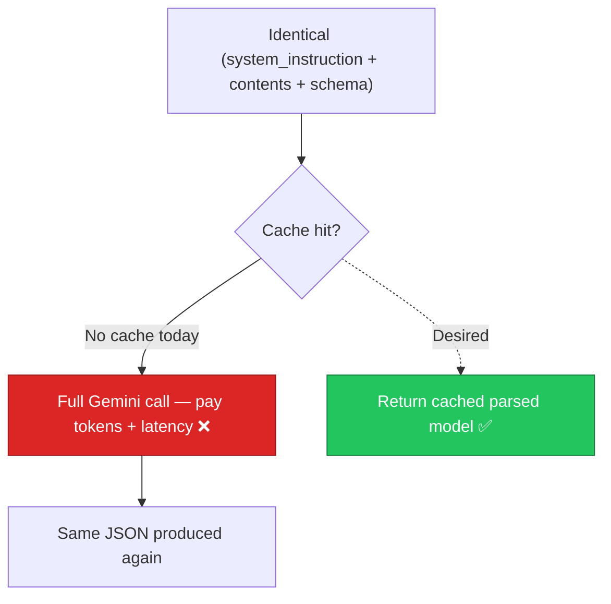

# AIA-02 — No Result Cache for Idempotent Gemini Calls

> **Role**: AI Automation Engineer · **Priority**: 🟡 High · **Effort**: ~1 day
> **Status**: 🔴 Not started. Every request re-calls Gemini even for identical inputs.

---

## Story Identity

| Field | Value |
|:---|:---|
| **Story ID** | `AIA-02` |
| **Owner** | AI Automation Engineer |
| **Files** | `ai-service/app/cache.py` (new), `ai-service/app/llm/gemini.py`, `ai-service/app/config.py` |
| **Depends on** | BUG-02 (retry/timeout inside the wrapper) |

---

## 1. Current Problem

`generate_structured()` in [gemini.py](../../../../ai-service/app/llm/gemini.py) calls Gemini on every invocation with no caching layer. The same brief re-parsed, or the confidence grid re-evaluating an unchanged proposal, pays full token cost and latency each time. The multi-agent confidence grid is especially expensive: each evaluation fans out to two agents, and the self-correction loop can multiply that.

---

## 2. Why It Matters

- **Direct cost**: Structured JSON generation carries token cost; caching identical calls removes duplicate spend.
- **Latency**: Cache hits return in microseconds vs multi-second LLM round-trips.
- **Resilience**: A warm cache can serve recent results during a Gemini outage.

---

## 3. Step-Wise Solution

### Step 3.1 — Define an `AiCache` protocol
In `app/cache.py`, define a small protocol (`get(key)`, `set(key, value, ttl)`) plus an in-process TTL implementation (dict + expiry). Leave room for a Redis-backed impl behind the same protocol.

### Step 3.2 — Deterministic cache key
Build the key from a hash of `(model, system_instruction, contents, response_schema name, temperature)`. Any input change ⇒ new key.

### Step 3.3 — Wire into the wrapper
In `generate_structured()`, check the cache before calling Gemini and populate it on success. Serialize/deserialize via the Pydantic model's JSON so cached values reconstruct into the correct type.

### Step 3.4 — Never cache fallbacks
Only cache genuine successful LLM outputs. Never cache sanitizer/fallback results or error responses, so a transient failure can't be pinned. Add `GEMINI_CACHE_TTL_SEC` (default e.g. `3600`) and a `GEMINI_CACHE_ENABLED` flag to `config.py`.

---

## 4. Done When

- [ ] `AiCache` protocol + in-process TTL implementation exist.
- [ ] Cache key is deterministic over all inputs that affect output.
- [ ] `generate_structured()` reads/writes cache and reconstructs the Pydantic type on hit.
- [ ] Fallback and error results are never cached.
- [ ] TTL + enable flag configurable via env.
- [ ] Unit tests cover hit, miss, expiry, and no-cache-on-error.
- [ ] `python -m compileall app` passes cleanly.

---

## 5. Cross-References

| Document | Relevance |
|:---|:---|
| [gemini.py](../../../../ai-service/app/llm/gemini.py) | Wrapper to wrap with cache |
| [config.py](../../../../ai-service/app/config.py) | Cache TTL/flag settings |
| [BUG-02](./BUG-02-gemini-unbounded-hang.md) | Retry/timeout layer beneath the cache |
