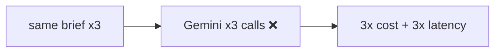
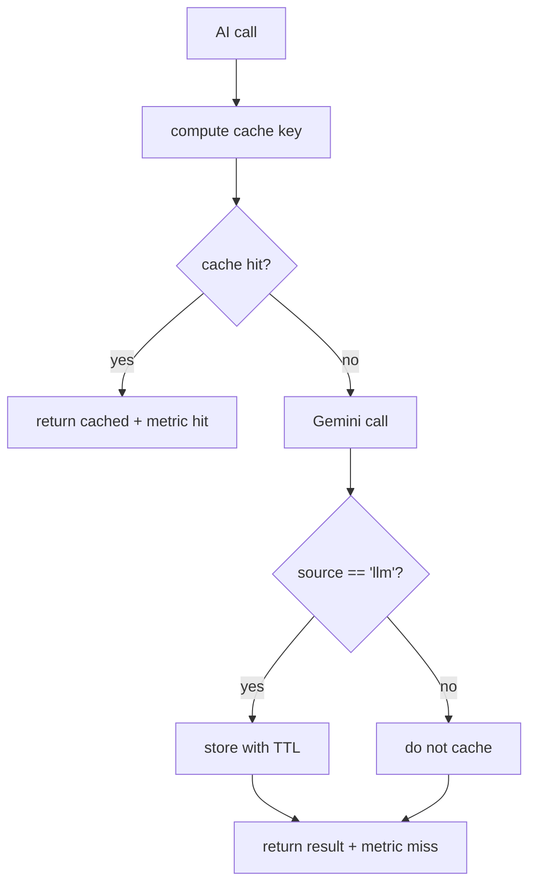

# AIA-02 — Gemini Result Cache Layer

> **Role**: AI Automation Engineer · **Priority**: 🟡 High · **Effort**: ~2 days

---

## Story Identity

| Field | Value |
|:---|:---|
| **Story ID** | `AIA-02` |
| **Owner** | AI Automation Engineer |
| **Backend files** | new `backend/src/services/aiCache.ts`, AI skills / shared wrapper |
| **Pairs with** | [AIA-05 Resilience](./AIA-05-gemini-call-resilience.md) |

---

## 1. Current Problem

Every AI route hits Gemini fresh on every call. `parseBrief`, `processConfidenceGrid`, `generateInterviewQuestions`, and `generateContractExtensions` each construct a `new GoogleGenAI(...)` and call `generateContent` with **no caching**. Identical or near-identical inputs (a user re-running the same brief, a retried request, a demo replayed) pay full cost and latency each time.

The [cost analysis](../../architecture/cost_analysis_1000_users.md) and AI features README both assume repeat traffic; without caching, spend scales linearly with clicks rather than with unique work.

---

## 2. Why It Matters

- Direct, measurable cost reduction on the most expensive operations (AI-002 makes 2–3 calls each).
- Lower latency improves UX and reduces serverless timeout pressure.
- A cache keyed on a schema version prevents stale results after a prompt/schema change.

---

## 3. Step-Wise Solution

### Step 3.1 — Define the cache key
`key = sha256(feature + model + promptVersion + schemaVersion + normalizedInput)`. Normalizing input (trim/lowercase where safe) increases hit rate. `promptVersion`/`schemaVersion` constants live in `aiConfig.ts` (from AIE-01) and are bumped on any prompt/schema change to auto-invalidate.

### Step 3.2 — Pick a backend
- **Local/dev**: in-memory Map with TTL, or Redis if already running.
- **Prod**: DynamoDB table with TTL attribute (per go-live Phase 5 "AI result caching → DynamoDB-backed cache"), or ElastiCache Redis.

Abstract behind an `AiCache` interface (`get(key)`, `set(key, value, ttlSec)`) so the store is swappable — mirror the existing repository pattern.

### Step 3.3 — Wrap reads/writes
In the shared Gemini wrapper (AIA-05) or a thin `cachedGenerate()` helper: check cache → on miss call Gemini → on success store with TTL. **Never cache fallback/degraded results** (from AIE-02) — only genuine `source: 'llm'` outputs.

### Step 3.4 — Set sensible TTLs
| Feature | TTL | Rationale |
|:---|:---|:---|
| Brief parse | 24h | Same brief → same proposal |
| Confidence grid | 6h | Re-evaluation may follow edits |
| Interview gen | 12h | Tied to brief + scan |
| Extensions | 1h | Depends on evolving chat summary |

### Step 3.5 — Add metrics
Emit `ai.cache{result=hit|miss, feature}` to AIA-06 so hit-rate and savings are observable.

---

## 4. Done When

- [ ] An `AiCache` interface exists with at least one TTL-backed implementation.
- [ ] AI calls check the cache and store only genuine LLM results.
- [ ] Keys include prompt/schema version for auto-invalidation.
- [ ] Per-feature TTLs are configured.
- [ ] `ai.cache` hit/miss metrics are emitted; `npm run build` passes.

---

## 5. Cross-References

| Document | Relevance |
|:---|:---|
| [Go-Live Roadmap Phase 5](../../go_live_roadmap.md) | DynamoDB-backed AI cache |
| [Cost Analysis](../../architecture/cost_analysis_1000_users.md) | Spend assumptions |
| [AIE-02 Honest Fallback](./AIE-02-brief-parser-honest-fallback.md) | Defines what must NOT be cached |
| [AIA-06 Observability](./AIA-06-ai-observability.md) | Cache hit-rate metrics |
