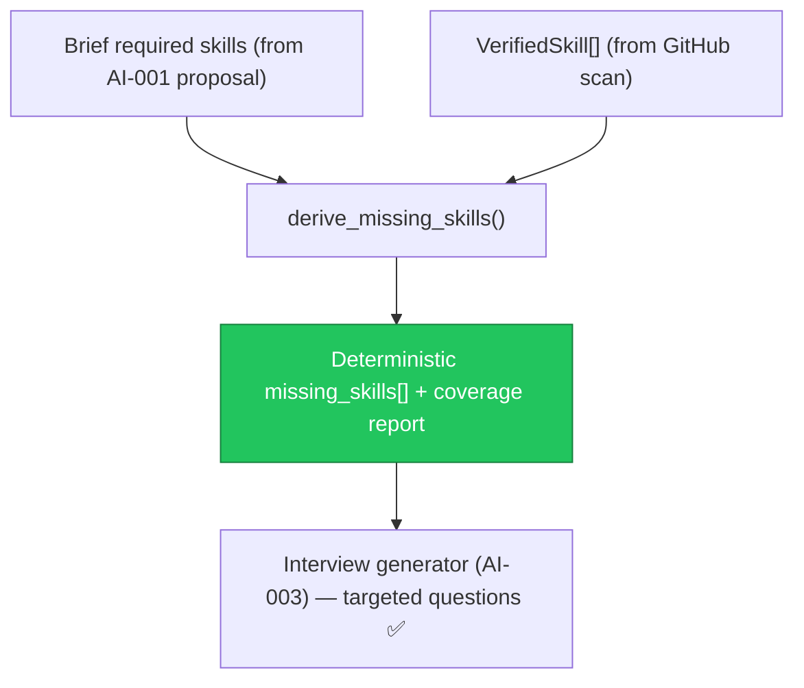

# AIA-03 — Deterministic Skill-Gap Bridge from GitHub Scan into Interview Generation

> **Role**: AI Automation Engineer · **Priority**: 🟡 High · **Effort**: ~1.5 days
> **Status**: 🟡 Partial. Scan engine + SSE streaming are built ([orchestrator.py](../../../../ai-service/app/features/github_scan/orchestrator.py)); the `missing_skills` input to interview generation is still supplied by the caller with no deterministic derivation.

---

## Story Identity

| Field | Value |
|:---|:---|
| **Story ID** | `AIA-03` |
| **Owner** | AI Automation Engineer |
| **Files** | `ai-service/app/features/skill_gap.py` (new), `ai-service/app/features/interview.py`, `ai-service/app/main.py` |
| **Depends on** | None (scan engine already exists) |

---

## 1. Current Problem

The GitHub scan pipeline is built and produces `VerifiedSkill[]` (with categories and confidence) in [github.py](../../../../ai-service/app/schemas/github.py). Separately, the interview generator (AI-003) accepts a `missingSkills: List[str]` field:

```python
# ai-service/app/main.py
class InterviewRequest(BaseModel):
    briefText: str = Field(min_length=1)
    githubScan: Union[str, dict, Any] = ""
    missingSkills: List[str] = Field(default_factory=list)   # ← caller-supplied, un-derived
```

Nothing in the AI service **computes** which brief-required skills are absent from the candidate's verified GitHub skills. The caller must guess and hand-feed `missingSkills`, so the interview questions that target "detected skill gaps" are only as good as an upstream heuristic that does not exist. This makes AI-003's core promise — "custom questions addressing missing skills" — dependent on a signal that is never produced deterministically.



---

## 2. Why It Matters

- **Closes the loop**: Scan output and interview input are two halves of one flow that are not connected.
- **Deterministic & testable**: Skill-gap detection should be reproducible (normalization + set difference), not an LLM guess.
- **Better questions**: Accurate gaps produce sharper vetting questions and reduce irrelevant ones.

---

## 3. Step-Wise Solution

### Step 3.1 — Extract required skills from the brief
Add a helper that reads a parsed `Proposal` (or brief text) and collects required skill tokens from feature `technical_approach` / `area` and any explicit skill mentions.

### Step 3.2 — Normalize both sides
Normalize candidate `VerifiedSkill.name` and required tokens to a canonical form (lowercase, alias map: `js`→`javascript`, `reactjs`→`react`, etc.) so the diff is accurate. Reuse the scan's skill-normalization conventions.

### Step 3.3 — Deterministic diff + coverage
Implement `derive_missing_skills(required, verified) -> SkillGapReport` returning `missing[]`, `covered[]`, and a `coverage_pct`. A skill is "covered" only if a verified skill meets a minimum confidence threshold.

### Step 3.4 — Wire into interview generation
Let `/ai/interview/generate` optionally accept the parsed proposal + scan and compute `missing_skills` server-side when the caller omits it. Keep the explicit `missingSkills` override for backward compatibility.

---

## 4. Done When

- [ ] `derive_missing_skills()` is deterministic and returns missing/covered/coverage.
- [ ] Skill normalization/alias map is shared and unit-tested.
- [ ] Interview generation computes `missing_skills` when not supplied, and still honors an explicit override.
- [ ] Coverage threshold is configurable.
- [ ] Unit tests cover alias matching, confidence threshold, and empty-scan cases.
- [ ] `python -m compileall app` passes cleanly.

---

## 5. Cross-References

| Document | Relevance |
|:---|:---|
| [interview.py](../../../../ai-service/app/features/interview.py) | Consumer of `missing_skills` |
| [github.py](../../../../ai-service/app/schemas/github.py) | `VerifiedSkill` source signal |
| [orchestrator.py](../../../../ai-service/app/features/github_scan/orchestrator.py) | Scan output producer |
