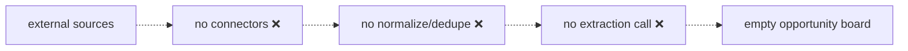
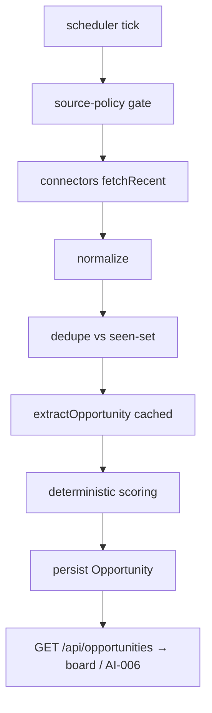

# AIA-04 — AI-005 Discovery Automation (Connectors + Cron)

> **Role**: AI Automation Engineer · **Priority**: 🟡 High · **Effort**: ~4–5 days

---

## Story Identity

| Field | Value |
|:---|:---|
| **Story ID** | `AIA-04` |
| **Owner** | AI Automation Engineer |
| **Backend files** | new `backend/src/services/opportunity/` (connectors, scheduler) |
| **Depends on** | [AIE-06 Scoring Design](./AIE-06-opportunity-intelligence-scoring.md) |

---

## 1. Current Problem

AI-005 has no ingestion pipeline. There is no scheduled discovery, no source connectors, no normalize/dedupe stage, and nothing to feed the opportunity board. The [build guide](../opportunity_intelligence_build_guide.md) lays out a 7-stage flow and a source-policy gate, but none of it is implemented.

This story builds the **plumbing**; the extraction schema + scoring rubric are designed in [AIE-06](./AIE-06-opportunity-intelligence-scoring.md).

---

## 2. Why It Matters

- Turns AI-005 from a doc into a working inbound-demand engine feeding AI-006.
- Source-policy compliance and dedupe must be engineered carefully — automation/ops territory.

---

## 3. Step-Wise Solution

### Step 3.1 — Source-policy gate first
Before any connector runs, enforce the build guide's policy gate: only ingest from sources whose terms permit it. Encode allowed sources in config; log/skip disallowed ones. (See go-live Phase 8 data-compliance note.)

### Step 3.2 — Build free connectors behind an interface
Define a `SourceConnector` interface (`fetchRecent(): RawPost[]`). Implement the free/permitted connectors from the build guide. New sources plug in without touching the pipeline — mirror the repository pattern already used for freelancers/users.

### Step 3.3 — Normalize + dedupe
Map each `RawPost` to a common shape, then drop duplicates using the canonical dedupe key defined in AIE-06 (normalized title + source domain + posted week). Persist a `seen` set to avoid re-ingesting across runs.

### Step 3.4 — Call extraction + scoring
For each new, deduped post: call `extractOpportunity()` (AIE-06) → run the deterministic scoring rubric → persist the scored `Opportunity`. Route extraction through the AIA-02 cache and AIA-05 resilience wrapper.

### Step 3.5 — Schedule it
Run on a cron (local `node-cron` / prod EventBridge → worker Lambda, per serverless plan). Make the interval configurable; process in batches to respect Gemini and source rate limits.

### Step 3.6 — Expose the board API
`GET /api/opportunities` (ranked by score, filterable by skill/domain/freshness) for the frontend opportunity board and as an inbound feed to AI-006.

---

## 4. Done When

- [ ] A source-policy gate blocks disallowed sources before fetch.
- [ ] At least the build-guide free connectors are implemented behind a `SourceConnector` interface.
- [ ] Normalize + dedupe (with a persisted seen-set) prevents duplicates across runs.
- [ ] New posts are extracted (cached + resilient) and scored, then persisted.
- [ ] A configurable scheduler runs the pipeline in batches.
- [ ] `GET /api/opportunities` returns a ranked board; `npm run build` passes.

---

## 5. Cross-References

| Document | Relevance |
|:---|:---|
| [Opportunity Intelligence Build Guide](../opportunity_intelligence_build_guide.md) | Source policy + 7-stage order |
| [AIE-06 Scoring Design](./AIE-06-opportunity-intelligence-scoring.md) | Extraction schema + scoring + dedupe key |
| [AIA-02 Cache](./AIA-02-gemini-result-cache.md) | Extraction caching |
| [AIA-05 Resilience](./AIA-05-gemini-call-resilience.md) | Retry/timeout for extraction calls |
