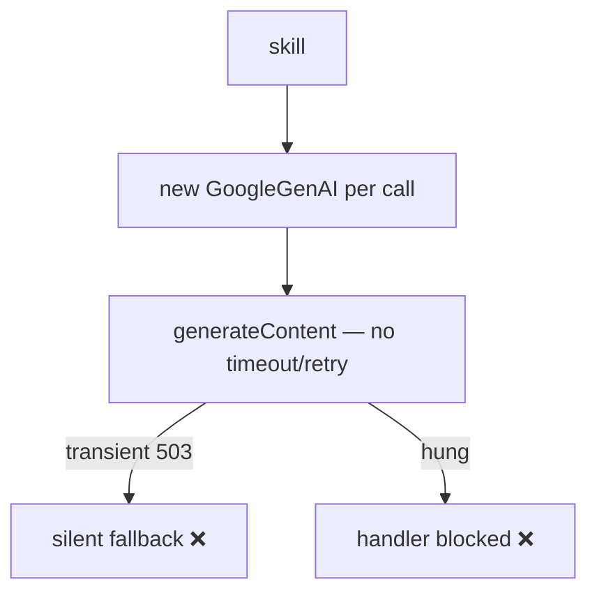
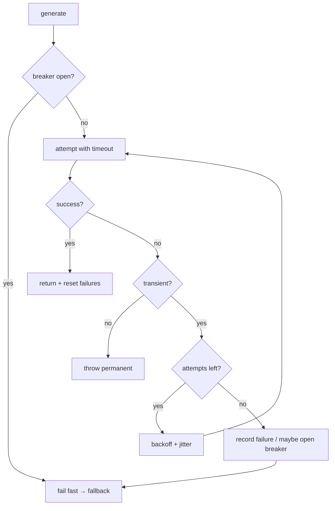

# AIA-05 — Resilience for All Gemini Calls (Retry / Timeout / Circuit-Breaker)

> **Role**: AI Automation Engineer · **Priority**: 🔴 Critical · **Effort**: ~2 days

---

## Story Identity

| Field | Value |
|:---|:---|
| **Story ID** | `AIA-05` |
| **Owner** | AI Automation Engineer |
| **Backend files** | new `backend/src/services/geminiClient.ts`, all AI skills |
| **Foundation for** | AIE-02, AIA-01, AIA-02, AIA-04 |

---

## 1. Current Problem

Every skill calls Gemini directly with no timeout, no retry, and no breaker:

```ts
const ai = new GoogleGenAI({ apiKey });
const response = await ai.models.generateContent({ ... });
```

Consequences:
- A transient `503`/network blip goes straight to the silent fallback — a recoverable error is treated as a hard failure.
- No request timeout means a hung call can block the handler until the platform kills it.
- A Gemini outage causes every request to wait and fail individually (no breaker), wasting time and quota.
- Each skill re-instantiates the client and duplicates error handling.



---

## 2. Why It Matters

- This is the shared foundation. AIE-02 (honest fallback), AIA-01 (job retries), AIA-02 (caching), and AIA-04 (extraction) all need a single, reliable call path with classified errors.
- Retries on transient errors materially cut the fallback rate and improve perceived quality.

---

## 3. Step-Wise Solution

### Step 3.1 — Create one shared client wrapper
`geminiClient.ts` exposes `generate(opts)` and owns a module-scope `GoogleGenAI` instance (keep-alive; matches the serverless plan's module-scope client guidance). All skills call this instead of `new GoogleGenAI(...)`.

### Step 3.2 — Classify errors
Return/throw a typed error: `transient` (5xx, network, rate-limit `429`) vs `permanent` (invalid key, invalid model, 4xx schema). This is the classification AIE-02 maps to `degradedReason`.

### Step 3.3 — Bounded retry with backoff + jitter
Retry **only** transient errors, e.g. up to 3 attempts with exponential backoff + jitter. Permanent errors fail immediately — no pointless retries.

### Step 3.4 — Per-call timeout
Wrap each attempt in a configurable timeout (`GEMINI_TIMEOUT_MS`, default ~25s to stay under serverless limits). A timed-out attempt is treated as transient and retried within the attempt budget.

### Step 3.5 — Circuit breaker
Track recent failures; after N consecutive transient failures, **open** the breaker for a cooldown so calls fail fast (and route to fallback) instead of all hanging. Half-open probe to recover.

### Step 3.6 — Emit telemetry
For each call emit `ai.call{feature, model, outcome, attempts, latencyMs}` to AIA-06. Migrate all five AI skills onto the wrapper.



---

## 4. Done When

- [ ] All five AI skills call a single `geminiClient.generate()` wrapper.
- [ ] Errors are classified `transient` vs `permanent`.
- [ ] Transient errors retry with bounded backoff + jitter; permanent fail fast.
- [ ] A configurable per-call timeout is enforced.
- [ ] A circuit breaker opens on sustained failures and recovers via half-open probe.
- [ ] `ai.call` telemetry is emitted; `npm run build` passes.

---

## 5. Cross-References

| Document | Relevance |
|:---|:---|
| [AIE-02 Honest Fallback](./AIE-02-brief-parser-honest-fallback.md) | Consumes error classification |
| [AIA-01 Async Jobs](./AIA-01-async-evaluation-jobs.md) | Uses retry policy |
| [Serverless Migration Plan §3.5](../../architecture/serverless_migration_plan.md) | Module-scope client + timeouts |
| [AIA-06 Observability](./AIA-06-ai-observability.md) | Consumes `ai.call` telemetry |
