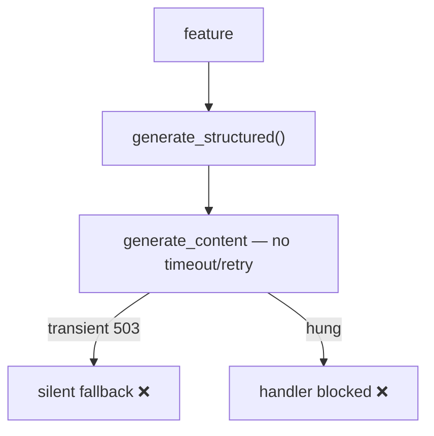
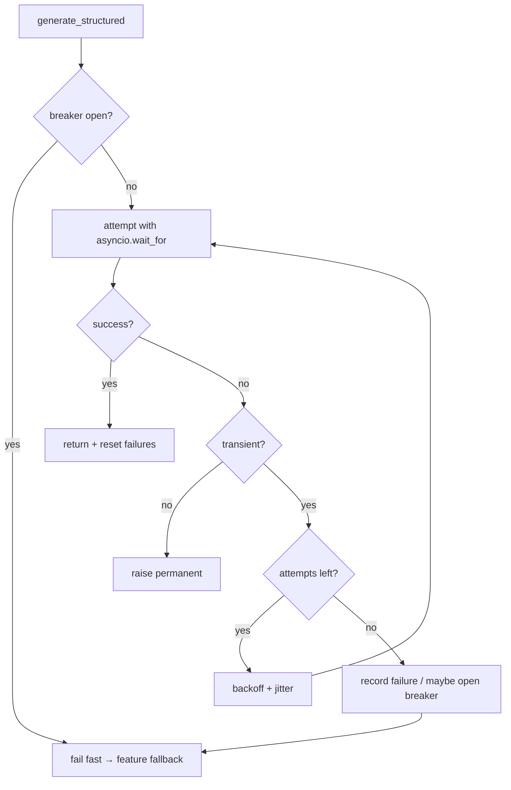

# AIA-05 — Resilience for All Gemini Calls (Retry / Timeout / Circuit-Breaker)

> **Role**: AI Automation Engineer · **Priority**: 🔴 Critical · **Effort**: ~2 days
> **Migration status**: 🟢 **The shared wrapper already exists** — all features call `generate_structured()` in `ai-service/app/llm/gemini.py` with a module-scope client. Remaining work: add retry/timeout/circuit-breaker + error classification to that single function.
> **✅ Verified status (2026-07-05): 🟡 ~20% done.** Confirmed in code: `gemini.py` has the reused module-scope client but no timeout, retry, breaker, or error classification. **Priority: 🔴 P0** (foundation for AIE-02, AIA-01, AIA-02, AIA-04 — do right after AIE-01). See [status board](../IMPLEMENTATION_STATUS.md).

---

## Story Identity

| Field | Value |
|:---|:---|
| **Story ID** | `AIA-05` |
| **Owner** | AI Automation Engineer |
| **Files** | `ai-service/app/llm/gemini.py` (shared wrapper), `ai-service/app/config.py` |
| **Foundation for** | AIE-02, AIA-01, AIA-02, AIA-04 |

---

## 1. Current Problem

The migration already centralized every Gemini call into one wrapper with a reused module-scope client:

```python
# ai-service/app/llm/gemini.py — single call path (good), but no resilience yet
response = await client.aio.models.generate_content(
    model=..., contents=..., config=...,
)   # no timeout, no retry, no breaker
```

That solved client duplication, but resilience is still missing:
- A transient `503`/network blip goes straight to each feature's silent fallback — a recoverable error is treated as a hard failure.
- No request timeout means a hung call can block the handler until the platform kills it.
- A Gemini outage causes every request to wait and fail individually (no breaker), wasting time and quota.



---

## 2. Why It Matters

- This is the shared foundation. AIE-02 (honest fallback), AIA-01 (job retries), AIA-02 (caching), and AIA-04 (extraction) all need a single, reliable call path with classified errors.
- Retries on transient errors materially cut the fallback rate and improve perceived quality.

---

## 3. Step-Wise Solution

### Step 3.1 — One shared wrapper — ✅ done
`generate_structured()` in `app/llm/gemini.py` already owns a module-scope `genai.Client` (keep-alive) and is the single path every feature uses. Build the rest of this story inside it.

### Step 3.2 — Classify errors
Return/raise a typed error: `transient` (5xx, network, rate-limit `429`) vs `permanent` (invalid key, invalid model, 4xx schema). This is the classification AIE-02 maps to `degradedReason`.

### Step 3.3 — Bounded retry with backoff + jitter
Retry **only** transient errors, e.g. up to 3 attempts with exponential backoff + jitter (`asyncio.sleep`). Permanent errors raise immediately — no pointless retries. Read limits from `config.py`.

### Step 3.4 — Per-call timeout
Wrap each attempt in `asyncio.wait_for(..., timeout=GEMINI_TIMEOUT_S)` (default ~25s to stay under serverless limits). A timed-out attempt is treated as transient and retried within the attempt budget.

### Step 3.5 — Circuit breaker
Track recent failures in module scope; after N consecutive transient failures, **open** the breaker for a cooldown so calls fail fast (and features route to fallback) instead of all hanging. Half-open probe to recover.

### Step 3.6 — Emit telemetry
For each call emit `ai.call{feature, model, outcome, attempts, latencyMs}` to AIA-06. (All five features already ride on the wrapper, so this lands everywhere at once.)



---

## 4. Done When

- [x] All features call a single `generate_structured()` wrapper with a reused client.
- [ ] Errors are classified `transient` vs `permanent`.
- [ ] Transient errors retry with bounded backoff + jitter; permanent fail fast.
- [ ] A configurable per-call timeout is enforced.
- [ ] A circuit breaker opens on sustained failures and recovers via half-open probe.
- [ ] `ai.call` telemetry is emitted; `python -m compileall app` passes.

---

## 5. Cross-References

| Document | Relevance |
|:---|:---|
| [AIE-02 Honest Fallback](./AIE-02-brief-parser-honest-fallback.md) | Consumes error classification |
| [AIA-01 Async Jobs](./AIA-01-async-evaluation-jobs.md) | Uses retry policy |
| [Serverless Migration Plan §3.5](../../architecture/serverless_migration_plan.md) | Module-scope client + timeouts |
| [AIA-06 Observability](./AIA-06-ai-observability.md) | Consumes `ai.call` telemetry |
