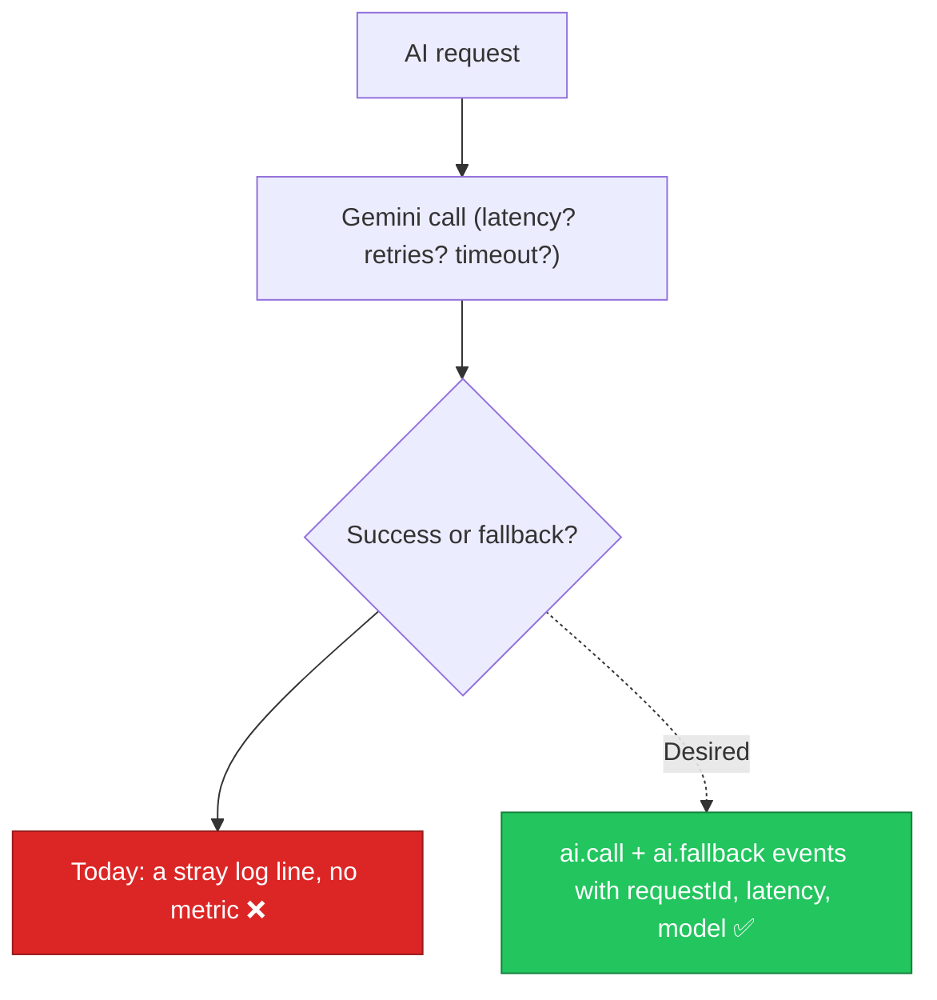

# AIA-06 — No AI Observability: Fallback Rate & Call Health Are Invisible

> **Role**: AI Automation Engineer · **Priority**: 🟡 High · **Effort**: ~1.5 days
> **Status**: ✅ Done (verified 2026-07-19). `telemetry.py` records per-call latency/tokens/success, request-id correlation middleware in `main.py`, and metrics on `/health`. Canonical status: [ai-service backlog](../../../stories/ai-service/README.md).

---

## Story Identity

| Field | Value |
|:---|:---|
| **Story ID** | `AIA-06` |
| **Owner** | AI Automation Engineer |
| **Files** | `ai-service/app/telemetry.py` (new), `ai-service/app/llm/gemini.py`, `ai-service/app/features/*`, `ai-service/app/main.py` |
| **Depends on** | AIE-07 (robust logging), BUG-02 (call classification) |

---

## 1. Current Problem

The AI service emits scattered `logger.info` / `logger.error` lines and one `ai.fallback` record, but there is no coherent telemetry:

- No count of **how often** each feature falls back vs returns a real LLM result.
- No timing on Gemini calls (latency, retries, timeouts).
- No `requestId` correlation across a request's log lines.
- No structured event stream a dashboard or alarm can consume.

As a result, a rising fallback rate (fabricated proposals looking real — see AIE-02) or a degrading Gemini latency is completely invisible until users complain.

---

## 2. Why It Matters

- **Trust**: AIE-02 makes fallbacks honest in the response; observability makes them **measurable** so the team knows when the AI layer is degraded.
- **Cost/perf**: Latency and retry counts reveal expensive or flaky call patterns.
- **Correlation**: A `requestId` threads all events for one request, making incidents debuggable.

---

## 3. Step-Wise Solution

### Step 3.1 — Telemetry module
Create `app/telemetry.py` with a structured emitter (`emit(event, **fields)`) that writes JSON log lines and increments in-process counters. Standard events: `ai.call` (feature, model, latency_ms, attempts, outcome) and `ai.fallback` (feature, reason).

### Step 3.2 — Request correlation
Add FastAPI middleware that assigns/propagates a `requestId` (from an incoming header or generated) and binds it to a `contextvar` so every telemetry event carries it.

### Step 3.3 — Instrument the wrapper
Wrap `generate_structured()` to time each call, record retry/timeout outcomes (from BUG-02's logic), and emit `ai.call`. Route existing `ai.fallback` logs through the emitter.

### Step 3.4 — Expose metrics
Add a `/metrics` (or extend `/health`) endpoint returning per-feature call counts, fallback counts, and rolling latency percentiles so operators/alarms can scrape them.

---

## 4. Done When

- [ ] `app/telemetry.py` emits structured `ai.call` and `ai.fallback` events.
- [ ] Every request carries a correlated `requestId` across its log lines.
- [ ] `generate_structured()` records latency, attempts, and outcome.
- [ ] A metrics endpoint exposes call/fallback counts and latency percentiles.
- [ ] Fallback rate is derivable per feature.
- [ ] Unit tests assert events are emitted with required fields.
- [ ] `python -m compileall app` passes cleanly.

---

## 5. Cross-References

| Document | Relevance |
|:---|:---|
| [gemini.py](../../../../ai-service/app/llm/gemini.py) | Instrumentation point |
| [fallback_logger.py](../../../../ai-service/app/features/fallback_logger.py) | Existing fallback log to fold in |
| [AIE-02](./AIE-02-brief-parser-salvage-fallback.md) | Produces the fallback signal to measure |
