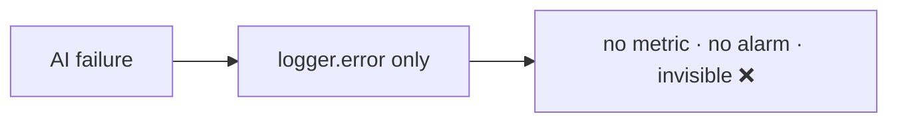
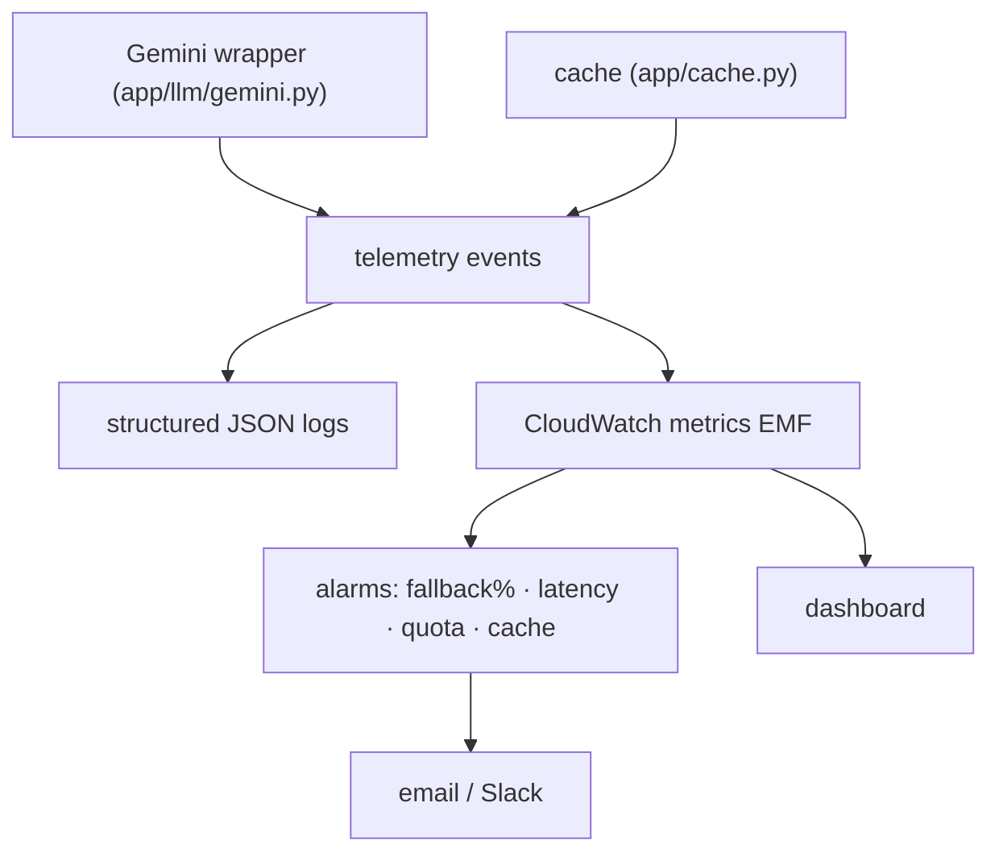

# AIA-06 — AI Observability: Structured Logs, Metrics, Alarms

> **Role**: AI Automation Engineer · **Priority**: 🟡 High · **Effort**: ~2 days

---

## Story Identity

| Field | Value |
|:---|:---|
| **Story ID** | `AIA-06` |
| **Owner** | AI Automation Engineer |
| **Files** | new `ai-service/app/telemetry.py`, wired into `app/llm/gemini.py` + features |
| **Consumed by** | AIE-04 (offline eval complements prod metrics) |

---

## 1. Current Problem

AI failures are observable only as Python `logger.error` / `logging` lines:

```python
# ai-service/app/features/brief_parser.py
logger.error("CRITICAL: Semantic Brief Parsing Exception: %s", error)
# ai-service/app/features/confidence_grid.py
logger.error("Auditor Agent Evaluation Exception: %s", error)
```

There is **no metric** for fallback rate, call latency, token usage, cache hit-rate, or Gemini quota errors. When a feature's silent fallback (AIE-02) fires in production, nobody knows. The go-live roadmap Phase 7 explicitly calls for "key metrics (latency, error rate, Gemini failures), alarms (Gemini quota), and a simple dashboard" — none exist yet.



---

## 2. Why It Matters

- You can't operate or improve what you can't measure. Fallback rate is the single most important AI health signal and it's currently dark.
- Gemini quota/cost alarms prevent surprise outages and bills.
- Provides the production counterpart to AIE-04's offline quality gate.

---

## 3. Step-Wise Solution

### Step 3.1 — Define a small event vocabulary
Centralize in `ai-service/app/telemetry.py`:
| Event | Fields |
|:---|:---|
| `ai.call` | feature, model, outcome, attempts, latencyMs |
| `ai.fallback` | feature, reason |
| `ai.cache` | feature, result (hit/miss) |
| `ai.tokens` | feature, promptTokens, outTokens (when available) |

### Step 3.2 — Structured logging
Replace ad-hoc `logger.error` with a structured logger emitting single-line JSON (timestamp, level, event, fields, requestId) — e.g. a `logging.Formatter` that serializes a dict, or `structlog`. Structured logs are queryable in CloudWatch Logs Insights.

### Step 3.3 — Emit metrics
From the AIA-05 wrapper (`app/llm/gemini.py`) and the AIA-02 cache, emit the events above. In prod, publish CloudWatch EMF/custom metrics: `FallbackRate`, `CallLatencyP95`, `QuotaErrors`, `CacheHitRate`, per-feature dimensions.

### Step 3.4 — Alarms
Create alarms: fallback rate > X% over 5 min, P95 latency > threshold, any sustained `429`/quota errors, cache hit-rate collapse. Route to email/Slack (ties into go-live Phase 7).

### Step 3.5 — Minimal dashboard
A CloudWatch dashboard with per-feature call volume, fallback rate, latency, and cache hit-rate. Document how to read it.

### Step 3.6 — Correlation id
Thread a `requestId` (accepted as a header from the TS gateway, and `jobId` for AIA-01) through Python logs so a single proposal's journey across parse → evaluate → match is traceable end-to-end.



---

## 4. Done When

- [ ] `app/telemetry.py` defines `ai.call`, `ai.fallback`, `ai.cache`, `ai.tokens` events.
- [ ] `logger.error` in AI features is replaced by structured logging.
- [ ] Metrics are emitted with per-feature dimensions.
- [ ] Alarms exist for fallback rate, latency, quota errors, and cache hit-rate.
- [ ] A dashboard shows AI health; a `requestId` correlates a request across features.
- [ ] `python -m compileall app` passes.

---

## 5. Cross-References

| Document | Relevance |
|:---|:---|
| [Go-Live Roadmap Phase 7](../../go_live_roadmap.md) | Observability requirements |
| [AIA-05 Resilience](./AIA-05-gemini-call-resilience.md) | Emits `ai.call` events |
| [AIE-02 Honest Fallback](./AIE-02-brief-parser-honest-fallback.md) | Emits `ai.fallback` events |
| [AIE-04 Eval Harness](./AIE-04-ai-evaluation-harness.md) | Offline complement to prod metrics |
