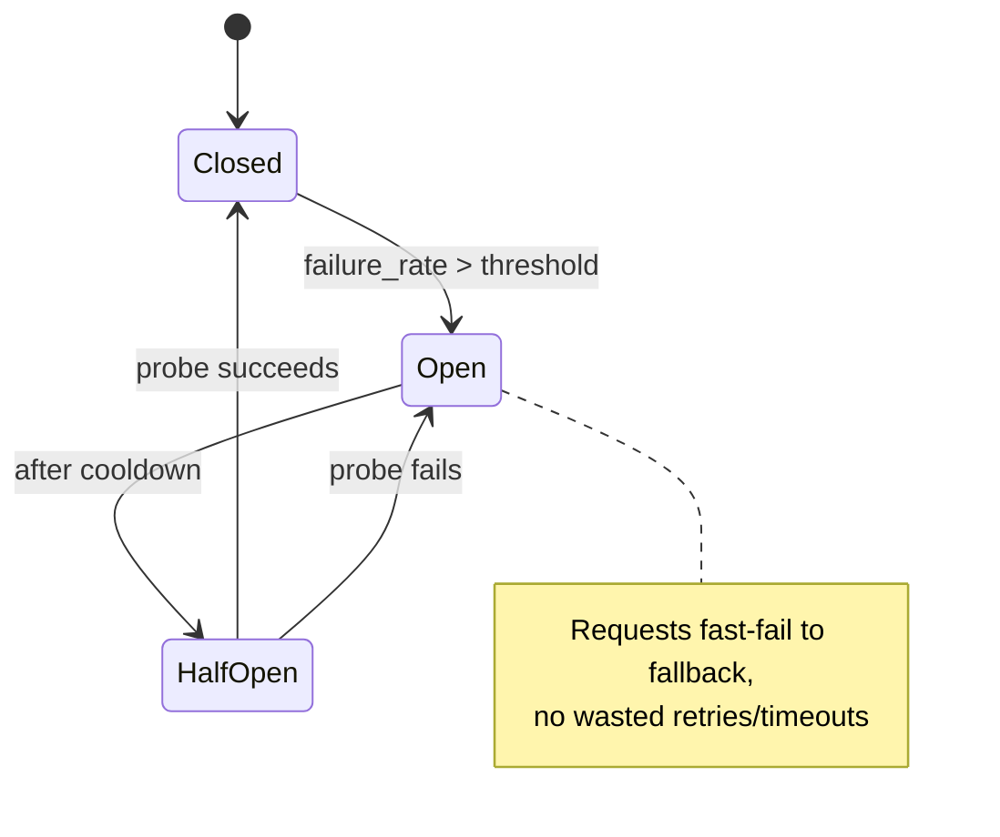

# AIA-07 — Add a Circuit Breaker Around Gemini Calls

> **Role**: AI Automation Engineer · **Priority**: 🟡 Medium · **Effort**: ~1 day
> **Status**: ✅ Done (verified 2026-07-19). `llm/circuit_breaker.py` (`primary_breaker`) is integrated into `generate_structured()` with open-state fallback routing. Canonical status: [ai-service backlog](../../../stories/ai-service/README.md).

---

## Story Identity

| Field | Value |
|:---|:---|
| **Story ID** | `AIA-07` |
| **Owner** | AI Automation Engineer |
| **Files** | `ai-service/app/llm/circuit_breaker.py` (new), `ai-service/app/llm/gemini.py`, `ai-service/app/config.py` |
| **Depends on** | BUG-02 (retry/backoff/timeout) |

---

## 1. Current Problem

Once BUG-02 lands, each individual Gemini call retries with backoff and a timeout. But retries are **per-request** — during a sustained Gemini outage, every incoming request still burns its full retry budget (multiple timed-out attempts) before falling back. Under load this stacks up latency and wastes the backoff windows across thousands of requests hammering a service that is already down.

There is no shared circuit state that says "Gemini is currently failing; skip the attempts and fall back immediately" until it recovers.

---

## 2. Why It Matters

- **Fast failover under outage**: When Gemini is down, requests should fall back in milliseconds, not after exhausting per-request retry budgets.
- **Protects the event loop**: Fewer stacked timeouts means the FastAPI worker stays responsive.
- **Auto-recovery**: A half-open probe restores normal operation without manual intervention.

---

## 3. Step-Wise Solution

### Step 3.1 — Breaker implementation
Create `app/llm/circuit_breaker.py` with a `CircuitBreaker` (states: `closed`/`open`/`half_open`), a rolling failure counter, an open cooldown, and a half-open probe allowance. Make it async-safe (single shared instance).

### Step 3.2 — Config knobs
Add `GEMINI_BREAKER_FAILURE_THRESHOLD`, `GEMINI_BREAKER_COOLDOWN_SEC`, and `GEMINI_BREAKER_ENABLED` to `config.py`.

### Step 3.3 — Wrap the call path
In `generate_structured()`, consult the breaker before attempting; when `open`, raise a fast `CircuitOpenError` so callers hit their existing fallback path immediately. Record success/failure to update breaker state (feed AIA-06 telemetry).

### Step 3.4 — Classify what trips the breaker
Only transient/availability failures (timeouts, 429, 5xx) trip the breaker. Validation errors and 4xx auth errors do **not** (they aren't Gemini-availability signals).

---

## 4. Done When

- [ ] `CircuitBreaker` implements closed/open/half-open transitions and is async-safe.
- [ ] Breaker thresholds/cooldown/enable are env-configurable.
- [ ] Open circuit fast-fails to the existing fallback without retrying.
- [ ] Only availability failures trip the breaker.
- [ ] Half-open probe restores service after cooldown.
- [ ] Unit tests cover trip, cooldown, half-open recovery, and re-trip.
- [ ] `python -m compileall app` passes cleanly.

---

## 5. Cross-References

| Document | Relevance |
|:---|:---|
| [gemini.py](../../../../ai-service/app/llm/gemini.py) | Wrapper the breaker guards |
| [BUG-02](./BUG-02-gemini-unbounded-hang.md) | Retry/timeout layer beneath the breaker |
| [AIA-06](./AIA-06-ai-observability-telemetry.md) | Consumes breaker state events |
