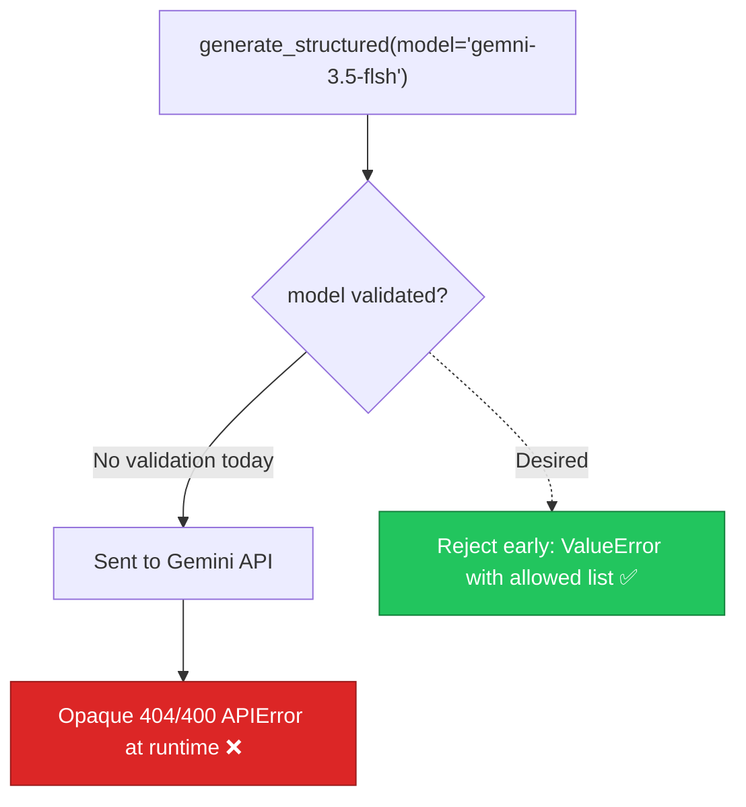

# AIE-01 — Model Allow-List Enforcement & Fail-Fast on Invalid Model IDs

> **Role**: AI Engineer · **Priority**: 🔴 Critical · **Effort**: ~0.5 day
> **Status**: ✅ Done (verified 2026-07-19). `ALLOWED_MODELS` + `model_valid`/`fallback_model_valid` in `config.py`, boot-time fail-fast in `main.py`, and `resolve_model()` validates overrides. Canonical status: [ai-service backlog](../../../stories/ai-service/README.md).

---

## Story Identity

| Field | Value |
|:---|:---|
| **Story ID** | `AIE-01` |
| **Owner** | AI Engineer |
| **Files** | `ai-service/app/config.py`, `ai-service/app/main.py`, `ai-service/app/llm/gemini.py` |
| **Depends on** | None |

---

## 1. Current Problem

The service already declares an `ALLOWED_MODELS` allow-list and exposes `model_valid` / `fallback_model_valid` properties in [config.py](../../../../ai-service/app/config.py). `main.py` correctly refuses to boot on an invalid `GEMINI_MODEL` or `GEMINI_FALLBACK_MODEL`. However, the guarantee is **incomplete** because `generate_structured()` accepts a per-call `model` override that is never validated:

```python
# ai-service/app/llm/gemini.py
async def generate_structured(*, ..., model: str | None = None) -> T:
    ...
    primary_model = model or settings.gemini_model   # ← 'model' is NOT checked against ALLOWED_MODELS
    response = await client.aio.models.generate_content(
        model=primary_model, contents=contents, config=config
    )
```

Any future feature that passes a model string (a typo, a deprecated id, or a model the account lacks access to) will send it straight to Gemini and fail at request time with an opaque `APIError`, instead of failing fast with a clear, actionable message. The boot-time guard only covers the two env-configured models — not runtime overrides.



---

## 2. Why It Matters

- **Correctness baseline**: A bad model id is a configuration error and should surface immediately, not as a confusing API failure mid-pipeline.
- **Debuggability**: `"model 'x' not in allow-list [...]"` is instantly actionable; a raw Gemini 404 is not.
- **Blast radius**: This wrapper is the single choke point for every AI feature (`brief_parser`, `confidence_grid`, `interview`, `extensions`). Hardening it once protects all of them.

---

## 3. Step-Wise Solution

### Step 3.1 — Centralize validation in a helper
Add a `resolve_model(candidate: str | None) -> str` helper (in `config.py` or `gemini.py`) that returns the default when `candidate` is `None`, and otherwise validates against `ALLOWED_MODELS`, raising a `ValueError` listing the allowed ids.

### Step 3.2 — Use the helper in the wrapper
Replace `primary_model = model or settings.gemini_model` with `primary_model = resolve_model(model)` so every call — including overrides — is validated.

### Step 3.3 — Surface allow-list on `/health`
Extend the `/health` payload to include `allowedModels: sorted(ALLOWED_MODELS)` so operators can confirm the deployed allow-list without reading code.

### Step 3.4 — Confirm boot-time fail-fast
Keep the existing `RuntimeError` on invalid env models in `main.py`; add a one-line log at startup echoing the resolved primary/fallback models.

---

## 4. Done When

- [ ] `resolve_model()` validates any non-`None` model against `ALLOWED_MODELS` and raises a clear `ValueError`.
- [ ] `generate_structured()` routes both default and override model ids through `resolve_model()`.
- [ ] `/health` returns `allowedModels`.
- [ ] Boot still fails fast (`RuntimeError`) for invalid env model ids.
- [ ] Unit tests cover: valid override, invalid override, `None` → default.
- [ ] `python -m compileall app` passes cleanly.

---

## 5. Cross-References

| Document | Relevance |
|:---|:---|
| [config.py](../../../../ai-service/app/config.py) | Allow-list + validity properties |
| [gemini.py](../../../../ai-service/app/llm/gemini.py) | Model resolution choke point |
| [IMPLEMENTATION_STATUS.md](../IMPLEMENTATION_STATUS.md) | Tracks AIE-01 at ~70% |
