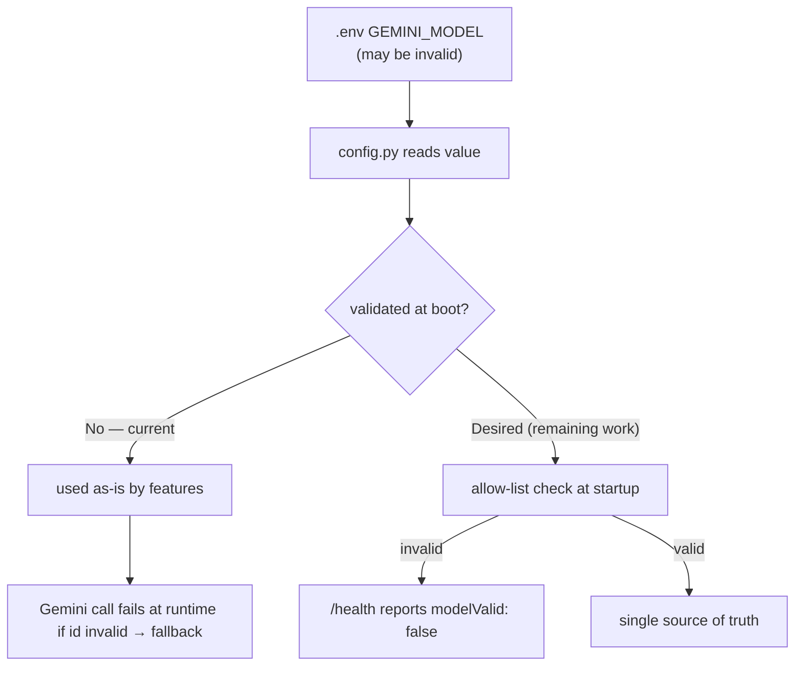

# AIE-01 — Fix Brand & Model-Config Drift in AI Prompts

> **Role**: AI Engineer · **Priority**: 🔴 Critical · **Effort**: ~0.5 day
> **Migration status**: 🟢 **Mostly resolved by the TS→Python migration.** The brand typo is fixed and the invalid model id is gone. Only the boot-time model allow-list validation remains.
> **✅ Verified status (2026-07-05): 🟡 ~70% done.** Confirmed in code: `config.py` is the single model source, no `Dixflow` remains. **Left:** `ALLOWED_MODELS`/`model_valid` in `config.py`, `modelValid` on `/health`, fail-fast. **Priority: 🔴 P0** (do first — tiny, unblocks correctness). See [status board](../IMPLEMENTATION_STATUS.md).

---

## Story Identity

| Field | Value |
|:---|:---|
| **Story ID** | `AIE-01` |
| **Owner** | AI Engineer |
| **Files** | `ai-service/app/features/brief_parser.py`, `ai-service/app/features/confidence_grid.py`, `ai-service/app/config.py`, `ai-service/app/main.py` |
| **Blocks** | AIE-02, every other AI story (correctness baseline) |

---

## 1. Current Problem (original)

Two unrelated defects shipped together as "config drift" and both reached production output.

### 1.1 Wrong brand name baked into prompts — ✅ FIXED (historical; nothing to do)
> **Note:** "Dixflow" no longer exists anywhere in the repo. This item documents a defect in the **old, now-deleted TypeScript files** — it is not a current problem. If you're reading this fresh, you can skip it.

The original TypeScript prompts for the two most important features addressed the model as **"Dixflow AI"** instead of **FixFlow AI** (in `backend/src/skills/briefParser.ts` and `confidenceGrid.ts`). Those `.ts` files were **removed** in the TS→Python migration and replaced by `ai-service/app/features/brief_parser.py` and `confidence_grid.py`, which say **"FixFlow AI"** — matching the interview/extensions prompts. A repo-wide grep for `Dixflow` now returns matches **only in documentation** (this story + the migration plan, both as historical references), never in code.

### 1.2 Model selection inconsistent and unvalidated — 🟡 partially fixed
- The old TS skills defaulted to `'gemini-2.5-pro'` while `index.ts` passed `GEMINI_MODEL` (defaulting to `gemini-2.5-flash`), silently overriding it.
- The go-live roadmap once flagged `Gemini 3.5 Flash` as an "invalid model id." That string is a **display name**, not an API id — the real, now-available id is **`gemini-3.5-flash`**. The lesson stands: only a validated **API id** (lowercase, hyphenated — never a display name with spaces) may be set in `.env`.

**Now:** the model is read once in `ai-service/app/config.py` (`GEMINI_MODEL`) and used by every feature — a single source of truth. **Updated model policy (latest availability):** default to **`gemini-3.5-flash`** as the primary, with **`gemini-3.1-flash-lite`** as the cheaper/faster fallback. **Remaining gap:** an invalid or display-name `GEMINI_MODEL` is still only discovered at the first Gemini call (routes into fallback) rather than failing fast at boot.

#### Latest Gemini model lineup (set the API id, never the display name)
| Display name | API id | Role in FixFlow |
|:---|:---|:---|
| Gemini 3.5 Flash | `gemini-3.5-flash` | **Primary / default** — fast, schema-constrained JSON extraction |
| Gemini 3.1 Flash Lite | `gemini-3.1-flash-lite` | **Fallback** — cheapest / lowest-latency for retries & high-volume calls |
| Gemini 3.5 Flash Lite | `gemini-3.5-flash-lite` | Optional lighter tier |
| Gemini 3 Flash | `gemini-3-flash` | Previous-gen Flash, still available |
| Gemini 2.5 Flash | `gemini-2.5-flash` | Legacy fallback (older accounts) |
| Gemini 3.1 Pro | `gemini-3.1-pro` | Higher-quality option for hard evaluations (AI-002 optimizer) |



---

## 2. Why It Matters

- **Brand integrity**: client-facing proposals/findings must never say "Dixflow." *(Done.)*
- **Determinism**: the team must know the exact model running to reason about cost, latency, and quality. *(Done — single value in `config.py`.)*
- **Fail fast**: a model typo should fail at startup, not masquerade as a low-quality (but valid-looking) proposal. *(Remaining.)*

---

## 3. Step-Wise Solution (remaining work)

### Step 3.1 — Add an allow-list to `config.py`
Extend `Settings` with the current model ids (primary + fallbacks):
- `ALLOWED_MODELS = {"gemini-3.5-flash", "gemini-3.1-flash-lite", "gemini-3.5-flash-lite", "gemini-3-flash", "gemini-2.5-flash", "gemini-3.1-pro"}` (extend as new ids ship)
- `GEMINI_MODEL` default → `"gemini-3.5-flash"`.
- `model_valid` property: `self.gemini_model in ALLOWED_MODELS`.

### Step 3.1b — Add a configurable fallback model
Add `GEMINI_FALLBACK_MODEL` (default `"gemini-3.1-flash-lite"`), also validated against `ALLOWED_MODELS`. This is the model [AIA-05](./AIA-05-gemini-call-resilience.md) retries with when the primary is unavailable/overloaded (e.g. `429`/`503`), so a transient primary-model issue degrades to a lighter *real* model before falling back to canned defaults.

### Step 3.2 — Surface validity on `/health`
`ai-service/app/main.py` `health()` already returns `aiEnabled` and `model`; add `"modelValid": settings.model_valid`. The TS gateway `/api/health` can proxy/echo it if desired.

### Step 3.3 — Fail fast (optional hard mode)
Optionally raise at startup (or refuse AI routes with a clear 503 `code: invalid_model`) when `model_valid` is false, so a typo is obvious immediately rather than surfacing as fallback output.

### Step 3.4 — Confirm brand sweep
Grep both repos to confirm zero `Dixflow` occurrences remain:
```bash
grep -ri "dixflow" ai-service backend/src   # expect no matches
```

---

## 4. Done When

- [x] No occurrence of `Dixflow` anywhere in the AI code (verified by grep).
- [x] A single source of truth for the model (`config.py`), used by all features.
- [x] No display-name string (e.g. `Gemini 3.5 Flash` with spaces) is used as an id; the valid id `gemini-3.5-flash` is the default.
- [ ] `config.py` validates `GEMINI_MODEL` **and** `GEMINI_FALLBACK_MODEL` against `ALLOWED_MODELS`.
- [ ] `GEMINI_FALLBACK_MODEL` (default `gemini-3.1-flash-lite`) is defined and used by AIA-05 on primary-model failure.
- [ ] `/health` reports `modelValid`; invalid model is visible at boot.
- [ ] `python -m compileall app` passes.

---

## 5. Cross-References

| Document | Relevance |
|:---|:---|
| [Python Migration Plan](../python_migration_plan.md) | Where the prompts/model config now live |
| [AIE-02 Honest Fallback](./AIE-02-brief-parser-honest-fallback.md) | Depends on this for clean failure signals |
| [Go-Live Roadmap §3 Phase 0](../../go_live_roadmap.md) | Flagged the invalid model config |
