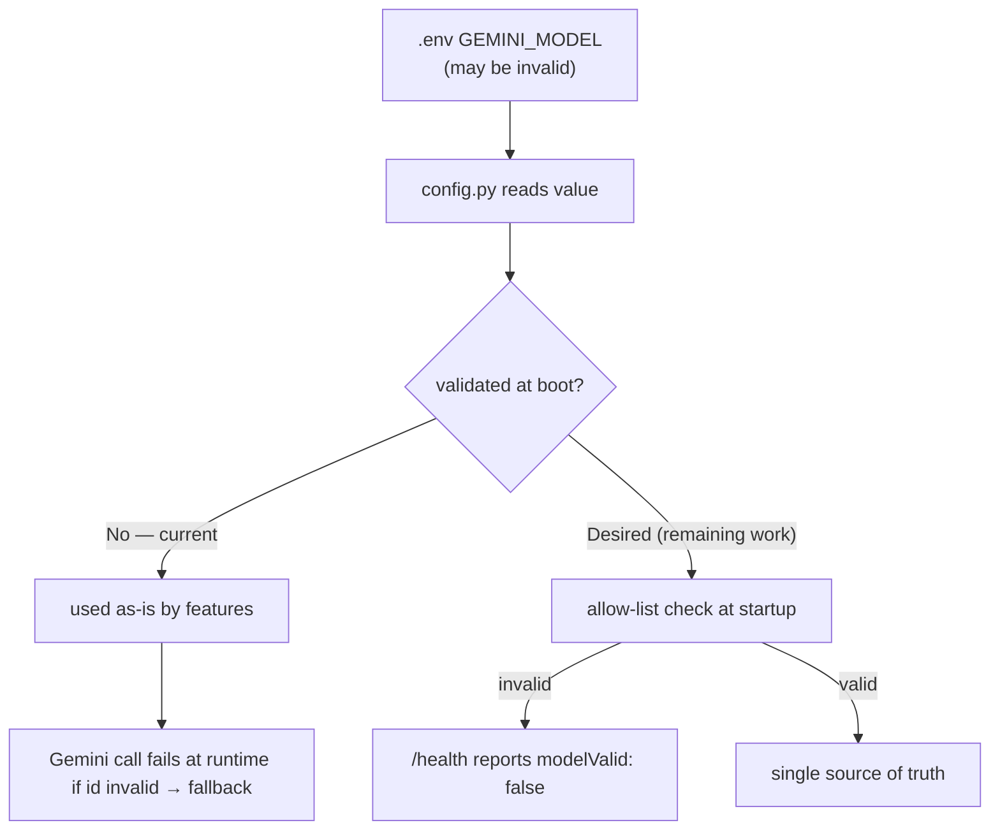

# AIE-01 — Fix Brand & Model-Config Drift in AI Prompts

> **Role**: AI Engineer · **Priority**: 🔴 Critical · **Effort**: ~0.5 day
> **Migration status**: 🟢 **Mostly resolved by the TS→Python migration.** The brand typo is fixed and the invalid model id is gone. Only the boot-time model allow-list validation remains.

---

## Story Identity

| Field | Value |
|:---|:---|
| **Story ID** | `AIE-01` |
| **Owner** | AI Engineer |
| **Files** | `ai-service/app/features/brief_parser.py`, `ai-service/app/features/confidence_grid.py`, `ai-service/app/config.py`, `ai-service/app/main.py` |
| **Blocks** | AIE-02, every other AI story (correctness baseline) |

---

## 1. Current Problem (original)

Two unrelated defects shipped together as "config drift" and both reached production output.

### 1.1 Wrong brand name baked into prompts — ✅ FIXED in migration
The TypeScript prompts for the two most important features addressed the model as **"Dixflow AI"** instead of **FixFlow AI** (`briefParser.ts`, `confidenceGrid.ts`). During the port to Python these were corrected: `ai-service/app/features/brief_parser.py` and `confidence_grid.py` now say **"FixFlow AI"**, matching the interview/extensions prompts.

### 1.2 Model selection inconsistent and unvalidated — 🟡 partially fixed
- The old TS skills defaulted to `'gemini-2.5-pro'` while `index.ts` passed `GEMINI_MODEL` (defaulting to `gemini-2.5-flash`), silently overriding it.
- The go-live roadmap flagged an **invalid model id** (`Gemini 3.5 Flash`) set in `.env`.

**Now:** the model is read once in `ai-service/app/config.py` (`GEMINI_MODEL`, default `gemini-2.5-flash`) and used by every feature — a single source of truth. The invalid `.env` default is gone. **Remaining gap:** an invalid `GEMINI_MODEL` is still only discovered at the first Gemini call (routes into fallback) rather than failing fast at boot.



---

## 2. Why It Matters

- **Brand integrity**: client-facing proposals/findings must never say "Dixflow." *(Done.)*
- **Determinism**: the team must know the exact model running to reason about cost, latency, and quality. *(Done — single value in `config.py`.)*
- **Fail fast**: a model typo should fail at startup, not masquerade as a low-quality (but valid-looking) proposal. *(Remaining.)*

---

## 3. Step-Wise Solution (remaining work)

### Step 3.1 — Add an allow-list to `config.py`
Extend `Settings` with:
- `ALLOWED_MODELS = {"gemini-2.5-pro", "gemini-2.5-flash"}` (extend as needed)
- `model_valid` property: `self.gemini_model in ALLOWED_MODELS`.

### Step 3.2 — Surface validity on `/health`
`ai-service/app/main.py` `health()` already returns `aiEnabled` and `model`; add `"modelValid": settings.model_valid`. The TS gateway `/api/health` can proxy/echo it if desired.

### Step 3.3 — Fail fast (optional hard mode)
Optionally raise at startup (or refuse AI routes with a clear 503 `code: invalid_model`) when `model_valid` is false, so a typo is obvious immediately rather than surfacing as fallback output.

### Step 3.4 — Confirm brand sweep
Grep both repos to confirm zero `Dixflow` occurrences remain:
```bash
grep -ri "dixflow" ai-service backend/src   # expect no matches
```

---

## 4. Done When

- [x] No occurrence of `Dixflow` anywhere in the AI code (verified by grep).
- [x] A single source of truth for the model (`config.py`), used by all features.
- [x] The invalid `Gemini 3.5 Flash` default is removed.
- [ ] `config.py` validates `GEMINI_MODEL` against an allow-list.
- [ ] `/health` reports `modelValid`; invalid model is visible at boot.
- [ ] `python -m compileall app` passes.

---

## 5. Cross-References

| Document | Relevance |
|:---|:---|
| [Python Migration Plan](../python_migration_plan.md) | Where the prompts/model config now live |
| [AIE-02 Honest Fallback](./AIE-02-brief-parser-honest-fallback.md) | Depends on this for clean failure signals |
| [Go-Live Roadmap §3 Phase 0](../../go_live_roadmap.md) | Flagged the invalid model config |
