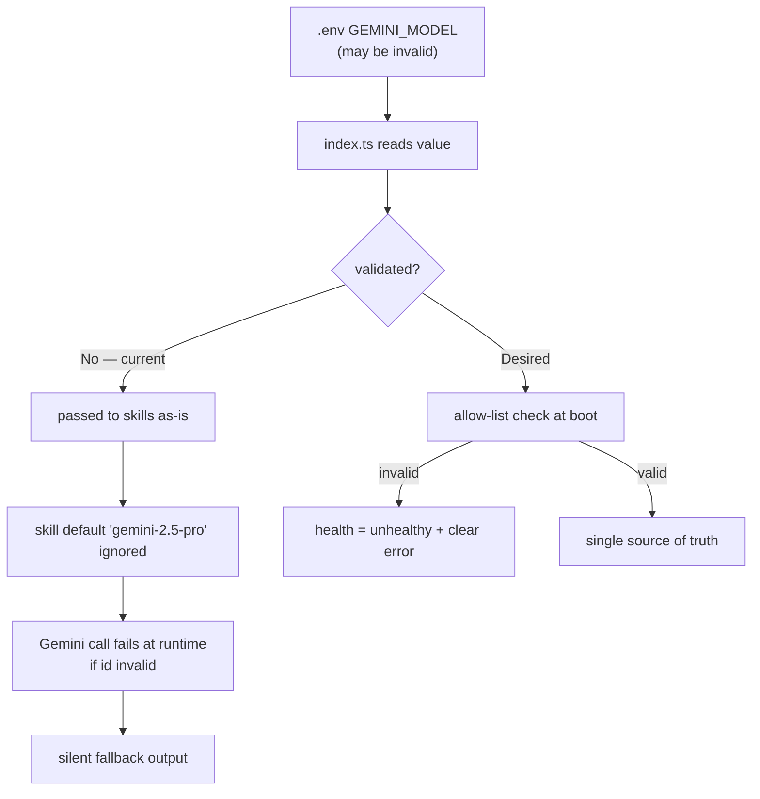
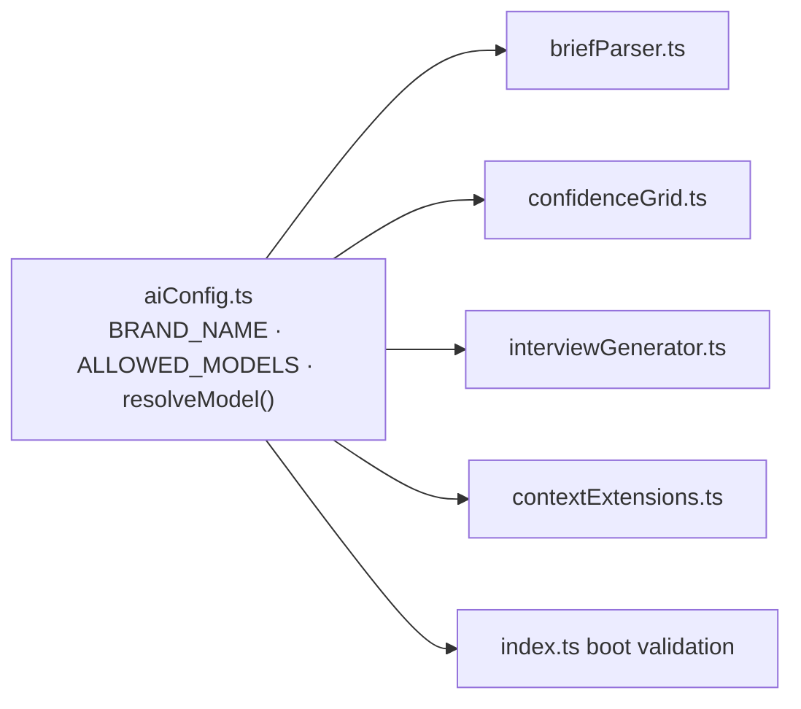

# AIE-01 — Fix Brand & Model-Config Drift in AI Prompts

> **Role**: AI Engineer · **Priority**: 🔴 Critical · **Effort**: ~0.5 day

---

## Story Identity

| Field | Value |
|:---|:---|
| **Story ID** | `AIE-01` |
| **Owner** | AI Engineer |
| **Backend files** | [briefParser.ts](../../../backend/src/skills/briefParser.ts), [confidenceGrid.ts](../../../backend/src/skills/confidenceGrid.ts), [index.ts](../../../backend/src/index.ts) |
| **Blocks** | AIE-02, every other AI story (correctness baseline) |

---

## 1. Current Problem

Two unrelated defects ship together as "config drift" and both reach production output.

### 1.1 Wrong brand name baked into prompts
The system prompts for the two most important AI features address the model as **"Dixflow AI"** instead of **FixFlow AI**:

- `briefParser.ts` → `"You are the lead architect and enterprise consultant for Dixflow AI."`
- `confidenceGrid.ts` → `"You are the Lead Auditor Agent for Dixflow AI."` and `"...Lead Technical Feasibility Agent for Dixflow AI."`

Meanwhile `interviewGenerator.ts` and `contextExtensions.ts` correctly say **"FixFlow AI"**. The model can echo the wrong brand into generated prose (summaries, findings, drafts) that clients see.

### 1.2 Model selection is inconsistent and unvalidated
- Each skill defaults its `modelName` parameter to `'gemini-2.5-pro'`.
- `index.ts` reads `GEMINI_MODEL` (defaulting to `'gemini-2.5-flash'`) and passes it into every skill call, **silently overriding** the per-skill default.
- The [go-live roadmap](../../go_live_roadmap.md) flags an **invalid model id** (`Gemini 3.5 Flash`) having been set in `.env`. An invalid id is only discovered at the first Gemini call — as a runtime failure that then routes into the silent fallback.

The net effect: the team can't easily answer "which model actually ran?" and a typo in `.env` produces degraded output instead of a clear boot-time error.

---

## 2. Why It Matters

- **Brand integrity**: client-facing proposals/findings must never say "Dixflow."
- **Determinism**: the team must know the exact model running to reason about cost, latency, and quality.
- **Fail fast**: a model typo should fail at startup, not masquerade as a low-quality (but valid-looking) proposal.

---

## 3. Step-Wise Solution

### Step 3.1 — Centralize AI constants
Create `backend/src/skills/aiConfig.ts`:
- `BRAND_NAME = 'FixFlow AI'`
- `ALLOWED_MODELS = ['gemini-2.5-pro', 'gemini-2.5-flash']` (extend as needed)
- `DEFAULT_MODEL = 'gemini-2.5-flash'`
- `resolveModel(name?: string)` → returns a valid id or throws `InvalidModelError`.

### Step 3.2 — Sweep the prompts
Replace every `"Dixflow AI"` with the `BRAND_NAME` constant (or the literal `FixFlow AI`) across `briefParser.ts` and `confidenceGrid.ts`. Grep to confirm zero remaining occurrences.

### Step 3.3 — Validate model at boot
In `index.ts`, call `resolveModel(process.env.GEMINI_MODEL)` once at startup. If invalid, log a clear error and surface it on `GET /api/health` (`aiEnabled: false`, `modelValid: false`).

### Step 3.4 — Single source of truth
Have skills import `DEFAULT_MODEL` from `aiConfig.ts` instead of hardcoding `'gemini-2.5-pro'`, so the per-skill default and the server default agree.

### Step 3.5 — Verify
Run `npm run build`; hit `GET /api/health` and confirm `modelValid: true`. Run a parse with a deliberately invalid `GEMINI_MODEL` and confirm the server reports it clearly rather than returning a fallback proposal.

---

## 4. Done When

- [ ] No occurrence of `Dixflow` anywhere in `backend/src` (verified by grep).
- [ ] `aiConfig.ts` is the single source for brand + model constants.
- [ ] Invalid `GEMINI_MODEL` makes `GET /api/health` report `modelValid: false` at boot.
- [ ] Skill defaults and server default reference the same constant.
- [ ] `npm run build` passes.

---

## 5. Cross-References

| Document | Relevance |
|:---|:---|
| [AIE-02 Honest Fallback](./AIE-02-brief-parser-honest-fallback.md) | Depends on this for clean failure signals |
| [Go-Live Roadmap §3 Phase 0](../../go_live_roadmap.md) | Flags the invalid model config |
| [AI Features Index](../README.md) | Shared Gemini infrastructure |
