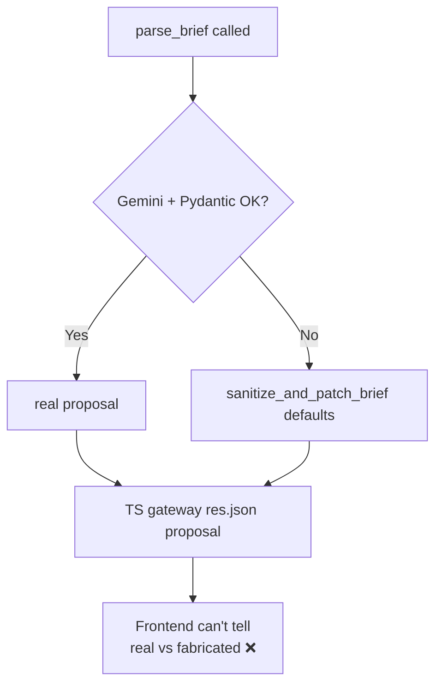
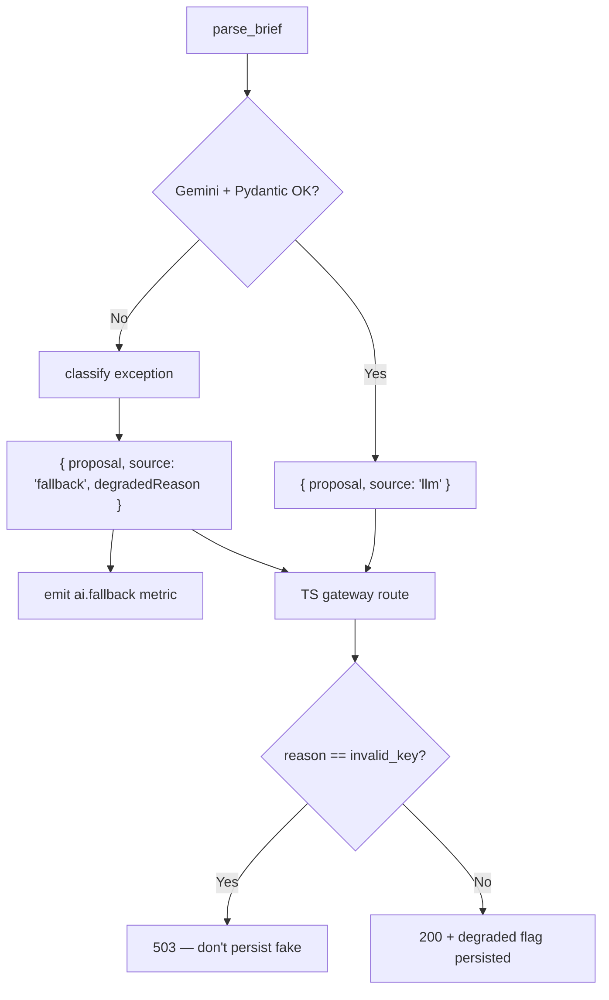

# AIE-02 — Make the Brief Parser Fallback Honest (Stop Silent Fakes)

> **Role**: AI Engineer · **Priority**: 🔴 Critical · **Effort**: ~1–1.5 days

---

## Story Identity

| Field | Value |
|:---|:---|
| **Story ID** | `AIE-02` |
| **Owner** | AI Engineer |
| **Files** | `ai-service/app/features/brief_parser.py`, `ai-service/app/main.py`, `ai-service/app/schemas/proposal.py`; TS passthrough in `backend/src/services/aiClient.ts` + `index.ts` |
| **Depends on** | [AIE-01](./AIE-01-prompt-brand-model-config.md), [AIA-05](./AIA-05-gemini-call-resilience.md) |

---

## 1. Current Problem

`parse_brief()` (in `ai-service/app/features/brief_parser.py`) wraps the entire Gemini call in a `try/except`. On **any** error — invalid key, network failure, quota exhaustion, malformed JSON, Pydantic validation failure — it calls `sanitize_and_patch_brief()` and returns a fully-formed, schema-valid `Proposal` built from **generic defaults** (e.g. `"Core Module Deployment"`, `confidence_pct: 75`).

The Python endpoint returns that proposal, and the TS gateway (`index.ts` → `aiClient.parseBrief`) then persists and returns it **with no indication it is synthetic**:

```python
# ai-service/app/features/brief_parser.py
except Exception as error:
    logger.error("CRITICAL: Semantic Brief Parsing Exception: %s", error)
    return sanitize_and_patch_brief({})   # looks identical to a real parse
```

```ts
// backend/src/index.ts (gateway)
const proposal = await parseBrief(briefText);
const stored = await getProposalRepository().create({ userId, briefText, proposal });
res.json({ proposal, proposalId: stored.proposalId });
```

So a complete Gemini outage looks identical to a successful parse across the whole chain. The client sees a polished proposal unrelated to their brief, and the team gets no signal.



> Note: the fallback itself is good engineering (the API never 500s). The defect is that **the signal is lost**. We keep the resilience, add the honesty.

---

## 2. Why It Matters

- A fabricated proposal presented as real erodes trust and produces wrong milestones/budgets downstream (AI-002 will "evaluate" garbage, AI-006 will match on fake requirements).
- Without a degraded signal, AIA-06 observability can't measure the true fallback rate.
- The frontend (per go-live Phase 3) is supposed to show honest loading/empty/error states — it can't, because the backend hides the failure.

---

## 3. Step-Wise Solution

### Step 3.1 — Add a provenance marker to the result
Return a structured result from the Python endpoint instead of a bare proposal. Extend the `ParseBriefResponse` model in `ai-service/app/main.py`:

```python
# ai-service/app/schemas/proposal.py (or main.py response model)
class ParseBriefResponse(BaseModel):
    proposal: Proposal
    source: Literal["llm", "fallback"]
    degradedReason: str | None = None   # e.g. 'gemini_timeout', 'validation', 'invalid_key'
```

`parse_brief()` returns `source="llm"` only when Gemini returned and Pydantic validated. Every fallback path sets `source="fallback"` plus a machine-readable `degradedReason`.

### Step 3.2 — Classify the failure
Map caught exceptions to a small enum (`invalid_key`, `empty_response`, `json_parse`, `validation`, `gemini_error`) so reasons are queryable, not free text. (This aligns with the transient/permanent classification from [AIA-05](./AIA-05-gemini-call-resilience.md).)

### Step 3.3 — Decide the API contract per reason
- **Hard config errors** (missing/invalid key) → the Python service returns `503`; the TS gateway surfaces `503` and does **not** persist a fake.
- **Transient/model errors** → still return `200` with the fallback proposal **but** include `source: "fallback"` and `degradedReason`; the TS gateway persists with a `degraded: true` flag on the proposal record.

### Step 3.4 — Update the TS gateway passthrough
`aiClient.parseBrief()` returns the full `{ proposal, source, degradedReason }`; `index.ts`:

```ts
const result = await parseBrief(briefText);   // { proposal, source, degradedReason? }
if (result.source === 'fallback' && result.degradedReason === 'invalid_key') {
  return res.status(503).json({ error: 'AI temporarily unavailable', code: result.degradedReason });
}
const stored = await getProposalRepository().create({
  userId, briefText, proposal: result.proposal, degraded: result.source === 'fallback',
});
res.json({ proposal: result.proposal, proposalId: stored.proposalId, source: result.source, degradedReason: result.degradedReason });
```

### Step 3.5 — Emit a metric
On every fallback, emit the structured event consumed by [AIA-06](./AIA-06-ai-observability.md) (`ai.fallback{feature=brief_parse, reason}`) from the Python service.



---

## 4. Done When

- [ ] The Python `/ai/brief/parse` response includes `{ proposal, source, degradedReason? }`.
- [ ] `source: "llm"` is set **only** on a genuine successful parse.
- [ ] Hard config failures return `503` and the gateway never persists a fabricated proposal.
- [ ] Persisted proposals carry a `degraded` flag (TS `StoredProposal`).
- [ ] A `ai.fallback` metric is emitted on every fallback.
- [ ] `aiClient.ts` + `index.ts` updated; `python -m compileall app` and `npm run build` pass.

---

## 5. Cross-References

| Document | Relevance |
|:---|:---|
| [AIE-01](./AIE-01-prompt-brand-model-config.md) | Clean config errors feed the classifier |
| [AIA-05 Resilience](./AIA-05-gemini-call-resilience.md) | Distinguishes transient vs permanent failures |
| [AIA-06 Observability](./AIA-06-ai-observability.md) | Consumes the fallback metric |
| [AI-001 Spec](../ai_001_semantic_brief_parsing.md) | Original fallback design |
