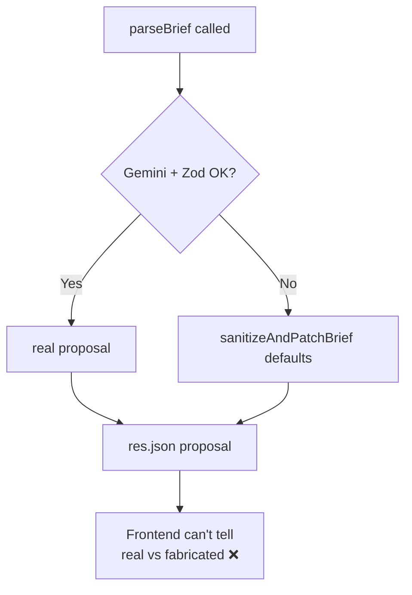
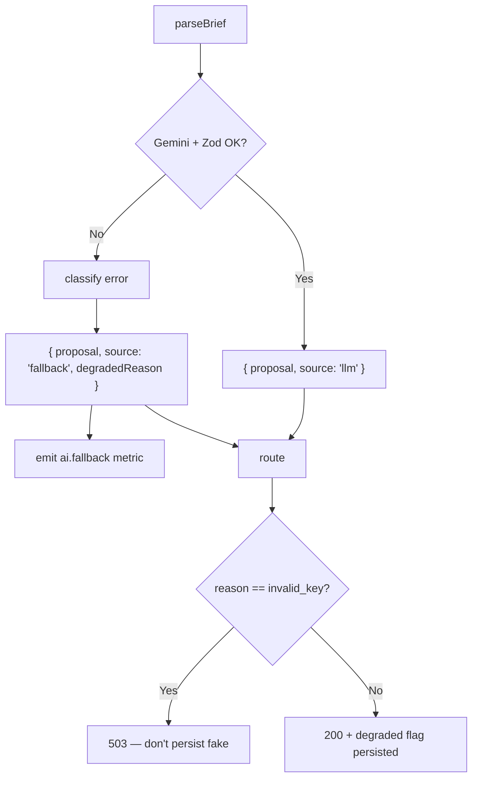

# AIE-02 — Make the Brief Parser Fallback Honest (Stop Silent Fakes)

> **Role**: AI Engineer · **Priority**: 🔴 Critical · **Effort**: ~1–1.5 days

---

## Story Identity

| Field | Value |
|:---|:---|
| **Story ID** | `AIE-02` |
| **Owner** | AI Engineer |
| **Backend files** | [briefParser.ts](../../../backend/src/skills/briefParser.ts), [index.ts](../../../backend/src/index.ts) |
| **Depends on** | [AIE-01](./AIE-01-prompt-brand-model-config.md), [AIA-05](./AIA-05-gemini-call-resilience.md) |

---

## 1. Current Problem

`parseBrief()` wraps the entire Gemini call in a `try/catch`. On **any** error — invalid key, network failure, quota exhaustion, malformed JSON, Zod failure — it calls `sanitizeAndPatchBrief()` and returns a fully-formed, schema-valid `Proposal` built from **generic defaults** (e.g. `"Core Module Deployment"`, `confidence_pct: 75`).

The caller in `index.ts` then persists and returns that object **with no indication it is synthetic**:

```ts
const proposal = await parseBrief(briefText, GEMINI_API_KEY, GEMINI_MODEL);
const stored = await getProposalRepository().create({ userId, briefText, proposal });
res.json({ proposal, proposalId: stored.proposalId });
```

So a complete Gemini outage looks identical to a successful parse. The client sees a polished proposal that has nothing to do with their brief, and the team gets no signal.



> Note: the fallback itself is good engineering (the API never 500s). The defect is that **the signal is lost**. We keep the resilience, add the honesty.

---

## 2. Why It Matters

- A fabricated proposal presented as real erodes trust and produces wrong milestones/budgets downstream (AI-002 will "evaluate" garbage, AI-006 will match on fake requirements).
- Without a degraded signal, AIA-06 observability can't measure the true fallback rate.
- The frontend (per go-live Phase 3) is supposed to show honest loading/empty/error states — it can't, because the backend hides the failure.

---

## 3. Step-Wise Solution

### Step 3.1 — Add a provenance marker to the result
Return a discriminated result instead of a bare `Proposal`:

```ts
interface ParseResult {
  proposal: Proposal;
  source: 'llm' | 'fallback';
  degradedReason?: string;   // e.g. 'gemini_timeout', 'zod_validation', 'invalid_key'
}
```

Set `source: 'llm'` only when Gemini returned and Zod passed. Every fallback path sets `source: 'fallback'` plus a machine-readable `degradedReason`.

### Step 3.2 — Classify the failure
Map caught errors to a small enum (`invalid_key`, `empty_response`, `json_parse`, `zod_validation`, `gemini_error`) so reasons are queryable, not free text.

### Step 3.3 — Decide the API contract per reason
- **Hard config errors** (missing/invalid key) → return `503` (server misconfigured), do not persist a fake.
- **Transient/model errors** → still return `200` with the fallback proposal **but** include `source: 'fallback'` and `degradedReason`, and persist with a `degraded: true` flag on the proposal record.

### Step 3.4 — Update `index.ts` route
```ts
const result = await parseBrief(briefText, GEMINI_API_KEY, GEMINI_MODEL);
if (result.source === 'fallback' && result.degradedReason === 'invalid_key') {
  return res.status(503).json({ error: 'AI temporarily unavailable', code: result.degradedReason });
}
const stored = await getProposalRepository().create({
  userId, briefText, proposal: result.proposal, degraded: result.source === 'fallback',
});
res.json({ proposal: result.proposal, proposalId: stored.proposalId, source: result.source, degradedReason: result.degradedReason });
```

### Step 3.5 — Emit a metric
On every fallback, emit the structured event consumed by [AIA-06](./AIA-06-ai-observability.md) (`ai.fallback{feature=brief_parse, reason}`).



---

## 4. Done When

- [ ] `parseBrief()` returns `{ proposal, source, degradedReason? }`.
- [ ] `source: 'llm'` is set **only** on a genuine successful parse.
- [ ] Hard config failures return `503` and never persist a fabricated proposal.
- [ ] Persisted proposals carry a `degraded` flag.
- [ ] A `ai.fallback` metric is emitted on every fallback.
- [ ] Existing callers/tests updated; `npm run build` passes.

---

## 5. Cross-References

| Document | Relevance |
|:---|:---|
| [AIE-01](./AIE-01-prompt-brand-model-config.md) | Clean config errors feed the classifier |
| [AIA-05 Resilience](./AIA-05-gemini-call-resilience.md) | Distinguishes transient vs permanent failures |
| [AIA-06 Observability](./AIA-06-ai-observability.md) | Consumes the fallback metric |
| [AI-001 Spec](../ai_001_semantic_brief_parsing.md) | Original fallback design |
