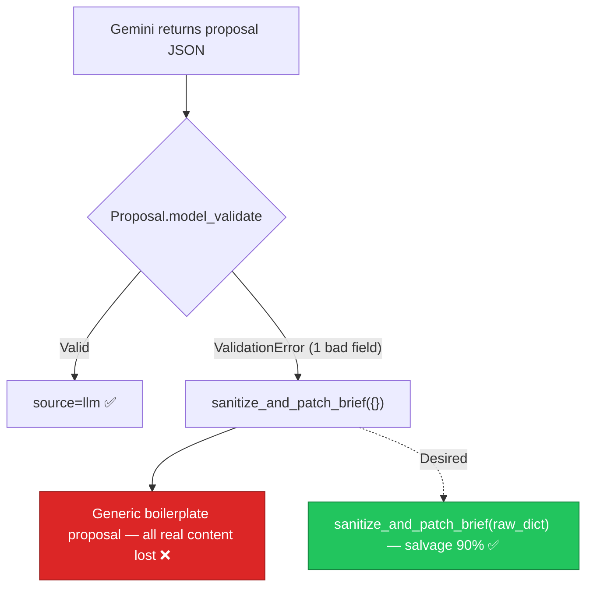

# AIE-02 — Brief Parser Discards Partial LLM Output on Fallback

> **Role**: AI Engineer · **Priority**: 🔴 Critical · **Effort**: ~1 day
> **Status**: ✅ Done (verified 2026-07-19). The `{proposal, source, degradedReason}` contract exists and `parse_brief` now salvages the model's partial payload (`raw_payload` → `sanitize_and_patch_brief`), tagging `partial_salvage`. Canonical status: [ai-service backlog](../../../stories/ai-service/README.md).

---

## Story Identity

| Field | Value |
|:---|:---|
| **Story ID** | `AIE-02` |
| **Owner** | AI Engineer |
| **Files** | `ai-service/app/features/brief_parser.py` |
| **Depends on** | AIA-05 (error classification) |

---

## 1. Current Problem

`parse_brief()` already returns an honest envelope (`source` = `"llm"` / `"fallback"`, plus `degradedReason`) and logs an `ai.fallback` event — that part is good. The problem is that **every** fallback branch calls the sanitizer with an empty dict:

```python
# ai-service/app/features/brief_parser.py
except ValidationError as validation_error:
    ...
    fallback = sanitize_and_patch_brief({})   # ← raw LLM output is discarded
    return ParseBriefResponse(proposal=fallback, source="fallback", degradedReason="validation")
```

`sanitize_and_patch_brief(raw)` is explicitly written to **coerce a partially-malformed object** into a valid `Proposal` — it reads `raw.get("features")`, `raw.get("risks")`, `raw.get("timeline")`, etc., and only substitutes generic defaults per-field. But because callers always pass `{}`, a brief that produced a *90%-correct* proposal with one bad enum value is thrown away entirely and replaced with a boilerplate "Core Platform Setup" proposal. The client silently loses all the real extracted content.



---

## 2. Why It Matters

- **Wasted spend**: A full Gemini generation was paid for, then discarded over a single invalid enum.
- **Silent quality collapse**: The client receives a plausible-looking but generic proposal and cannot tell that real parsing failed beyond the `degradedReason` flag.
- **The sanitizer already supports this** — it was designed to patch partial objects; the wiring simply never feeds it the raw payload.

---

## 3. Step-Wise Solution

### Step 3.1 — Capture the raw model payload before validation
When the Gemini call succeeds but `Proposal` validation fails, capture the raw parsed dict (`response.parsed` if a dict, else `json.loads(response.text)`), guarded by a try/except.

### Step 3.2 — Feed the raw payload into the sanitizer
Change the `ValidationError` branch to `sanitize_and_patch_brief(raw_dict)` so salvageable fields survive. Keep `{}` only for the true no-output paths (`empty_response`, `invalid_key`, network `gemini_error` where no JSON exists).

### Step 3.3 — Add a `partial` degraded reason
Introduce `degradedReason="partial_salvage"` when the sanitizer recovered real fields from a validation failure, distinct from `"validation"` (nothing usable). This keeps the `ai.fallback` metric honest and measurable.

### Step 3.4 — Preserve the existing envelope contract
Do not change the response shape. `source` stays `"fallback"` on any patch; only `degradedReason` gains the new value.

---

## 4. Done When

- [ ] Validation failures with a partially-valid payload preserve real extracted fields (features/risks/timeline) instead of returning boilerplate.
- [ ] Empty/keyless/network failures still return the safe generic proposal.
- [ ] New `degradedReason="partial_salvage"` distinguishes salvage from total fallback.
- [ ] `ai.fallback` log still fires with the correct `reason`.
- [ ] Unit tests cover: valid, partial-salvage, and empty-response paths.
- [ ] `python -m compileall app` passes cleanly.

---

## 5. Cross-References

| Document | Relevance |
|:---|:---|
| [brief_parser.py](../../../../ai-service/app/features/brief_parser.py) | `parse_brief` + `sanitize_and_patch_brief` |
| [proposal.py](../../../../ai-service/app/schemas/proposal.py) | Proposal + `ParseBriefResponse` envelope |
| [BUG-02](./BUG-02-gemini-unbounded-hang.md) | Error classification these branches consume |
