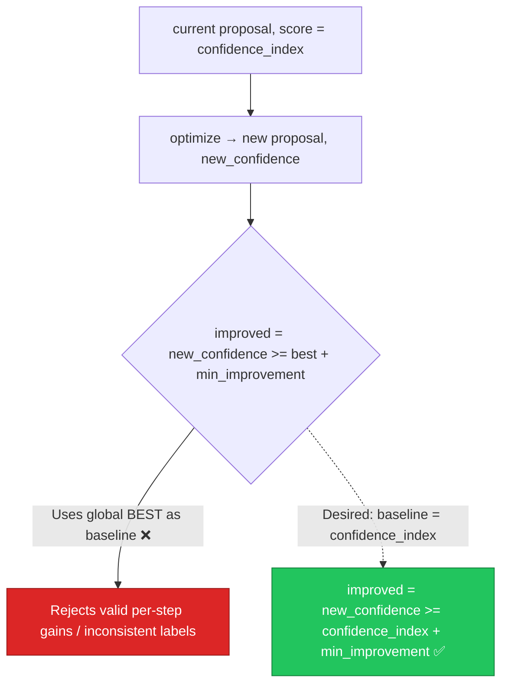

# AIE-03 — Confidence Grid Improvement Check Compares Against Best, Not Current

> **Role**: AI Engineer · **Priority**: 🟡 High · **Effort**: ~1 day
> **Status**: 🟡 ~30%. Regression-guard logic in [confidence_grid.py L200-L235](../../../../ai-service/app/features/confidence_grid.py#L200-L235) uses the wrong baseline.

---

## Story Identity

| Field | Value |
|:---|:---|
| **Story ID** | `AIE-03` |
| **Owner** | AI Engineer |
| **Files** | `ai-service/app/features/confidence_grid.py`, `ai-service/app/config.py` |
| **Depends on** | None |

---

## 1. Current Problem

`process_confidence_grid()` decides whether an optimization cycle "improved" using this line:

```python
# ai-service/app/features/confidence_grid.py
improved = new_confidence >= best_confidence_index + min_improvement
```

The baseline here is `best_confidence_index` (the best score seen across **all** prior cycles), not `confidence_index` (the score of the proposal that was just optimized). These differ once `max_correction_cycles > 1`. The intended semantics of `CONFIDENCE_MIN_IMPROVEMENT` is *"did this optimization step improve on the proposal it was given?"* — a per-step delta. Using the global best instead means:

- If cycle 1 hit a high score and cycle 2 optimizes a *different* (lower) branch, the guard can wrongly reject a legitimate local improvement, or
- With `min_improvement = 0` (current default), `improved` becomes `new_confidence >= best_confidence_index`, which is a "must match or beat the all-time best" rule — stricter and semantically different from "improved over what we just had".

There is also a subtle labeling inconsistency: `improvedOverPrevious` in each `CycleRecord` is computed against `cycle_records[-1].confidenceIndex` (previous *recorded* cycle), while `optimizationApplied` is driven by the `best_confidence_index` comparison — two different baselines describing the same event.



---

## 2. Why It Matters

- **Multi-cycle correctness**: The bug is dormant at `max_correction_cycles = 1` (the current default) but activates the moment cycles are increased — exactly when self-correction is supposed to add value.
- **Auditability**: `optimizationApplied` and `improvedOverPrevious` should tell a consistent story about each cycle. Two baselines make the audit trail contradictory.
- **Cost control**: A correct per-step guard lets the loop stop early and deterministically when optimization stalls, avoiding wasted evaluation cycles.

---

## 3. Step-Wise Solution

### Step 3.1 — Fix the improvement baseline
Change the guard to compare against the score of the proposal that was optimized:
```python
improved = new_confidence >= confidence_index + min_improvement
```
Keep `best_proposal` / `best_confidence_index` bookkeeping separate — the loop should still *return* the all-time best proposal, but *decide to continue* based on per-step improvement.

### Step 3.2 — Unify the audit baseline
Compute `improvedOverPrevious` from the same baseline used for the continue/stop decision so every `CycleRecord` is internally consistent.

### Step 3.3 — Document `CONFIDENCE_MIN_IMPROVEMENT`
Add a comment in `config.py` clarifying it is a *per-step minimum delta*, and default it explicitly (e.g. `1`) so a zero-delta no-op cannot loop.

### Step 3.4 — Guard against regression
Ensure that if `new_confidence < confidence_index`, the loop breaks and returns the pre-optimization best (never a worse proposal), and records `optimizationApplied=False`.

---

## 4. Done When

- [ ] Improvement decision uses `confidence_index` (current) as the baseline, not `best_confidence_index`.
- [ ] `optimizationApplied` and `improvedOverPrevious` share one consistent baseline.
- [ ] The loop never returns a proposal worse than the best evaluated candidate.
- [ ] `CONFIDENCE_MIN_IMPROVEMENT` is documented and defaulted to a non-zero value.
- [ ] Unit tests cover: improvement accepted, regression rejected, stall (no improvement) breaks the loop.
- [ ] `python -m compileall app` passes cleanly.

---

## 5. Cross-References

| Document | Relevance |
|:---|:---|
| [confidence_grid.py](../../../../ai-service/app/features/confidence_grid.py) | Self-correction loop |
| [confidence.py](../../../../ai-service/app/schemas/confidence.py) | `CycleRecord` audit schema |
| [BUG-05](./BUG-05-confidence-grid-double-eval.md) | Related double-evaluation cleanup |
