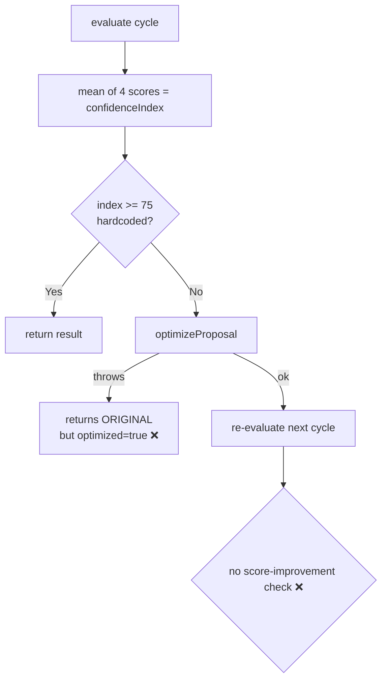
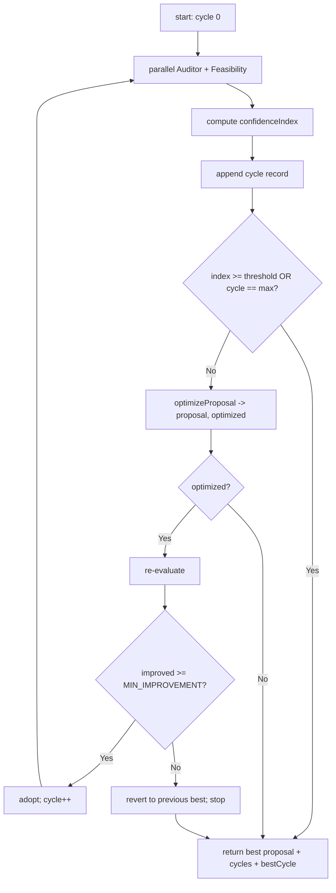

# AIE-03 — Configurable & Auditable Confidence Grid Self-Correction

> **Role**: AI Engineer · **Priority**: 🟡 High · **Effort**: ~2 days

---

## Story Identity

| Field | Value |
|:---|:---|
| **Story ID** | `AIE-03` |
| **Owner** | AI Engineer |
| **Backend files** | [confidenceGrid.ts](../../../backend/src/skills/confidenceGrid.ts), [index.ts](../../../backend/src/index.ts) |
| **Pairs with** | [AIA-01 Async Jobs](./AIA-01-async-evaluation-jobs.md) |

---

## 1. Current Problem

`processConfidenceGrid()` runs the Auditor + Feasibility agents in parallel, averages their four scores into a `confidenceIndex`, and triggers `optimizeProposal()` when the index is below threshold. Three issues limit its trustworthiness:

1. **Hardcoded policy.** The pass threshold `75` and `maxCorrectionCycles = 1` are literals in the code. Tuning quality requires a code change + redeploy.
2. **Silent optimizer failure.** If `optimizeProposal()` throws, it returns the **original** proposal unchanged. The loop still marks `optimized = true`, so the result claims a correction happened when it didn't.
3. **No regression guard / audit.** Nothing checks that the optimized proposal actually scores *higher*. A "correction" can silently lower quality, and there's no per-cycle record of scores/issues to explain the final number.



---

## 2. Why It Matters

- The confidence index gates whether a proposal is shown as "verified." A miscalibrated or unverifiable index undermines the entire "zero-noise / trust-first" UVP.
- Without per-cycle audit data, the team can't debug why a proposal scored low or whether self-correction is even helping.

---

## 3. Step-Wise Solution

### Step 3.1 — Externalize policy
Read from env with safe defaults:
- `CONFIDENCE_PASS_THRESHOLD` (default `75`)
- `CONFIDENCE_MAX_CYCLES` (default `1`)
- `CONFIDENCE_MIN_IMPROVEMENT` (default `0` — optimized score must not regress)

### Step 3.2 — Make optimizer failure explicit
`optimizeProposal()` should return `{ proposal, optimized: boolean }`. If it fails, `optimized: false` and the orchestrator must **not** claim a successful correction. Stop the loop on optimizer failure.

### Step 3.3 — Add a regression guard
After re-evaluating an optimized proposal, keep it only if its `confidenceIndex` improved by at least `CONFIDENCE_MIN_IMPROVEMENT`. Otherwise revert to the previous best proposal and record the regression.

### Step 3.4 — Capture a per-cycle audit trail
Extend `ConfidenceGridResult` with:
```ts
cycles: Array<{
  cycle: number;
  auditor: AuditorEvaluation;
  feasibility: FeasibilityEvaluation;
  confidenceIndex: number;
  issuesFed: string[];
  optimizationApplied: boolean;
  improvedOverPrevious: boolean | null;
}>;
bestCycle: number;
```
Persist this alongside the proposal so the UI/audit can show *why* the final score was reached.



### Step 3.5 — Verify
Unit-test three scenarios: (a) passes first cycle, (b) optimizer improves and is adopted, (c) optimizer regresses and is reverted. Confirm `optimized` is never `true` when no improvement occurred.

---

## 4. Done When

- [ ] Threshold, max cycles, and min-improvement are env-configurable with defaults.
- [ ] Optimizer failure yields `optimized: false`; the loop stops cleanly.
- [ ] An optimized proposal is adopted only if it improves the score; otherwise reverted.
- [ ] `ConfidenceGridResult` includes a per-cycle audit trail and `bestCycle`.
- [ ] Unit tests cover pass / improve / regress paths; `npm run build` passes.

---

## 5. Cross-References

| Document | Relevance |
|:---|:---|
| [AI-002 Spec](../ai_002_confidence_grid_self_correction.md) | Original grid design |
| [AIA-01 Async Jobs](./AIA-01-async-evaluation-jobs.md) | This loop should run as a background job |
| [AIE-04 Eval Harness](./AIE-04-ai-evaluation-harness.md) | Calibrates the threshold against labeled data |
