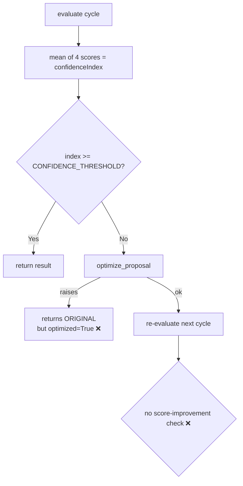
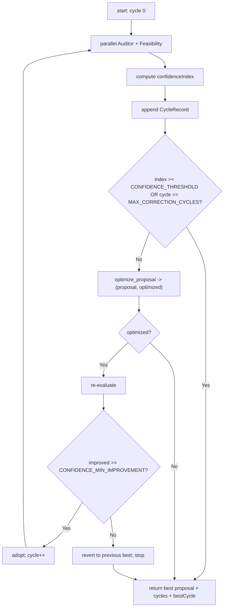

# AIE-03 — Configurable & Auditable Confidence Grid Self-Correction

> **Role**: AI Engineer · **Priority**: 🟡 High · **Effort**: ~2 days
> **Migration status**: 🟢 **Threshold + cycles are already env-configurable** (`CONFIDENCE_THRESHOLD`, `MAX_CORRECTION_CYCLES` in `ai-service/app/config.py`). Remaining work: explicit optimizer-failure handling, regression guard, and the per-cycle audit trail.

---

## Story Identity

| Field | Value |
|:---|:---|
| **Story ID** | `AIE-03` |
| **Owner** | AI Engineer |
| **Files** | `ai-service/app/features/confidence_grid.py`, `ai-service/app/config.py`, `ai-service/app/schemas/confidence.py` |
| **Pairs with** | [AIA-01 Async Jobs](./AIA-01-async-evaluation-jobs.md) |

---

## 1. Current Problem

`process_confidence_grid()` (in `ai-service/app/features/confidence_grid.py`) runs the Auditor + Feasibility agents in parallel (`asyncio.gather`), averages their four scores into a `confidenceIndex`, and triggers `optimize_proposal()` when the index is below threshold. The threshold/cycles are **now read from env** (`CONFIDENCE_THRESHOLD`, `MAX_CORRECTION_CYCLES`), which resolves the original hardcoding complaint. Two issues remain:

1. **Silent optimizer failure.** If `optimize_proposal()` fails, it returns the **original** proposal unchanged, but the loop still sets `optimized = True` — so the result claims a correction happened when it didn't.
2. **No regression guard / audit.** Nothing checks that the optimized proposal actually scores *higher*. A "correction" can silently lower quality, and there's no per-cycle record of scores/issues to explain the final number.



---

## 2. Why It Matters

- The confidence index gates whether a proposal is shown as "verified." A miscalibrated or unverifiable index undermines the entire "zero-noise / trust-first" UVP.
- Without per-cycle audit data, the team can't debug why a proposal scored low or whether self-correction is even helping.

---

## 3. Step-Wise Solution

### Step 3.1 — Externalize policy — ✅ mostly done
Already read from env in `config.py` with safe defaults:
- `CONFIDENCE_THRESHOLD` (default `75`)
- `MAX_CORRECTION_CYCLES` (default `1`)

Add one more:
- `CONFIDENCE_MIN_IMPROVEMENT` (default `0` — optimized score must not regress)

### Step 3.2 — Make optimizer failure explicit
`optimize_proposal()` should return `tuple[Proposal, bool]` (`proposal, optimized`). If it fails, return `(proposal, False)` and the orchestrator must **not** claim a successful correction. Stop the loop on optimizer failure.

### Step 3.3 — Add a regression guard
After re-evaluating an optimized proposal, keep it only if its `confidenceIndex` improved by at least `CONFIDENCE_MIN_IMPROVEMENT`. Otherwise revert to the previous best proposal and record the regression.

### Step 3.4 — Capture a per-cycle audit trail
Extend `ConfidenceGridResult` in `ai-service/app/schemas/confidence.py`:
```python
class CycleRecord(BaseModel):
    cycle: int
    auditor: AuditorEvaluation
    feasibility: FeasibilityEvaluation
    confidenceIndex: int
    issuesFed: list[str]
    optimizationApplied: bool
    improvedOverPrevious: bool | None

class ConfidenceGridResult(BaseModel):
    # ...existing fields...
    cycles: list[CycleRecord]
    bestCycle: int
```
The TS gateway persists this opaquely via `getProposalRepository().setEvaluation()` (already wired), so the UI/audit can show *why* the final score was reached.



### Step 3.5 — Verify
Add `pytest` cases for three scenarios: (a) passes first cycle, (b) optimizer improves and is adopted, (c) optimizer regresses and is reverted. Confirm `optimized` is never `True` when no improvement occurred. Mock the Gemini wrapper so tests run without a key.

---

## 4. Done When

- [x] Threshold and max cycles are env-configurable with defaults.
- [ ] `CONFIDENCE_MIN_IMPROVEMENT` added.
- [ ] Optimizer failure yields `optimized: False`; the loop stops cleanly.
- [ ] An optimized proposal is adopted only if it improves the score; otherwise reverted.
- [ ] `ConfidenceGridResult` includes a per-cycle audit trail and `bestCycle`.
- [ ] `pytest` covers pass / improve / regress paths; `python -m compileall app` passes.

---

## 5. Cross-References

| Document | Relevance |
|:---|:---|
| [AI-002 Spec](../ai_002_confidence_grid_self_correction.md) | Original grid design |
| [AIA-01 Async Jobs](./AIA-01-async-evaluation-jobs.md) | This loop should run as a background job |
| [AIE-04 Eval Harness](./AIE-04-ai-evaluation-harness.md) | Calibrates the threshold against labeled data |
