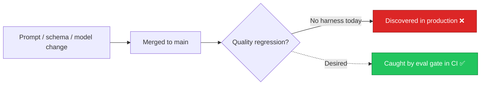

# AIE-04 — No Golden Evaluation Harness for AI Features

> **Role**: AI Engineer · **Priority**: 🟡 High · **Effort**: ~2 days
> **Status**: 🔴 Not started. No `ai-service/eval/` directory exists; regressions in prompts or schemas are undetectable in CI.

---

## Story Identity

| Field | Value |
|:---|:---|
| **Story ID** | `AIE-04` |
| **Owner** | AI Engineer |
| **Files** | `ai-service/eval/` (new), `ai-service/app/features/*`, `.github/workflows/*` |
| **Depends on** | AIA-02 (cache — optional), AIA-06 (telemetry — optional) |

---

## 1. Current Problem

The four LLM features (`brief_parser`, `confidence_grid`, `interview`, `extensions`) are validated only by `smoke_test.py` and a single `test_confidence_grid.py`. There is no **golden dataset** of representative briefs with expected structural properties, and no runner that scores output quality against them. Any prompt tweak, schema change, or model swap can silently degrade output quality (e.g. fewer features extracted, confidence index drift, missing timeline tasks) with zero signal in CI.

---

## 2. Why It Matters

- **Prompt drift is invisible**: LLM behavior shifts across model versions; without a baseline, degradation is only found via user complaints.
- **Refactor safety**: Stories like AIE-02 and AIE-03 change core logic. A harness proves they did not regress output quality.
- **Deterministic gate**: Structural assertions (counts, ranges, required fields) can run without a live API by replaying recorded fixtures.

---

## 3. Step-Wise Solution

### Step 3.1 — Golden dataset
Create `ai-service/eval/golden/` with 8–12 representative briefs (short/urgent, long/RFP, vague, over-specified) and, per brief, an `expected.json` describing **structural** expectations (min feature count, required areas, confidence range, non-empty timeline tasks) — not exact strings.

### Step 3.2 — Recorded fixtures for deterministic runs
Add a fixture mode that replays previously-captured Gemini responses (JSON on disk) so the harness runs offline and deterministically in CI, plus a `--live` flag for real-API smoke runs.

### Step 3.3 — Scorer + runner
Build `ai-service/eval/run_eval.py` that executes each feature against the dataset, applies the structural assertions, and emits a per-feature pass/score summary plus an aggregate.

### Step 3.4 — Regression gate
Store a `baseline_scores.json`. Fail the run (non-zero exit) if aggregate score drops more than a configurable tolerance below baseline. Wire into a CI workflow (fixture mode by default).

---

## 4. Done When

- [ ] `ai-service/eval/golden/` contains ≥8 briefs with structural `expected.json` files.
- [ ] `run_eval.py` runs offline against recorded fixtures and online via `--live`.
- [ ] A regression gate fails when aggregate quality drops beyond tolerance.
- [ ] CI workflow runs the harness in fixture mode on PRs touching `ai-service/`.
- [ ] `python -m compileall app eval` passes cleanly.

---

## 5. Cross-References

| Document | Relevance |
|:---|:---|
| [smoke_test.py](../../../../ai-service/smoke_test.py) | Existing minimal check to extend |
| [test_confidence_grid.py](../../../../ai-service/test_confidence_grid.py) | Existing unit test |
| [IMPLEMENTATION_STATUS.md](../IMPLEMENTATION_STATUS.md) | Tracks AIE-04 |
