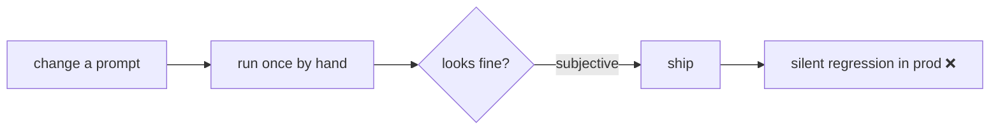
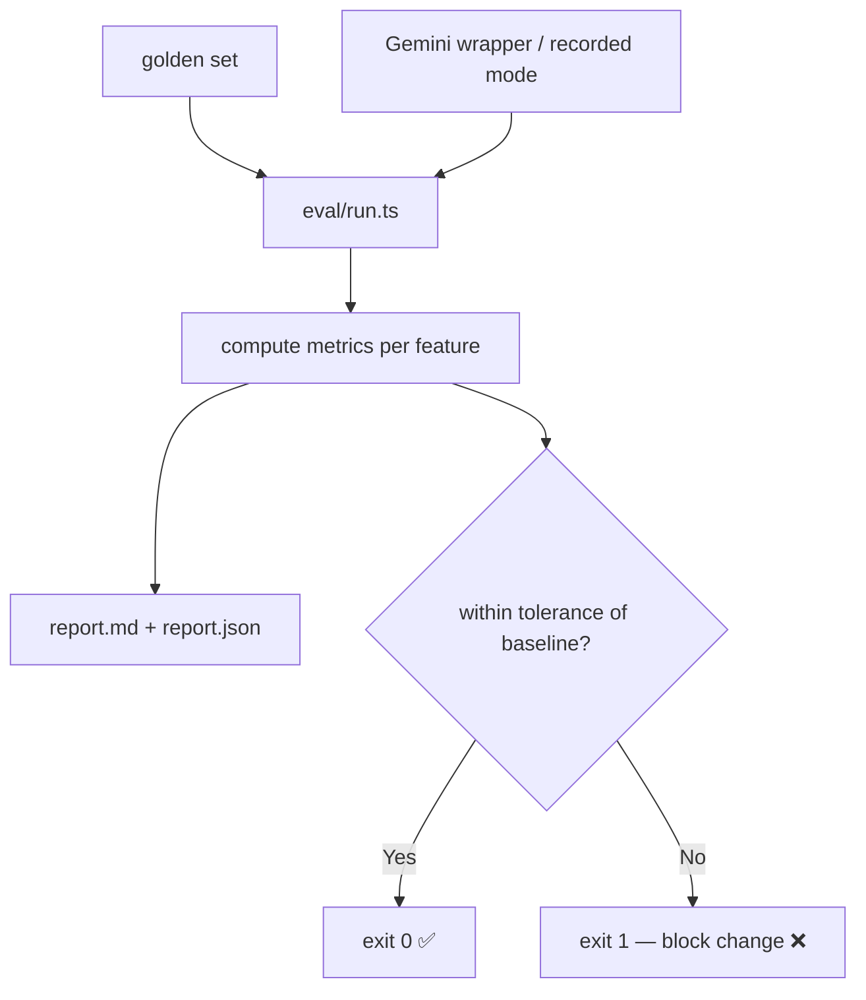

# AIE-04 — AI Evaluation Harness (Golden Set + Regression Gate)

> **Role**: AI Engineer · **Priority**: 🟡 High · **Effort**: ~3 days

---

## Story Identity

| Field | Value |
|:---|:---|
| **Story ID** | `AIE-04` |
| **Owner** | AI Engineer |
| **Backend files** | new `backend/src/eval/`, [test/testSkills.ts](../../../backend/src/test/testSkills.ts) |
| **Consumes** | [AIA-06 telemetry](./AIA-06-ai-observability.md) |

---

## 1. Current Problem

The only test asset is `src/test/testSkills.ts`, which exercises the skills but does not **score output quality** or guard against regressions. Today, when anyone edits a prompt, schema, temperature, or model in `briefParser.ts` / `confidenceGrid.ts` / `interviewGenerator.ts` / `contextExtensions.ts`, there is **no objective way** to tell whether the change improved or degraded results. Quality changes are judged by eyeballing a single output.

---

## 2. Why It Matters

- Prompt/model changes are the highest-leverage and highest-risk edits in an AI product. Without a regression gate, quality drifts invisibly.
- A labeled set also lets AIE-03 calibrate the confidence threshold against ground truth instead of a guessed `75`.

---

## 3. Step-Wise Solution

### Step 3.1 — Curate a golden set
Create `backend/src/eval/datasets/` with 15–30 labeled briefs spanning: well-specified, vague one-liner, budget-only, tech-heavy, and adversarial/empty. Each entry stores the input and expected signals (must-have features, expected complexity band, rough confidence band).

### Step 3.2 — Define metrics per feature
| Feature | Metric(s) |
|:---|:---|
| AI-001 Brief Parser | schema-valid rate, fallback rate, required-feature recall, confidence calibration error |
| AI-002 Confidence Grid | score stability across reruns, self-correction lift, threshold precision/recall vs labels |
| AI-003 Interview Gen | question count in range, missing-skill coverage, dedupe rate |
| AI-004 Extensions | milestone count in range, budget-pct sanity (sums plausible) |

### Step 3.3 — Build the runner
`backend/src/eval/run.ts`: loads a dataset, calls each skill (using the real Gemini wrapper from AIA-05, or a recorded-response mode for cheap CI runs), computes metrics, and writes a JSON + Markdown report to `backend/src/eval/reports/`.

### Step 3.4 — Add a regression gate
Store a `baseline.json` of metric values. The runner fails (non-zero exit) if any metric drops beyond a configured tolerance, so it can run in CI on prompt/model changes.

### Step 3.5 — Wire an npm script
Add `"eval": "node dist/eval/run.js"` and document usage in the harness README. Recorded-response mode keeps CI free of Gemini cost.

---

## 4. Done When

- [ ] A versioned golden set of ≥15 labeled briefs exists.
- [ ] The runner computes the defined metrics for AI-001..AI-004 and writes a report.
- [ ] A baseline + tolerance gate fails the run on regression.
- [ ] `npm run eval` works in both live and recorded-response modes.
- [ ] Documented so any prompt change is expected to run the harness.

---

## 5. Cross-References

| Document | Relevance |
|:---|:---|
| [AIE-03 Self-Correction](./AIE-03-confidence-grid-self-correction.md) | Threshold calibration target |
| [AIA-05 Resilience](./AIA-05-gemini-call-resilience.md) | Shared call wrapper / recorded mode |
| [AIA-06 Observability](./AIA-06-ai-observability.md) | Production metrics complement offline eval |
